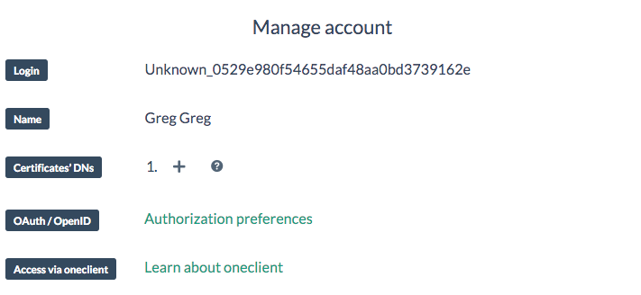
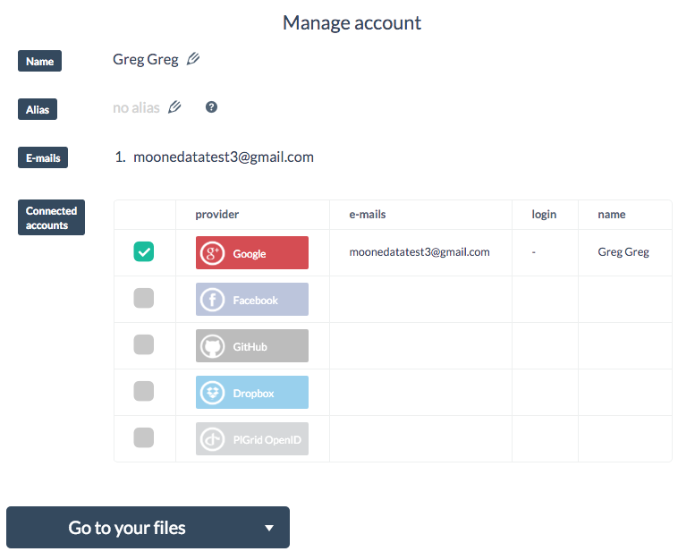

# Account Management
Your account can be managed by clicking on your login name on the right side of the top pane in the Onedata web interface.

In account management section you can add new certificates that will be used to authenticate with Onedata services.

By clicking on *Authorization preferences* you are taken to a second account management view, where you can change you name and alias, see what services you used to authenticate with Onedata with details supplied by a corresponding service, your email used in Onedata system, and finally you can chose a provider which you want to use in order to access your files.

