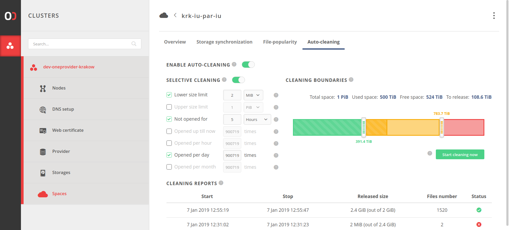

# Automatic replica cleaning

As a prerequisite for understanding this section we advise to familiarize with 
the mechanism of [file-popularity](../administering_onedata/file_popularity.md).

<!-- toc -->

## Concept

In order to automate the process of maintaining the storage usage at a certain 
limit and ensuring that there is a space left for new replicas when performing 
continuous computations, the *auto-cleaning* mechanism has been introduced.
The mechanism uses the statistics collected by the 
[file-popularity](../administering_onedata/file_popularity.md) to determine
the least popular file replicas in the space and deletes them.
Of course, only files which have remote replicas can be deleted. 
Files which exist only on given Oneprovider will not be removed.
Custom algorithm for synchronization of deleting replicas has been implemented.
It ensures that in case of simultaneous requests for deletion of replicas of the same file
there is no risk of data loss.

After each auto-cleaning run a cleaning report will show the released number of
bytes and number of removed replicas.

## Configuration

### Basic setup

The mechanism can be enabled in the space configuration tab.

> *NOTE:* 
>The [file-popularity](../administering_onedata/file_popularity.md) mechanism 
must be enabled to turn *auto-cleaning* on. 
> Disabling [file-popularity](../administering_onedata/file_popularity.md), disables *auto-cleaning*.
 
The user interface allows administrator to specify **low** and **high** thresholds:
* The **high threshold** determines the amount of data stored on the local
storage supporting given space  which when exceeded will trigger run of auto-cleaning which will try to remove redundant replicas. 
* The **low threshold** determines the amount of data which when reached will stop current run of auto-cleaning.  

The thresholds can be adjusted using the GUI as shown below or using REST API:

### Selective rules

It is possible to filter list of files obtained from the 
[file-popularity](../administering_onedata/file_popularity.md) by enabling *selective-rules*.

The index has six rules for which ranges might be provided:
* `maxOpenCount` - Files that have been opened less than `maxOpenCount` times may be cleaned.
  The default value is `9007199254740991 (2^53-1)`.
* `minHoursSinceLastOpen` - Files that haven't been opened for longer than or equal
  to given period (in hours) may be cleaned. The default value is `0`.
* `minFileSize` - Only files which size (in bytes) is greater than given value may be cleaned.
  The default value is `1`.
* `maxFileSize` - Only files which size (in bytes) is less than given value may be cleaned.
  The default value is `1125899906842624 (1 PiB)`.
* `maxHourlyMovingAverage` - Files that have moving average of open operations
  count per hour less than given value may be cleaned. The average is calculated
  in 24 hours window. The default value is `9007199254740991 (2^53-1)`.
* `maxDailyMovingAverage` - Files that have moving average of open operations
  count per day less than given value may be cleaned. The average is calculated in 
  30 days window. The default value is `9007199254740991 (2^53-1)`.
* `maxMonthlyMovingAverage` - Files that have moving average of open operations
  count per month less than given value may be cleaned. The average is calculated
  in 12 months window. The default value is `9007199254740991 (2^53-1)`.

If a rule is disabled it is ignored.

### Force start

It is possible to forcefully start run of auto-cleaning by pressing the green button
placed below space occupancy bar. The run can be forcefully triggered even
if the **high threshold** is not exceeded.

### REST API

All operation presented in the GUI can also be performed using REST API.
Links to the documentation are presented below.

| Request                                 | Link to API |
|---------------------------------------- |-------------|
| Get auto-cleaning configuration         | [API](https://onedata.org/#/home/api/latest/onepanel?anchor=operation/get_space_auto_cleaning_configuration)|        
| Update auto-cleaning configuration      | [API](https://onedata.org/#/home/api/latest/onepanel?anchor=operation/configure_space_auto_cleaning)|
| Get list of auto-cleaning runs' reports | [API](https://onedata.org/#/home/api/latest/onepanel?anchor=operation/get_provider_space_auto_cleaning_reports)|
| Get the report of auto-cleaning run     | [API](https://onedata.org/#/home/api/latest/onepanel?anchor=operation/get_provider_space_auto_cleaning_report)|
| Trigger auto-cleaning run               | [API](https://onedata.org/#/home/api/latest/onepanel?anchor=operation/trigger_auto_cleaning)|
| Get current auto-cleaning status        | [API](https://onedata.org/#/home/api/latest/onepanel?anchor=operation/get_provider_space_auto_cleaning_status)|