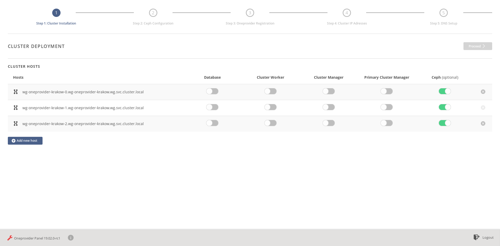
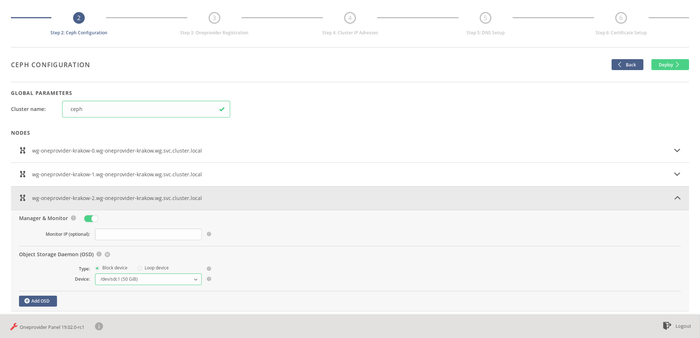
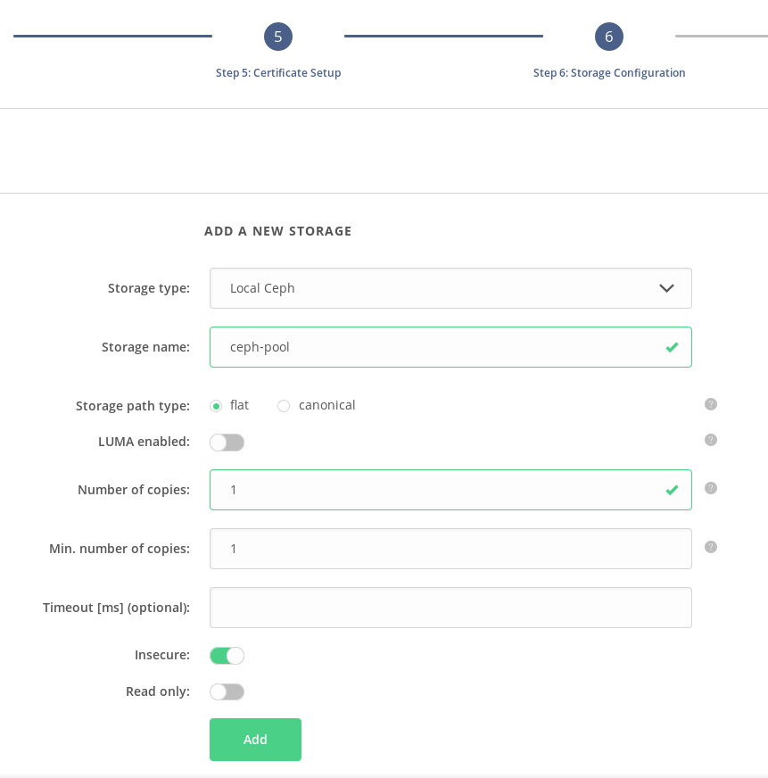
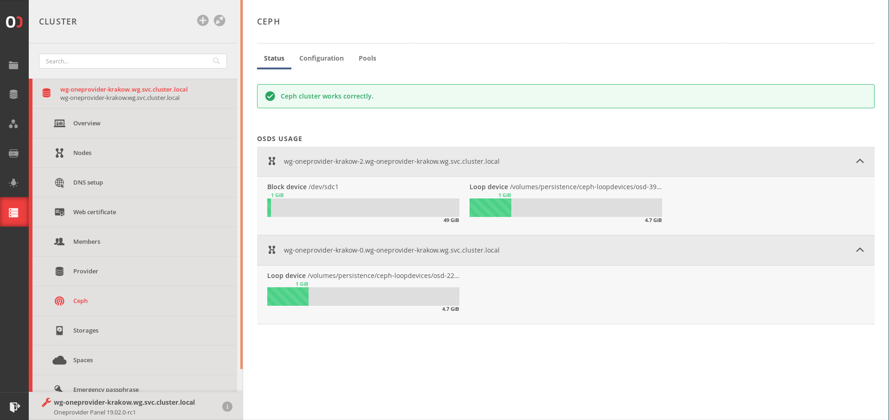

# Ceph cluster deployment

Onedata docker containers since version 20.02 ship with [Ceph](https://ceph.io/) 14.2.2
services preinstalled. Onepanel GUI and API offer means of deploying a Ceph
cluster among Onedata cluster nodes, which can later be configured as
[Oneprovider storage backend](./storage_configuration.html) using `localceph` storage type.

## Cluster components

There are 3 main types of Ceph services:
- Monitors - store cluster state and configuration
- Managers - provide additional cluster monitoring
- Object Storage Daemons (OSDs) - handle storing the actual data on storage devices

For simplicity, and per Ceph recommendations, Ceph managers
are always deployed on the same nodes as Ceph monitors when configured via Onepanel GUI.

## Deploying a Ceph cluster

### Prerequisites

Ceph deployment involves formatting and mounting host's block devices and/or
creation of loop devices. Consequently, the Onedata docker containers have to
be run in **privileged** mode:
- when using docker-compose file, add `privileged: true` service property
- when using `docker run` command, add `--privileged=true` argument
- when using Kubernetes, specify `privileged: true` in pod's security context

### Using Onepanel GUI

Ceph is configured at the beginning of the deployment process, along with Onedata services.

#### Choosing Ceph nodes

During the first step of cluster deployment, select nodes that should become part of the Ceph cluster.
If any node is selected, a new deployment step will appear.

After proceeding to the next step, you will be presented with a screen for
assigning Ceph services to selected nodes. You can also go back to the previous step to change
your nodes selection if needed.

**Cluster name**: you can change the Ceph cluster name. However, the default
name `ceph` is a good choice. It is used by default when managing Ceph with CLI tools.

#### Monitors configuration

It is recommended to choose an odd number of nodes for Ceph monitors to
improve cluster resiliency (it simplifies reaching quorum).

For each monitor node, you can specify an IP on which the monitor should bind
for network activity. The IP must be directly accessible on the specific
node, that is must be the address of one of its network interfaces.
If not specified, IP returned by `hostname -i` will be used (usually the docker container's IP).

For more information about the Ceph monitors see
[Ceph documentation](https://docs.ceph.com/docs/nautilus/rados/configuration/mon-config-ref/#).

### Using REST API

All operations presented in the GUI can also be performed using the REST API.
Ceph configuration can either be triggered by a POST request on a
[dedicated endpoint](https://onedata.org/#/home/api/stable/onepanel?anchor=operation/configure_ceph).

Configuration in the format used by the above endpoint can also be embedded
in the config map [provided in docker-compose](./oneprovider_tutorial.md#customizing-oneprovider-docker-compose-script).
In which case it should be provided under the key `ceph`, along with
`cluster` and `oneprovider`. See relevant
[API documentation](https://onedata.org/#/home/api/stable/onepanel?anchor=operation/configure_provider).

The Ceph cluster can also be added or extended after Onedata deployment, by sending 
requests to the `configureCeph` endpoint with configuration of additional services.

#### OSDs configuration

An OSD has to be configured for each storage device to be used by Ceph. E.g.
a host with 3 hard drives will need 3 OSDs.

##### OSD types
- It is most recommended to have disks/partitions dedicated to storing Ceph
  data. In this case, **block device** OSD type should be used.

  **WARNING** Device selected for use by a block device OSD will be **wiped and formatted**.

- Alternatively, you can select the **loop device** OSD type. This will cause
  Onepanel to allocate a file of specified size and create a virtual block
  device backed by this file. This enables deployment on a host without
  dedicated storage, at the cost of performance and stability.

## Using the Ceph cluster as Oneprovider's storage backend

### Using Onepanel GUI

When a local Ceph cluster is present, a new storage type - `local ceph` - appears in the storage creation dialog.

Fields in the dialog configure the Oneprovider behaviour and underlying Ceph
pool which is created for each storage. Options specific to Ceph are:
- **Number of copies** - number of redundant data copies, which are
  distributed among the OSDs.
- **Minimal number of copies** - if there are fewer OSDs than this number,
  writes to the pool are rejected by Ceph. This may happen if some of the OSDs
  experience failure.

### Using REST API

Storages backed by the local Ceph are deployed in the same way as other
storage types. Use the [Add storage](https://onedata.org/#/home/api/stable/onepanel?anchor=operation/add_storage)
endpoint with storage type `localceph`.

## Monitoring Ceph cluster

### Using Onepanel GUI

When a local Ceph cluster is present, a _Ceph_ tab appears in Onepanel. It
can be used to see Ceph status notifications and monitor OSD disk space
usage.

### Using REST API

There are endpoints available for monitoring Ceph cluster status:

| Request                                 | Link to API |
|---------------------------------------- |-------------|
| Get cluster status report               | [API](https://onedata.org/#/home/api/stable/onepanel?anchor=operation/get_ceph_status)|
| Get disk usage for all OSDs and pools   | [API](https://onedata.org/#/home/api/stable/onepanel?anchor=operation/get_ceph_usage)|
| Get disk usage for a specific pool      | [API](https://onedata.org/#/home/api/stable/onepanel?anchor=operation/get_ceph_pool_usage)|
| Get disk usage for a specific OSD       | [API](https://onedata.org/#/home/api/stable/onepanel?anchor=operation/get_ceph_osd_usage)|