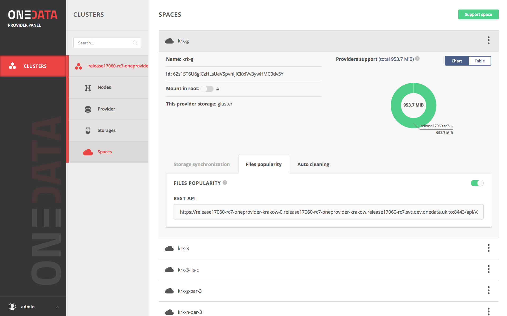

# File-popularity
<!-- This header is referenced at least one time as "file_popularity.md" -->

<!-- toc -->

## Concept

The file-popularity mechanism enables tracking of usage-statistics for files in the 
selected space. It allows listing files' IDs sorted by increasing order of the 
[`popularity`](#the-popularity-function) function, so that the least popular files
are at the beginning of the list.

>**NOTE:** Usage statistics can be collected only for local storage supporting the space. 
> It is impossible to obtain file-popularity statistics for a remote provider.

The mechanism for given space can be enabled in Oneprovider's Onepanel, in the space
configuration tab.


## Querying the file-popularity view

The file-popularity view can be queried using the following request:
```bash
curl -sS -k -H "X-Auth-Token:$TOKEN" -X GET https://$HOST/api/v3/oneprovider/spaces/$SPACE_ID/views/file-popularity/query
```
An example of such request is presented in the file-popularity configuration tab.
The example request returns 10 least popular files in the space.

## Advanced topics

As a prerequisite for understanding this section we advise to familiarize with 
the concept of [Onedata views](../using_onedata/views.md).

### Internal implementation

Internally, the mechanism creates the *file-popularity* view. All notes presented in the 
[Views chapter](../using_onedata/views.md)
applies also to the *file-popularity* view.
>**NOTE:** The file-popularity view is a special view, therefore it is forbidden to create 
> a view with such name. Furthermore, it is forbidden and impossible to 
> modify or delete the view using 
>[Onedata Views API](../using_onedata/views.md).

### The popularity function
The key that is emitted to the *file-popularity* view is the value of the
[`popularity`](#the-popularity-function) function for given file.
The function is defined as follows:

```
P(lastOpenHour, avgOpenCountPerDay) = w1 * lastOpenHour + w2 * min(avgOpenCountPerDay, MAX_AVG_OPEN_COUNT_PER_DAY)
```

where:
* `lastOpenHour` - parameter which is equal to timestamp (in hours since 01.01.1970)
  of last open operation on given file
* `w1` - weight of lastOpenHour parameter
* `avgOpenCountPerDay` - parameter equal to moving average of number of open
  operations on given file per day. The value is calculated over last 30 days.
* `w2` - weight of avgOpenCountPerDay parameter
* `MAX_AVG_OPEN_COUNT_PER_DAY` - upper boundary for avgOpenCountPerDay parameter

Entries in the views are modified only when associated document
in the database is modified. It means that entry in the *file-popularity* view
is modified only when the 
[`file_popularity`](../using_onedata/views.md#file-popularity-model) model
document is updated. It happens on each close operation on a file.
It is possible that a file that has been intensively used is not opened any more. 
Therefore, it's `avgOpenCountPerDay` is not re-calculated and it stays
on a very high value. If the popularity of the file was estimated only basing on
this parameter such file stays "popular" forever. To cope with this issue, 
`lastOpenHour` parameter was used in the [`popularity`](#the-popularity-function) function.
The parameter is responsible for "balancing" the importance of `avgOpenCountPerDay` parameter.


### Configuration of the mechanism

The three parameters of the function: `w1`, `w2` and `MAX_AVG_OPEN_COUNT_PER_DAY`
can be modified in the file-popularity configuration panel.

>**NOTE:** Modification of the [`popularity`](#the-popularity-function) 
function parameters results in modification of the mapping function of the
*file-popularity* view. It means that all already indexed files are 
re-indexed. Such operation can be very time-consuming as it depends on the number 
of the files in the space.
>
>**NOTE2:** The same notice applies to disabling/enabling the mechanism. 
Disabling the view results in its deletion, therefore re-enabling the view
results in re-indexing all files in the space.
>
><span style="color:red">MODIFICATION OF THE [`popularity`](#the-popularity-function)FUNCTION MUST BE PERFORMED WITH CARE!!!</span>

### Default parameters

The default values of the file-popularity view are as follows:
* `w1 = 1.0`
* `w2 = 20.0`
* `MAX_AVG_OPEN_COUNT_PER_DAY = 100`

The default value of `MAX_AVG_OPEN_COUNT_PER_DAY` means that we assume that
files that have `avgOpenCountPerDay > 100` have the same popularity and should 
be treated as equally popular.
 
The above values of `w1` and `w2` mean that file that has been opened just once
has "similar" popularity to file that was opened about 1000 times in the month
preceding the last open and that the last open was performed a month (30 days) before
open on the former file.

Estimations of the default values of weights are presented below.

#### Estimation of default weights

In the default configuration, we would like to keep balance between `lastOpenHour` and
`avgOpenCountPerDay` parameters in such a way, that file that has been opened just once has
value of [`popularity`](#the-popularity-function) function equal to file that was 
opened for the last time a month earlier and
which was opened about 1000 times in the month preceding the last open. 

```
Assume that we have 2 files: F1 and F2.

The file F1 was opened at timestamp (in hours) T1.
F1 - lastOpenHour1 = T1
   - number of openes in the month preceding last open: NO1 = 1
   - avgOpenCountPerDay1 = avg1 = NO1/30 = 1/30
   
The file F2 was opened month earlier than T1 for the last time.
F2 - lastOpenHour2 = T2 = T1 - 30 * 24
   - number of openes in the month preceding last open: NO2 = 1000
   - avgOpenCountPerDay2 = avg2 = NO2/30 = 1000/30

Lets count popularity for both files:

P1 = P(lastOpenHour1, avgOpenCountPerDay1)
P1 = w1 * T1 + w2 * min(avg1, 100)
P1 = w1 * T1 + w2 * avg1

P2 = P(lastOpenHour2, avgOpenCountPerDay2)
P2 = w1 * T2 + w2 * min(avg2, 100)
P2 = w1 * T2 + w2 * avg2
P2 = w1 * (T1 - 720) + w2 * avg2

We want P1 = P2:

w1 * T1 + w2 * avg1 = w1 * (T1 - 720) + w2 * avg2
w1 * T1 + w2 * avg1 = w1 * T1 - w1 * 720 + w2 * avg2
w1 * 720 = w2 * (avg2 - avg1)
w1/w2 = (avg2 - avg1)/720
w1/w2 = 999/21600

We can set w1 := 1 and therefore we have:

w2 = 21600/999 ~= 21,62

Finally, to make it simpler, we set:
w1 := 1.0
w2 := 20.0
```

### REST API

All operations presented in the GUI can also be performed using the REST API.
Links to the documentation are presented below.

| Request                             | Link to API |
|-------------------------------------|-------------|
| Get file-popularity configuration   | [API](https://onedata.org/#/home/api/latest/onepanel?anchor=operation/get_file_popularity_configuration)|        
| Update file-popularity configuration| [API](https://onedata.org/#/home/api/latest/onepanel?anchor=operation/configure_file_popularity)|        