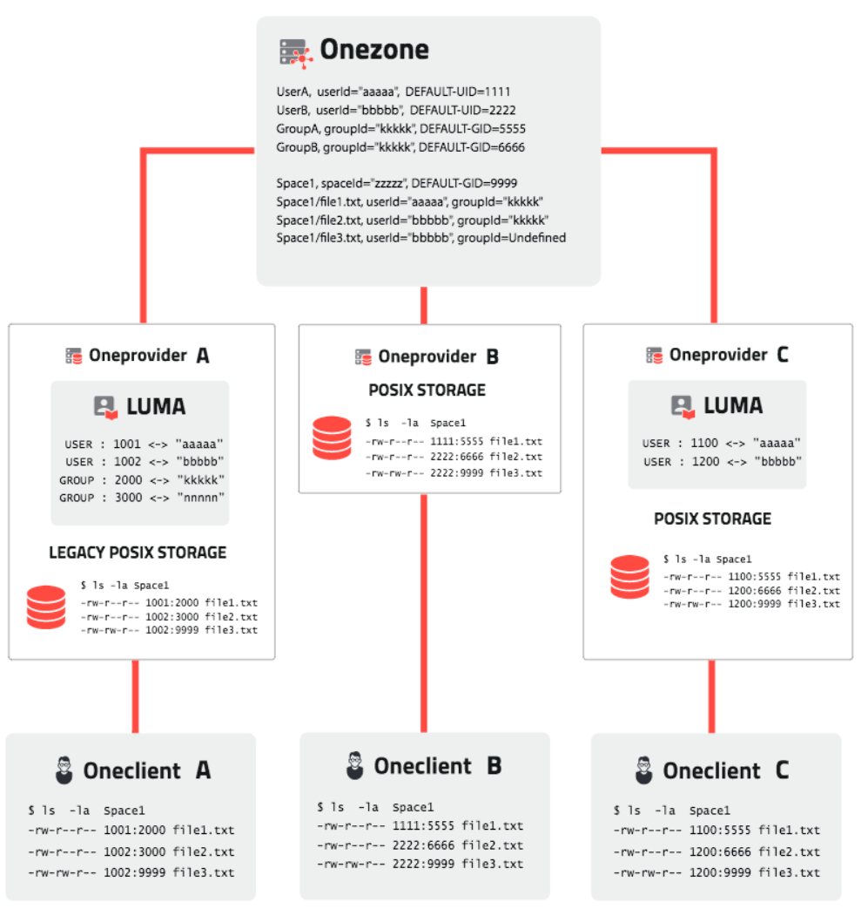
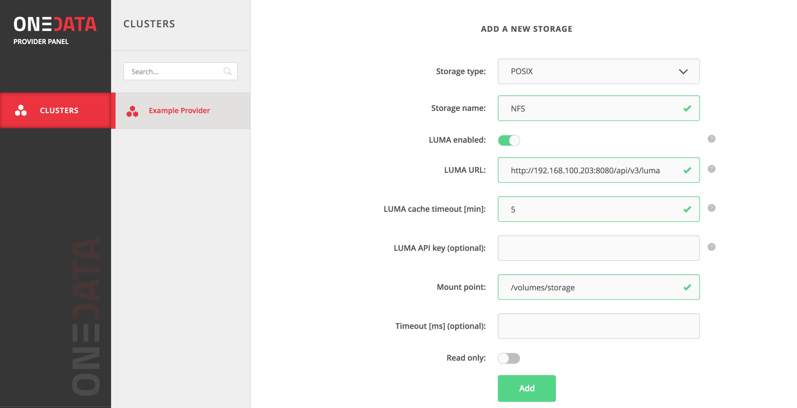

# LUMA - Local User MApping

<!-- toc -->

## Overview

LUMA is a Onedata service that allows custom mapping between local user accounts or credential on storage resources (e.g. POSIX user ID/group ID, LDAP DN, Ceph username, GlusterFS UID/GID, etc.) to Onedata user accounts.

LUMA can be enabled for each storage registered in Oneprovider separately, with different credentials for users on each storage.

LUMA defines an API which can be used by Oneprovider to request credentials for specific federated user to a specific storage. Actual implementation of the mapping logic can vary from between data centers as it can be based on a simple configuration file or integrated with for instance an LDAP identity service.

We provide a simple reference implementation suitable for basic deployments and testing.

The following sections provide overview of LUMA API and describe how to deploy and configure our reference LUMA implementation. A custom implementation stub can be generated automatically from [LUMA Swagger specification](https://onedata.org/#/home/api/latest/luma) using [Swagger Codegen](https://github.com/swagger-api/swagger-codegen) tool in mulitple programming frameworks.

### Onedata file permissions model and LUMA

In order to understand LUMA and how mappings should be defined it is necessary to understand how file ownership and permissions work in Onedata.

By default, when LUMA is not configured for storage, Onedata ownership and permissions follow these rules:

* Each space has an automatically generated GID, which is common for all files in that space, each file created in that space will have that GID assigned, unless it has an explicit group ownership which at the moment can only be assigned when file was imported from storage with LUMA configured
* Each file has UID automatically generated based on the user who is the owner of the file
* When a new file is created in the space it will have UID assigned based on the user who created it and GID assigned based on the space in which it was created
* The file will have by default assigned the following permissions: `rw-rw-r--`, where the *owner* is the creator of the file, the *group* is everyone who is the member of a given space and *others* are external users who get access to the space via **Share** URL
* In case multiple Oneproviders support the same space, Oneclient will show the files with the same UID's and GID's independently of which provider it is connected to
* When files are imported from a storage where no LUMA is configured, they will be assigned UID and GID's based on the user who requested support for this space and thus initiated the import of files

When LUMA is configured for storage, the situation is slightly different, as in this case LUMA is responsible for providing user and group mapping between federated id's and storage id's, and in case a user or group has no mapping for this storage file operations will fail:

* When a file is created, Oneprovider queries LUMA for UID of a user identified by Onedata or some external IdP identifier (example of request and mappings are presented later) and this UID is assigned as the owner of the file on the storage
* The GID is assigned to be the default for the space as without LUMA (in the next release we will provide a mechanism to enable custom default GID for a space)
* When Oneclient is connected to Oneprovider with LUMA configured, it will present the UID's and GID's consistently with the LUMA mappings
* When files are imported from the legacy storage, the UID's and GID's of the files will be converted to user Id's and group Id's based on the mappings defined in LUMA

The diagram below presents an example of a complex deployment with multiple providers, where **OneproviderA** imported `file1.txt` and `file2.txt` from legacy storage using LUMA, **OneproviderB** has no LUMA configured and **OneproviderC** has a different LUMA configured for the same space. `file3.txt` was created by UserB via **OneproviderB**. The diagram presents the ownership and permissions as visible on the storage and in Oneclients connected to different Oneproviders.



One important issue to remember, is that LUMA uid and gid mappings only make sense for POSIX and GlusterFS storages, as Ceph, S3 and Swift do not have a concept of UID and GID, and accesses to these storages is performed based on passwords and access tokens, thus in case of these storages Oneclient will display UID and GID values as in the case of **OneproviderB**.

## LUMA API

The LUMA API has 2 groups of endpoints:
 - **Mapping** - *[required]* provide operations to map users and groups to their respective storage counterparts,
 - **Admin** - *[optional]* allow to add credentials to a running LUMA service  using REST API. These operations are not used directly by the provider, thus can be ommited if the mapping information is provided in another way.

### Mapping operations
The mapping API consists of 6 operations:

#### Get user credentials
`[POST] /api/v3/luma/map_user_credentials` - returns user credentials to a specific storage based on users federated identity:

**Example request**

```json
{
  "storageId": "nl75Tyj0Ef0DRT9pEhKkMCpxcAIjkAEJTUz3Kp9jTcM",
  "storageName": "NFS",
  "spaceId": "c5oiB633lvdGArj-dfpQJk7Wx8wQUmHxc_3a43-P9mw",
  "userDetails": {
    "name": "John Doe",
    "login": "jdoe",
    "emailList": ["jdoe@example.com"],
    "id": "d5ffe868b88f75e38f8b1e6809d093d1",
    "connectedAccounts": [
       {
         "idp": "github",
         "userId": "68b88f75e38f8b1e68",
         "emailList": ["jdoe@github.com"]
       }
    ]
  }
}
```

**Example response**

```json
{
  "type": "posix",
  "uid": 1001,
  "gid": 1001
}
```


#### Resolve user identity
`[POST] /api/v3/luma/resolve_user` - reverse of the above, returns user federated identity based on storage credentials, it is used for automatic data import

**Example request**

```json
{
  "storageName": "NFS",
  "type": "posix",
  "uid": 1001,
  "gid": 1001
}
```

**Example response**

```json
{
  "idp": "onedata",
  "userId": "SDASDBNASDLKAJHFLKJHASD9879A"
}
```

#### Get group storage id
`[POST] /api/v3/luma/map_group` - returns group GID for specific Onedata or IdP group

**Example request**

```json
{
  "groupId": "HFLKJHASD9879ASDASDBNASDLKAJ"
}
```

**Example response**

```json
{
  "gid": 2000
}
```

#### Resolve group identity

`[POST] /api/v3/luma/resolve_group` - returns the federated group Id based on  the group Id on the storage

**Example request**

```json
{
  "storageName": "NFS",
  "gid": 2000
}
```

**Example response**

```json
{
  "idp": "onedata",
  "groupId": "HFLKJHASD9879ASDASDBNASDLKAJ"
}
```

#### Resolve ACL user
`[POST] /api/v3/luma/resolve_acl_user` - allows to get the federated user identity based on the user ACL name on a specific storage

**Example request**

```json
{
  "storageName": "NFS",
  "type": "posix",
  "aclName": "jdoe@example.com"
}
```

**Example response**

```json
{
  "idp": "onedata",
  "userId": "SDASDBNASDLKAJHFLKJHASD9879A"
}
```

#### Resolve ACL group
`[POST] /api/v3/luma/resolve_acl_group` - returns the federated group Id based on  the group ACL name on the storage

**Example request**

```json
{
  "storageName": "NFS",
  "aclName": "users"
}
```

**Example response**

```json
{
  "idp": "onedata",
  "groupId": "HFLKJHASD9879ASDASDBNASDLKAJ"
}
```

### Storage credential types

Each of the above operations' arguments depend on the type of storage for which the mappings are defined.  Currently LUMA supports the following storage backends with the following credentials:
 - **POSIX**

   ```json
   {
     "type": "posix",
     "uid": 1001,
     "gid": 1002
   }
   ```

 - **Ceph**

   ```json
   {
     "type": "ceph",
     "username": "client.user1",
     "key": "LKAJHFLKJHASD9879ASDASDBNASD"
   }
   ```

 - **Amazon S3**

   ```json
   {
     "type": "s3",
     "accessKey": "J7657576ASDFKJAHSDASDASDJHVASDLKJAHSDLK",
     "secretKey": "ASDASDJHVASDLKJAHSDLKJ7657576ASDFKJAHSD"
   }
   ```

 - **OpenStack Swift**

   ```json
   {
     "type": "swift",
     "username": "user1",
     "password": "SKDJg55aSDLKJhAkkasxC"
   }
   ```

 - **GlusterFS**

   ```json
   {
     "type": "glusterfs",
     "uid": 1001,
     "gid": 1001
   }
   ```

## LUMA deployment

This section presents a tutorial on how to deploy the reference LUMA instance and configure it for a basic use case. LUMA reference implementation is a very basic service in Python using [Flask](http://flask.pocoo.org/) and [TinyDB](http://tinydb.readthedocs.io/). The source can be obtained from [onedata/luma](https://github.com/onedata/luma/tree/release/17.06.0-rc7) GitHub repository.

### Add Oneprovider storage with LUMA support

The first step in LUMA setup is to add a storage to Oneprovider with LUMA support. LUMA does not have to be running yet, but it's endpoint has to be known, as presented below:



Typically, LUMA can be deployed on the same host as the Oneprovider and thus all network communication  with LUMA can be constrained to a localhost after it is configured.

Please note that the LUMA URL must contain entire REST endpoint, i.e.

```bash
http://HOSTNAME:PORT/api/v3/luma
```

### Start LUMA using Docker

Latest LUMA container can be found on our [Dockerhub repository](https://hub.docker.com/r/onedata/luma/). This implementation stores entire mapping database in a single JSON file, which should be mounted from the host to the container in order to provide persistence between container restarts:

```bash
$ touch db.json # Only the first time
$ docker run -v $PWD/db.json:/luma/db.json -p 8080:8080 -it onedata/luma:17.06.0-rc7
```

Flask server will by default log all requests to the stdout, so it should be easy to see whether the Oneprovider requests are handled properly.

### Start LUMA directly from sources

LUMA can be also started directly without Docker:

```bash
$ git clone https://github.com/onedata/luma
$ cd luma
$ git checkout release/17.06.0-rc7
$ cd luma
$ vim db.json # Define the mappings manually or leave empty
$ python app.py # Make sure that the service will run persistently
```

Once LUMA is started it can be interacted with using the REST API or the auto-generated GUI at: [http://<LUMA_HOST>:8080/api/v3/luma/ui/]().

### Adding user and group mappings

Mappings between users, groups and storage credentials can be defined in LUMA in 2 ways:

* By manually creating the `db.json` files with proper structure
* By adding mappings dynamically using LUMA admin REST API

Both approaches require that certain identifiers for users, groups and storages are known to define the mappings properly. The following subsection describes how they can be obtained using Onedata REST API's.

#### Prerequisites

In order to define mappings, it is necessary to know the following information:

- Storage name or storage Id
- Users Id
- Groups Id

Storage name can be obtained simply from the Onepanel GUI under storage properties. All other attributes can be retrieved using the REST API of Onezone interface. The Onedata REST API's can be most conveniently accessed using or command line REST clients, which are provided in a small Docker container `onedata/rest-cli`. To start a preconfigured command-line environment to interact with Onedata services via REST simply run the following command:

```sh
$ docker run -e ONEDATA_ZONE=<ZONE_HOST> -e ONEDATA_PROVIDER=<PROVIDER_HOST> -e ONEDATA_API_KEY=<ACCESS_TOKEN> -it onedata/rest-cli
```

The following command line examples assume they are executed inside this container.

##### Obtaining storage Id

Although LUMA mappings can be defined using local storage name (LUMA is always associated with only a single Oneprovider), the mappings can also be defined using storage ID. The storage Id can be obtained from the Onepanel REST interface of the Oneprovider to which the storage is attached.

```bash
[Onedata REST CLI - 17.06.0-rc6]$ export ONEPANEL_HOST=https://<ONEPROVIDER_IP>:9443
[Onedata REST CLI - 17.06.0-rc6]$ export ONEPANEL_BASIC_AUTH=admin:<ADMIN_PASSWORD>
# First get the list of storage ids attached to this Oneprovider
[Onedata REST CLI - 17.06.0-rc6]$ onepanel-rest-cli getStorages | jq .
{
  "ids": [
    "sF6AGzSiGVNSRGvxiA6p3287LUZS-nyMhDzKubrGsSM",
    "Hx0HFUdKiDFgMdNDuFv7uwvpr5dew5VHS2N2kYa9haQ"
  ]
}
# Now find which storage is the required one
[Onedata REST CLI - 17.06.0-rc6]$ onepanel-rest-cli getStorageDetails id=sF6AGzSiGVNSRGvxiA6p3287LUZS-nyMhDzKubrGsSM | jq .
{
  "id": "sF6AGzSiGVNSRGvxiA6p3287LUZS-nyMhDzKubrGsSM",
  "name": "LUMATEST",
  "type": "posix",
  "readonly": false,
  "insecure": false,
  "lumaEnabled": true,
  "lumaUrl": "http://192.168.1.200:8080/api/v3/luma",
  "lumaCacheTimeout": 1,
  "mountPoint": "/mnt/storage1"
}
```

##### Obtaining user Id

User Id can be obtained by from the details which each user can get when authenticated to the Onezone REST API using the following operation.

```bash
[Onedata REST CLI - 17.06.0-rc6]$ onezone-rest-cli getCurrentUser
{
  "userId": "a5ffe868b88f75e38f8b1e6809d093d1",
  "name": "John Doe",
  "login": "",
  "emailList": [
    "jdoe@example.com"
  ],
  "connectedAccounts": [
    {
      "user_id": "223536c273ca61ff53c61bb3da6ed061b74755c22bb012b048ac2768a26693c@egi.eu",
      "provider_id": "egi",
      "name": "John Doe",
      "login": "",
      "groups": [
        "vo:vo.indigo-datacloud.eu/tm:aai.egi.eu/user:member",
        "vo:egi.eu/tm:www.egi.eu/tm:wiki-editors/user:member",
      ],
      "email_list": [
        "jdoe@example.com"
      ]
    }
  ],
  "alias": ""
}
```

Here we can see that the user has 2 Id's:

* `userId` at the top level which is associated with `onedata` IdP
* as well as `user_id` in the `connectedAccounts` section which is associated with the `egi` IdP - bot can be used in the LUMA mappings, provided they are paired with the name of the IdP

##### Obtaining group Id
In order to get the Id of a specific group in Onedata, it is necessary to list through all groups associated with a user or space and find the required one, for instance:

```bash
# First list the user groups Id's
[Onedata REST CLI - 17.06.0-rc6]$ onezone-rest-cli getUserGroups | jq .
{
  "groups": [
    "wZTuAqxmm8ntFhCY5NpbjAKzAjokHqs2Ehj9SdqMJCk",
    "vSJ4IRnBmNyLSHFLbRaotI7FVsck-6yT5X5S0KV08-o",
    "zWB2Jf3ivo0Zhevl9kexOvk9OaDAsTBAwtpQnEzuFu8",
    "2d8950e9906941550d925d734ad5a8b6",
    "4cd7e5abfb60b7826685a4155b5e97e3",
    "182558bbbf31ba86b44f0f6e27dc79fc",
    "3a03833b34bf536b52a09229080eac12",
    "4bcfd2b2f147fb29413330efb5945a7c",
    "54938227e8111a2bb26bbc1c314929a2",
    "2e8e1132377d829d1a03ebc12cb06991",
    "5ff9bbcf302dcd0fc0955a102555d78b",
    "6bd0b3e7f051efe10c43e9d85ffb8d8f",
    "396a71bfe20fdae15383921ddf59f290",
    "367239461069f0798969eb202b2854bb",
    "12b0ddb46ae9583e7a057efe1aff56d4",
    "all_users"
  ]
}
# Then search for the interesting group
[Onedata REST CLI - 17.06.0-rc6]$ onezone-rest-cli getUserGroup gid=zWB2Jf3ivo0Zhevl9kexOvk9OaDAsTBAwtpQnEzuFu8 | jq .
{
  "type": "role",
  "name": "GroupA",
  "groupId": "zWB2Jf3ivo0Zhevl9kexOvk9OaDAsTBAwtpQnEzuFu8"
}
```


#### Creating mapping database manually

The LUMA mappings can be defined directly in a `db.json` file of the LUMA reference implementation. An example LUMA database definition is presented below - corresponding with the example above for **OneproviderA**.

```json
{
  "_default": {},
  "users": {
    "1": {
      "userDetails": {
        "id": "aaaaa"
      },
      "credentials": [
        {
          "storageName": "LUMATEST",
          "type": "posix",
          "uid": 1001,
          "gid": 1001
        }
      ]
    },
    "2": {
      "userDetails": {
        "id": "bbbbb"
      },
      "credentials": [
        {
          "storageName": "LUMATEST",
          "type": "posix",
          "uid": 1002,
          "gid": 1002
        }
      ]
    }
  },
  "groups": {
    "1": {
      "idp": "onedata",
      "groupId": "kkkkk",
      "groupDetails": [
        {
          "gid": 2000,
          "storageName": "LUMATEST"
        }
      ]
    },
    "2": {
      "idp": "onedata",
      "groupId": "nnnnn",
      "groupDetails": [
        {
          "gid": 3000,
          "storageName": "LUMATEST"
        }
      ]
    }
  }
}
```

#### Advanced mapping examples

##### Using user Id from external IdP

In case it is preferred to use user Id from another IdP than Onedata, it can be defined in the mapping as follows:

```json
{
  "_default": {},
  "users": {
    "1": {
      "userDetails": {
      	"connectedAccounts": [ {
        	"userId": "54213ca61ff53c61bb3da6ed061b74755c22bb012b048ac2768a26693c@egi.eu",
        	"idp": "egi"
      },
      "credentials": [
        {
          "storageName": "LUMATEST",
          "type": "posix",
          "uid": 1001,
          "gid": 1001
        }
      ]
    }
  }
}
```

##### Using user email

Users can be also identified by email - however this will only work for forward mappings (federated Id to storage credentials - it will not work for importing data from legacy storage as in such case LUMA has to return unique user Id):

```json
{
  "_default": {},
  "users": {
    "1": {
      "userDetails": {
      	"connectedAccounts": [ {
        	"emailList": ["jdoe@example.com"]
      },
      "credentials": [
        {
          "storageName": "LUMATEST",
          "type": "posix",
          "uid": 1001,
          "gid": 1001
        }
      ]
    }
  }
}
```

##### Mapping ACL names

In case the legacy storage supports ACL, and it is necessary to import ACL's from the legacy storage (typically from NFSv4), the ACL names can be defined both for users and groups in LUMA directly using `aclName` field as follows:

```json
{
  "_default": {},
  "users": {
    "1": {
      "userDetails": {
        "id": "aaaaa"
      },
      "credentials": [
        {
          "storageName": "LUMATEST",
          "type": "posix",
          "aclName": "jdoe@example.com"
          "uid": 1001,
          "gid": 1001
        }
      ]
    }
  },
  "groups": {
    "1": {
      "idp": "onedata",
      "groupId": "kkkkk",
      "groupDetails": [
        {
          "gid": 2000,
          "storageName": "LUMATEST",
          "aclName": "groupa"
        }
      ]
    }
  }
}
```

#### Adding mappings using REST

Mappings can be also added, removed or modified directly on a running LUMA instance using admin REST calls.

The following request adds user identity to LUMA (based on user Id), and returns in the `Location` head the automatically assigned LUMA user ID:

```bash
curl -vvv -X POST -H 'Content-Type: application/json' -H 'Accept: application/json' -d '{ "id": "d5ffe868b88f75e38f8b1e6809d093d1"}' http://<LUMA_HOST>:8080/api/v3/luma/admin/users

...
Location: /api/v3/luma/admin/users/1
...
```

Here we can see that the assigned user ID by LUMA is `1`.

Now in order to add the mappings for UserA and UserB to NFS storage, we have to call the following operation:

```bash
$ curl -X PUT -H 'Content-Type: application/json' -H 'Accept: application/json' -d '[{"storageName": "NFS", "type": "posix", "uid": 1000, "gid": 1000 }]' http://<LUMA_HOST>:8080/api/v3/luma/admin/users/1/credentials
```

In the same vein a group mapping can be defined in LUMA. However first, it is necessary to obtain the group Id from Onezone. The below example shows how to add a mapping between the GroupA in Onezone and groupa on the POSIX storage:

```sh
curl -X PUT -H 'Content-Type: application/json' -H 'Accept: application/json' -d '[{"gid": "1002", "name": "groupa", "id": "7d8950e9906941550d925d734ad5a8b6"}]' http://<LUMA_HOST>:8080/api/v3/luma/admin/5da4aaa1-5cd3-4e33-92b6-89589e997974/groups/a514ccef-fb96-4e65-b786-5d503ff04c45
```

The LUMA reference implementation provides also a simple, automatically generated GUI which can be used to interact with the LUMA service by directly invoking the REST calls - it can be accessed under the following URL: [http://<LUMA_HOST>:8080/api/v3/luma/ui/]().

