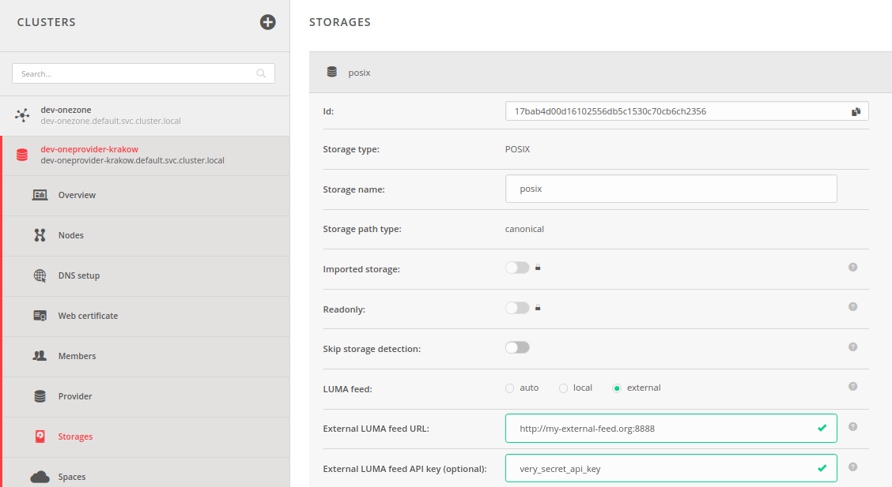

# Local User Mapping - LUMA

<!-- toc -->

## Overview

LUMA is a database that stores information used for acquiring mappings between local user accounts or credentials on
storage resources (e.g. POSIX UID/GID, Ceph username, GlusterFS UID/GID, etc.) to Onedata user accounts.
LUMA DB can be set up for each storage registered in Oneprovider separately, with different credentials for users on 
each storage.

## Credential types

### Storage credentials 
Credentials relevant for corresponding storage backend, used to perform operations on the storage in context of a specific user.

### Display credentials
Credentials used to present POSIX credentials (UID & GID) of a file owner in the
file's attributes. e. g. they are displayed in the result of `ls` operation in Oneclient or when fetching file
attributes using REST API.

### Onedata user credentials
Credentials identifying user in the Onedata system.

### Onedata group credentials
Credentials identifying group in the Onedata system.

## Use cases

### Basic

* mapping Onedata user to [storage credentials](#storage-credentials)
* mapping Onedata user to [display credentials](#display-credentials)

### Advanced

Advanced LUMA DB use cases are associated with the concept of [storage import](oneprovider_tutorial.md#add-storage-with-existing-data)
and should only be considered when corresponding storage is an imported storage.                                                     
* mapping storage user to [Onedata user](#onedata-user-credentials) - used in case of importing files from storage.
 It allows to map owner of the storage file to a specific Onedata user who will become owner of the file imported
 to the space. Storage user is identified by the value of UID field returned from `stat` operation or equivalent on
 given storage backend.  
* mapping storage NFSv4 ACL principal to Onedata [user](#onedata-user-credentials)/[group](#onedata-group-credentials) - 
used in case of importing files from storage that
supports [NFSv4 ACLs](https://www.osc.edu/book/export/html/4523), with `syncAcl` option enabled.
It allows to map ACE principal to a specific user/group in the Onedata. If `syncAcl` option is disabled this mapping 
does not have to be defined. 
  
## Onedata file permissions model and LUMA DB

In order to understand LUMA DB and how mappings should be defined please consult how 
[POSIX-like file ownership and permissions](../using_onedata/file_management.md#posix-permissions) work in Onedata.

## Database

LUMA DB consists of 5 tables that store 4 types of records, as described below.

### Tables

| Table                        | Key                       | Record                                 | 
|------------------------------|---------------------------|----------------------------------------|
| Storage users                | `(StorageId, UserId)`     | [`StorageUser`](#storageuser)          |        
| Spaces posix storage defaults| `(StorageId, SpaceId)`    | [`PosixCredentials`](#posixcredentials)|        
| Spaces display defaults      | `(StorageId, SpaceId)`    | [`PosixCredentials`](#posixcredentials)|        
| Onedata users                | `(StorageId, UID/AclUser)`| [`OnedataUser`](#onedatauser)          |        
| Onedata groups               | `(StorageId, AclGroup)`   | [`OnedataGroup`](#onedatagroup)        |        

### Records

#### `StorageUser`
This record is used to represent user on the specific storage backend and consists of two fields:
* `storageCredentials` is a map storing credentials relevant for given storage backend,
* `displayUid` is a field used to present corresponding user as owner of a file (UID) in Oneclient or GUI

```JSON
{
    "storageCredentials": JSON, // Map storing credentials relevant for given storage backend
    "displayUid": Integer
}
```

#### `PosixCredentials`
This record stores standard POSIX-like user Id and group Id.
```JSON
{
    "uid": Integer,
    "gid": Integer
}
```

#### `OnedataUser`
These record represents credentials identifying user in the Onedata system.
The record can have 2 schemes:
* `"onedataUser"` - user's Id is stored directly in the record
* `"idpUser"` - the record stores Id of an external identity provider (Idp) and Id of the user understood by the Idp
```JSON
{
    "mappingScheme": "onedataUser" | "idpUser",
    // fields for "onedataUser" scheme
    "onedataUserId": String,     
    // fields for "idpUser" scheme
    "idp": String,
    "subjectId": String
}
```

#### `OnedataGroup`
These record represents credentials identifying group in the Onedata system.
The record can have 2 schemes:
* `"onedataGroup"` - group's Id is stored directly in the record
* `"idpEntitlement"` - the record stores Id of an external identity provider (Idp) and Id of the group understood by the Idp
```JSON
{
    "mappingScheme": "onedataGroup" | "idpEntitlement",
    // fields for "onedataGroup" scheme
    "onedataGroupId": String,
    // fields for "idpEntitlement" scheme
    "idp": String,
    "idpEntitlement": String
}
```

## How mappings are acquired?

In order to better understand how to configure LUMA DB it is important to learn how each of the mappings is acquired.
Below sections are divided according to basic and advanced mappings.

>**NOTE:**
> 
> This sections assumes that LUMA DB has already been populated.
> Section [Populating LUMA DB](#populating-luma-db-with-feeds) is intentionally located 
> after this section as we recommend to first understand how LUMA DB is used by the Oneprovider
> and only then learn how to populate it.

### Basic mappings

#### Onedata user to storage credentials mapping

[Storage credentials](#storage-credentials) are acquired differently depending on the storage type.

On POSIX incompatible storages, field `storageCredentials` from [`StorageUser`](#storageuser) record stored in 
[Storage users table](#tables) is basically returned.

On POSIX compatible storages (currently POSIX, GLUSTERFS, NULLDEVICE), credentials consist of 2 integers: UID and GID.
Only UID field is stored in the [`StorageUser`](#storageuser) record, the GID is constant for the space 
(all space members are treated as the owner group - [read more](../using_onedata/file_management.md#posix-permissions)).
This strategy, ensures that all files created in the space have the same GID owner on the supporting storage so that
ownership of the files in the space is correctly mapped on the storage. 

Due to above reasons, GID is acquired from field `gid` from [`PosixCredentials`](#posixcredentials) record stored in [Spaces posix storage defaults table](#tables).

>**NOTE:**  In order to use [Oneclient direct-io mode](../using_onedata/oneclient.md#direct-io-and-proxy-io-modes) 
> storage admin has to ensure that storage users identified by UIDs, to which Onedata space members are mapped, belong
> to a space group, identified by GID, associated with the space. The admin must also ensure that group identified by GID
>associated with the space exists in the system. 


#### Onedata user to display credentials mapping
[Display credentials](#display-credentials) are POSIX compatible credentials that consist of 2 integers: UID and GID.

UID is acquired from field `displayUid` from [`StorageUser`](#storageuser) record stored in [Storage users table](#tables).

GID is acquired from field `gid` from [`PosixCredentials`](#posixcredentials) record stored in [Spaces display defaults table](#tables).

### Advanced mappings

>**NOTE:** It is possible that imported files have different GIDs. Oneprovider do not attempt
to map them to onedata groups model as it's not compatible with POSIX groups model.
It is strongly encouraged that admin of the legacy storage that is to be imported
should ensure that the file structure is compliant with Onedata model 
(all files in the space should have the same group owner).
If such "preparation" is not performed, access to imported files may be denied by the underlying storage system

#### Storage user to Onedata user mapping

UID returned from `stat` operation or equivalent on given storage backend is mapped to [`OnedataUser`](#onedatauser) record
stored in the [Onedata users table](#tables). Information stored in the record allow to identify corresponding Onedata user.
If the mapping is not defined, virtual space user becomes owner of the imported file.
>**NOTE:** This mapping is used only in case of enabled auto storage import. 

#### Storage ACL user to Onedata user mapping

ACE principal is mapped to [`OnedataUser`](#onedatauser) record stored in the [Onedata users table](#tables).
Information stored in the record allow to identify corresponding Onedata user.
If the mapping is not defined, importing the file will return error. 
 >**NOTE:** This mapping is used only in case of enabled auto storage import with `syncAcl` option enabled.

#### Storage ACL group to Onedata group mapping

ACE group principal is mapped to [`OnedataGroup`](#onedatagroup) record stored in the [Onedata groups table](#tables).
Information stored in the record allow to identify corresponding Onedata group.
If the mapping is not defined, importing the file will return error. 
>**NOTE:** This mapping is used only in case of enabled auto storage import with `syncAcl` option enabled.

## Populating LUMA DB with feeds
 
LUMA DB can be filled with mapping in 3 different ways, called feeds, which are:
* `auto` - LUMA DB will be filled automatically
* `local` -  All mappings in LUMA DB must be set explicitly by the Oneprovider admin using the REST API. 
It is recommended to set the mappings before inviting users to join the space.
* `external` - External HTTP server that implements required API ([see below](#external-feed)), is lazily queried for
mappings which are then stored in the LUMA DB. Implementation and maintenance of the server is the space admin's
responsibility.
 
### Auto Feed 

Auto feed populates LUMA DB using an automatic algorithm. 
This sections describes the algorithm for each [table](#tables).

>**NOTE:**  If you want to fully configure LUMA DB for efficient and secure storage access
> you must choose local or external feeds. Auto feed is meant to be used at the very beginning of
> learning how to maintain Oneprovider service to ease the process of the first deployment.  

#### Auto feed for Storage users table

This table is populated differently depending on the storage type for which it is configured.
In case of POSIX compatible storages, UID is generated basing on the Onedata user Id.
>**NOTE:**  Using auto feed on POSIX compatible storage results in an inability to use 
>[Oneclient direct-io mode](../using_onedata/oneclient.md#direct-io-and-proxy-io-modes). The reason
>for that issue is that automatically generated UIDs are not known to the underlying storage system. 
>In other words, there are no users with such generated UIDs.

The same UID is used as user's `displayUid`.

In case of POSIX incompatible storages, storage credentials of the storage admin are used as user's storage credentials.
>**WARNING:**  Allowing all space members to access storage with admin credentials is a potential security risk. Therefore,
> using auto feed is not recommended.

`displayUid` is generated the same way as UID in case of POSIX compatible storage.

#### Auto feed for Spaces posix storage defaults table
This table is populated only for POSIX compatible storages.
UID and GID of owner of the storage mountpoint are used, as returned by the `stat` operation.
 
#### Auto feed for Spaces display defaults table
This table is populated differently depending on the storage type for which it is configured.
In case of POSIX compatible storages, the same credentials as stored in [Spaces posix storage defaults table](#tables) are used.

In case of POSIX incompatible storages, UID and GID are generated basing on the Id of the space for which the table is populated. 


#### Auto feed for Onedata users table
This table can be populated automatically only with entries that associate storage user, identified by UID with Onedata user.
Entries for NFSv4 ACL users cannot be populated automatically, they can only by populated by [local](#local-feed) or
[external](#external-feed) feeds. The table is used only in case of auto storage import enabled. Moreover, mappings for NFSv4 ACL users are used
only if `syncAcl` option is enabled.

#### Auto feed for Onedata groups table
This table cannot be populated automatically, it can only be populated by [local](#local-feed) or [external](#external-feed)
feeds. The table is used only in case of case of auto storage import enabled with `syncAcl` option enabled.  

### Local Feed 

Comprehensive description of requests and their parameters considering configuration of local feed 
can be found in the [REST API documentation](https://onedata.org/#/home/api/stable/onepanel?anchor=tag/LUMA-DB-local-feed).    

>**NOTE:**
> 
> In order to make the [Basic mappings](#basic-mappings) work properly, it is enough to set the 
[Onedata user to credentials mappings](#onedata-user-to-storage-credentials-mapping).
> Other mappings, if not set, are acquired the same way it is done in case of auto feed. 
>
>**WARNING:**
>
> In case of local feed, mappings are directly stored in the LUMA DB tables.
> Deleting entries from the local feed results in deleting them from the LUMA DB
> and vice versa.

| Request                                                    | Link to API |
|------------------------------------------------------------|-------------|
| Lookup Onedata user to credentials mapping in local feed   | [API](https://onedata.org/#/home/api/stable/onepanel?anchor=operation/local_feed_get_onedata_user_to_credentials_mapping)|
| Remove Onedata user to credentials mapping in local feed   | [API](https://onedata.org/#/home/api/stable/onepanel?anchor=operation/local_feed_remove_onedata_user_to_credentials_mapping)|
| Insert Onedata user to credentials mapping into local feed | [API](https://onedata.org/#/home/api/stable/onepanel?anchor=operation/local_feed_add_onedata_user_to_credentials_mapping)|
| Modify Onedata user to credentials mapping in local feed   | [API](https://onedata.org/#/home/api/stable/onepanel?anchor=operation/local_feed_modify_onedata_user_to_credentials_mapping)|
| Lookup default display credentials in local feed           | [API](https://onedata.org/#/home/api/stable/onepanel?anchor=operation/local_feed_get_display_credentials)|
| Remove default display credentials in local feed           | [API](https://onedata.org/#/home/api/stable/onepanel?anchor=operation/local_feed_remove_display_credentials)|
| Insert default display credentials into local feed         | [API](https://onedata.org/#/home/api/stable/onepanel?anchor=operation/local_feed_set_display_credentials)|
| Lookup default posix credentials in local feed             | [API](https://onedata.org/#/home/api/stable/onepanel?anchor=operation/local_feed_get_default_posix_credentials)|
| Remove default posix credentials in local feed             | [API](https://onedata.org/#/home/api/stable/onepanel?anchor=operation/local_feed_remove_default_posix_credentials)|
| Insert default posix credentials into local feed           | [API](https://onedata.org/#/home/api/stable/onepanel?anchor=operation/local_feed_set_default_posix_credentials)|
| Lookup mapping of UID in local feed                        | [API](https://onedata.org/#/home/api/stable/onepanel?anchor=operation/local_feed_get_UID_to_onedata_user_mapping)|
| Remove mapping of UID in local feed                        | [API](https://onedata.org/#/home/api/stable/onepanel?anchor=operation/local_feed_remove_UID_to_onedata_user_mapping)|
| Insert mapping of UID into local feed                      | [API](https://onedata.org/#/home/api/stable/onepanel?anchor=operation/local_feed_set_UID_to_onedata_user_mapping)|
| Lookup mapping of ACL user in local feed                   | [API](https://onedata.org/#/home/api/stable/onepanel?anchor=operation/local_feed_get_acl_user_to_onedata_user_mapping)|
| Remove mapping of ACL user in local feed                   | [API](https://onedata.org/#/home/api/stable/onepanel?anchor=operation/local_feed_remove_acl_user_to_onedata_user_mapping)|
| Insert mapping of ACL user into local feed                 | [API](https://onedata.org/#/home/api/stable/onepanel?anchor=operation/local_feed_set_acl_user_to_onedata_user_mapping)|
| Lookup mapping of ACL group in local feed                  | [API](https://onedata.org/#/home/api/stable/onepanel?anchor=operation/local_feed_get_acl_group_to_onedata_group_mapping)|
| Remove mapping of ACL group in local feed                  | [API](https://onedata.org/#/home/api/stable/onepanel?anchor=operation/local_feed_remove_acl_group_to_onedata_group_mapping)|
| Insert mapping of ACL group into local feed                | [API](https://onedata.org/#/home/api/stable/onepanel?anchor=operation/local_feed_set_acl_group_to_onedata_group_mapping)|

### External Feed


>**NOTE:**
> 
> It is compulsory to configure URL of external feed. Please have a look at [Configuration](#configuration) section.

This section describes REST API that should be implemented by an external server that shall be used as an
lazy feed for LUMA DB.

>**NOTE:**
> 
> In order to make the [Basic mappings](#basic-mappings) work properly, it is enough to implement callback for acquiring
>[Onedata user to credentials mappings](#endpoint-for-mapping-onedata-user-to-storage-credentials).
> Other mappings, if not set, are acquired the same way it is done in case of auto feed.  

#### Endpoint for mapping Onedata user to storage credentials

* URL: `/storage_access/all/onedata_user_to_credentials`
* HTTP method: `POST`
* accepted body: 
```json
{
    "storageId": String,         // guaranteed
    "onedataUserId": String,     // guaranteed,
    "idpIdentities": [{          // guaranteed
        "idp": String,
        "subjectId": String,
    }],
    "additionalUserDetails": {   // best effort, can be empty
        "id": String,
        "username": String,
        "emails": [String],
        "linkedAccounts": [
            "idp": String,
            "subjectId": String,
            "username": String,
            "emails": [String],
            "custom": JSON       
        ]
    }
}
```
* response body: [`StorageUser`](#storageuser)
```json
{
    "storageCredentials": StorageCredentials, // required
    "displayUid": Integer                     // optional
}
```

#### Endpoint for setting default POSIX storage credentials in the space
* URL: `/storage_access/posix_compatible/default_credentials`
* HTTP method: `POST`
* accepted body: 
```json
{
    "storageId": String,    // guaranteed
    "spaceId": String       // guaranteed
}
```
* response body: [`PosixCredentials`](#posixcredentials)
```json
{
    "uid": Integer,         // optional
    "gid": Integer          // optional
}
```

#### Endpoint for setting default space display credentials in the space
* URL: `/display_credentials/default` 
* HTTP method: `POST` 
* accepted body: 
```json
{
    "storageId": String,    // guaranteed
    "spaceId": String       // guaranteed
}
```
* response body: [`PosixCredentials`](#posixcredentials)
```json
{
    "uid": Integer,          // optional
    "gid": Integer           // optional
}
```

#### Endpoint for mapping storage UID to Onedata user
* URL: `/storage_import/posix_compatible/uid_to_onedata_user`
* HTTP method: `POST`
* accepted body: 
```json
{
    "storageId": String,    // guaranteed
    "uid": Integer          // guaranteed
}
```
* response body: [`OnedataUser`](#onedatauser)
```JSON
{
    "mappingScheme": "onedataUser" | "idpUser", // required
    // fields for "onedataUser" scheme
    "onedataUserId": String,                    // required if mappingScheme == "onedataUser"
    // fields for "idpUser" scheme
    "idp": String,                              // required if mappingScheme == "idpUser"
    "subjectId": String                         // required if mappingScheme == "idpUser"
}
```

#### Endpoint for mapping NFSv4 ACL user principal to Onedata user
* URL: `/storage_import/posix_compatible/acl_user_to_onedata_user` 
* HTTP method: `POST`
* accepted body:
```json
{
    "storageId": String,    // guaranteed
    "aclUser": String       // guaranteed
}
``` 
* response body: [`OnedataUser`](#onedatauser)
```JSON
{
    "mappingScheme": "onedataUser" | "idpUser", // required
    // fields for "onedataUser" scheme
    "onedataUserId": String,                    // required if mappingScheme == "onedataUser"
    // fields for "idpUser" scheme
    "idp": String,                              // required if mappingScheme == "idpUser"
    "subjectId": String                         // required if mappingScheme == "idpUser"
}
```

#### Endpoint for mapping NFSv4 ACL group principal to Onedata group
* URL: `/storage_import/posix_compatible/acl_group_to_onedata_group`
* HTTP method: `POST`
* accepted body: 
```json
{
    "storageId": String,    // guaranteed
    "aclGroup": String      // guaranteed
}
```
* response body: [`OnedataGroup`](#onedatagroup)
```JSON
{
    "mappingScheme": "onedataGroup" | "idpEntitlement", // required
    // fields for "onedataGroup" scheme
"onedataGroupId": String,                               // required if mappingScheme == "onedataGroup"
    // fields for "idpEntitlement" scheme
    "idp": String,                                      // required if mappingScheme == "idpEntitlement"
    "idpEntitlement": String                            // required if mappingScheme == "idpEntitlement"
}
```

## Configuration

Configuration of LUMA DB is part of a [storage configuration](storage_configuration.md#storage-configuration).

It is possible to choose type of [feed](#populating-luma-db-with-feeds) for populating the DB.
In case of selecting the [external feed](#external-feed), it is compulsory to set URL of the external server that
shall be queried for populating the LUMA DB.
It is also possible to set api key that will be send with each request to the external server.
Example configuration of LUMA feed is presented on the below picture:



>**NOTE:**
> 
> Modification of the type of feed for LUMA DB results in automatic deletion of all entries in the LUMA DB for given
> storage resource. Newly set feed will be used to populate LUMA DB once again.  
>
>**WARNING:**
> 
> Clearing the LUMA DB when feed type is changed means that the local feed is also cleared.  
> In order to use local feed once again, all mappings must also be set once again.


## REST API

LUMA DB exposes [REST API](https://onedata.org/#/home/api/stable/onepanel?anchor=tag/LUMA-DB) which allows to
get its configuration and also lookup/delete entries in the database.
Links to comprehensive description of requests are presented in the below table:

>**NOTE:**
> 
> Deleted mapping from LUMA DB will be acquired from the currently set feed when needed.
> Please remember that deleting entry from LUMA DB in case of local feed results also in deleting
> it from the feed. 

| Request                                    | Link to API |
|--------------------------------------------|-------------|
| Get LUMA DB configuration                  | [API](https://onedata.org/#/home/api/stable/onepanel?anchor=operation/luma_get_config)|        
| Clear LUMA DB                              | [API](https://onedata.org/#/home/api/stable/onepanel?anchor=operation/luma_clear_db)|
| Lookup default display credentials         | [API](https://onedata.org/#/home/api/stable/onepanel?anchor=operation/luma_get_display_credentials)|
| Remove default display credentials         | [API](https://onedata.org/#/home/api/stable/onepanel?anchor=operation/luma_remove_display_credentials)|
| Lookup Onedata user to credentials mapping | [API](https://onedata.org/#/home/api/stable/onepanel?anchor=operation/luma_get_onedata_user_to_credentials_mapping)|
| Remove Onedata user to credentials mapping | [API](https://onedata.org/#/home/api/stable/onepanel?anchor=operation/luma_remove_onedata_user_to_credentials_mapping)|
| Lookup default posix credentials           | [API](https://onedata.org/#/home/api/stable/onepanel?anchor=operation/luma_get_default_posix_credentials)|
| Remove default posix credentials           | [API](https://onedata.org/#/home/api/stable/onepanel?anchor=operation/luma_remove_default_posix_credentials)|
| Lookup mapping of UID                      | [API](https://onedata.org/#/home/api/stable/onepanel?anchor=operation/luma_get_UID_to_onedata_user_mapping)|
| Remove mapping of UID                      | [API](https://onedata.org/#/home/api/stable/onepanel?anchor=operation/luma_remove_UID_to_onedata_user_mapping)|
| Lookup mapping of ACL user                 | [API](https://onedata.org/#/home/api/stable/onepanel?anchor=operation/luma_get_acl_user_to_onedata_user_mapping)|
| Remove mapping of ACL user                 | [API](https://onedata.org/#/home/api/stable/onepanel?anchor=operation/luma_remove_acl_user_to_onedata_user_mapping)|
| Lookup mapping of ACL group                | [API](https://onedata.org/#/home/api/stable/onepanel?anchor=operation/luma_get_acl_group_to_onedata_group_mapping)|
| Remove mapping of ACL group                | [API](https://onedata.org/#/home/api/stable/onepanel?anchor=operation/luma_remove_acl_group_to_onedata_group_mapping)|
