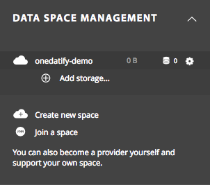
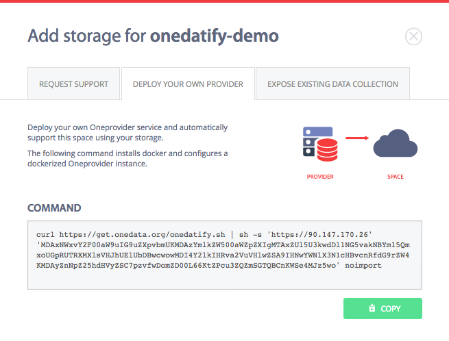
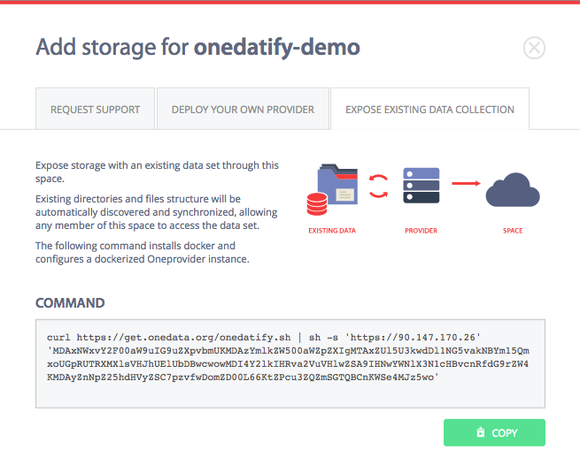
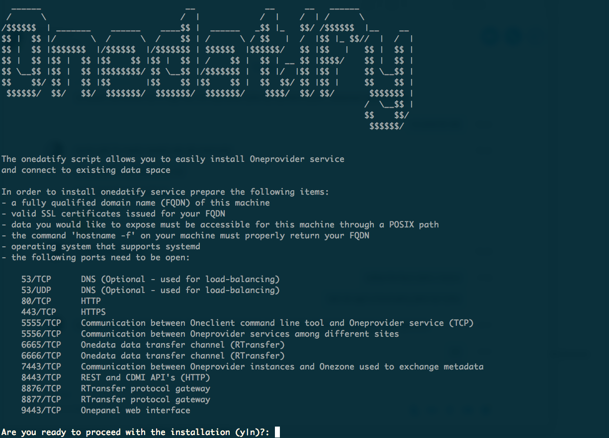
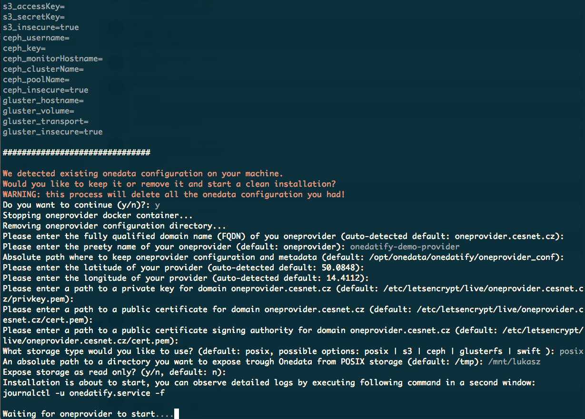

# Onedatify - automated Oneprovider setup

<!-- toc -->

Onedatify is an easy to use script for automating the deployment of Docker based
Oneprovider instance, automatically registered to a selected Onezone with selected
storage resources and enabling import of legacy data sets.

## Prerequisites
In order to use this setup method the following is necessary:
 
 * account in a Onezone instance, with which Oneprovider should register
 * a clean VM or physical machine with Fully Qualified Domain Name assigned
 * host certificate for the machine where Oneprovider will be installed
 * [necessary opened ports](./firewall_setup.md) for communication with Onezone

## Usage
Follow carefully the following steps.


### Create a new space in Onezone
The first step to deploy Oneprovider using Onedatify script is to create a new space,
which will be automatically supported by the new Oneprovider instance.

Go the main Onezone interface and select `DATA SPACE MANAGEMENT->Create new space`:

<p align="center">  </p>

### Prepare host certificates
In case you have certificates for the host machine were Oneprovider will be installed,
place place them in some folder (the script will ask for these paths later).

Certificates can be also easily generated using Let's Encrypt service. First install 
`certbot` tool by following the steps described [here](https://certbot.eff.org/) 
for your specific distribution.

Then simply invoke:
```
sudo certbot certonly --standalone -d $ONEPROVIDER_DOMAIN -d www.$ONEPROVIDER_DOMAIN
```

### Generate oneline Onedatify invocation in Onezone
The next step depends whether the Oneprovider should be deployed with empty storage
attached, or whether it should automatically scan legacy filesystem and expose it's
contents via the space.

In both cases, go to Onezone interface, and select `Add storage...` option under
the space name.

#### Deploy Oneprovider and attach empty storage
In the first case, select the tab `DEPLOY YOUR OWN PROVIDER`:

<p align="center">  </p>

and copy the generated command.

#### Deploy Oneprovider and expose existing data collection
In the second case, select the tab `EXPOSE EXISTING DATA COLLECTION`:

<p align="center">  </p>

and copy the generated command.

### Run the command on the target host
Paste the copied command in the terminal on the Oneprovider machine (as superuser).

Check the prerequsite list and confirm to proceed to the next step:

<p align="center">  </p>

If necessary, the Onedatify script will ask for permission to install 
all necessary dependencies including Docker and Docker Compose.

After the dependency installation is complete, the script will answer several
questions and suggest default setting for each one:

<p align="center">  </p>

The progress can be monitored on a separate terminal using the following command:

```
journatctl -u onedatify.service -f
```

After the deployment is complete, the following message will be show, with connection
details for administration panel for the Oneprovider instance:

<p align="center">  </p>

### Check the filesystem scan progress in the Onepanel interface
In order to monitor the filesystem scan progress, it is possible to login to the Onepanel
and watch the scan process statistics:

<p align="center">  </p>

When the scan is complete, the files can be accessed in a regular manner via the Oneprovider
GUI or using Oneclient command line tool.
