# Oneprovider installation tutorial

<!-- toc -->

This section describes the steps needed to install and configure
**Oneprovider** service in production, either using Docker images or directly
using our packages. In order to deploy **Oneprovider**, it must be connected
during startup to an existing **Onezone** installation.

## Installation
**Oneprovider** can be deployed using our [official Docker images](https://hub.docker.com/r/onedata/oneprovider/)
on any [Linux OS supporting Docker](https://docs.docker.com/engine/installation/#supported-platforms)
or using packages that we provide for *Ubuntu Xenial* and *CentOS 7*). Docker
based deployment is the recommended setup due to minimal requirements and
best portability.

**Oneprovider** service can be deployed on multiple nodes for high-availability purpose, in
such case either the Docker setup or the packages need to be installed on all
nodes where the **Oneprovider** should be deployed. This tutorial assumes
**Oneprovider** will be installed on a single node.

### Prerequisites
In order to ensure optimum performance of the **Oneprovider** service,
several low-level settings need to be tuned on the host machine. This applies
to both Docker based as well as package based installations, in particular to
nodes where Couchbase database instance are deployed.

After these settings are modified, the machine needs to be rebooted.

#### Increase maximum number of opened files
In order to install **Oneprovider** service on one of the supported operating systems, first make sure that the maximum limit of opened files is sufficient (preferably 63536, but below `/proc/sys/fs/file-max`). The limit can be checked using:

```sh
ulimit -n
1024
```

If necessary, increase the limit using:

```sh
$ sudo sh -c 'echo "* soft nofile 63536" >> /etc/security/limits.conf'
$ sudo sh -c 'echo "* hard nofile 63536" >> /etc/security/limits.conf'
```
> It might be also necessary to setup the limit in /etc/systemd/system.conf:
>```sh
sudo sh -c 'echo DefaultLimitNOFILE=65536 >> /etc/systemd/system.conf'
sudo systemctl daemon-reexec
```

#### Swap preference settings
Make sure that the swap preference (i.e. *swappiness*) is set to `0` (or at most `1` - see [here](https://developer.couchbase.com/documentation/server/current/install/install-swap-space.html) for details):

```sh
$ cat /proc/sys/vm/swappiness
60
```
and if necessary decrease it using:
```sh
$ sudo sh -c 'echo "vm.swappiness=0" >> /etc/sysctl.d/50-swappiness.conf'
```

#### Disable Transparent Huge Pages feature
By default, many Linux machines have the Transparent Huge Pages feature enabled, which somehwat improves performance of machines running multiple application at once (e.g. desktop operation systems), however it deteriorates the performance of most database-heavy applications, such as **Oneprovider**.

These settings can be checked using the following commands (the output shown below presents the expected settings):

```
$ cat /sys/kernel/mm/transparent_hugepage/enabled
always madvise [never]

$ cat /sys/kernel/mm/transparent_hugepage/defrag
always madvise [never]
```

If any of the settings is different than the above, they should be changed permanently, which can be achieved for instance by creating a simple **systemd** unit file `/etc/systemd/system/disable-thp.service`:

```
[Unit]
Description=Disable Transparent Huge Pages

[Service]
Type=oneshot
ExecStart=/bin/sh -c "/bin/echo 'never' | /usr/bin/tee /sys/kernel/mm/transparent_hugepage/enabled"
ExecStart=/bin/sh -c "/bin/echo 'never' | /usr/bin/tee /sys/kernel/mm/transparent_hugepage/defrag"

[Install]
WantedBy=multi-user.target
```

and enabling it on system startup using:

```
$ sudo systemctl enable disable-thp.service
$ sudo systemctl start disable-thp.service
```

#### Node hostname
Make sure that the machine has a resolvable, domain-style hostname (it can be Fully Qualified Domain Name or just a proper entry in `/etc/hostname` and `/etc/hosts`) - for this tutorial it is set to `oneprovider-example.com`.

Following command examples assumes an environment variable `ONEPROVIDER_HOST` is available, for instance:

```sh
$ export ONEPROVIDER_HOST="oneprovider-example.com"
```

#### Python
Make sure that python 2.x is installed on the machine. For example:
```sh
$ python -V
Python 2.7.12
```

### Onedatify based setup
The easiest way to deploy **Oneprovider** is using **Onedatify**. The deployment procedure is described [here](./onedatify_deploy.md).

### Docker based setup
**Oneprovider** installation using Docker is very straightforward. This type of deployment requires that docker and docker-compose are installed on your server.

#### Customizing Oneprovider Docker Compose script
In case of Docker based deployment all configuration information needed to install Oneprovider can be included directly in the Docker Compose script. This tutorial assumes that all **Oneprovider** configuration and log files will be stored in the folder `/opt/onedata/oneprovider` on the host machine, but you can use any directory to which Docker has access to. Make sure the partition where the `/opt` directory is mounted has at least 20GB of free space for logs and database files. For large systems with large numbers of files (>1M files) the space should be much bigger. Also consider setting up the `persistence` folder on a separate partition with backup.

The following assumes you have prepared the following directory structure:

```sh
$ sudo mkdir -p /opt/onedata/oneprovider
$ sudo mkdir /opt/onedata/oneprovider/certs
$ sudo mkdir /opt/onedata/oneprovider/persistence
```

Create the following Docker Compose file in `/opt/onedata/oneprovider/docker-compose.yml`:

```Yaml
version: '2.0'
services:
  node1.oneprovider.localhost:
    # Oneprovider Docker image version
    image: onedata/oneprovider:18.02.0-rc13
    # Hostname (in this case the hostname inside Docker network)
    hostname: node1.oneprovider.localhost
    # dns: 8.8.8.8 # Optional, in case Docker containers have no DNS access
    # Host network mode is preferred, but on some systems may not work (e.g. CentOS)
    # To use bridge network
    network_mode: host
    # Friendly name of the Oneprovider Docker container
    container_name: oneprovider-1
    # Mapping of volumes to Oneprovider container
    volumes:
       - "/var/run/docker.sock:/var/run/docker.sock"
       # Oneprovider runtime files
       - "/opt/onedata/oneprovider/persistence:/volumes/persistence"
       # Data storage directories
       - "/mnt/nfs:/volumes/storage"
       # Additional, trusted CA certificates (all files from this directory will be added)
       - "/opt/onedata/oneprovider/cacerts:/etc/op_worker/cacerts"
       # Uncoment lines below if you disabled the built-in Let's Encrypt client
       ## SSL certificate
       #- "/opt/onedata/oneprovider/certs/cert.pem:/etc/op_panel/certs/web_cert.pem"
       ## SSL certificate key
       #- "/opt/onedata/oneprovider/certs/key.pem:/etc/op_panel/certs/web_key.pem"
       ## Certificate chain for the TLS certificate above
       #- "/opt/onedata/oneprovider/certs/cacert.pem:/etc/op_panel/certs/web_chain.pem"
    # Expose the necessary ports from Oneprovider container to the host
    # This section can be commented when using host mode networking
    ports:
      - "80:80"
      - "443:443"
      - "6665:6665"
      - "9443:9443"
    environment:
      # Force Onepanel to read configuration from environment variable
      ONEPANEL_BATCH_MODE: "true"
      # Provide initial Oneprovider configuration for Onepanel in environment variable
      ONEPROVIDER_CONFIG: |
        # Cluster configuration allows to specify distribution of Oneprovider
        # components over multiple nodes - here we deploy entire service on
        # a single node
        cluster:
          # Domain name of the provider within Docker network, will be appended
          # to all nodes specified below
          domainName: "oneprovider.localhost"
          autoDeploy: true
          nodes:
            n1:
              hostname: "node1"
          managers:
            mainNode: "n1"
            nodes:
              - "n1"
          workers:
            nodes:
              - "n1"
          databases:
            # Per node Couchbase cache size in MB for all buckets
            serverQuota: 4096
            # Per bucket Couchbase cache size in MB across the cluster
            bucketQuota: 1024
            nodes:
              - "n1"
          storages:
            # Add initial storage resource (optional - can be added later)
            # In this example NFS mounted at /mnt/nfs on the host, which is
            # mounted to /volumes/storage directory inside Docker container
            NFS:
              type: "posix"
              mountPoint: "/volumes/storage"
        oneprovider:
          geoLatitude: 50.0646501
          geoLongitude: 19.9449799
          register: true
          name: "ONEPROVIDER-DEMO"
          adminEmail: "admin@oneprovider-example.tk"
          # Use built-in Let's Encrypt client to obtain and renew certificates
          letsEncryptEnabled: true
          # Automatically register this Oneprovider in Onezone without subdomain delegation
          subdomainDelegation: false
          domain: "oneprovider-example.tk"

          # Alternatively:
          ## Automatically register this Oneprovider in Onezone with subdomain delegation
          # subdomainDelegation: true
          # subdomain: oneprovider-example # Domain will be "oneprovider-example.onezone-example.tk"
        onezone:
          # Address of the Onezone at which this Oneprovider will register
          domainName: "onezone-example.tk"
        onepanel:
          # Create initially 1 administrator and 1 regular user
          users:
            "admin":
              password: "password"
              userRole: "admin"
            "user":
              password: "password"
              userRole: "regular"
```

To install the necessary Docker images on the machine run:

```sh
$ docker-compose -f /opt/onedata/oneprovider/docker-compose.yml pull
```

### Installation from distribution packages
The following instructions are based on Ubuntu Xenial.

#### Package installation
Now in order to install **Oneprovider** service, it should be enough to execute our install script, which automatically detects operating system version, adds our repository and installs required packages:

```sh
$ curl -sS  http://get.onedata.org/oneprovider.sh | bash
```

Alternatively, the necessary packages can be installed manually:
```sh
# Add Onedata package repository
$ sudo sh -c 'curl -sSL  http://packages.onedata.org/onedata.gpg.key | apt-key add -'
$ sudo sh -c 'echo "deb http://packages.onedata.org/apt/ubuntu/xenial xenial main" > /etc/apt/sources.list.d/onedata.list'
$ sudo sh -c 'echo "deb-src http://packages.onedata.org/apt/ubuntu/xenial xenial main" >> /etc/apt/sources.list.d/onedata.list'

# Update package list
$ sudo apt update

# Install packages
$ export ONEPANEL_AUTOSTART=false # Disable automatic Onepanel start
$ sudo apt install op-panel
$ sudo apt install cluster-manager
$ sudo apt install op-worker
$ sudo apt install couchbase-server-community
$ sudo apt install oneprovider
```

> Sometimes Couchbase service fails to start automatically during installation, in such case it has to be restarted manually using `$ sudo systemctl restart couchbase-server.service` and then install Oneprovider again `$ sudo apt install oneprovider`


## Configuration


### Setting up certificates
Since release 18.02.0-beta5, **Oneprovider** supports automatic certificate
management backed by Let's Encrypt. To use this option, it is only necessary
to enable this feature in **Oneprovider** Docker Compose configuration file
(see above) or via GUI.

If you prefer to obtain and install certificates for **Oneprovider** service
manually, modify the Docker Compose file to mount PEM files inside the
container using paths listed in [TLS certificate management](./ssl_certificate_management.html).

### Security and recommended firewall settings
**Oneprovider** service requires several TCP ports (`80`,`443`,`6665`,`9443`) to be opened for proper operation. Some of these ports can be limited to internal network, in particular `9443` for **Onepanel** management interface. For more details on these ports see here.

Furthermore, on all nodes of **Oneprovider** deployment where Couchbase
instance is deployed, it exposes several additional ports. This means that
the Couchbase [security guidelines](https://developer.couchbase.com/documentation/server/4.6/security/security-intro.html)
should be also followed.

For more information about ports setup see [Firewal setup](./firewall_setup.md)

### Cluster configuration for package based deployment
This tutorial assumed that the cluster configuration is provided directly in the Docker Compose file. However for package based installation the cluster configuration has to be performed separately. It can be done using the Onepanel web based interface. **Onepanel** administration service is automatically started after installation and can be accessed from `https://oneprovider-example.tk:9443` port to configure **Oneprovider** instance. In case it was not started properly, it can be restarted using `systemctl` command:

```
$ sudo systemctl restart op_panel.service
```

Open `https://oneprovider-example.tks:9443` using any web browser and continue through the following steps:

* Login using default credentials specified in (e.g. `admin:password`)
  <p align="center">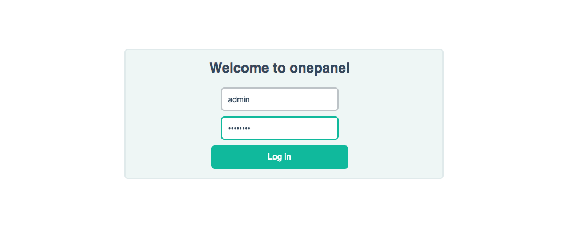</p>

* Initialize the cluster setup
  <p align="center">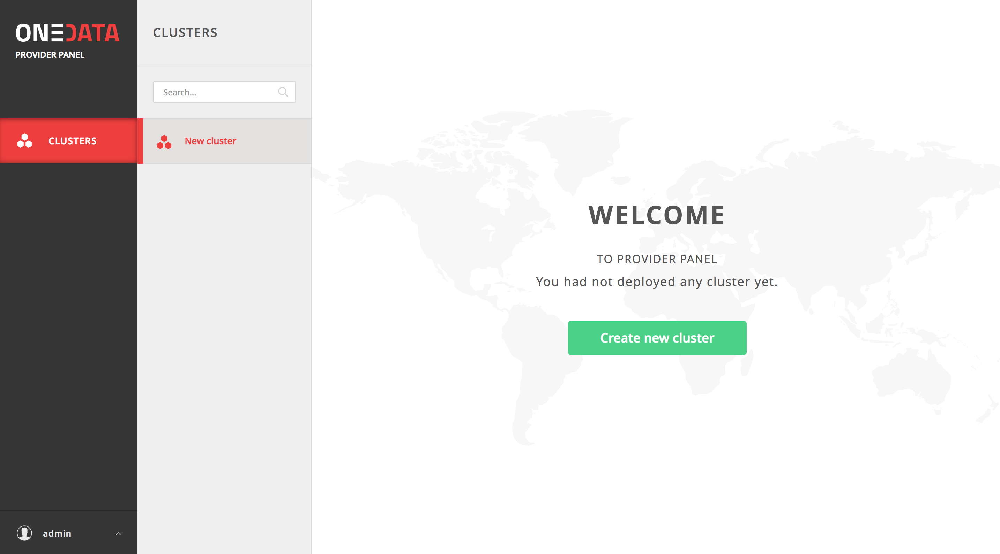</p>

* Select hosts in the cluster which will have specific roles (leave as is)
  <p align="center">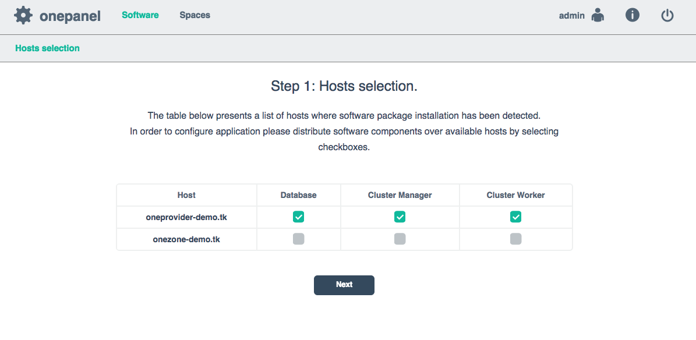</p>

* Provide Onezone details including subdomain delegation request
  <p align="center">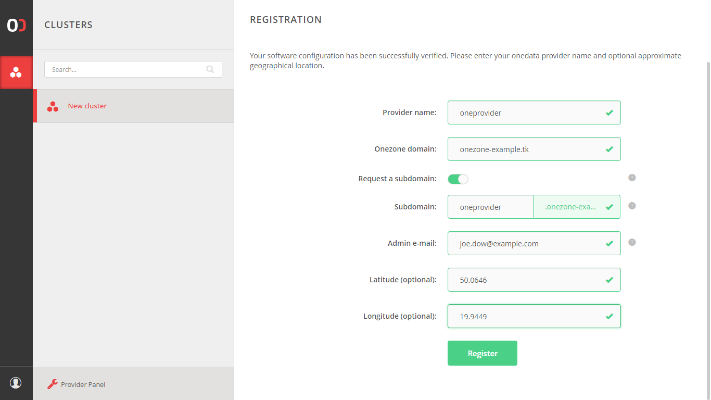</p>

* Provide the external IP address of the Oneprovider cluster and click "Setup IP address".
  <p align="center">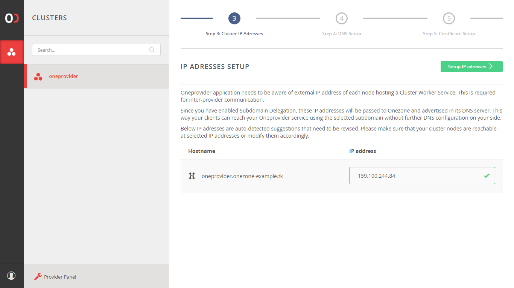</p>

* Check the DNS settings and click "Perform check". If it fails then check that the DNS records, which are displayed exists. 
  <p align="center">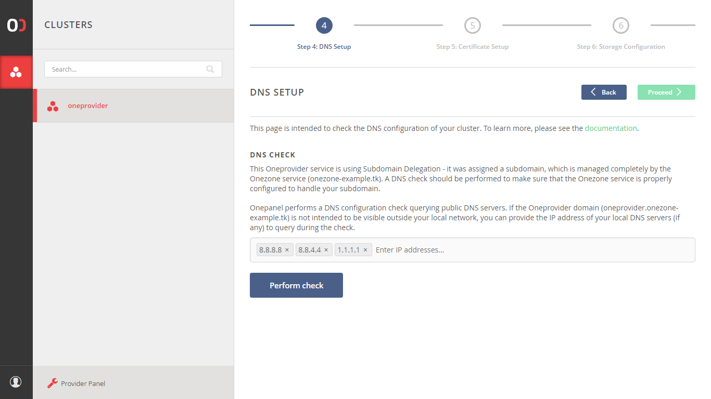</p>

* Click "Proceed" when the DNS check succeeds.
  <p align="center">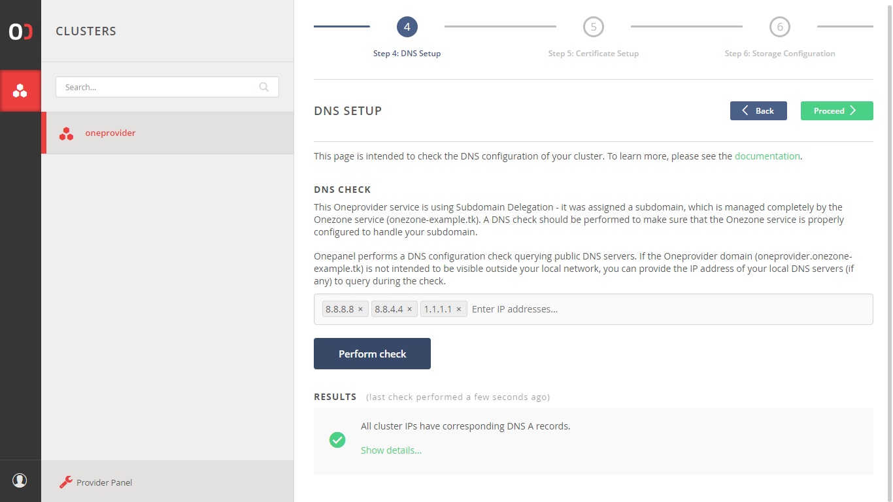</p>

* Click "Obtain certificate" to automatically obtain a web certificate from Let's encrypt.
  <p align="center">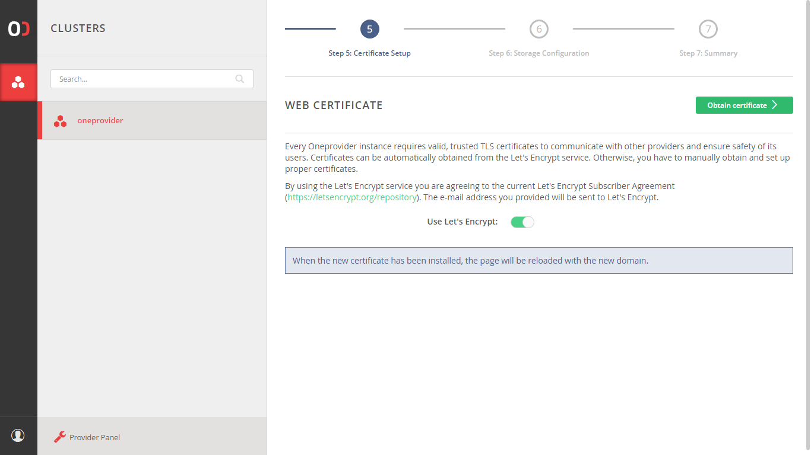</p>

* Add storage
  <p align="center">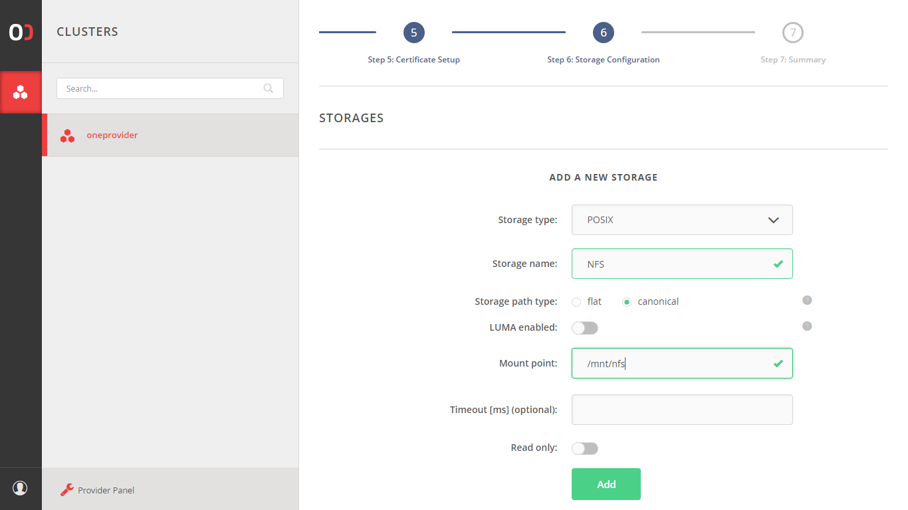</p>

* Verify the storage was added successfully and click "Finish".
  <p align="center">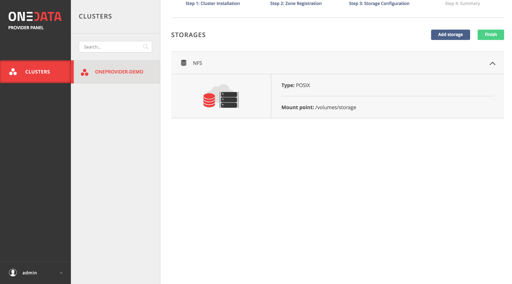</p>

* Wait for registration and deployment to complete
  <p align="center">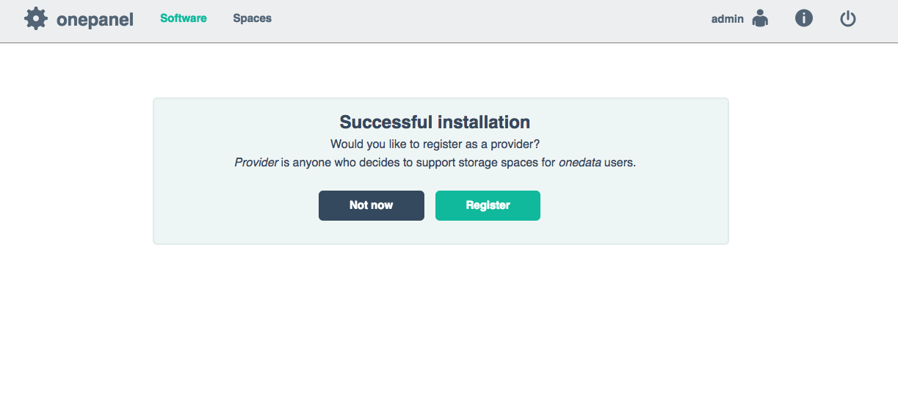</p>

After this step succeeds, **Oneprovider** should be running and opening `https://oneprovider-example.tk` should redirect to it's **Onezone** login page, in this case `https://onezone-example.tk`.

### Advanced configuration
After installation several **Oneprovider** parameters can be further fine-tuned using erlang application configuration files.

The basis for configuration are read-only files located at `/var/lib/op_worker/app.config` and `/var/lib/op_panel/app.config`. They can be used for reference for defaults in use and extensive comments explaining containted variables, but should not be modified.

Settings contained in the `app.config` files are overriden by configuration written by Onepanel during deployment in `autogenerated.config` files and by option custom user config file `overlay.config`.

The autogenerated file is located at `/etc/op_worker/autogenerated.config` and should not by modified by hand.

For custom configuration a new file `/etc/op_worker/overlay.config` or `/etc/op_panel/overlay.config` should be created. Variables set there will override those from `app.config` and `autogenerated.config` files.

## Running

### Running Docker based installation using systemd
Docker based installation can be conveniently managed using a **systemd** service unit. Simply create a `/etc/systemd/system/oneprovider.service`:

```
[Unit]
Description=Oneprovider Service
After=docker.service
Requires=docker.service

[Service]
ExecStartPre=/usr/bin/docker-compose -f /opt/onedata/oneprovider/docker-compose.yml down
ExecStart=/usr/bin/docker-compose -f /opt/onedata/oneprovider/docker-compose.yml up --abort-on-container-exit --no-recreate
ExecStop=-/usr/bin/docker-compose -f /opt/onedata/oneprovider/docker-compose.yml down
Restart=always

[Install]
WantedBy=multi-user.target
```

Then the **Oneprovider** service can be managed using standard `systemctl` command:
```
# Enable Oneprovider service on machine startup
$ sudo systemctl enable oneprovider.service

# Start Oneprovider service
$ sudo systemctl start oneprovider.service
$ sudo systemctl status oneprovider.service
...
May 25 23:25:32 localhost docker-compose[13499]: oneprovider-1                  | Congratulations! oneprovider has been successfully started.

# Stopping Oneprovider service
$ sudo systemctl stop oneprovider.service

# Restarting Oneprovider service while keeping all persistent files
$ sudo systemctl restart oneprovider.service

# Remove Oneprovider data files
$ sudo systemctl stop oneprovider.service
$ sudo rm -rf /opt/onedata/oneprovider/persistence/*
```

### Running package based installation
After web based Onepanel setup is complete, **Oneprovider** service should be operating normally. However, **Oneprovider** service can be manually started and stopped when needed, it is composed of several **systemd** units:

| Name                       | Purpose                                  |
| :------------------------- | :--------------------------------------- |
| `couchbase-server.service` | Couchbase server for **Oneprovider** metadata |
| `op_panel.service`         | **Onepanel** administration service      |
| `cluster_manager.service`  | The process for managing a cluster **Oneprovider** deployment |
| `op_worker.service`        | The main **Oneprovider** service         |

### Monitoring

Monitoring information is available on a specific port and provides basic status of all **Oneprovider** service functional components. The service status can be monitored using a simple script like below or using our [Nagios scripts](https://github.com/onedata/nagios-plugins-onedata):

```xml
curl -sS https://$ONEPROVIDER_HOST/nagios | xmllint --format -
<?xml version="1.0"?>
<healthdata date="2017/05/27 22:48:16" status="ok">
  <op_worker name="op_worker@oneprovider-example.com" status="ok">
    <node_manager status="ok"/>
    <request_dispatcher status="ok"/>
    <datastore_worker status="ok"/>
    <dbsync_worker status="ok"/>
    <dns_worker status="ok"/>
    <fslogic_deletion_worker status="ok"/>
    <fslogic_worker status="ok"/>
    <monitoring_worker status="ok"/>
    <session_manager_worker status="ok"/>
    <space_sync_worker status="ok"/>
    <subscriptions_worker status="ok"/>
    <tp_router status="ok"/>
    <dns_listener status="ok"/>
    <gui_listener status="ok"/>
    <nagios_listener status="ok"/>
    <protocol_listener status="ok"/>
    <provider_listener status="ok"/>
    <redirector_listener status="ok"/>
    <rest_listener status="ok"/>
  </op_worker>
</healthdata>
```

If all components report `"ok"` and overall healthdata status is also `"ok"`, it means the service is running properly.

### Logs
In case of issues, both **Onepanel** and **Oneprovider** logs should be checked and included in any reported issues.

**Onepanel** logs should be consulted for issues related to Oneprovider deployment, registering new storage backends or supporting spaces. **Oneprovider** logs should contain errors related to data management tasks and replication.

#### Docker based deployment
In case of Docker based deployment, assuming the paths were set as in the tutorial, the following directories contain logs:

```
# Onepanel logs
sudo ls /opt/onedata/oneprovider/persistence/var/log/op_panel/
cmd.log debug.log error.log info.log run_erl.log

# Oneprovider logs
sudo ls /opt/onedata/oneprovider/persistence/var/log/oz_worker/
debug.log error.log info.log run_erl.log
```

#### Package based deployment
In case of package based deployment, the following directories contain logs:

```
# Onepanel logs
sudo ls /var/log/op_panel/
cmd.log debug.log error.log info.log run_erl.log

# Oneprovider logs
sudo ls /var/log/op_worker/
debug.log error.log info.log run_erl.log
```

#### Enabling debug logs
By default, logs on the debug level are disabled, as they have a heavy impact on
system performance. However, there are cases when you might want to turn them 
on for some time to identify problems. To do so, you need to attach to the
Erlang console of the node and execute `logger:set_loglevel(debug).`, like this:
```
~$ op_worker attach-direct
```
You will be attached to the console and see the following prompt:
```
Direct Shell: Use "Ctrl-D" to quit. "Ctrl-C" will terminate the op_worker node.
Attaching to /tmp/op_worker/erlang.pipe.1 (^D to exit)

(op_worker@node1.oneprovider.local)11> 
```
Enter the command (the `.` at the end is required) and press `[Enter]`:
```
(op_worker@node1.oneprovider.local)11> logger:set_loglevel(debug).
ok
```
Detach from the console by pressing `[Ctrl + D]` - pressing `[Ctrl + C]` will 
kill the node!
```
(op_worker@node1.oneprovider.local)12> [Quit]
~$ 
```
From now on, the debug logs will be written to the `debug.log` file as they 
appear. Remember to turn off the debug logs when you are finished:
```
~$ op_worker attach-direct

(op_worker@node1.oneprovider.local)13> logger:set_loglevel(info).
ok

^D
```

> You can do the same for Onepanel, just replace `op_worker` with `op_panel`.


## Upgrading

### Docker based installation
To upgrade a Docker based installation, stop the **Oneprovider** service using:

```
$ sudo systemctl stop oneprovider.service
```

and modify the Oneprovider Docker image version in `/opt/onedata/oneprovider/docker-compose.yml`:

```yaml
  ...
  node1.onezone.localhost:
    # Oneprovider Docker image version
    image: onedata/oneprovider:VERSION
    ...
```

and restart the service:

```
$ sudo systemctl start oneprovider.service
```

### Package based installation

To upgrade **Oneprovider** deployment perform the following steps. In case **Oneprovider** is running on multiple nodes, stop the services first on all nodes, perform upgrade and then restart the services.

```sh
# Stop Oneprovider components
$ sudo systemctl stop op_panel.service
$ sudo systemctl stop op_worker.service
$ sudo systemctl stop cluster_manager.service
$ sudo systemctl stop couchbase-server.service

# Upgrade packages
$ sudo apt upgrade onezone

# Start Oneprovider components
$ sudo systemctl start couchbase-server.service
$ sudo systemctl start cluster_manager.service
$ sudo systemctl start op_panel.service
$ sudo systemctl start op_worker.service
```

## Typical administration tasks
This section presents few typical administration tasks that can be performed by **Oneprovider** admins.

### Change administrator password
The administrator password to the **Oneprovider** administration panel can be changed easily within GUI (`https://$ONEPROVIDER_HOST:9443`) or using the REST API:

```sh
curl -sS -X PATCH -H 'Content-type: application/json' \
-d '{"username": "admin", "password": "NewPassword"}' -u admin:password \
https://$ONEPROVIDER_HOST:9443/api/v3/onepanel/users
```

### Adding new storage to Oneprovider

Storage resources can be conveniently added to a **Oneprovider** instance using the Onepanel GUI, in menu **Storages** and click **Add storage** in the top right corner:

* Select storage type and provider required connection details (example for S3):
  <p align="center">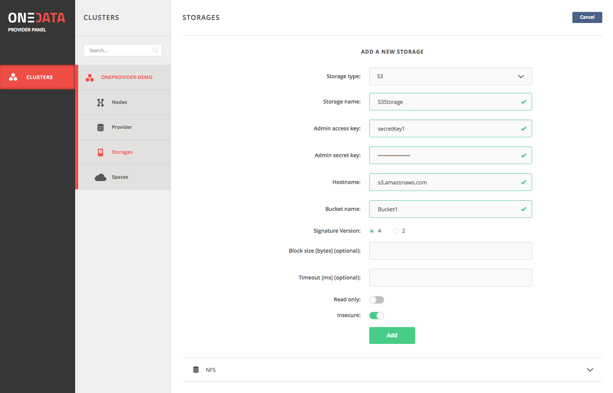</p>

From this point on when supporting user spaces, this storage will be available as an option.

### Support user spaces with storage

The only way users can use the **Oneprovider** storage resources is by requesting storage support from **Oneprovider** administrator, by sending them **Space support** tokens created in the **Onezone** user interface.

Using the token, the administrator can support the space on a specific storage using the web interface:

* Select storage type, paste support token received from user and specify storage quota for the user:
  <p align="center">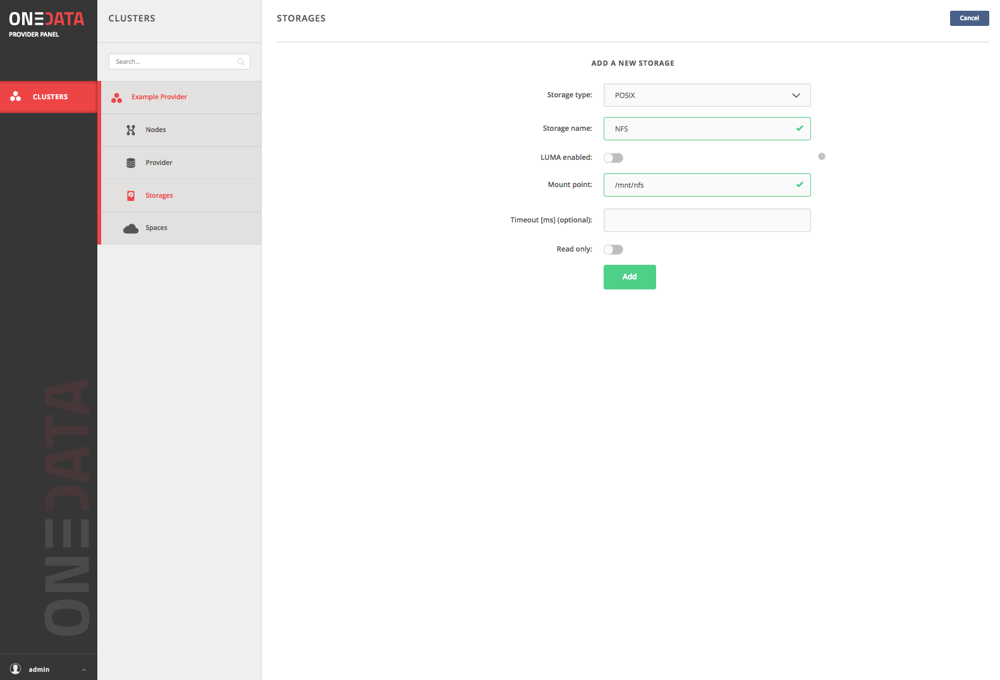</p>

### Add storage with existing data

Oneprovider allows to enable synchronization of existing storage with legacy data without the need for manually importing that data into the Oneprovider.

First, storage with the legacy data must be registered in the Oneprovider, as explained above. In case the underlying storage is read-only, make sure to set the radio button **Read only** while adding the storage, which will prevent Oneprovider from storing a local copy of the monitoring metrics on that storage:

<p align="center">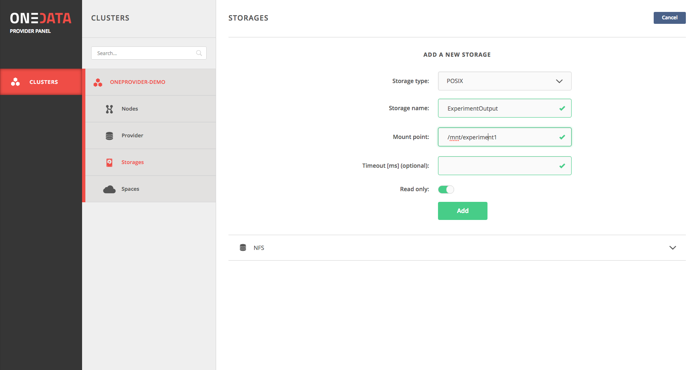</p>

Then a space has to be created in the Onezone for this data set, and then support for the  storage has to be added in the Onepanel interface. When supporting the space, the import can be enabled. This means that from the same storage several data collections can be exported under different spaces and with different options.

When supporting a space for storage synchronization, typically **Mount in root** option must be enabled. This option will align the space namespace with the mounpoint specified in the storage. In case this option is not enabled, Oneprovider will look for the files under storage path suffixed with space id, i.e. it only makes sens to use this option when connecting empty storage to space.

Second option, **Import storage data** needs to be selected and it provides 2 basic modes of import: one-time import or continuous synchronization.

#### One time data import
In case only one-time import is required, i.e. no future changes in the filesystems (new files, modified files, removed files) will be detected. This can be enabled using the following configuration:

<p align="center">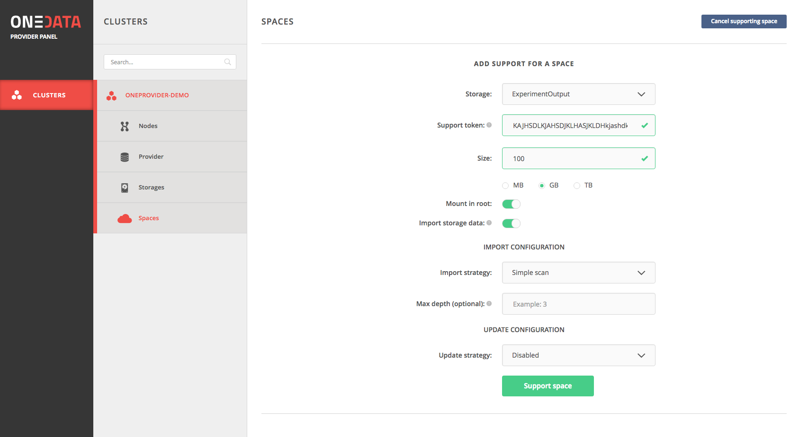</p>

The following options can be provided:

* **Import strategy** - currently only Simple scan mode is available
* **Max depth** - the maximum directory depth the scanner should follow (by default it is unlimited)

#### Continuous synchronization
In case only one-time import is required, i.e. no future changes in the filesystems (new files, modified files, removed files) will be detected. This can be enabled using the following configuration:

<p align="center">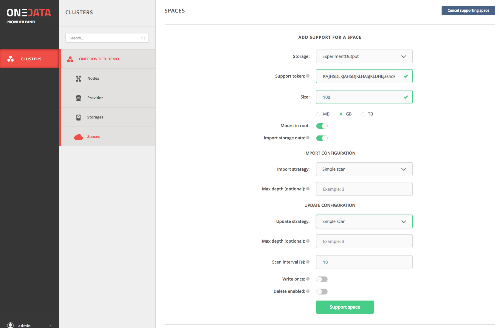</p>

The following options can be provided in this case:

* **Import strategy** - currently only Simple scan mode is available
* **Max depth** - the maximum directory depth the scanner should follow (by default it is unlimited)
* **Update strategy** - currently only Simple scan mode is available, which must be selected
* **Max depth** - again, the maximum directory depth the scanner should follow for consecutive updates (by default it is unlimited)
* **Scan interval** - the delay between consecutive scans of the filesystem changes
* **Write once** - determines that the storage should be treated as read-only
* **Delete enabled** - allows to enable or disable detection of deleted files


After the space is supported, storage synchronization starts automatically and it's progress can be observed in the spaces details view with several charts visualizing the data import progress:

<p align="center">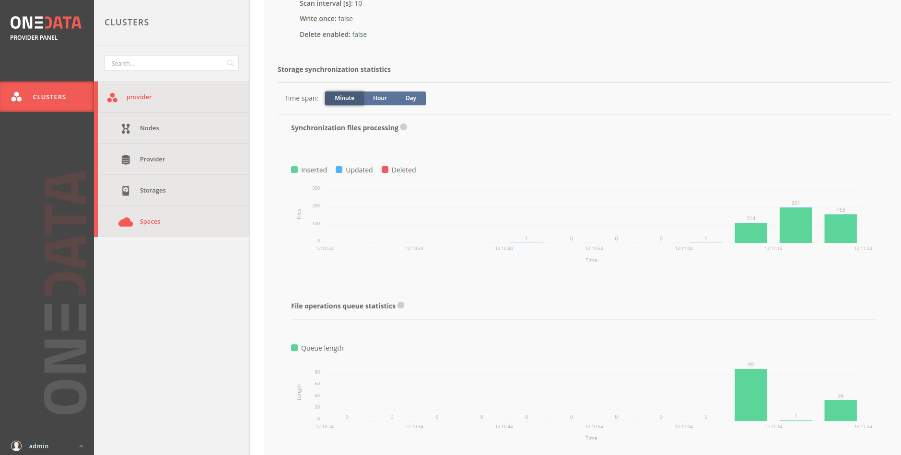</p>
