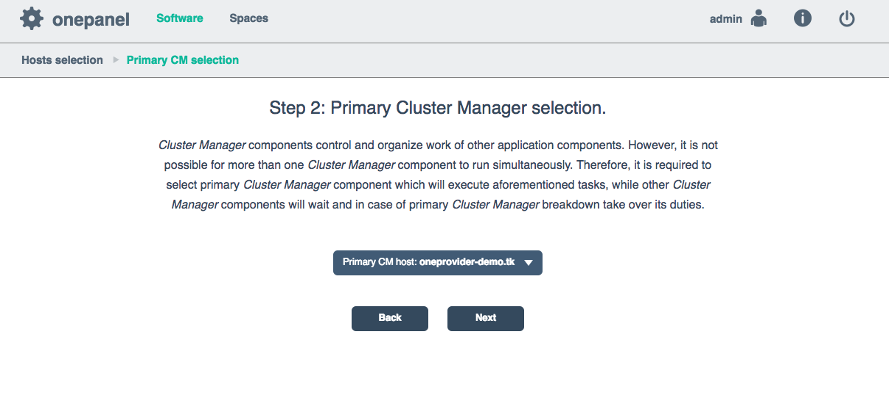
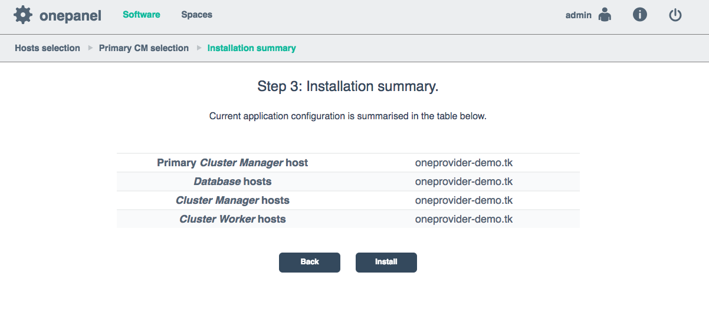
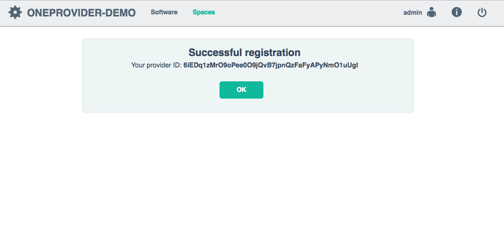

# Oneprovider installation tutorial

<!-- toc -->

This section describes the steps needed to install and configure **Oneprovider** service in production, either using Docker images or directly using our packages. In order to deploy **Oneprovider**, it must be connected during startup to an existing **Onezone** installation.

For instructions how to setup test deployments with minimal effort checkout our [Getting Started](https://github.com/onedata/getting-started) repository - this tutorial is roughly equivalent to [scenario 3.0](https://github.com/onedata/getting-started/tree/master/scenarios/3_0_oneprovider_onezone_multihost).

## Installation
**Oneprovider** can be deployed using our [official Docker images](https://hub.docker.com/r/onedata/onezone/) on any [Linux OS supporting Docker](https://docs.docker.com/engine/installation/#supported-platforms) or using packages that we provide for *Ubuntu Wily*, *Ubuntu Xenial* and *Fedora 23*). Docker based deployment is the recommended setup due to minimal requirements and best portability.

**Oneprovider** service can be deployed on multiple nodes for high-availability purpose, in such case either the Docker setup or the packages need to be installed on all nodes where the **Oneprovider** should be deployed. This tutorial assumes **Oneprovider** will be installed on a single node.

### Prerequisites
In order to ensure optimum performance of the **Oneprovider** service, several low-level settings need to be tuned on the host machine. This applies to both Docker based as well as package based installations, in particular to nodes where Couchbase database instance are deployed.

#### Increase maximum number of opened files
In order to install **Oneprovider** service on one of the supported operating systems, first make sure that the maximum limit of opened files is at least `4096`:

```sh
$ ulimit -n
4096
```

If it's less, increase the limit using:

```sh
$ sudo sh -c 'echo "* soft nofile 4096" >> /etc/security/limits.conf'
```

#### Swap preference settings
Make sure that the swap preference (i.e. *swappiness*) is set to `0` (or at most 1 - see [here](https://developer.couchbase.com/documentation/server/current/install/install-swap-space.html) for details):

```sh
$ cat /proc/sys/vm/swappiness
60
```
and if necessary decrease it using:
```sh
$ sudo sh -c 'echo "vm.swappiness=0" >> /etc/sysctl.d/50-swappiness.conf'
```

#### Disable Transparent Huge Pages feature
By default, many Linux machines have the Transparent Huge Pages feature enabled, which improves performance of machines running multiple application at once, however it deteriorates the performance of most database-heavy applications, such as **Oneprovider**.

These settings can be checked using the following commands (the output shown below presents the expected settings):

```
$ cat /sys/kernel/mm/transparent_hugepage/enabled
always madvise [never]

$ cat /sys/kernel/mm/transparent_hugepage/defrag
always madvise [never]
```

If any of the settings is different than the above, they should be changed permanently, which can be achieved for instance by creating a simple **systemd** unit file `/etc/systemd/system/disable-thp.service`:

```
[Unit]
Description=Disable Transparent Huge Pages

[Service]
Type=oneshot
ExecStart=/bin/sh -c "/bin/echo "never" | /usr/bin/tee /sys/kernel/mm/transparent_hugepage/enabled"
ExecStart=/bin/sh -c "/bin/echo "never" | /usr/bin/tee /sys/kernel/mm/transparent_hugepage/defrag"

[Install]
WantedBy=multi-user.target
```

and enabling it on system startup using:

```
$ sudo systemctl enable disable-thp.service
$ sudo systemctl start disable-thp.service
```

#### Node hostname
Make sure that the machine has a resolvable, domain-style hostname (it can be Fully Qualified Domain Name or just a proper entry in `/etc/hostname` and `/etc/hosts`) - for this tutorial it is set to `oneprovider-demo.tk`.

### Docker based setup
**Oneprovider** installation using Docker is very straightforward, the best way is to use and customize our example [Docker Compose scripts](https://github.com/onedata/getting-started).

#### Customizing Oneprovider Docker Compose script
In case of Docker based deployment all configuration information needed to install Oneprovider can be included directly in the Docker Compose script. This tutorial assumes that all **Oneprovider** configuration and log files will be stored in the folder `/opt/onedata/oneprovider` on the host machine, but you can use any directory to which Docker has access to. Make sure the partition where the `/opt` directory is mounted has at least 20GB of free space for logs and database files.

Create the following Docker Compose file in `/opt/onedata/oneprovider/docker-compose.yml`:

```Yaml
version: '2.0'
services:
  node1.onezone.localhost:
    # Oneprovider Docker image version
    image: onedata/oneprovider:3.0.0-rc14
    # Hostname (in this case the hostname inside Docker network)
    hostname: node1.oneprovider.localhost
    # dns: 8.8.8.8 # Optional, in case Docker containers have no DNS access
    container_name: oneprovider-1
    # Mapping of volumes to Oneprovider container
    volumes:
       - "/var/run/docker.sock:/var/run/docker.sock"
       # Oneprovider runtime files
       - "/opt/onedata/oneprovider/persistence:/volumes/persistence"
       # Data storage directories
       - "/mnt/nfs:/volumes/storage"
       # Oneprovider certificate key
       - "/opt/onedata/oneprovider/certs/key.pem:/etc/op_panel/certs/key.pem"
       # Oneprovider public certificate
       - "/opt/onedata/oneprovider/certs/cert.pem:/etc/op_panel/certs/cert.pem"
       # Certificate of public certificate signing authority
       - "/opt/onedata/oneprovider/certs/cacert.pem:/etc/op_panel/cacerts/cacert.pem"
       # Certificate of public certificate signing authority (same as above)
       - "/opt/onedata/oneprovider/certs/cacert.pem:/etc/op_worker/cacerts/cacert.pem"
    # Expose the necessary ports from Oneprovider container to the host
    ports:
      - "53:53"
      - "53:53/udp"
      - "443:443"
      - "80:80"
      - "5555:5555"
      - "5556:5556"
      - "6665:6665"
      - "6666:6666"
      - "7443:7443"
      - "8443:8443"
      - "8876:8876"
      - "8877:8877"
      - "9443:9443"
    environment:
      # Force Onepanel to read configuration from environment variable
      ONEPANEL_BATCH_MODE: "true"
      # Provide initial Oneprovider configuration for Onepanel in environment variable
      ONEZONE_CONFIG: |
        # Cluster configuration allows to specify distribution of Oneprovider
        # components over multiple nodes - here we deploy entire service on
        # a single node
        cluster:
          domainName: "oneprovider.localhost"
          autoDeploy: true
          nodes:
            n1:
              hostname: "node1"
          managers:
            mainNode: "n1"
            nodes:
              - "n1"
          workers:
            nodes:
              - "n1"
          databases:
            # Per node Couchbase cache size in MB for all buckets
            serverQuota: 4096
            # Per bucket Couchbase cache size in MB across the cluster
            bucketQuota: 1024
            nodes:
              - "n1"
          storages:
            # Add initial storage resource (optional - can be added later)
            # In this example NFS mounted at /mnt/nfs on the host, which is
            # mounted to /volumes/storage directory inside Docker container
            NFS:
              type: "posix"
              mountPoint: "/volumes/storage"
        oneprovider:
          # Automatically register this Oneprovider in Onezone
          register: true
          name: "ONEPROVIDER-DEMO"
          redirectionPoint: "https://oneprovider-demo.tk"
          geoLatitude: 50.0646501
          geoLongitude: 19.9449799
        onezone:
          # Assign custom name to the Onezone instance
          domainName: "onezone-demo.tk"
        onepanel:
          # Create initially 1 administrator and 1 regular user
          users:
            "admin":
              password: "password"
              userRole: "admin"
            "user":
              password: "password"
              userRole: "regular"
```

To install the necessary Docker images on the machine run:

```sh
$ docker-compose -f /opt/onedata/oneprovider/docker-compose.yml pull
```

### Installation from distribution packages
The following instructions are based on Ubuntu Xenial.

#### Package installation
Now in order to install **Oneprovider** service, it should be enough to execute our install script, which automatically detects operating system version, adds our repository and installs required packages:

```sh
$ curl -sS  http://get.onedata.org/oneprovider.sh | bash
```

Alternatively, the necessary packages can be installed manually:
```sh
# Add Onedata package repository
$ sudo sh -c 'curl -sSL  http://packages.onedata.org/onedata.gpg.key | apt-key add -'
$ sudo sh -c 'echo "deb http://packages.onedata.org/apt/ubuntu/xenial xenial main" > /etc/apt/sources.list.d/onedata.list'
$ sudo sh -c 'echo "deb-src http://packages.onedata.org/apt/ubuntu/xenial xenial main" >> /etc/apt/sources.list.d/onedata.list'

# Update package list
$ sudo apt update

# Install packages
$ sudo apt install op-panel
$ sudo apt install cluster-manager
$ sudo apt install op-worker
$ sudo apt install couchbase-server-community
$ sudo apt install oneprovider
```

> Sometimes Couchbase service fails to start automatically during installation, in such case it has to be restarted manually using `$ sudo systemctl restart couchbase-server.service` and then install Oneprovider again `$ sudo apt install oneprovider`


## Configuration

### Configuring service properties

TODO


### Setting up certificates

#### Manually using CA issued set of certificates
In order to configure certificates for **Oneprovider** service the following certificates are necessary (in PEM format) and should be placed under specified below paths depending on type of installation:

| Name             | Path for Docker deployment | Path for package deployment |
|:-----------------|:-----------------|:-----------------|
| Oneprovider private key | `/opt/onedata/oneprovider/certs/key.pem` | `/etc/op_panel/certs/key.pem` |
| Oneprovider public certificate | `/opt/onedata/oneprovider/certs/cert.pem` | `/etc/op_panel/certs/cert.pem`|
| Oneprovider certificate CA cert | `/opt/onedata/oneprovider/certs/cacert.pem` | `/etc/op_panel/certs/cert.pem`, `/etc/op_worker/certs/cacert.pem` |

#### Automated setup using Let's Encrypt

TODO

### Security and recommended firewall settings
**Oneprovider** service requires several ports (`53`,`53/UDP`,`80`,`443`,`5555`,`5556`,`6665`,`6666`,`7443`,`8443`,`8876`,`8876`,`8877`,`9443`) to be opened for proper operation. Some of these ports can be limited to internal network, in particular `9443` for **Onepanel** management interface and `6666` for monitoring information. For more details on these ports see here.

Furthermore, on all nodes of **Oneprovider** deployment where Couchbase instance is deployed, it exposes several additional ports. This means that the Couchbase [security guidelines](should be also followed.https://developer.couchbase.com/documentation/server/4.6/security/security-intro.html) should be also followed.

<!--
### Load balancing setup

TODO -->

### Cluster configuration for package based deployment
This tutorial assumed that the cluster configuration is provided directly in the Docker Compose file. However for package based installation the cluster configuration has to be performed separately. It can be done using the Onepanel web based interface. **Onepanel** administration service is automatically started after installation and can be accessed from `https://oneprovider-demo.tk:9443` port to configure **Oneprovider** instance. In case it was not started properly, it can be restarted using `systemctl` command:

```
$ sudo systemctl restart op_panel.service
```

Open `https://oneprovider-demo.tk:9443` using any web browser and continue through the following steps:

* Login using default credentials specified in (e.g. `admin:password`)
<p align="center"></p>

* Select hosts in the cluster which will have specific roles (leave as is)
<p align="center"></p>

* Select the main cluster manager host
<p align="center"></p>

* Verify the configuration and proceed with install
<p align="center"></p>

* Wait for installation to complete and choose to register with a Onezone instance
<p align="center"></p>

* Provide Onezone details
<p align="center"></p>

* Wait for registration to complete
<p align="center"></p>


After this step succeeds, **Oneprovider** should be running and opening a `https://oneprovider-demo.tk` should redirect to it's **Onezone** login page, in this case `https://onezone-demo.tk`.

## Running

### Running Docker based installation using systemd
Docker based installation can be conveniently managed using a **systemd** service unit. Simply create a `/etc/systemd/system/oneprovider.service`:

```
[Unit]
Description=Oneprovider Service
After=docker.service
Requires=docker.service

[Service]
ExecStartPre=/usr/bin/docker-compose -f /opt/onedata/oneprovider/docker-compose.yml down
ExecStart=/usr/bin/docker-compose -f /opt/onedata/oneprovider/docker-compose.yml up --abort-on-container-exit --no-recreate
ExecStop=-/usr/bin/docker-compose -f /opt/onedata/oneprovider/docker-compose.yml down
Restart=always

[Install]
WantedBy=multi-user.target
```

Then the **Oneprovider** service can be managed using standard `systemctl` command:
```
# Enable Oneprovider service on machine startup
$ sudo systemctl enable oneprovider.service

# Start Oneprovider service
$ sudo systemctl start oneprovider.service
$ sudo systemctl status oneprovider.service
...
May 25 23:25:32 localhost docker-compose[13499]: oneprovider-1                  | Congratulations! oneprovider has been successfully started.

# Stopping Oneprovider service
$ sudo systemctl stop oneprovider.service

# Restarting Oneprovider service while keeping all persistent files
$ sudo systemctl restart oneprovider.service

# Remove Oneprovider data files
$ sudo systemctl stop oneprovider.service
$ sudo rm -rf /opt/onedata/oneprovider/persistence/*
```

### Running package based installation
After web based Onepanel setup is complete, **Oneprovider** service should be operating normally. However, **Oneprovider** service can be manually started and stopped when needed, it is composed of several **systemd** units:

| Name             | Purpose |
|:-----------------|:-----------------|
| `couchbase-server.service` | Couchbase server for **Oneprovider** metadata |
| `op_panel.service` | **Onepanel** administration service |
| `cluster_manager.service` | The process for managing a cluster **Oneprovider** deployment |
| `op_worker.service` | The main **Oneprovider** service |

### Monitoring

Monitoring information is available on a specific port and provides basic status of all **Oneprovider** service functional components. The service status can be monitored using a simple script like below or using our [Nagios scripts](https://github.com/onedata/nagios-plugins-onedata):

```xml
curl -sS http://oneprovider-demo.tk:6666/nagios | xmllint --format -
<?xml version="1.0"?>
<healthdata date="2017/05/27 22:48:16" status="ok">
  <op_worker name="op_worker@oneprovider-demo.tk" status="ok">
    <node_manager status="ok"/>
    <request_dispatcher status="ok"/>
    <datastore_worker status="ok"/>
    <dbsync_worker status="ok"/>
    <dns_worker status="ok"/>
    <fslogic_deletion_worker status="ok"/>
    <fslogic_worker status="ok"/>
    <monitoring_worker status="ok"/>
    <session_manager_worker status="ok"/>
    <space_sync_worker status="ok"/>
    <subscriptions_worker status="ok"/>
    <tp_router status="ok"/>
    <dns_listener status="ok"/>
    <gui_listener status="ok"/>
    <nagios_listener status="ok"/>
    <protocol_listener status="ok"/>
    <provider_listener status="ok"/>
    <redirector_listener status="ok"/>
    <rest_listener status="ok"/>
  </op_worker>
</healthdata>
```

If all components report `"ok"` and overall healthdata status is also `"ok"`, it means the service is running properly.


## Upgrading

### Docker based installation
To upgrade a Docker based installation, stop the **Oneprovider** service using:

```
$ sudo systemctl stop oneprovider.service
```

and modify the Oneprovider Docker image version in `/opt/onedata/oneprovider/docker-compose.yml`:

```yaml
  ...
  node1.onezone.localhost:
    # Oneprovider Docker image version
    image: onedata/oneprovider:VERSION
    ...
```

and restart the service:

```
$ sudo systemctl start oneprovider.service
```

### Package based installation

TODO

## Typical administration tasks

### Adding new storage to Oneprovider

TODO

### Support user spaces with storage

TODO