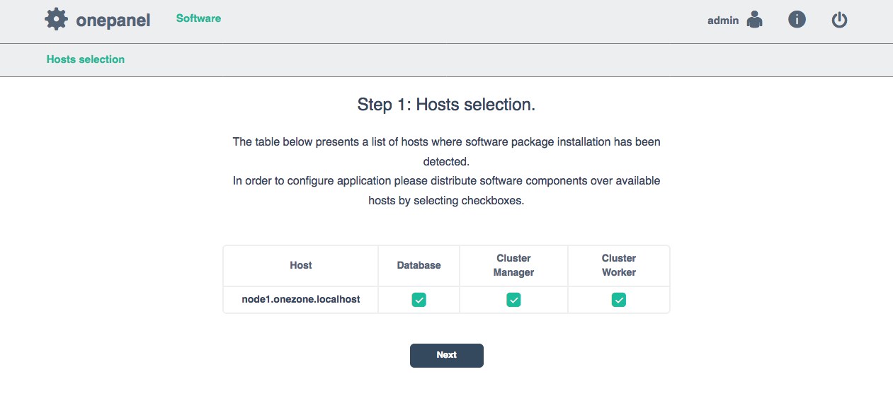
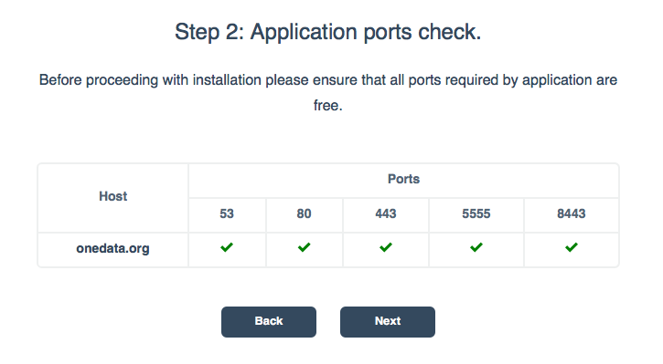
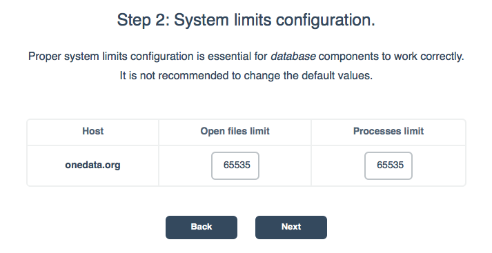

# Onezone setup

<!-- toc -->

In order to install Onezone service, either use one of the provided
packages or use Docker.

For detailed instructions on how to install Onezone checkout
[downloading section](../getting_started/downloading_onedata.md) on
Onedata homepage.

Onezone package setups a service called Onepanel. Onepanel is a cluster
installation and administration user interface that detects all other nodes in
the local network where Onezone service have been installed and allows for
configuration of services on each cluster node.

Upon successful installation of Onezone package, you need to navigate to
`https://<ip>:9443` address. The default credentials for logging into Onepanel
are:
~~~
login: admin
password: password
~~~

## Configuration using Onepanel GUI

### Step 1: Hosts selection

<p align="center"></p>

In this step, Onepanel detects all nodes in the network where Onezone package
has been installed and Onepanel service is running. You can specify on which
nodes Onezone services will be installed.


### Step 2: Application ports check

In order to work properly, Onezone needs a number of [ports](./firewall_setup.md)
open on the machine. In this step Onezone ensures that all needed ports are open.

<p align="center"></p>


### Step 3: System limits configuration

Administrators may impose limit on a number of files opened by Onezone, services
and processes spawned by them.

<p align="center"></p>

## Configuration using YAML
In addition to Onepanel GUI, Onezone can be configured before starting using
YAML defined configuration. Example configuration file is presented below:

```
cluster:
  domainName: "myzone.example.com"
  autoDeploy: true
  nodes:
    n1:
      hostname: "node1"
  managers:
    mainNode: "n1"
    nodes:
      - "n1"
  workers:
    nodes:
      - "n1"
  databases:
    serverQuota: 20972
    bucketQuota: 10486
    nodes:
      - "n1"
onezone:
  name: "MyZone"
  domainName: "myzone.example.com"
onepanel:
  users:
    "admin":
      password: "password"
      userRole: "admin"
    "user":
      password: "password"
      userRole: "regular"
```

The meaning of the fields is as follows:
* `cluster` - specification of the Onezone cluster deployment
  * `domainName` - the domain name of this Onezone instance
  * `autoDeploy` - whether the Onepanel should automatically deploy components on all specified nodes
  * `nodes` - the list of nodes comprising this Onezone deployment
  * `managers` - the list of nodes where cluster manager component is deployed
  * `workers` - the list of nodes where worker components are deployed
  * `databases` - the list of nodes where database instances are deployed
    * `serverQuota` - the size (in MB) for database memory buffer on each node (see [here](http://docs.couchbase.com/admin/admin/Concepts/concept-ramQuota.html) for more information)
    * `bucketQuota` - the size (in MB) for memory of each bucket (see [here](http://docs.couchbase.com/admin/admin/Concepts/concept-ramQuota.html) for more information)
* `onezone` - Onezone specific details
  * `name` - name of the Onezone instances
  * `domainName` - the Onezone domain address
* `onepanel` - Onepanel specific details
  * `users` - the list of users which can login to Onepanel and Onezone services using Basic Auth
