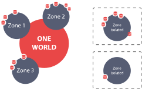

# Onezone Overview

Onezone is a cluster solution that divides Onedata distributed system into zones. There can be only one Onezone service in a zone. Providers register with/join Onezone service in order to communicate with each other and expose their resources to users.

**Onezone** service is a gateway for users to Onedata system. It is responsible for authentication and authorization of users using *Open ID* services such as: Github, Facebook, Google and Dropbox.

It allows users to:
- generate space support tokens, that can be used to support user spaces with storage from a dedicated storage provider
- monitor availability of storage providers that support user spaces
- see the geographical distribution of storage providers
- select storage providers
- collaborate with other users by sharing single files or entire data spaces or creating and managing user groups

**Onezone** is a cluster solution that is composed of 3 types of services:
* **Cluster Manager** - an administrative service that monitors the health of the cluster, performs load balancing and manages other cluster nodes
* **Worker** - a service for data management
* **Database** - a service providing persistent storage for metadata and tranfer control

Each service can be scaled to any number of nodes in a site, depending on the performance and reliability requirements. The cluster can be administered from any node, thanks to *Onepanel* web application that runs on every Onedata node.
