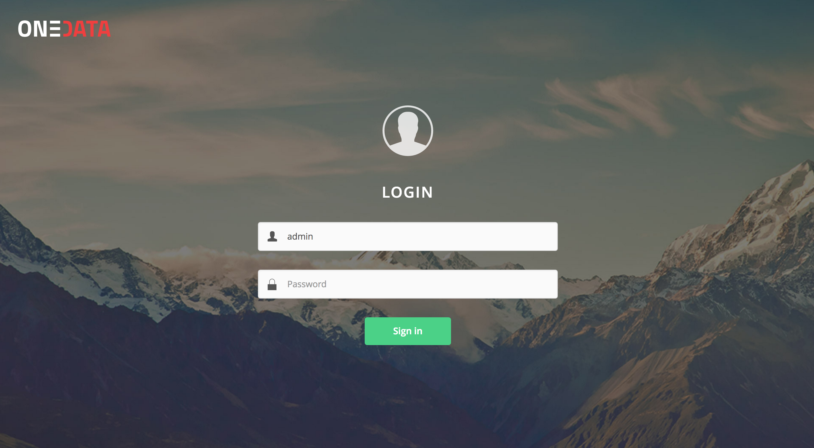
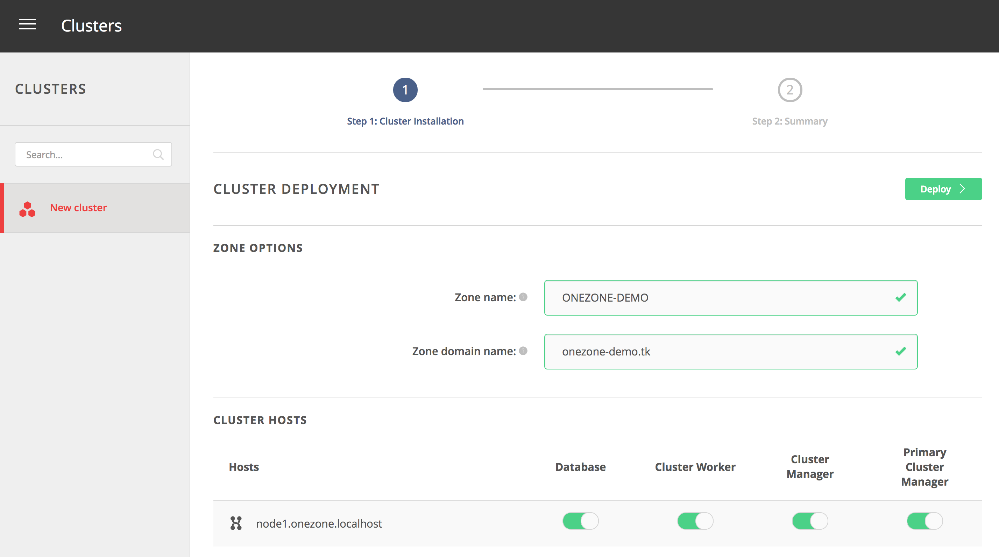
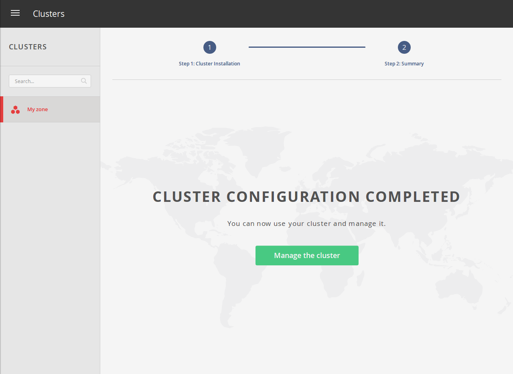

# Onezone installation tutorial

<!-- toc -->

This section describes the steps needed to install and configure Onezone service in production, either using Docker images or directly using our packages. For instructions how to setup test deployments with minimal effort checkout our [Getting Started](https://github.com/onedata/getting-started) repository - this tutorial is roughly equivalent to [scenario 3.0](https://github.com/onedata/getting-started/tree/master/scenarios/3_0_oneprovider_onezone_multihost).

## Installation
Onezone can be deployed using our [official Docker images](https://hub.docker.com/r/onedata/onezone/) on any [Linux OS supporting Docker](https://docs.docker.com/engine/installation/#supported-platforms) or using packages that we provide for *Ubuntu Wily*, *Ubuntu Xenial* and *Fedora 23*). Docker based deployment is the recommended setup due to minimal requirements and best portability.

**Onezone** service can be deployed on multiple nodes for high-availability purposes, in such case either the Docker setup or the packages need to be installed on all nodes where the **Onezone** should be deployed. This tutorial assumes **Onezone** will be installed on a single node.

### Prerequisites
In order to ensure optimum performance of the **Onezone** service, several low-level settings need to be tuned on the host machine. This applies to both Docker based as well as package based installations, in particular to nodes where Couchbase database instance are deployed.

After these settings are modified, the machine needs to be rebooted.

#### Increase maximum number of opened files
In order to install **Onezone** service on one of the supported operating systems, first make sure that the maximum limit of opened files is sufficient (preferably 63536, but below `/proc/sys/fs/file-max`). The limit can be checked using:

```sh
$ ulimit -n
1024
```

If necessary, increase the limit using:

```sh
$ sudo sh -c 'echo "* soft nofile 63536" >> /etc/security/limits.conf'
```

#### Swap preference settings
Make sure that the swap preference (i.e. *swappiness*) is set to `0` (or at most `1` - see [here](https://developer.couchbase.com/documentation/server/current/install/install-swap-space.html) for details):

```sh
$ cat /proc/sys/vm/swappiness
60
```
and if necessary decrease it using:
```sh
$ sudo sh -c 'echo "vm.swappiness=0" >> /etc/sysctl.d/50-swappiness.conf'
```

#### Disable Transparent Huge Pages feature
By default, many Linux machines have the Transparent Huge Pages feature enabled, which improves apparent performance of machines running multiple applications at once, however it deteriorates the performance of most database-heavy applications, such as **Onezone**.

These settings can be checked using the following commands (here the output shown is the expected setting):

```
$ cat /sys/kernel/mm/transparent_hugepage/enabled
always madvise [never]

$ cat /sys/kernel/mm/transparent_hugepage/defrag
always madvise [never]
```

If any of the settings is different than the above, they should be changed permanently, which can be achieved for instance by creating a simple **systemd** unit file `/etc/systemd/system/disable-thp.service`:

```
[Unit]
Description=Disable Transparent Huge Pages

[Service]
Type=oneshot
ExecStart=/bin/sh -c "/bin/echo "never" | /usr/bin/tee /sys/kernel/mm/transparent_hugepage/enabled"
ExecStart=/bin/sh -c "/bin/echo "never" | /usr/bin/tee /sys/kernel/mm/transparent_hugepage/defrag"

[Install]
WantedBy=multi-user.target
```

and enabling it on start using:

```
$ sudo systemctl enable disable-thp.service
$ sudo systemctl start disable-thp.service
```

#### Node hostname
Make sure that the machine has a resolvable, domain-style hostname (it can be Fully Qualified Domain Name or just a proper entry in `/etc/hostname` and `/etc/hosts`) - for this tutorial it is set to `onezone-demo.tk`.

Following command examples assumes an environment variable `ONEZONE_HOST` is available, for instance:

```sh
$ export ONEZONE_HOST="onezone-demo.tk"
```

### Docker based setup
Onezone installation using Docker is very straightforward, the best way is to use and customize our example [Docker Compose scripts](https://github.com/onedata/getting-started).

#### Customizing Onezone Docker Compose script
In case of Docker based deployment all configuration information needed to install **Onezone** can be included directly in the Docker Compose script. This tutorial assumes that all **Onezone** configuration and log files will be stored in the folder `/opt/onedata/onezone` on the host machine, but you can use any directory to which Docker has access to. Make sure the partition where the `/opt` directory is mounted has at least 20GB of free space for logs and database files.

The following assumes you have prepared the following directory structure:

```sh
$ sudo mkdir -p /opt/onedata/onezone
$ sudo mkdir /opt/onedata/onezone/certs
$ sudo mkdir /opt/onedata/onezone/persistence
```

Create the following Docker Compose file in `/opt/onedata/onezone/docker-compose.yml`:

```Yaml
version: '2.0'
services:
  node1.onezone.localhost:
    # Onezone Docker image version
    image: onedata/onezone:17.06.0-rc2
    # Hostname (in this case the hostname inside Docker network)
    hostname: node1.onezone.localhost
    # dns: 8.8.8.8 # Optional, in case Docker containers have no DNS access
    container_name: onezone-1
    # Mapping of volumes to Onezone container
    volumes:
       - "/var/run/docker.sock:/var/run/docker.sock"
       # Onezone runtime files
       - "/opt/onedata/onezone/persistence:/volumes/persistence"
       # OpenID configuration
       - "/opt/onedata/onezone/auth.config:/var/lib/oz_worker/auth.config"
       # Load balancing configuration based on DNS
       - "/opt/onedata/onezone/dns.config:/var/lib/oz_worker/dns.config"
       # Onezone certificate key
       - "/opt/onedata/onezone/certs/key.pem:/etc/oz_panel/certs/key.pem"
       # Onezone public certificate
       - "/opt/onedata/onezone/certs/cert.pem:/etc/oz_panel/certs/cert.pem"
       # Certificate of public certificate signing authority
       - "/opt/onedata/onezone/certs/cacert.pem:/etc/oz_panel/cacerts/cacert.pem"
       # Certificate of public certificate signing authority (same as above)
       - "/opt/onedata/onezone/certs/cacert.pem:/etc/oz_worker/cacerts/cacert.pem"
    # Expose the necessary ports from Onezone container to the host
    ports:
      - "53:53"
      - "53:53/udp"
      - "443:443"
      - "80:80"
      - "5555:5555"
      - "5556:5556"
      - "6665:6665"
      - "6666:6666"
      - "7443:7443"
      - "8443:8443"
      - "8876:8876"
      - "8877:8877"
      - "9443:9443"
    environment:
      # Force Onepanel to read configuration from environment variable
      ONEPANEL_BATCH_MODE: "true"
      # Provide initial Onezone configuration for Onepanel in environment variable
      ONEZONE_CONFIG: |
        # Cluster configuration allows to specify distribution of Onezone
        # components over multiple nodes - here we deploy entire service on
        # a single node
        cluster:
          domainName: "onezone.localhost"
          autoDeploy: true
          nodes:
            n1:
              hostname: "node1"
          managers:
            mainNode: "n1"
            nodes:
              - "n1"
          workers:
            nodes:
              - "n1"
          databases:
            # Per node Couchbase cache size in MB for all buckets
            serverQuota: 4096
            # Per bucket Couchbase cache size in MB across the cluster
            bucketQuota: 1024
            nodes:
              - "n1"
        onezone:
          # Assign custom name to the Onezone instance
          name: "ONEZONE-DEMO"
          domainName: "onezone.localhost"
        onepanel:
          # Create initially 1 administrator and 1 regular user
          users:
            "admin":
              password: "password"
              userRole: "admin"
            "user":
              password: "password"
              userRole: "regular"
```

To install the necessary Docker images on the machine run:

```sh
$ docker-compose -f /opt/onedata/onezone/docker-compose.yml pull
```

### Installation from distribution packages
The following instructions are based on Ubuntu Xenial.

#### Package installation
Now in order to install **Onezone** service, it should be enough to execute our install script, which automatically detects operating system version, adds our repository and installs required packages:

```sh
$ curl -sS  http://get.onedata.org/onezone.sh | bash
```

Alternatively, the necessary packages can be installed manually:
```sh
# Add Onedata package repository
$ sudo sh -c 'curl -sSL  http://packages.onedata.org/onedata.gpg.key | apt-key add -'
$ sudo sh -c 'echo "deb http://packages.onedata.org/apt/ubuntu/xenial xenial main" > /etc/apt/sources.list.d/onedata.list'
$ sudo sh -c 'echo "deb-src http://packages.onedata.org/apt/ubuntu/xenial xenial main" >> /etc/apt/sources.list.d/onedata.list'

# Update package list
$ sudo apt update

# Install packages
$ sudo apt install oz-panel
$ sudo apt install cluster-manager
$ sudo apt install oz-worker
$ sudo apt install couchbase-server-community
$ sudo apt install onezone
```

> Sometimes Couchbase service fails to start automatically during installation, in such case it has to be restarted manually using `$ sudo systemctl restart couchbase-server.service`

## Configuration

<!-- ### Configuring service properties

TODO
 -->
### Configuring authentication methods
In order to specify authentication options for the **Onezone** service, `auth.config` file has to be provided. Currently **Onezone** supports 2 general modes of authentication, i.e.: basic authentication and OpenID Connect. For all supported OpenID Provider services see [here](openid_configuration.md). The example below presents how to enable basic authentication and Google IdP. Basic authentication does not take any parameters here, and accounts can be managed via **Onepanel** REST API. The Google authentication plugin requires that special Service Key is generated in [Google account management portal](https://developers.google.com/+/web/api/rest/oauth).

In case of installation using Docker, create a file `/opt/onedata/onezone/auth.config` (in case of package installation edit file `/var/lib/oz_worker/auth.config`) with the following contents:

```erlang
[
    {basicAuth, [
    ]},
    {google, [
        {auth_module, auth_google},
        {app_id, <<"APP_ID">>},
        {app_secret, <<"APP_SECRET">>},
        {xrds_endpoint,
            <<"https://accounts.google.com/.well-known/openid-configuration">>}
    ]}
].
```

### Setting up certificates
In order to configure certificates for **Onezone** service the following certificates are necessary (in PEM format) and should be placed under specified below paths depending on type of installation:

| Name             | Path for Docker deployment | Path for package deployment |
|:-----------------|:-----------------|:-----------------|
| Onezone private key | `/opt/onedata/onezone/certs/key.pem` | `/etc/oz_panel/certs/key.pem` |
| Onezone public certificate | `/opt/onedata/onezone/certs/cert.pem` | `/etc/oz_panel/certs/cert.pem`|
| Onezone certificate CA cert | `/opt/onedata/onezone/certs/cacert.pem` | `/etc/oz_panel/cacerts/oz_cacert.pem` |

During deployment, Onepanel will install these certificates in the **Onezone** certificate directories `/etc/oz_worker/cacerts` and `/etc/oz_worker/certs`.

#### Automated setup using Let's Encrypt
These instructions show how to replace certificates in **Onezone** service with [Let's Encrypt](https://letsencrypt.org/) signed certificates using [certbot](https://certbot.eff.org/) utility. In case the certificates were obtained from another CA, the steps are similar.

> In your are running the following commands after the Onezone service has been
 started or rerunning them to generate new certificates, the Onezone service has to be stopped.

##### Docker based deployment

```sh
# Install certbot tool (https://certbot.eff.org/#ubuntuxenial-other)
$ sudo apt-get install software-properties-common
$ sudo add-apt-repository ppa:certbot/certbot
$ sudo apt-get update
$ sudo apt-get install certbot
$ sudo certbot certonly --standalone -d $ONEZONE_HOST

# The certificates should be in:
$ sudo ls /etc/letsencrypt/live/$ONEZONE_HOST
cert.pem  chain.pem  fullchain.pem  privkey.pem  README

# Link the files to the certificates in Docker container
$ cd /opt/onedata/onezone/certs
$ rm -rf *.pem
$ ln -s /etc/letsencrypt/live/$ONEZONE_HOST/chain.pem cacert.pem
$ ln -s /etc/letsencrypt/live/$ONEZONE_HOST/fullchain.pem cert.pem
$ ln -s /etc/letsencrypt/live/$ONEZONE_HOST/privkey.pem key.pem
```

##### Package based deployment

```sh
# Install certbot tool (https://certbot.eff.org/#ubuntuxenial-other)
$ sudo apt-get install software-properties-common
$ sudo add-apt-repository ppa:certbot/certbot
$ sudo apt-get update
$ sudo apt-get install certbot
$ sudo certbot certonly --standalone -d $ONEZONE_HOST

# The certificates should be in:
$ sudo ls /etc/letsencrypt/live/$ONEZONE_HOST
cert.pem  chain.pem  fullchain.pem  privkey.pem  README

# Link the files to the certificates in Onepanel and Onezone services
$ cd /etc/oz_panel/cacerts
$ rm -rf *.pem
$ cd /etc/oz_panel/certs
$ rm -rf *.pem
$ ln -s /etc/letsencrypt/live/$ONEZONE_HOST/fullchain.pem cert.pem
$ ln -s /etc/letsencrypt/live/$ONEZONE_HOST/privkey.pem key.pem

# These are only necessary when replacing certificates in already deployed
# Onezone service
$ cd /etc/oz_worker/certs
$ rm -rf *.pem
$ ln -s /etc/letsencrypt/live/$ONEZONE_HOST/fullchain.pem web_cert.pem
$ ln -s /etc/letsencrypt/live/$ONEZONE_HOST/privkey.pem web_key.pem
```

### Security and recommended firewall settings
**Onezone** service requires several ports (`53`,`53/UDP`,`80`,`443`,`5555`,`5556`,`6665`,`6666`,`7443`,`8443`,`8876`,`8876`,`8877`,`9443`) to be opened for proper operation. Some of these ports can be limited to internal network, in particular `9443` for **Onepanel** management interface and `6666` for monitoring information. For more details on these ports see here.

Furthermore, on all nodes of **Onezone** deployment where Couchbase instance is deployed, it exposes several additional ports. This means that the Couchbase [security guidelines](should be also followed.https://developer.couchbase.com/documentation/server/4.6/security/security-intro.html) should be also followed.

<!--
### Load balancing setup

TODO -->

### Cluster configuration for package based deployment
This tutorial assumed that the cluster configuration is provided directly in the Docker Compose file. However for package based installation the cluster configuration has to be performed separately. It can be done using the Onepanel web based interface. **Onepanel** administration service is automatically started after installation and can be accessed from `https://$ONEZONE_HOST:9443` port to configure **Onezone** instance. In case it was not started properly, it can be restarted using `systemctl` command:

```
$ sudo systemctl restart oz_panel.service
```

Open `https://$ONEZONE_HOST:9443` using any web browser and continue through the following steps:

* Login using default credentials specified in (e.g. `admin:password`)
<p align="center"></p>

* Select hosts in the cluster which will have specific roles (leave as is)
<p align="center"></p>

* Wait for installation to complete
<p align="center"></p>

After this step succeeds, **Onezone** should be ready and accessible at `https://$ONEZONE_HOST`

### Advanced configuration
After installation several **Onezone** parameters can be further fine-tuned and checked in `app.config` file located in `/etc/oz_worker/app.config` for package based deployment and in `/opt/onedata/onezone/persistence/etc/oz_worker/app.config`. After modifying `app.config` file always restart **Onezone** service in order for changes to take effect.

#### Onezone domain, name and administrator email
Make sure that Onezone domain was properly set by **Onepanel**, example entries for this tutorial:

```erlang
...
    {http_domain, "onezone-demo.tk"},
    {oz_name, "ONEZONE-DEMO"},
    {admin_emails, "admin@onezone-demo.tk"},
...
```

## Running

### Running Docker based installation using systemd
Docker based installation can be conveniently managed using a **systemd** service unit. Simply create a `/etc/systemd/system/onezone.service`:

```
[Unit]
Description=Onezone Service
After=docker.service
Requires=docker.service

[Service]
ExecStartPre=/usr/bin/docker-compose -f /opt/onedata/onezone/docker-compose.yml down
ExecStart=/usr/bin/docker-compose -f /opt/onedata/onezone/docker-compose.yml up --abort-on-container-exit --no-recreate
ExecStop=-/usr/bin/docker-compose -f /opt/onedata/onezone/docker-compose.yml down
Restart=always

[Install]
WantedBy=multi-user.target
```

Then the **Onezone** service can be managed using standard `systemctl` command:
```
# Enable Onezone service on machine startup
$ sudo systemctl enable onezone.service

# Start Onezone service
$ sudo systemctl start onezone.service
$ sudo systemctl status onezone.service
...
May 25 23:25:32 localhost docker-compose[13499]: onezone-1                  | Congratulations! onezone has been successfully started.

# Stopping Onezone service
$ sudo systemctl stop onezone.service

# Restarting Onezone service while keeping all persistent files
$ sudo systemctl restart onezone.service

# Remove Onezone data files
$ sudo systemctl stop onezone.service
$ sudo rm -rf /opt/onedata/onezone/persistence/*
```

### Running package based installation
After web based Onepanel setup is complete, **Onezone** service should be operating normally. However, **Onezone** service can be manually started and stopped when needed, it is composed of several **systemd** units:


| Name             | Purpose |
|:-----------------|:-----------------|
| `couchbase-server.service` | Couchbase server for **Onezone** metadata |
| `oz_panel.service` | Onepanel administration service |
| `cluster_manager.service` | The process for managing a cluster **Onezone** deployment |
| `oz_worker.service` | The main **Onezone** service |


### Monitoring

Monitoring information is available on a specific port and provides basic status of all **Onezone** service functional components. The service status can be monitored using a simple script like below or using our [Nagios scripts](https://github.com/onedata/nagios-plugins-onedata):

```xml
$ curl -sS http://$ONEZONE_HOST:6666/nagios | xmllint --format -
<?xml version="1.0"?>
<healthdata date="2017/05/26 17:52:33" status="ok">
  <oz_worker name="oz_worker@onezone-demo.tk" status="ok">
    <node_manager status="ok"/>
    <request_dispatcher status="ok"/>
    <changes_worker status="ok"/>
    <datastore_worker status="ok"/>
    <dns_worker status="ok"/>
    <ozpca_worker status="ok"/>
    <subscriptions_worker status="ok"/>
    <tp_router status="ok"/>
    <dns_listener status="ok"/>
    <gui_listener status="ok"/>
    <nagios_listener status="ok"/>
    <oz_redirector_listener status="ok"/>
    <rest_listener status="ok"/>
    <subscriptions_wss_listener status="ok"/>
  </oz_worker>
</healthdata>
```

If all components report `"ok"` and overall healthdata status is also `"ok"`, it means the service is running properly.

### Logs
In case of issues, both **Onepanel** and **Onezone** logs should be checked and included in any reported issues.

**Onepanel** logs should be consulted for issues related to Onezone deployment or adding new users. **Onezone** logs should contain errors related to accessing user spaces, registering providers and others.

#### Docker based deployment
In case of Docker based deployment, assuming the paths were set as in the tutorial, the following directories contain logs:

```
# Onepanel logs
$ sudo ls /opt/onedata/onezone/persistence/var/log/oz_panel/
cmd.log debug.log error.log info.log run_erl.log

# Onezone logs
sudo ls /opt/onedata/onezone/persistence/var/log/oz_worker/
debug.log error.log info.log run_erl.log
```

#### Package based deployment
In case of package based deployment, the following directories contain logs:

```
# Onepanel logs
$ sudo ls /var/log/oz_panel/
cmd.log debug.log error.log info.log run_erl.log

# Onezone logs
sudo ls /var/log/oz_worker/
debug.log error.log info.log run_erl.log
```

## Upgrading

### Docker based installation
To upgrade a Docker based installation, stop the Onezone service using:

```
$ sudo systemctl stop onezone.service
```

and modify the onezone Docker image version in `/opt/onedata/onezone/docker-compose.yml`:

```yaml
  ...
  node1.onezone.localhost:
    # Onezone Docker image version
    image: onedata/onezone:VERSION
    ...
```

and restart the service:

```
$ sudo systemctl start onezone.service
```

### Package based installation
To upgrade **Onezone** deployment perform the following steps. In case **Onezone** is running on multiple nodes, stop the services first on all nodes, perform upgrade and then restart the services.

```sh
# Stop Onezone components
$ sudo systemctl stop oz_panel.service
$ sudo systemctl stop oz_worker.service
$ sudo systemctl stop cluster_manager.service
$ sudo systemctl stop couchbase-server.service

# Upgrade packages
$ sudo apt upgrade onezone

# Start Onezone components
$ sudo systemctl start couchbase-server.service
$ sudo systemctl start cluster_manager.service
$ sudo systemctl start oz_panel.service
$ sudo systemctl start oz_worker.service
```

## Typical administration tasks

### Adding new users
If basic authentication is enabled, new users can be added via the Onepanel interface using the following command:

```sh
curl -sS -X POST -H 'Content-type: application/json' -u admin:password \
-d '{"username": "alice", "password": "secret", "userRole": "regular"}' \
https://$ONEZONE_HOST:9443/api/v3/onepanel/zone/users
```

where `userRole` can be either `regular` for normal users and `admin` for administrators.

For more information on user management see [here](./creating_user_accounts.md).
