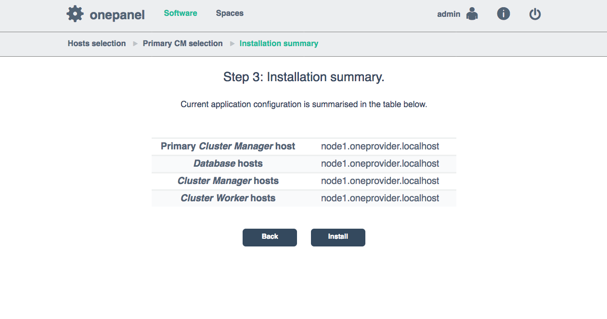
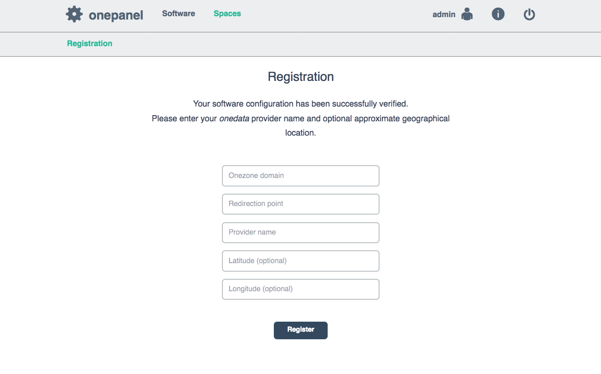
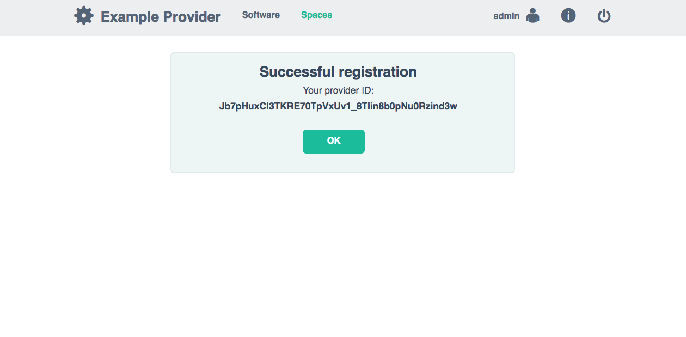

# Oneprovider setup

<!-- toc -->

Oneprovider installation includes:
* installation of Oneprovider services on the cluster nodes,
* registration of Oneprovider cluster with Onezone.

For detailed instructions on how to install Oneprovider using Docker or package
please visit [download section](../getting_started/downloading_onedata.md)
on Onedata homepage.

Oneprovider package setups a service called Onepanel. Onepanel is a cluster
installation and administration user interface that detects all other nodes in
the local network where Oneprovider service has been installed and allows for
configuration of services on each cluster node.

Upon successful installation of Oneprovider package, you need to navigate to
`https://<ip>:9443` address, which is the endpoint of Onepanel, administration
service which is deployed automatically with every Oneprovider and Onezone
instances. The default credentials for logging into Onepanel
are:
~~~
login: admin
password: password
~~~

## Configuration using Onepanel GUI

### Step 1: Hosts selection

<p align="center"></p>

In this step, Onepanel detects all nodes in the network where Oneprovider
package has been installed and where the Onepanel service is running.
You can configure on which nodes each of the services will be installed.


### Step 2: Primary Cluster Manager selection

You can deploy multiple Cluster Managers for redundancy purposes but only one
will be active at the same time. Here you can choose which one:

<p align="center"></p>

### Step 3: Installation summary.

<p align="center"></p>

After pressing `Install` button the installation will proceed using selected
settings, showing installation progress on a progress bar.


<!-- ### Step 3: Application ports check.

In order to work properly Oneprovider needs a number of
[required ports](./firewall_setup.md) open on machine. In this step Oneprovider
ensures that all needed ports are open.

<p align="center"></p>


### Step 4: System limits configuration.

Administrators may impose limit on a number of opened files by Oneprovider,
services and processes spawned by them.

<p align="center"></p>


### Step 5: Storage configuration.

Select a path to a mounted storage, which Oneprovider will use to store user
data. Detailed information on the supported storage types is discussed
[here](./storage_configuration.md).

<p align="center"></p> -->


## Registration with Onezone service
Once installed, Oneprovider has to be registered with some Onezone instance,
which allows users to login to the service and generated access tokens.

### Step 1: Specify Onezone connection details

Please make sure that all [required ports](./firewall_setup.md) on Oneprovider
and Onezone hosts are accessible to Onedata services and users. For the sake of
security it is recommended, that ports on database and cluster manager nodes
are not publicly available.

In the registration form fill all necessary fields:
<p align="center"></p>

After the registration is complete, the ID of this Oneprovider assigned by
Onezone should be displayed:
<p align="center"></p>

Ideally all the nodes should have a dedicated public IP address and the above
mentioned ports open to the world. In other case you can configure a `;`
separated *Redirection points*, where each entry is a pair of public IP and the
port which point to one of the nodes.


## Configuration using YAML
In addition to Onepanel GUI, Onezone can be configured before starting using
YAML defined configuration. Example configuration file is presented below:

```
cluster:
  domainName: "myprovider.example.com"
  nodes:
    n1:
      hostname: "node1"
  managers:
    mainNode: "n1"
    nodes:
      - "n1"
  workers:
    nodes:
      - "n1"
  databases:
    serverQuota: 167776
    bucketQuota: 20972
    nodes:
      - "n1"
  storages:
    NFS:
      type: "posix"
      mountPoint: "/volumes/storage"
oneprovider:
  register: true
  name: "${PROVIDER_NAME}"
  redirectionPoint: "https://${PROVIDER_FQDN}" # OR IP ADDRESS
  geoLatitude: ${GEO_LATITUDE}
  geoLongitude: ${GEO_LONGITUDE}
onezone:
  domainName: "${ZONE_FQDN}" # OR IP ADDRESS
onepanel:
  users:
    "admin":
      password: "password"
      userRole: "admin"
    "user":
      password: "password"
      userRole: "regular"
```

The meaning of the fields is as follows:
* `cluster` - specification of the Onezone cluster deployment
  * `domainName` - the domain name of this Onezone instance
  * `autoDeploy` - whether the Onepanel should automatically deploy components on all specified nodes
  * `nodes` - the list of nodes comprising this Onezone deployment
  * `managers` - the list of nodes where cluster manager component is deployed
  * `workers` - the list of nodes where worker components are deployed
  * `databases` - the list of nodes where database instances are deployed
    * `serverQuota` - the size (in MB) for database memory buffer on each node (see [here](http://docs.couchbase.com/admin/admin/Concepts/concept-ramQuota.html) for more information)
    * `bucketQuota` - the size (in MB) for memory of each bucket (see [here](http://docs.couchbase.com/admin/admin/Concepts/concept-ramQuota.html) for more information)
  * `storages` - the list of storages connected to Oneprovider, check this [page](./storage_configuration.md) for more information
* `oneprovider` - Oneprovider specific details
  * `register` - whether the Oneprovider should automatically register in the Onezone specified below
  * `name` - the name of the Oneprovider instance
  * `redirectionPoint` - the URL address of the Oneprovider for OpenID Connect redirectionPoint
  * `geoLatitude` - the geographical latitude of this Oneprovider deployment
  * `geoLongitude` - the geographical longitude of this Oneprovider deployment
* `onezone` - Onezone specific details
  * `domainName` - the Onezone domain address to which this Oneprovider instance should connect to
* `onepanel` - Onepanel specific details
  * `users` - the list of users which can login to Onepanel and Onezone services using Basic Auth
