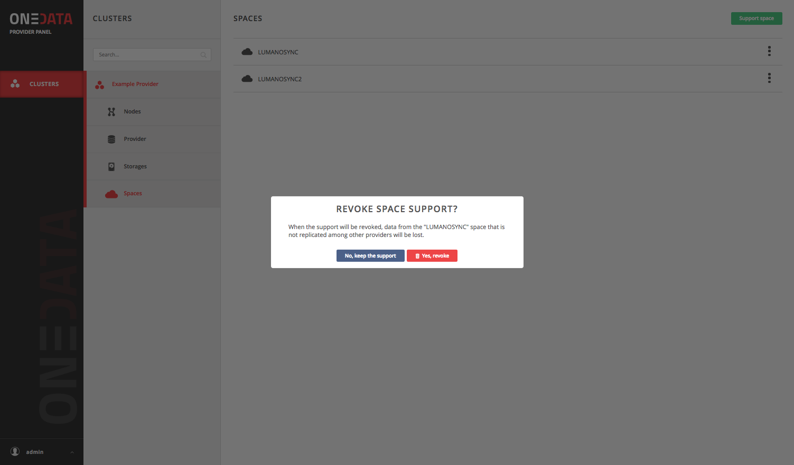

# Space storage support

<!-- toc -->

## Space storage support token
For maximum ease of use for users as well as flexibility, the storage support requests have a form of unique authorization tokens, which have to be generated by users in Onezone web interface and sent to the storage providers from which they would like to request storage space.

Tokens have a form of strings, e.g.:

~~~
mxYQpUBQtD-ai5dEQNB_k3qSVGwjxpgjbKMEdtTNphasdnl1asdhQ
~~~

## Space support step by step
In order to grant user a support for his space, login into Onepanel service and go to **Space** menu and select **Support space** button.

Press *Support Space* button, select storage name and paste the token given by a user and amount of space granted to the user.

## Removing space storage support
To remove support for a space select the Revoke space support option in the Onepanel space list and confirm:

