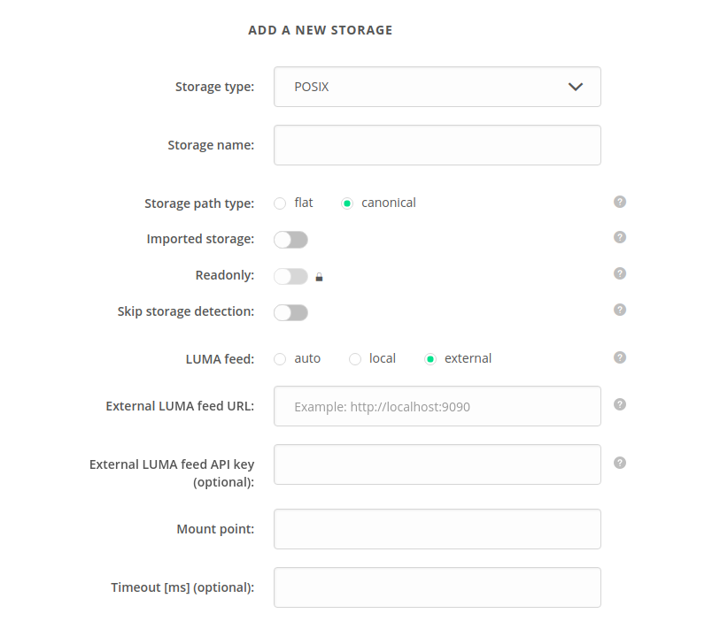

# Storage Configuration
<!---TODO VFS-6776 update storage configuration docs -->

This section thoroughly describes available options of storage configuration.

<!-- toc -->

## Configuration of generic options



### Storage path type 
Determines how the logical file paths will be mapped on the storage:
 * `canonical` paths reflect the logical file names and directory structure, however each rename operation will 
 require renaming the files on the storage,
 * `flat` paths are based on unique file UUID's and do not require on-storage rename when logical file name is changed.


### Imported storage

Option `Imported storage` determines if the contents of this storage should be imported to the Onedata space supported
with the storage. This option should be enabled for storages with legacy data or for storages that will be modified by 
applications bypassing the Oneprovider service.
Storage that is marked as `Imported storage` can be used to support just one space.
Moreover, only one out of supporting providers can support the space with an `Imported storage`.
Supporting the space with an `Imported storage` results in enabling the [Storage import](storage_import.md) 
in the space. It allows to register (import) files, located on the
storage, in the space. Registering files does not copy the data. It only creates necessary
metadata so that the files are visible in the space.

Please see [here](storage_import.md) to learn about the storage import. 

Please check whether storage backend for which you intend to enable `Imported storage` option is
supported and how to properly configure it. Here you can find description for [manual](storage_import.md#storage-configuration-for-manual-import) 
 and [auto](storage_import.md#storage-configuration-for-auto-import) import.

### Readonly
Option `Readonly` determines that storage is to be treated by the Oneprovider as a readonly. Oneprovider will not attempt
to create, modify or delete files on the storage. Files cannot be replicated from other providers supporting
the space. The only way to create files in the space supported by a readonly
storage is by importing them which is why  `Readonly` options is only allowed if the [`Imported storage`](#imported-storage)
option is enabled too. This option is **required** if the storage is truly readonly (any attempt to create, modify or delete
file would result in an error).
If you wish to use [Oneclient in direct-io mode](../using_onedata/oneclient.md#direct-io-and-proxy-io-modes) on
a readonly storage, you should also enable [`Skip storage detection`](#skip-storage-detection) option to turn off
automatic detection of direct access to the storage in the Oneclient application. Please remember that in such case,
 `--force-direct-io` option has to be passed to Oneclient application to enable `direct-io` mode. 
Additionally, on POSIX compatible storages mountpoint must be passed manually.
Please see Oneclient's documentation for [`--force-direct-io`](../using_onedata/oneclient.md#direct-io-and-proxy-io-modes)
and [`--override`](../using_onedata/oneclient.md#overriding-storage-helper-parameters) options.


### Skip storage detection 
`Skip storage detection` option turns off automatic detection of direct access to the storage in the Oneclient application.
It also disables checks performed by Oneprovider when storage is added or modified.


### LUMA feed
Option `LUMA feed` determines type of feed for [Local User Mapping Database](luma.md).
There are 3 possible values:
 * `auto`
 * `local`
 * `external`

For more information on configuration of LUMA DB feed please see [here](luma.md#configuration).

### Timeout
Storage operation timeout in milliseconds. This parameter is optional, the default is 120 seconds.

## Configuration of specific storage backends
Onedata supports several storage backends which can be used by storage providers to support users spaces.

The currently supported storage backends include:
* **posix** - any POSIX based storage, typically attached over high-throughput local network, such as Lustre,
* **s3** - [Amazon S3](http://docs.aws.amazon.com/AmazonS3/latest/API/Welcome.html) compatible storage,
* **cephrados** - storage backend allowing to support user spaces on storage resources managed by [Ceph](http://ceph.com/ceph-storage/) object storage,
* **swift** - storage backend compatible with [OpenStack SWIFT](http://docs.openstack.org/developer/swift/) protocol.
* **glusterfs** - [GlusterFS](https://www.gluster.org/) volumes can be directly attached to the Oneprovider.
* **nulldevice** - storage helper which emulates behavior of `/dev/null` on local filesystem, allowing running various performance tests which are not impacted by actual storage latency.

The sections below describe how to attach each of these storage types to a Onedata deployment on a local site. 
Storage can be attached using Oneprovider REST API, by updating the configuration. 
Example YAML configuration with multiple storage backends is presented below:

```yaml
    cluster:
      domain_name: "oneprovider.onedata.example.com"
      nodes:
        n1:
          hostname: "node1"
      manager:
        default_node: "n1"
        nodes:
          - "n1"
      worker:
        nodes:
          - "n1"
      database:
        serverQuota: 20972
        bucketQuota: 10486
        nodes:
          - "n1"
      storage:
        NFS:
          type: "posix"
          mountPoint: "/volumes/storage"
        my_s3_storage:
          type: "s3"
          hostname: s3.example.com
          bucketName: bucket1.iam.example.com
          accessKey: LKJHLAKJSHD887678678ASDKNJKASD9898789ASD
          secretKey: ASASDLLASD89798&LKJHLAKJSHD887678678ASDKNJK
          insecure: true
        Ceph-deployment:
          type: "cephrados"
          username: user1
          key: LKJASHD6876ASDBJHV65765ASD
          monitorHostname: test.example.com
          clusterName: CephCluster1
          poolName: Pool1
        SWIFT:
          type: "swift"
          authUrl: https://keystone.example.com/v2.0/tokens
          tenantName: Tenant1
          containerName: Container1
          username: alice
          password: password
        GlusterFSVolumeA:
          type: "glusterfs"
          hostname: 192.168.12.101
          volume: VolumeA
          transport: tcp
        SlowNullStorage:
          type: "nulldevice"
          latencyMin: 5
          latencyMax: 25
          filter: "read,write"
    oneprovider:
      register: true
      name: Provider1
      subdomainDelegation: false
      domain: "node1.oneprovider.onedata.example.com"
      adminEmail: "getting-started@example.com"
      geoLatitude: 50.068968
      geoLongitude: 19.909444
    onezone:
      domainName: onedata.example.com
```

### POSIX

POSIX attributes for configuration are:

| Attribute  | Type       | Description                              |
| ---------- | ---------- | ---------------------------------------- |
| type       | **string** | Must be equal to posix'                  |
| mountPoint | **string** | The local path at which Oneprovider worker threads can access this storage |
| timeout    | **string** | **(Optional)** Storage operation timeout in milliseconds |
| readonly   | **bool**   | **(Optional)** Defines whether storage is readonly |

Please note that Oneprovider will not automatically mount or unmount this storage from the nodes, this must be ensured by administrators.

### S3

S3 attributes for configuration are:

| Attribute  | Type       | Description                              |
| ---------- | ---------- | ---------------------------------------- |
| type       | **string** | Must be equal to 's3'                    |
| hostname   | **string** | The name of the host exposing the S3 REST API |
| bucketName | **string** | The name of S3 bucket which will be used as the storage resource |
| accessKey  | **string** | The access key for the S3 storage        |
| secretKey  | **string** | The secret key for the S3 storage        |
| timeout    | **string** | **(Optional)** Storage operation timeout in milliseconds |
| blockSize  | **string** | **(Optional)** Storage block size in bytes |
| insecure   | **bool**   | **(Optional)** Defines whether storage administrator credentials (accessKey and secretKey) may be used by users without storage accounts to access storage in direct IO mode. |
| readonly   | **bool**   | **(Optional)** Defines whether storage is readonly |


### Ceph

Ceph storage attributes are:


| Attribute       | Type       | Description                              |
| --------------- | ---------- | ---------------------------------------- |
| type            | **string** | Must be equal to 'cephrados'                  |
| username        | **string** | The username on behalf of which the Ceph storage will be accessed |
| key             | **string** | The key for the selected username        |
| monitorHostname | **string** | The host where the Ceph monitoring deamon `ceph-mon` is running |
| clusterName     | **string** | The name of the Ceph cluster             |
| poolName        | **string** | The Ceph pool name                       |
| timeout         | **string** | **(Optional)** Storage operation timeout in milliseconds |
| insecure        | **bool**   | **(Optional)** Defines whether storage administrator credentials (accessKey and secretKey) may be used by users without storage accounts to access storage in direct IO mode. |
| readonly        | **bool**   | **(Optional)** Defines whether storage is readonly |

More information about these attributes can be found in the official Ceph [documentation](http://docs.ceph.com/docs/hammer/rados/configuration/ceph-conf/).

> Ceph client requires among others, 'x' permission on the OSD in order to enable striped object layout.


### OpenStack Swift

Swift storage attributes are:

| Attribute     | Type       | Description                              |
| ------------- | ---------- | ---------------------------------------- |
| type          | **string** | Must be equal to 'swift'                 |
| authUrl       | **string** | The URL to OpenStack Keystone identity service |
| tenantName    | **string** | The name of the tenant to which the user belongs |
| containerName | **string** | The name of the Swift storage container  |
| username      | **string** | The Keystone authentication username     |
| password      | **string** | The Keystone authentication password     |
| blockSize     | **string** | **(Optional)** Storage block size in bytes |
| insecure      | **bool**   | **(Optional)** Defines whether storage administrator credentials (accessKey and secretKey) may be used by users without storage accounts to access storage in direct IO mode. |
| readonly      | **bool**   | **(Optional)** Defines whether storage is readonly |

More information about these attributes can be found in the official OpenStack Swift [documentation](http://docs.openstack.org/developer/swift/).


### GlusterFS

GlusterFS storage attributes are:

| Attribute     | Type        | Description                              |
| ------------- | ----------- | ---------------------------------------- |
| type          | **string**  | Must be equal to 'glusterfs'             |
| hostname      | **string**  | The URL to GlusteFS volume server        |
| volume        | **string**  | The volume name                          |
| port          | **integer** | **(Optional)** The volume server port    |
| transport     | **string**  | **(Optional)** Transport between provider and volume (tcp, rdma or socket). Default: 'tcp' |
| xlatorOptions | **string**  | **(Optional)** Custom client GlusterFS translator options, in the format: `Option1=Value1;Option2=Value2;Option3=Value3;...` |
| blockSize     | **string**  | **(Optional)** Storage block size in bytes |
| insecure      | **bool**    | **(Optional)** Defines whether storage administrator credentials (accessKey and secretKey) may be used by users without storage accounts to access storage in direct IO mode. |
| readonly      | **bool**    | **(Optional)** Defines whether storage is readonly |

### NullDevice

NullDevice storage attributes are:

| Attribute          | Type       | Description                              |
| ------------------ | ---------- | ---------------------------------------- |
| type               | **string** | Must be equal to `nulldevice`            |
| latencyMin         | **int**    | **(Optional)** NullDevice helper will emulate latency with at least this number of milliseconds |
| latencyMax         | **int**    | **(Optional)** NullDevice helper will emulate latency with at most this number of milliseconds |
| timeoutProbability | **float**  | **(Optional)** The probablity `[0.0, 1.0]` that a filesystem operation will return timeout error. |
| filter             | **string** | **(Optional)** Allows to specify for which Fuse operations the latency and timeout properties will be applied (e.g. `read,write`). By default it applies to all operations. |
| simulatedFilesystemParameters | **string** | **(Optional)** Allows to enable emulation of existing legacy filesystem on the nulldevice storage. For example `2-2:2-2:0-1` will generate a filesystem tree which has 2 directories (`0` and `1`) and 2 files (`2` and `3`) in the root of the filesystem, each of these directories will have 2 subdirectories (`0` and `1`) and 2 files (`2` and `3`) and each of these subdirectories has only a single file (`0`).  Default empty string disables the simulated filesystem feature. |
| simulatedFilesystemGrowSpeed | **float** | Determines the simulated filesystem grow rate. Default 0.0 value will cause all the files and directories defined by the `simulatedFilesystemParameters` specification to be visible immediately.  For example value of 0.01 will increase the number of the visible filesystem entries by 1 file per 100 seconds, while 100.0 will increase it by 100 files per second. |
| insecure           | **bool**   | Must be set to `true`                    |
| readonly           | **bool**   | Must be set to `true`                    |

## REST API

Comprehensive description of requests and their parameters considering administration of storage resources can be
found in the REST API documentation. 

| Request                      | Link to API |
|------------------------------|-------------|
| Create storage               | [API](https://onedata.org/#/home/api/stable/onepanel?anchor=operation/add_storage)|        
| Get storage details          | [API](https://onedata.org/#/home/api/stable/onepanel?anchor=operation/get_storage_details)|        
| Update storage               | [API](https://onedata.org/#/home/api/stable/onepanel?anchor=operation/modify_storage)|             
| Remove storage               | [API](https://onedata.org/#/home/api/stable/onepanel?anchor=operation/remove_storage)|             
| List storage resources       | [API](https://onedata.org/#/home/api/stable/onepanel?anchor=operation/get_storages)|        
