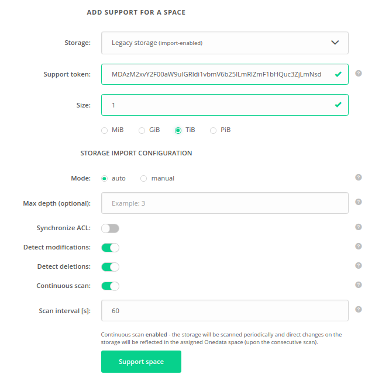

# Storage import

Storage import allows to register (import) files, located on the storage, in the space supported by the storage.
Registering files does not copy the data. It only creates necessary metadata so that the files are visible in the space.

This functionality should be used in two cases:
 * when legacy data from the storage should be imported into the space without copying the data
 * if the data on storage will be modified directly on the storage, by third party applications, bypassing the Oneprovider
 service and the changes should be reflected in the supported space
 
Storage import can be enabled if and only if the space is supported with an [`Imported storage`](storage_configuration.md#imported-storage).

## Modes

There are 2 possible modes of storage import: [`manual`](#manual-storage-import) and [`auto`](#auto-storage-import).
The mode is chosen when the space is supported with an [`Imported storage`](storage_configuration.md#imported-storage) 
as presented on the below picture.
> **NOTE**: Mode of the storage import cannot be modified.

### Manual storage import
In case of `manual` mode, the files must be registered manually by the space users with REST API. 
Registration of directories is not supported.

For more info please go [here](https://onedata.org/#/home/api/stable/oneprovider?anchor=tag/File-registration).

#### Storage configuration for manual import:

Manual storage import is supported on the following storage backends:
 * POSIX,
 * GLUSTERFS,
 * NULLDEVICE,
 * WEBDAV,
 * XROOTD,
 * HTTP,
 * S3,
 * SWIFT,
 * CEPHRADOS.
 
 > **NOTE**:
 The storage must have `canonical` [path type](storage_configuration.md#storage-path-type). 
 Moreover, on object storages: S3, SWIFT and CEPHRADOS `Block size` parameter **must be set to `0`!**

### Auto storage import
In case of `auto` mode, the storage will be automatically scanned and data will be imported from storage into the
assigned space.

#### Storage configuration for auto import:

Auto storage import is supported on the following storage backends:
 * POSIX,
 * GLUSTERFS,
 * NULLDEVICE,
 * WEBDAV,
 * XROOTD,
 * S3.
 
 > **NOTE**:
 The storage must have `canonical` [path type](storage_configuration.md#storage-path-type). 
 Moreover, on S3 `Block size` parameter **must be set to `0` !**

#### Configuration
The configuration of auto storage import can be set when supporting the space (as presented on the picture in the [Modes section](#modes)).
It can also be modified later in the `Spaces -> Storage import > Auto storage import configuration` tab as presented below.

 

All auto storage import options that can be configured are described below:
* `Max depth` - Maximum depth of filesystem tree that will be traversed during the scan. By default it is 65535.
* `Synchronize ACL` - Enables import of NFSv4 ACLs.
* `Detect modifications` - If disabled, the storage will be treated as immutable – changes of already imported files
will not be detected. Relevant only if more than one scan is performed.
* `Detect deletions` - Flag determining that deletions of already imported files will be detected and reflected.
Relevant only if more than one scan is performed.
* `Continuous scan` - Indicates if the data on the storage should be imported into the space periodically. Continuous
import guarantees data integrity if direct modifications on the storage are to be made during the space lifecycle.
* `Scan interval` - Period between subsequent scans in seconds (counted from end of one scan till beginning of the following).

#### Info
Below the configuration tab, there is a tab which present information about current or last finished scan.
It informs about status of the scan, its start and stop times, number of created, modified and deleted files.
If the `Continuous scan` is enabled it also displays time of the next scan.
Auto storage import info tab is presented below: 

#### Forcefully starting a scan

It is possible to forcefully start a single scan of auto storage import. 
It can be done by pressing the green button in the upper right corner of the auto storage import info tab.
The scan will be started with currently set configuration.

> **NOTE:** It is possible to start the scan only if there is no scan currently in progress in the space. 

#### Forcefully stopping a scan

It is also possible to forcefully stop current scan of auto storage import. 
It can be done by pressing the red button in the upper right corner of the auto storage import info tab.

> **NOTE:** Stopping the scan may take some time as it is asynchronous.
>The scan in not instantly stopped when the button is pressed. 

#### Statistics

Progress of the auto storage import can be observed on the three charts visualizing the data import progress. 
The charts are located below the auto storage import info tab. Please note that it is possible to change the 
time resolution of the charts in the upper right corner of the charts view.

