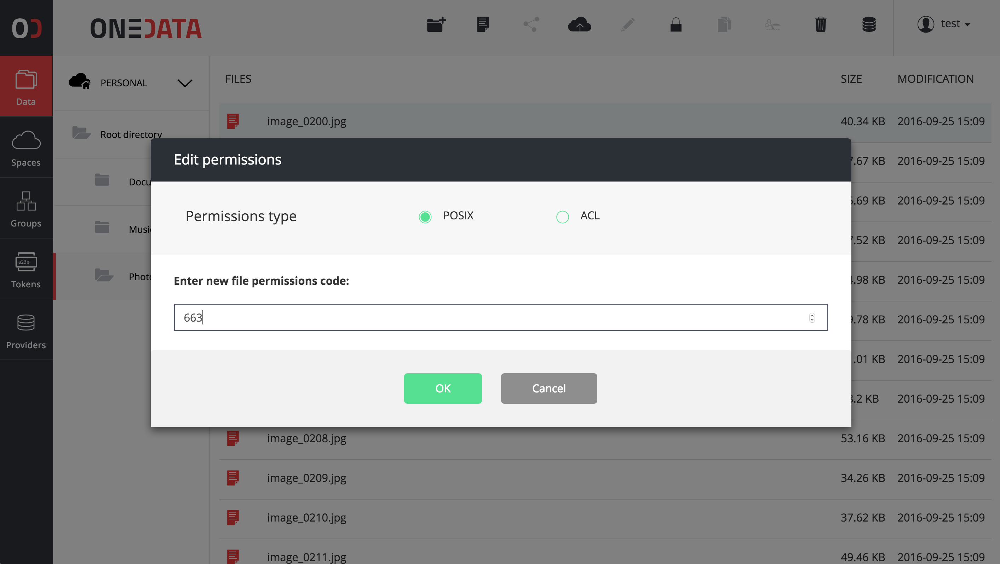
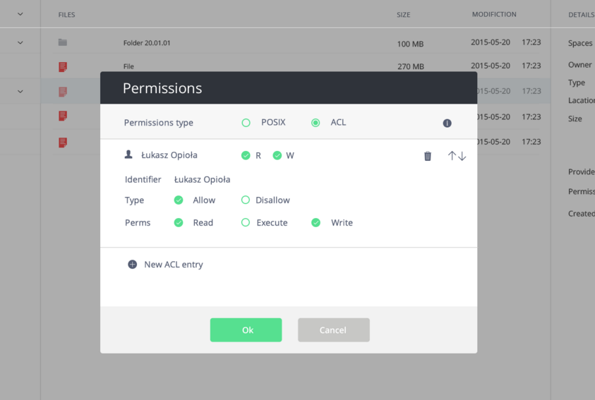

# File Management

## Data Sharing
You can share your files with other users, in a Dropbox-like manner, using links.
You can also see all the files your are sharing in that manner by navigating to Shared Files view, which is accessible under the Data tab in the top menu.

### Sharing a file with a link
To share a file with a link:

1. Navigate to **Data** page.
2. Click on the **file** you wish to share. It should lit up signaling it is selected.
3. Click on the **Share** icon, which is a third icon from the left.
4. Copy the generated link and share it with email or chat.

### Stop sharing a file
You can disable the link to the file you previously share:

1. Hover over the **Data** button.
2. Click on **Shared Files**.
3. On the list of files you share find the file you wish to stop sharing.
4. Click on the **"X" sign*** next to it.

## File Permissions
You can control access to your data with a combination of:
* classical files permissions,
* access lists

### POSIX Permissions
Much like POSIX permissions, onedata allows you to control access to your resources for users, group and others; in terms of read, write and executable permissions.
In order to edit permissions:

1. Navigate to **Data** tab.
2. Select a **file or a directory** by clicking on it.
3. Click on the **lock icon**.
4. Edit permissions by click on on the appropriate **checkbox**.
5. Click **OK** in order to save chances.

You can also edit POSIX permissions by entering it in octal form.
In case of directories you can select a recursive option, to apply permission to the whole subtree.

### Access Lists
You can also setup permissions using access lists to control permissions of individual users and groups.
In order to edit permissions:

1. Navigate to **Data** tab.
2. Select a **file or a directory** by clicking on it.
3. Click on the **lock icon**.
4. Clikc on the **ACLs radio button**
5. Edit permissions by click on on the appropriate **checkbox**.
5. Click **OK** in order to save chances.

*Note, that access lists take precedence over POSIX permissions. If access list is set, POSIX are set to octal value of `000`.*

The order in which permissions take precedence is shown with an arrow

In case of directories you can select a recursive option, to apply permission to the whole subtree.

