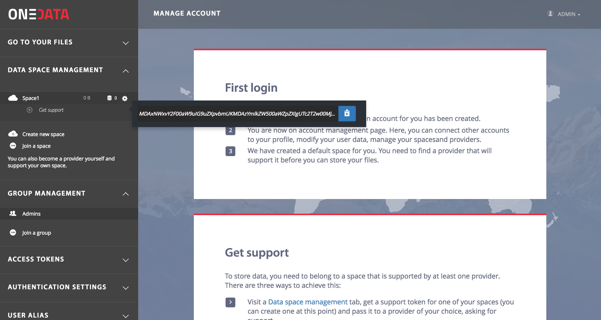
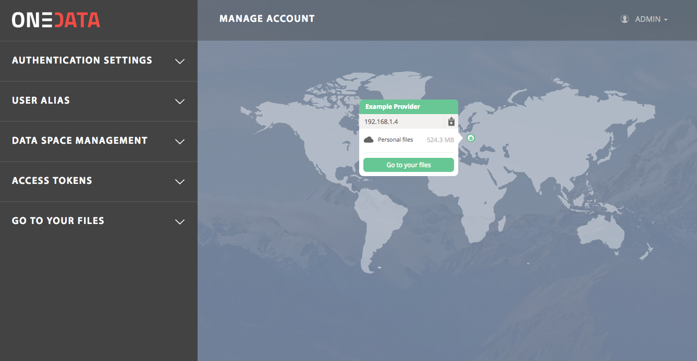
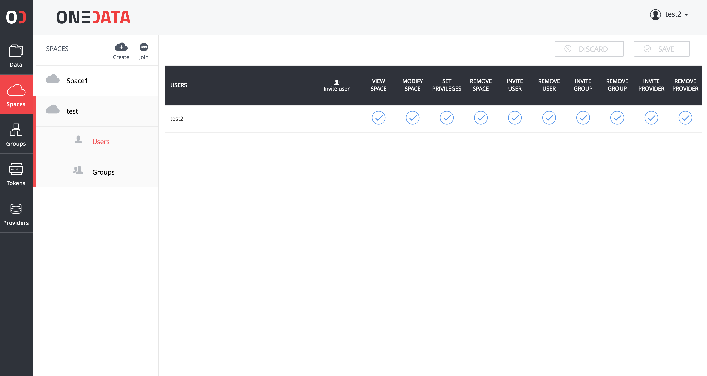
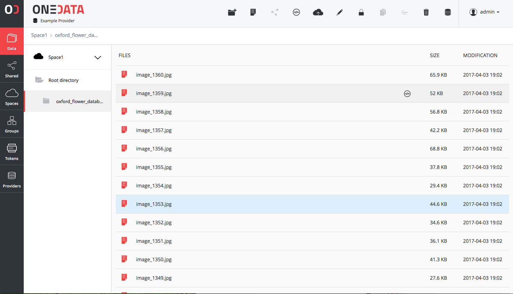
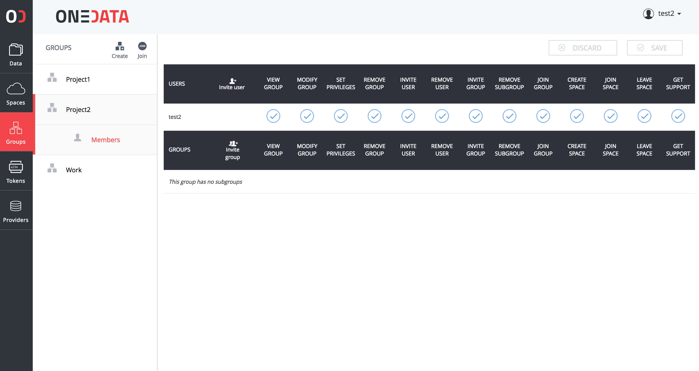

# User Quickstart
This step-by-step guide shows how to create a Onedata account, support your **home** space and upload files to your account.


## Setup an account
1. Go to [Onedata login page](https://onedata.org/login) and sign in using one of the supported login methods.
2. Follow the instructions presented to you at first login.
3. You will see the *onezone* page, were you can navigate through your spaces, request storage support from storage providers and generate access tokens.


## Supporting your first space
At the first login, you need to create your first space. Like every new space, at the beginning it has quota size of 0. You have to request storage support for certain storage space (e.g. 5GB) from some storage provider (or setup your own *Oneprovider* service) to be able to store any files in this space.

In the left panel of *Onezone* page you can find the *Data space management* menu. There you can create new storage support request token, by clicking on existing space. Press `Get support`  and copy the displayed token to your clipboard. 

<p align="center">

</p>

You need to send this token to one of storage providers associated with your zone and request support for your space.

After having your space supported by at least 1 provider, the provider will appear on the map on *Onezone* page. 

<p align="center">

</p>

Click on the provider icon on the map and click on the button "Go to your files". You will be redirected to [Oneprovider web interface](../user_guide.md), where you can [access and manage](../user_guide.md) your files.

## Data management
Once in the Oneprovider interface, you can easily:

* switch between your spaces in the `Spaces` tab

<p align="center">

</p>

* access and manage data in `Data` tab 

<p align="center">

</p>

* and create and manage user groups in the `Groups` tab.

<p align="center">

</p>

### Accessing files
Once you have some files in your space, you can access them using the web interface or the Onedata virtual file system through the Oneclient tool.

The best way to access your spaces by mounting them directly using our virtual filesystem implementation managed by Oneclient tool. Typically all it takes to have your spaces available in your local file system is:

```
export PROVIDER_HOSTNAME=<PREFERRED_PROVIDER_IP>

export ONECLIENT_AUTHORIZATION_TOKEN=<ACCESS_TOKEN>

mkdir ~/Onedata

oneclient --authentication token ~/Onedata
```

For more information see [Oneclient manual](../using_onedata/oneclient.md).

## Next steps
After you are comfortable using basic file operations in your space, see the [User Guide](../user_guide.md) and learn how to work with multiple spaces and perform other more advanced actions.
