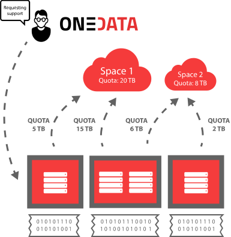
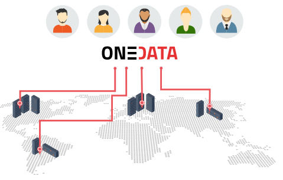
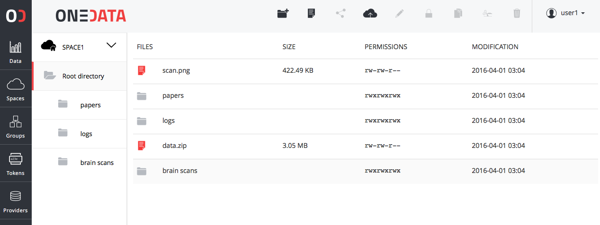

# What is Onedata?

With Onedata, users can access, store, process and publish data using global data storage backed by computing centers and storage providers worldwide.

Onedata focuses on instant, transparent access to distributed data sets, without unnecessary staging and migration, allowing access to the data directly from your local computer or worker node.

<!--
> If this is your first encounter with Onedata, start with the overview of major concepts of the platform to get familiar with the overall architecture and basic aspects of the system such as spaces, clients and providers.
-->

Before you start using Onedata, it's helpful to understand what functionality it provides, how data is organized and what are the various components of the platform.

## Basic concepts

The most important concepts of the platform to understand at the beginning include:
 - **Spaces** - distributed virtual volumes, where users can organize their data
 - **Providers** - entities who support spaces with actual storage resources
 - **Zones** - federations of providers which enable creation of closed or interconnected communities.

### Spaces
All data stored in Onedata is organized into *Spaces*. Spaces can be seen as virtual folders or drives, which can contain an arbitrary subdirectory and file hierarchy, while being distributed across multiple storage providers. Each space has to be supported by at least one provider, which means that this provider reserved certain storage quota for this particular space. In case a space is supported by more providers, the total quota is the sum of storage space provisioned by all providers supporting it.

After registering at [onedata.org](onedata.org), a so-called home *space* is created automatically. Onedata is not a storage provider, and it does not provide any free or paid storage resources. That is why, the newly created *space* has a quota size set to 0. In order to be able to use this *space*, you have to request storage from some provider.

You can do that by sending to the provider a unique support request token, which can be generated at [onedata.org](onedata.org). Provider uses this token to easily enable support for your *space* with a specified quota. The actual storage size and provisioning time depends on your agreement with the Provider. You can request more storage for your *space* from multiple geographically distributed providers. Onedata will unify access to these storage resources automatically.

Each user can have any number of *spaces*. *Spaces* can be easily shared with other users and even exposed to the public. If you want to create a *space* for a community of users, Onedata supports user *groups*, which enable multiple users to access single *space* with respect to specified authorization rules.

Data in spaces can be managed through a web interface as well as from command-line. Each space can be easily mounted to a local filesystem and accessed directly from a laptop, a cluster node or virtual machine deployed in the cloud.

For more information about *Spaces* and *Groups* see [Space Management](../using_onedata/space_management.md) and [Group Management](../using_onedata/group_management.md).

### Providers
Each zone is composed of a network of providers who provision their storage resources to users. Anyone can become a Onedata provider by installing *Oneprovider* service, attaching storage resources and registering at a private Onezone service or in the global [onedata.org](onedata.org) zone. 

A user can use several providers simultaneously to manage their data. Onedata exposes combined storage space of all providers to the user and ensures that access to user's data is instant and transparent.

Providers deploy *Oneprovider* services near physical storage resources, i.e. in computing and data centers or even personal computers. Providers have full control over which users can use their storage resources and in what amount.

Users use *Onezone* portals like [onedata.org](onedata.org) in order to authenticate with Onedata and access the data located on the providers storage resources.

For more information about Onedata's provider service, check out [Oneprovider Overview](../administering_onedata/provider_overview.md) documentation.

### Zones
Onedata is a distributed system divided into zones that are created by deploying a dedicated service called *Onezone*.  

The main public zone is [onedata.org](onedata.org) that is managed by *Onezone* service deployed at that address. Any organization, community or user group can deploy their own *Onezone* service with customized login page and either connect it to the distributed network of *Onezone* services or run it as a isolated private deployment. 

*Onezone* is responsible for authentication and authorization of users, makes it possible for users from different zones to communicate with each other and share data. It allows providers from different zones to interact with each other i.e. allowing users from different zones to support their spaces regardless of the zone in which particular provider is located.

As *onedata.org* is a main public zone, any provider registered there allows the users to access their data through *onedata.org* user interface.

For more information about Onedata's  *Onezone* service, check out [*Onezone* Overview](../administering_onedata/onezone_overview.md) documentation.

## User interfaces

Onedata gives you 4 basic ways to manage and access your data:

### User web interface

The Onedata Web Interface provides a web-based, graphical user interface that you can use to manage your spaces, control access rights and manage your user account.

### User command-line interface

If you prefer to work from the terminal, Onedata provides the *oneclient* command-line tool, which allows you to mount your spaces in a Linux filesystem and access your data directly from console. See the [oneclient](../using_onedata/oneclient.md) reference for the complete list of available features.

### Administrator web interface

Dedicated web interface for installation and management of *Oneprovider* and *Onezone* services.

### Developer interfaces

Currently Onedata exposes a CDMI (Cloud Data Management Interface) [interface](../advanced/cdmi.md) and RESTful [interface](../advanced/rest.md) for integration with other services, which allows developers to directly access and manage spaces, groups, authorization rights and data.

