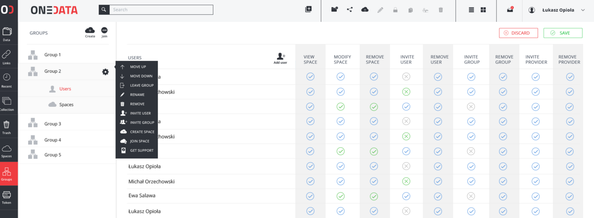
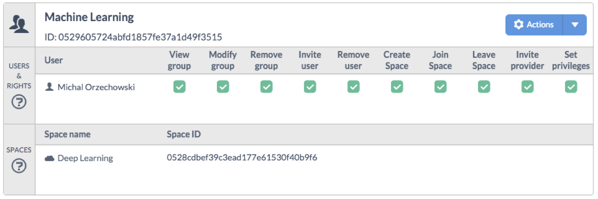

# Group Management

You can create or join existing groups to easily manage and collaborate using your spaces. A group is an abstract entity with a name and at least one user assigned to it, who has sufficient permissions to manage it. You can manage your groups from a **Manage groups** page, accessible with **Group** button on the top menu.

## Create a new group
In order to create a new  group:

1. In the Onedata Web Interface click **Groups** button located on the top menu.
2. On the **Manage groups** page, click **Create new group** button.
3. On the bottom of the screen set the name of the new group and click **OK** button.

New group will appear on the list of groups designated with a unique ID.

## Invite another user to your group
To invite another user to join your group:

1. Navigate to **Manage groups** page.
2. On your group, click the **Actions** button.
3. Pick **Invite User** from the drop down menu.
4. Copy the token and send it to the user you wish to invite to your group.

After another user joins your group you will be able to see him in the detailed group view.

## Join existing group
To join a group, you must request from them a token. After receiving the token:

1. Navigate to **Manage groups** page.
2. Click the **Join existing group** button.

You should be able to see a group on the Manage groups page immediately.

## Group properties
On the **Manage groups** page, you can see a detailed information about a group by clicking on it.

All information regarding your group is presented here, including:
- a list of members of this group and their permissions
- a list of spaces that this group has joined

### Group permissions

You can control actions and the level of access to your group by setting dedicated permissions. In order to edit permissions:

1. Navigate to **Group management** page.
2. Click on our **group**, to show group detailed view.
3. To set a permission click on the **empty box**.
4. To unset a permission click on the **box with a tick**.
5. To save or discard changes use **Save** or **Discard** buttons.

A complete list of available permissions:

| Permission Name | Description                                                                   |
|:----------------|:------------------------------------------------------------------------------|
| View Space      | User can see files and folders in your group                               |
| Modify Space    | User can modify files and folders in your group                             |
| Remove Space    | User can delete your group                                             |
| Invite user     | User can invite new users to your group                                   |
| Remove user     | User can remove  users from your group                                   |
| Invite group    | User can invite new groups to your group                                |
| Remove group    | User can remove  groups from your group                                     |
| Invite provider | User can request a support from the provider                                 |
| Remove provider | User can remove provider form the list of providers that supports your group |
| Set privileges  | User can modify these privileges                                              |

### Perform actions on your group
On the **Manage groups** page, each listed group has a **Action**, which allows you to:

| Action Name            | Description                                           |
|:-----------------------|:------------------------------------------------------|
| Move up                | Move this group up on the list of your groups.        |
| Move down              | Move this group down on the list of your groups.      |
| Leave group            | Remove this group from the list of your groups.       |
| Rename                 | Rename this group.                                    |
| Remove                 | Remove this group and leave all spaces it has joined. |
| Invite user            | Add a user to this group.                             |
| Create space           | Create a space and allow this group to control it.    |
| Join space             | Join existing space                                   |
| Request space creation | Create a space for this group                         |

### Remove your group
In order to remove your group:
1. Navigate to **Manage groups** page.
2. On your group, click the *Actions* button.
3. Pick **Remove** from the drop down menu.
4. Click **Yes**, acknowledging that you want to remove this group.
