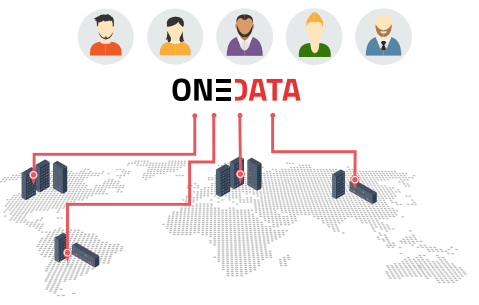

# Onedata overview

Before using Onedata, it's helpful to understand what functionality it provides, how data is organized and what are the various components of the platform.

## Basic concepts

### Providers
Onedata storage is composed of a global network of *Providers* who provision their resources to users. Anyone can become a Onedata provider by installing Oneprovider service and registering at [onedata.org](onedata.org). Each user can use several providers simultaneously to manage their data, and Onedata ensures that access to unified user's data sets is instant and transparent.

Providers deploy Oneprovider services near physical storage resources, i.e. in computing and data centers or even personal computers.
Providers have full control over which users can use their storage resources and to what extent in terms of data size and transfer limits.

[Onedata.org](onedata.org) portal provides global registry for all Onedata users. It coordinates interactions between Providers, manages information about distribution of user files across Providers, stores metadata of all files managed by Onedata and provides a single logical point of authentication in the system.

For more information about Onedata's  *Provider* service, check out [Oneprovider Overview](provider_overview.md) documentation.

## Spaces
All data stored in Onedata is organized into *Spaces*. Spaces can be considered as virtual folders or drives, which can contain an arbitrary subdirectory and file hierarchy, while being distributed across multiple storage providers. Each space has to be supported by at least one *Provider*, which means that this provider reserved certain storage quota for this particular space. In case, a space is supported by more providers, the total quota is the sum of storage space provisioned by all providers supporting it.

After registering at [onedata.org](onedata.org), a so-called default *space* is created automatically. Onedata is not a storage provider, and it does not provide any free or paid storage resources. That is why, the newly created *space* has a quota size set to zero. In order to be able to use the *space*, you have to request storage from some provider.

You can do that by sending to the provider a unique access token, which can be generated at [onedata.org](onedata.org). Provider uses this token to easily enable support for your *space* with a specified quota. The actual storage size and provisioning time depends on your agreement with the Provider. You can request more storage for your *space* from multiple geographically distributed Providers. Onedata will unify access to these storage resources automatically.

Each user can have any number of *spaces*. *Spaces* can be easily shared with other users and even exposed to the public. If you want to create a *space* for a community of users, Onedata supports user *groups*, which enable multiple users to access single *space* with respect to specified authorization rules.

Data in spaces can be managed through a web interface as well as from command-line. Each space can be easily mounted to a local filesystem and accessed directly from a laptop, a cluster node or virtual machine deployed in the cloud.

For more information about *Spaces* and *Groups* see [Space Managment](space_management.md) and [Group Managment](group_management.md).

## User interfaces

Onedata gives you 4 basic ways to interact with Onedata and to access your data.

### User space management interface

The Onedata Web Interface provides a web-based, graphical user interface that you can use to manage your spaces, control access rights and manage your user account.

### User command-line interface

If you prefer to work from the terminal, Onedata provides the *oneclient* command-line tool, which allows you to mount your spaces in a Linux filesystem and access your data directly from console. See the [oneclient](oneclient.md) reference for the complete list of available features.

### Provider management interface

Dedicated web interface for installation and managment of Oneprovider cluster.

### Developer interfaces

Currently Onedata exposes two kinds of API's:

- [REST and CDMI API](cdmi.md)

Both allow users to directly access and manage spaces, groups, authorization rights and data.
