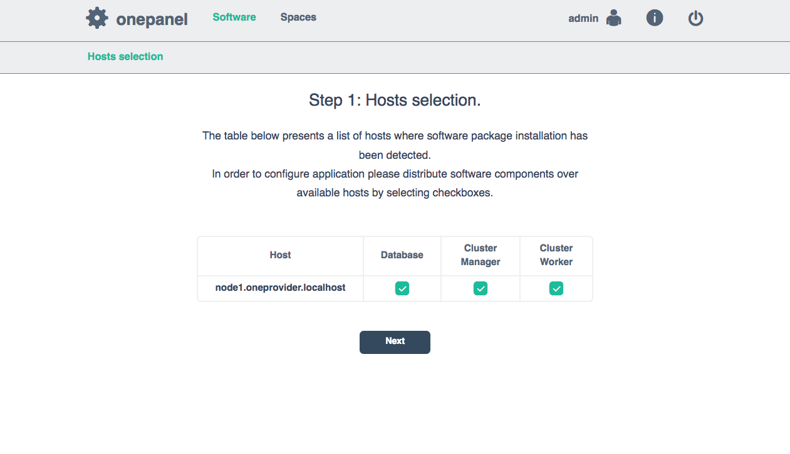
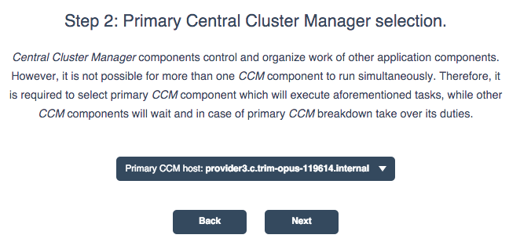
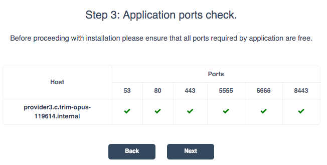
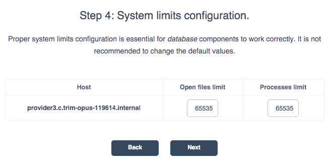
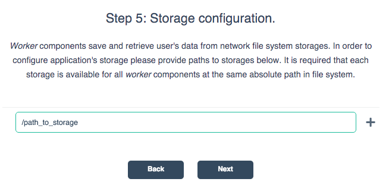
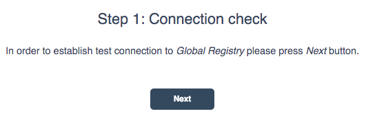
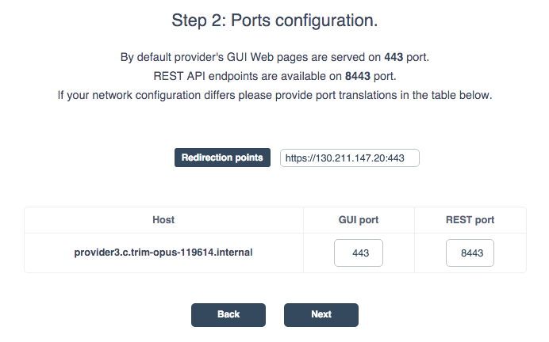
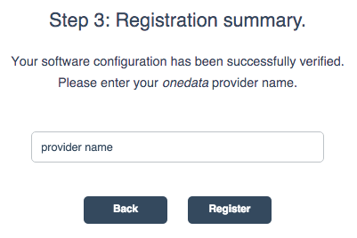

# Oneprovider Installation

> A detailed screencast presenting a single node installation of Oneprovider is located in the tutorials section.

Oneprovider instllation consists of two parts:
* installation of oneprovider services on the cluster nodes
* registration of oneprovider cluster with Onedata.

## Services Installation

In order to install oneprovider service, you need a (virtual) machine with one of supported operating systems installed. Currently oneprovider can be installed using RPM packages on:
* Scientific Linux 6.x
* CentoOS 7.x

and on other Linux platforms using Bash installation script.

For detailed instructions on how to install oneprovider package on each of those systems please visit [download section](https://onedata.org/download) on Onedata homepage.

Oneprovider package setups a service called onepanel. Onepanel is a cluster installation and administration user interface that detects all other nodes in the local network where oneprovider service has been installed and allows for configuration of services on each cluster node.

Upon successful installation of oneprovider package, you need to navigate to `https://<ip>:9443` address. The default credentials for logging into onepanel are:
~~~
login: admin
password: password
~~~

### Step 1: Hosts selection

In this step, onepanel detects all nodes in the network where oneprovider package has been installed and onepanel service is running. You can configure on which nodes which oneprovider each of the services will be installed.

### Step 2: Primary Cluster Manager selection

You can deploy multiple Cluster Managers for redundancy purposes but only one will be active at the same time. Here you chose which one:

### Step 3: Application ports check.

In order to work properly oneprovider needs a number of ports (443, 53) open on machine. In this step oneprovider ensures that all needed ports are open.

### Step 4: System limits configuration.

Administrators may impose limit on a number of opened files by oneprovider, services and processes spawned by them.

### Step 5: Storage configuration.

Select a path to a mounted storage, which oneprovider will use to store user data.

## Oneprovider Registration
Once installed, it is recommended to register oneprovider with onedata registry, so users can use onedata.org in order to see your Oneprovider service and request storage support directly from the web interface.

### Step 1&2: Connection check and Ports configuration

In order to communicate with [onedata.org](onedata.org) worker nodes in the cluster need to have a number of ports publicly available:
~~~
tpc: 80 - http web interface port
tcp: 53 - dns port
tpc: 443 - https web interface port
tcp: 5555 - port to communicate with FUSE clients.
tcp: 8443 - port for provider to provider communication
tcp: 9443 - onepanel port
~~~

Ideally all the nodes should have a dedicated public ip and those ports open to the world. In other case you can configure a `;` separated *Redirection points*, where each entry is a pair of public ip and the port which point to one of the nodes.

For the sake of security it is recommended, that no ports on database and cluster manager nodes were publicly open.

### Step 3: Name configuration
The last step allows to set a name for the provider by which it will be identified in onedata registry and presented to users.

