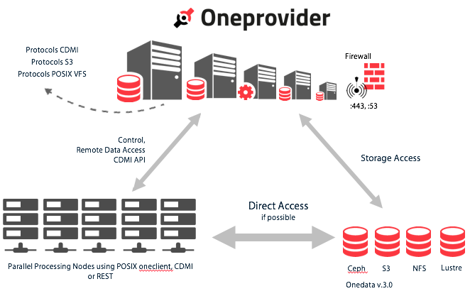

# Oneprovider Overview

**oneprovider** exposes storage resources to Onedata ecosystem. It is typically deployed in a data or computing center, on the nodes equipped with high speed connections to storage resources.

**oneprovider** is a cluster solution composed of 3 types of services:
* cluster manager - an administrative service that monitors the health of the cluster, performs load balancing and manages other cluster nodes
* worker - a service responsible for managing data transfer
* database - a service providing persistent storage for control data

Each service can be deployed multiple times depending on the performance and reliability requirements. The cluster can be administered from any node, thanks to *onepanel* web application that runs on every node.

**oneprovider** implements drivers for storages such as NFS, Lustre, Ceph (Onedata v3.0) or S3 (Onedata v3.0).

In order to function properly, **oneprovider** needs to communicate with [onedata.org](www.onedata.org) that requires a public IP address and specific ports opened to the world.

There are two types of data transfer that **oneprovider** can engage in:
* control data transfer - originating from clients (ex. FUSE client)
* remote data transfer - happens between two providers when data needed by one provider is not available on local storage. This also involves oneprovider access to storage.

While accessing data, depending on a client location data transfer can be:
* direct access - when client is located in the same computing center and has direct access to storage resources, the client exchanges only control communication with **oneprovider** and accesses storage directly bypassing **oneprovider** for actual data transfer,
* remote access - client is unable to access storage locally and data needs to be transferred via **oneprovider** nodes.

**oneprovider** is responsible for providing access to data for CDMI, S3 and POSIX VFS protocols.
