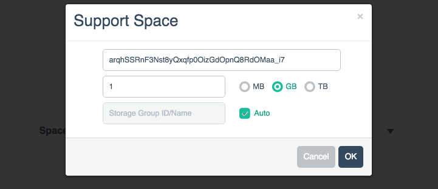
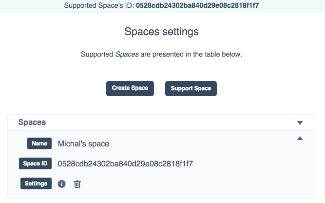
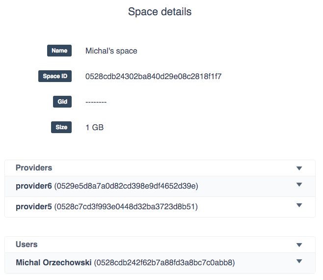

# Space support

Space is an abstract concept used in onedata for the purpose of data organization. In order to be useful in terms of storing data, user needs to request a storage support for his space from at least 1 provider. In order to do that user sends to the provider a token in a form:

~~~
example_token: mxYQpUBQtD-ai5dEQNB_k3qSVGwjxpgjbKMEdtTN
~~~
with accompanying information how much space is requested.

## Space support step by step
In order to grant user a support for his space,  you login into onepanel service and in the spaces tab chooses Support Space button:

He enters the token given by a user and amount of space he wishes to grant to the user.

After clicking ok, administrator can explore a list of spaces that are supported by this oneprovider cluster.

Further information about the space itself is available under the *i* information icon.
