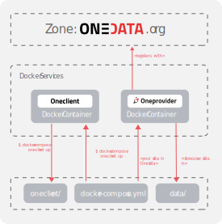

# Installing complete Onedata
 
This section shows how to deploy a fully functional Onedata installation that can work independently of Onedata.org using Docker Compose.

<!-- toc -->

Below is a diagram of the various components comprising a complete example Onedata deployment. 

<p align="center">

</p>

In this scenario we will leverage docker compose configuration files from [Scenario 1](). If you have problem following please refer to [Scenario 1]().

In [Scenario 1]() you used global Onezone service accessible under `ondata.org`. Now you need to start with setting your own Onezone service. 

To run Onedata locally with your Docker, you need 3 services:

- *Onezone* - a communication hub of Onedata system
- *Oneprovider* - a component that connects storage to Onedata
- *Oneclient* - a command line client used to access your files in Onedata

## Setting up Onezone
We will start by deploying a single-node Onezone installtion using a following `docker-compose-onezone.yaml` as a template: 

<pre><code class="yaml">version: '2.0'
services:
  onezone:
    image: docker.onedata.org/onezone:{{ book.quickstart.docker.versions.onezone }}
    restart: always
    hostname: node.onedata.org
</code></pre>

### Configuring Onezone
All Onedata services come with a dedicated web-based configuration wizard that guides the user through configuration process. Insted of using the wizard, in this scenario we will inject all the configuration options needed by Onezone by means of environmental variables in the docker-compose file. That includes domain names, hostnames and the name of the Onezone we are deploying.

All possible configuration options of Onezone are described [here]().

The `docker-compose-onezone.yaml` with configuration looks like this:

<pre><code class="yaml">version: '2.0'
  onezone:
    image: docker.onedata.org/onezone:{{ book.quickstart.docker.versions.onezone }}
    restart: always
    hostname: node.onedata.org
    environment:
      ONEPANEL_BATCH_MODE: 'true'
      ONEZONE_CONFIG: |
        cluster:
          domain_name: "onedata.org"
          nodes:
            node:
              hostname: "node"
          manager:
            default_node: "node"
            nodes:
              - "node"
          worker:
            nodes:
              - "node"
          database:
            nodes:
              - "node"
          settings:
            open_files_limit: 65535
            processes_limit: 65535
        onezone:
          name: "example"
</code></pre>

### Adding a second Onezone node &#x1F4D8;
In order to extend Onezone with extra node we you need to add a second service to 1docker-compose-onezone.yaml1 and modify Oneprovider configuration in `docker-compose-oneprovider.yaml` so that it accounts for extra nodes.

The complete `docker-compose-onezone.yaml` with double node Oneprovider cluster looks like that:

<pre><code class="yaml">version: '2.0'
  node1.onezone:
    image: docker.onedata.org/onezone:{{ book.quickstart.docker.versions.onezone }}
    restart: always
    hostname: node1.onedata.org
    environment:
      ONEPANEL_BATCH_MODE: 'true'
      ONEZONE_CONFIG: |
        cluster:
          domain_name: "onedata.org"
         nodes:
            node1:
              hostname: "node1"
            node2:
              hostname: "node2"
          manager:
            default_node: "node1"
            nodes:
              - "node1"
              - "node2"
          worker:
            nodes:
              - "node1"
              - "node2"
          database:
            nodes:
              - "node1"
              - "node2"
          settings:
            open_files_limit: 65535
            processes_limit: 65535
        onezone:
          name: "example"
          
 node2.onezone:
    image: docker.onedata.org/onezone:{{ book.quickstart.docker.versions.onezone }}
    restart: always
    hostname: node.onedata.org
</code></pre>


### Running Onezone
In order to start onezone nodes you need to run docker-compose. In each case wait for a confirmation message that oneprovider service was setup correctly.
To

```bash
# For singe-node installation
$ docker-compose -f "docker-compose-onezone.yaml" up onezone
Congratulations! onezone has been successfully started.

# For double node installation
$ docker-compose -f "docker-compose-onezone.yaml" up node1.onezone
Congratulations! node1. onezone has been successfully started.
$ docker-compose -f "docker-compose-onezone.yaml" up node2.onezone
Congratulations! node2. onezone has been successfully started.
```

## Setting up Oneprovider
The process of setting up Oneprovider service either single-node or multi-node is the same as in [Scenario 1](). You just need to modify address of the Onezone service to point to your local installation. 

The complete `docker-compose-onezone.yaml` for single node Oneprovider  that will connect with your Onezone service looks like this:

<pre><code class="yaml">version: '2.0'

services:
  oneprovider:
    image: docker.onedata.org/oneprovider:{{ book.quickstart.docker.versions.oneprovider }}
    restart: always
    hostname: localhost.localdomain
    volumes:
          - "onedata_tutrial1/data:/mnt/data"
    environment:
      ONEPANEL_BATCH_MODE: 'true'
      ONEPROVIDER_CONFIG: |
        cluster:
          domain_name: "localdomain"
          nodes:
            node:
              hostname: "localhost"
          manager:
            default_node: "node"
            nodes:
              - "node"
          worker:
            nodes:
              - "node"
          database:
            nodes:
              - "node"
          storage:
            NFS:
              type: "POSIX"
              mount_point: "/mnt/data"
          settings:
            open_files_limit: 65535
            processes_limit: 65535
        oneprovider:
          register: true
          name: "provider"
          geo_longitude: 19.945
          geo_latitude: 50.0647
        onezone:
          domain_name: "node1.onezone"
</code></pre>

For Oneprovider with two nodes that is correct `docker-compose-onezone.yaml`:

<pre><code class="bash">version: '2.0'

services:
  node1.oneprovider:
    image: docker.onedata.org/oneprovider:{{ book.quickstart.docker.versions.oneprovider }}
    restart: always
    hostname: localhost.localdomain
    volumes:
          - "onedata_tutrial1/data:/mnt/data"
    environment:
      ONEPANEL_BATCH_MODE: 'true'
         cluster:
          domain_name: "oneprovider.dev.local"
          nodes:
            node1:
              hostname: "node1"
            node2:
              hostname: "node2"
          manager:
            default_node: "node1"
            nodes:
              - "node1"
              - "node2"
          worker:
            nodes:
              - "node1"
              - "node2"
          database:
            nodes:
              - "node1"
              - "node2"
          storage:
            NFS:
              type: "POSIX"
              mount_point: "/tmp/data"
        oneprovider:
          register: true
          name: "example"
          redirection_point: "https://node1.oneprovider.dev.local"
        onezone:
          domain_name: "node1.onezone"
    
  node2.oneprovider:
    image: docker.onedata.org/oneprovider:{{ book.quickstart.docker.versions.oneprovider }}
    hostname: node1.oneprovider.dev.local
    volumes: # shared volume required for mulit-node storage access verification
          - "onedata_tutrial1/data:/mnt/data"
</code></pre>

To run Oneprovider use the same commands as in [Scenario 1](), remember to ensure that Onezone service is running before you start Oneprovider.


## Accessing your data with Oneclient
The process is exacly the same as in [Scenario 1]()