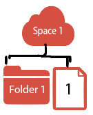
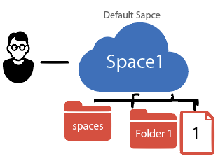
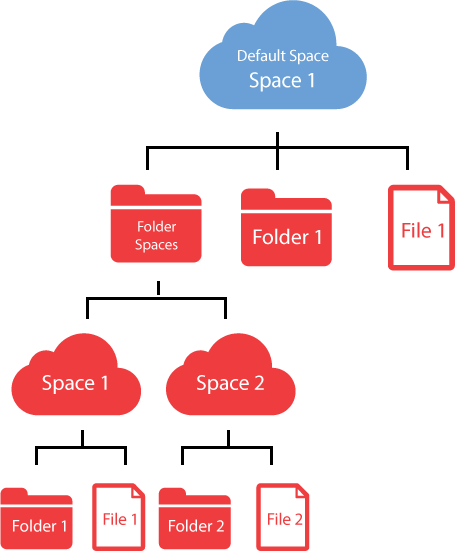
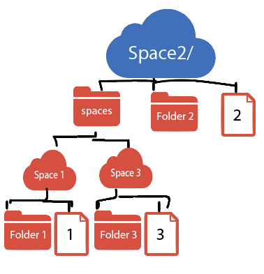
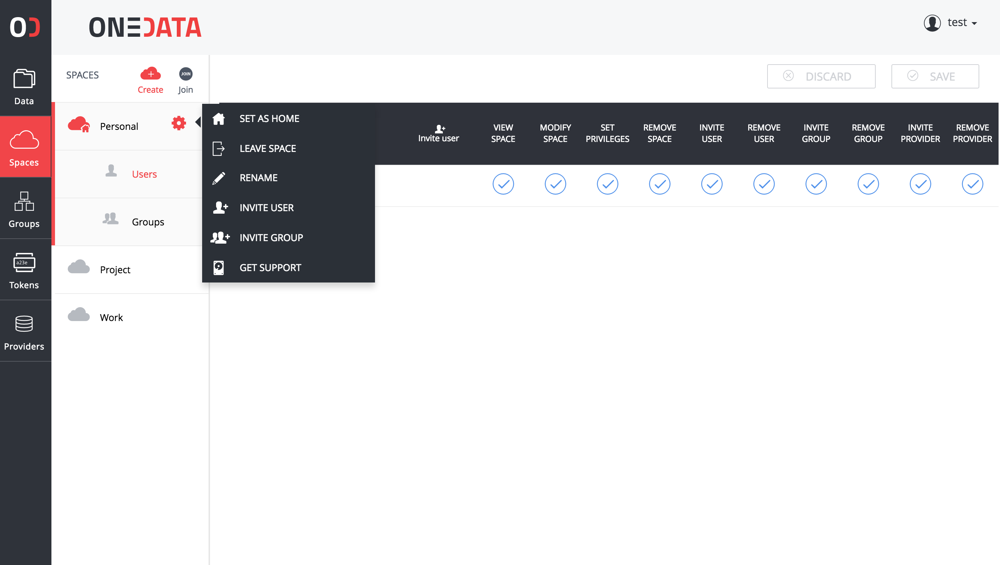

# Space Management
This document discusses in more detail what the space is, and how they can be managed through the Onedata web interface.

## Space concept overview
You can think of a space as a virtual directory, which contents are stored in distributed storage resources provisioned by storage providers. Each space must have at least one provider supporting it with a non-zero storage space (quota). The effective quota available to a single space is the sum of storage quotas dedicated to this space by all providers supporting it.

*It is important to note that even if a some file in the space is larger than any single provider quota but smaller that total storage quota left in the space, Onedata can still manage this file by splitting it between different storage providers.*

You can create as many spaces as necessary, and each of them can have different providers supporting it.

### Default Space
After creating account at [onedata.org](onedata.org), a first space is automatically created which is called the *default space*.

The contents of the default space are presented as a root directory for your spaces. Default space contains a single directory called `spaces`, which allows you to access files in other manually created spaces.

### Working with multiple spaces
To understand the hierarchy of spaces, lets go through an example:
- we have 3 spaces
- in each space there is a single directory and a single file, whose names correspond to the space's name

In first case the `Space1` is designated as the *default space*. Two other spaces were put into folder `spaces` and can be accessed from `Space1`.

Let's change the default space to `Space2`. Now when you access your files, at the root level you will see the content of `Space2`. In order to access the content of `Space1` you will have to navigate to `spaces/Space1`.

## Manage your spaces
You can manage your spaces from the **Manage spaces** tab in the web user interface. To navigate to **Manage spaces** page, click on the **Spaces**, there you can see the list of all your spaces with one of them denoted as the default space.

### Create your space
The first space is created for you automatically during the first login. In order to create more spaces:

1. In the Onedata Web Interface click **Spaces** button located on the top menu.
2. On the **Manage spaces** page, click **Create new space** button.
3. On the bottom of the screen set the name of the new space and confirm with the **OK** button.

New space will appear in the list of spaces designated with a unique ID.

### Space Properties
On the **Manage spaces** page, you can see a detailed information about a space by clicking on it.

All information regarding your space is presented here, including:
- a list of users who can access your space and their permissions
- a list of groups who can access your space and their permissions
- a list of providers who support this space and the respective quotas

For more information about groups, see [Group Management](group_management.md).

For more information about permissions, see [Access Control](access_control.md).

### Space management
On the **Manage spaces** page, each listed space has a **Action**, which allows you to:

| Action Name     | Description                                                              |
|:----------------|:-------------------------------------------------------------------------|
| Move up         | Move this space up on the list of your spaces.                           |
| Move down       | Move this space down on the list of your spaces.                         |
| Set as default  | Set this space to be your default space.                                 |
| Leave space     | Remove this space from the list of your spaces.                          |
| Rename          | Rename this space.                                                       |
| Remove          | Remove this space and all the data it contains.                          |
| Invite user     | Add a user to this space.                                                |
| Create group    | Create a group and add it to this space.                                 |
| Invite group    | Add a group to this space.                                               |
| Request support | Generate a unique token for this space that can be sent to the provider. |

### Increase your space quota
In order to increase your space quota:
1. Navigate to **Manage spaces** page.
2. On your space, click the *Actions* button.
3. Select **Request support** from the drop down menu.
4. Copy the token and send it to the Provider asking for required amount of storage space.

The last step can be performed by email or by other means depending on the policies adopted by the provider. After the provider supports your space with more storage you will be able to see it in the detailed space view.

### Remove your space
In order to remove your space:
1. Navigate to **Manage spaces** page.
2. On your space, click the *Actions* button.
3. Select **Remove** from the drop down menu.
4. Click **Yes**, acknowledging that you want to remove this space.
