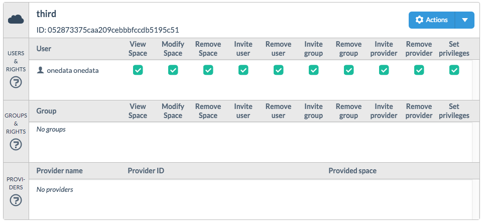

# Space Management


> This document should explain:
* what the space is
* how to support the space
* how to create the space
* how to delete the space

> In this document we show step by step how to login into onedata, how to create a space and how to upload files.

> All of it is quite easy.

> zostało join space
> i space collaboration



## Introduction to spaces

You can think of a space as a virtual directory, with its storage capacity limited by a quota. A space serves as a root directory for all your files and directories located in that space.
You can create multiple spaces, each govern by separate quota.

### Default Space

Upon account creation a first space is created which is marked as a *default space*.
The content of the default space is presented as a content of a root directory of your files. In the default space resides a single directory called `spaces`, which allows you to access files in other no-default spaces.

### Work with multiple spaces
To understand the hierarchy of spaces, lets go through an example:
- we have 3 spaces
- in each space there are a directory and a file which name corresponds to the space's name

In first case the Space1 is designated as a default space. Two other spaces were put into folder `spaces` and can be accessed form the default space.

Lets change the default space to Space2. Now when you will accesss your files, at the root level you will see the content of Space2. In order to access the content of Space1 you will have to navigate to `spaces/Space1`.

## Manage your spaces
You can manage your spaces form the **Manage spaces** page. To navigate to Manage spaces page, click on the **Spaces** in the Onedata Web Interface, there you can see the list of all your spaces with one of them described as a default space.

### Create your space
The first space is created for you during the first login. In order to create more spaces:

1. In the Onedata Web Interface click **Spaces** button located on the top menu.
2. On the **Manage spaces** page, click **Create new space** button.
3. On the bottom of the screen set the name of the new space and click **OK** button.

New space will appear on the list of spaces designated with a unique ID.

### Space Properties
On the **Manage spaces** page, you can see a detailed information about a space by clicking on it.

All information regarding you space is presented here, including:
- a list of users who can access your space and their permissions
- a list of groups who can access your space and their permissions
- a list of providers who support

For more information about groups, see [Group Management](group_management.md).

#### Space Permissions

You can control actions and the level of access to your space by setting dedicated permissions for a userp. In order to edit permissions:

1. Navigate to **Manage spaces** page.
2. Click on our **space**, to show space detailed view.
3. To set a permission click on the **empty box**.
4. To unset a permission click on the **box with a tick**.
5. To save or discard changes use **Save** or **Discard** buttons.

You can modify any of these permissions:

| Permission Name | Description                                                                   |
|:----------------|:------------------------------------------------------------------------------|
| View Space      | User can see  files and folders in your space.                                |
| Modify Space    | User can modify files and folders in your space.                              |
| Remove Space    | User can delete your space.                                                   |
| Invite user     | User can invite new users to your space.                                      |
| Remove user     | User can remove  users from your space.                                       |
| Invite group    | User can invite new groups to your space.                                     |
| Remove group    | User can remove  groups from your space.                                      |
| Invite provider | User can request a support from the provider.                                 |
| Remove provider | User can remove provider form the list of providers that supports your space. |
| Set privileges  | User can modify this privileges.                                              |

### Perform actions on your space
One the **Manage spaces** page, each listed space has a **Action**, which allows you to:

| Action Name     | Description                                                              |
|:----------------|:-------------------------------------------------------------------------|
| Move up         | Move this space up on the list of your spaces.                           |
| Move down       | Move this space down on the list of your spaces.                         |
| Set as default  | Set this space to be your default space.                                 |
| Leave space     | Remove this space from the list of your spaces.                          |
| Rename          | Rename this space.                                                       |
| Remove          | Remove this space with all the data in it.                               |
| Invite user     | Add a user to this space.                                                |
| Create group    | Create a group and add it to this space.                                 |
| Invite group    | Add a group to this space.                                               |
| Request support | Generate a unique token for this space that can be sent to the provider. |

### Increase your space quota
In order to increase your space quota:
1. Navigate to **Manage spaces** page.
2. On your space, click the *Actions* button.
3. Pick **Request support** from the drop down menu.
4. Copy the token and send it to the Provider asking for an amount of storage space.

The last step can be performed by email or by other means depending on the policies adopted by the provider. After the provider supports your space with more storage you will be able to see it in detailed space view.

### Remove your space
In order to remove your space:
1. Navigate to **Manage spaces** page.
2. On your space, click the *Actions* button.
3. Pick **Remove** from the drop down menu.
4. Click **Yes**, acknowledging that you want to remove this space.
