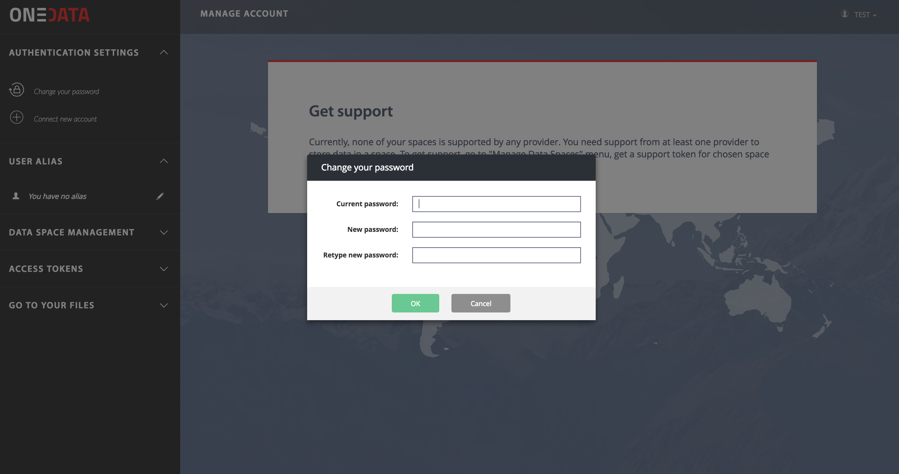

# Account Management

<!-- toc -->

Basic account management functionality is available via the Onezone interface.

## Changing password
If your Onezone service supports basic HTTP authentication, it can be changed
in `Authentication Settings` menu:

## Connecting additional accounts
When your Onezone service supports multiple OpenID Identity Providers, it is
possible to connect multiple external accounts to a single Onedata account
allowing you to login using for instance Google, Facebook and GitHub accounts
to the same Onedata account.

## Setting user username
In order to ease the use and discovery of Onedata service and to enable
identification for collaboration with other users, it is preferred to set a user
username after the first sign-in.

This username can be used to make it easier to find you by other users for
collaboration (e.g. inviting to join spaces or groups).
