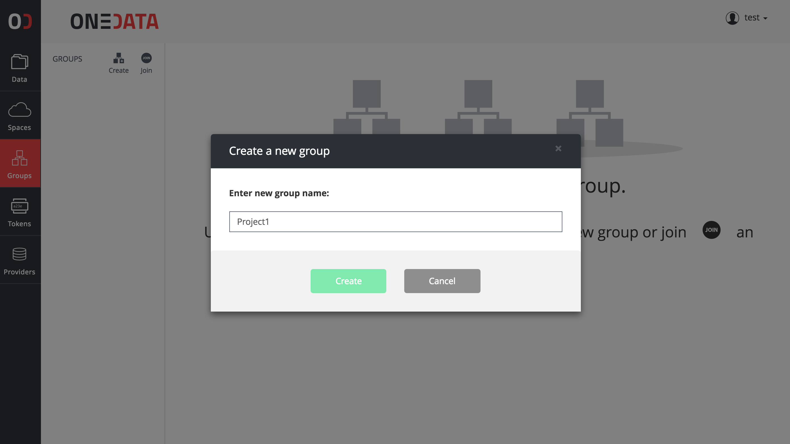
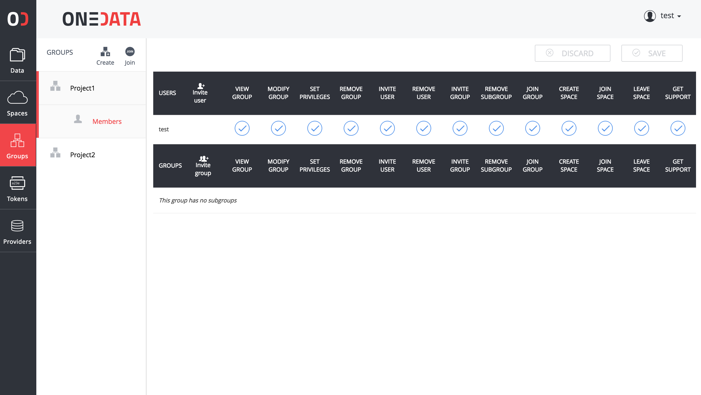
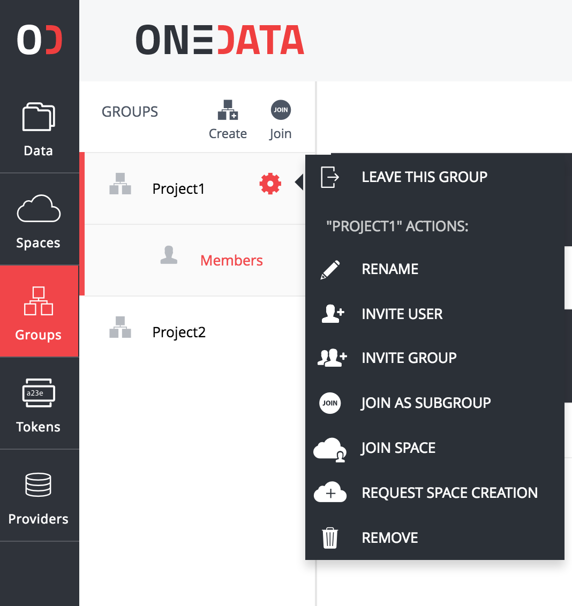

# Group Management

<!-- toc -->

You can create or join existing groups to easily manage and collaborate using your data. A group is an abstract entity with a name and at least one user assigned to it, who has sufficient permissions to manage it. You can manage your groups from a **Manage groups** page, accessible using **Group** button on the top menu.

## Create a new group
In order to create a new  group:

1. In the Onedata Web Interface click **Groups** button located on the left menubar.
2. On the **Groups** page, click **Create** button.
3. On the bottom of the screen set the name of the new group and click **OK** button.

New group will appear on the list of groups designated with a unique ID.

## Invite another user to your group
To invite another user to join your group:

1. Navigate to **Groups** page.
2. On your group, click the **Settings** button.
3. Pick **Invite User** from the drop down menu.
4. Copy the token and send it to the user you wish to invite to your group.

After another user joins your group you will be able to see him in the detailed group view.

## Join existing group
To join a group, you must request from them a token. After receiving the token:

1. Navigate to **Groups** page.
2. Click the **Join** button.

You should be able to see a group on the Manage groups page immediately.

## Group properties
On the **Groups** page, you can see a detailed information about a group by clicking on it.

All information regarding your group is presented here, including:
- a list of members of this group and their permissions
- a list of spaces that this group has joined

### Group permissions

You can control actions and the level of access to your group by setting dedicated permissions. In order to edit permissions:

1. Navigate to **Groups** page.
2. Click on your **group**, to show detailed view.
3. To set a permission click on an **empty box** in the relevant column.
4. To unset a permission click on the **box with a tick**.
5. To save or discard changes use **Save** or **Discard** buttons.

A complete list of available permissions:

| Permission Name | Description                                                                  |
|:----------------|:-----------------------------------------------------------------------------|
| View Group      | User can see files and folders in your group                                 |
| Modify Group    | User can modify files and folders in your group                              |
| Set privileges  | User can modify group privileges                                             |
| Remove Group    | User can delete your group                                                   |
| Invite user     | User can invite new users to your group                                      |
| Remove user     | User can remove  users from your group                                       |
| Invite group    | User can invite new groups to your group                                     |
| Remove subgroup    | User can remove  subgroups from your group                                      |
| Join group    | User can join the group as a subgroup of another group                                      |
| Create space| User can create spaces on behalf of the group |
| Join space | User can join a space on behalf of the group                                 |
| Leave space | User can leave a space on behalf of a group |
| Get support | User can request storage support for spaces on behalf of the group |

### Perform actions on your group
On the **Groups** page, each listed group has a **Settings** menu.

It allows you to:

| Action Name            | Description                                          |
|:-----------------------|:-----------------------------------------------------|
| Leave this group            | Remove this group from the list of your groups       |
| Rename                 | Rename this group                                    |
| Invite user            | Add a user to this group                             |
| Invite group            | Add a subgroup to this group                             |
| Join as subgroup | Join another group |
| Join space             | Join existing space                                  |
| Request space creation | Create a space for this group                        |
| Remove                 | Remove this group and leave all spaces it has joined |

### Remove your group
In order to remove your group:
1. Navigate to **Groups** page.
2. On your group, click the **Settings** button.
3. Pick **Remove** from the drop down menu.
4. Click **Yes**, confirming that you want to remove this group.
