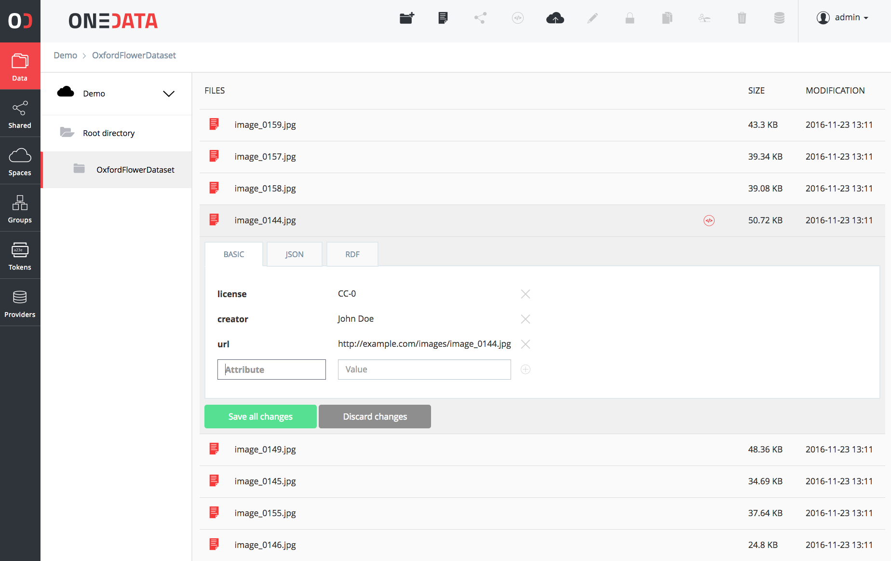
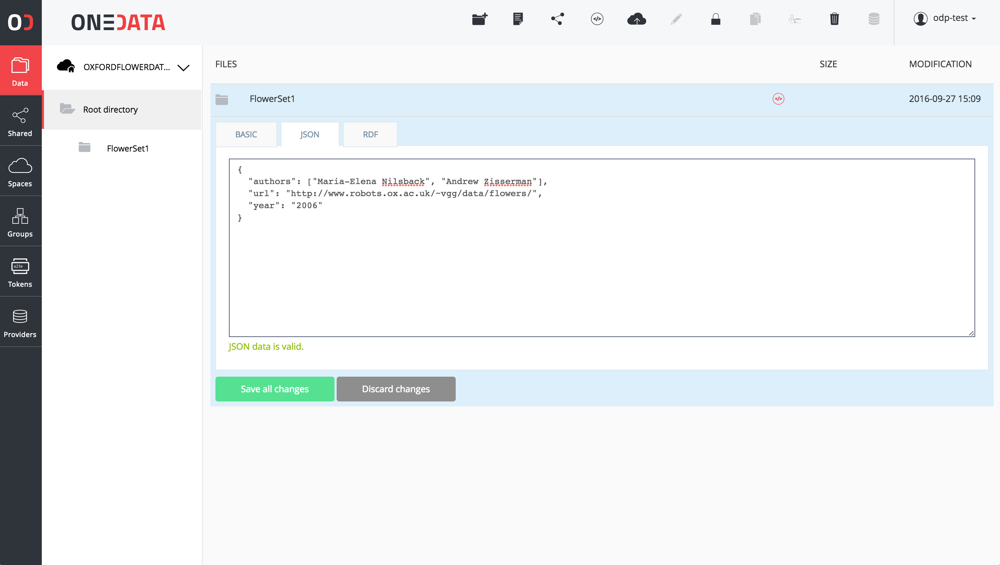

# Metadata

<!-- toc -->

Onedata comes with an extensive support for metadata management, which can be used to describe all kinds of resources in Onedata including files, directories, spaces and users.

## Metadata types in Onedata
Metadata in Onedata are organized into 3 levels:

* **Filesystem attributes** - basic metadata related to file system operations such as file size, creation and modification timestamps, POSIX access rights, etc.,
* **Extended attributes** - these attributes enable assigning custom key-value pairs with resources in Onedata. These attributes can include for instance information about owner and creators of the file, Access Control Lists, license, etc.,
* **Custom metadata** - this level provides most flexibility and Onedata itself does not assume any schema related with these metadata. For each resource, user can assign a separate document in one of supported metadata formats (currently JSON and RDF).

The filesystem and extended level attributes are accessible directly via POSIX and CDMI protocols.

## Filesystem attributes

This section describes typical filesystem metadata attributes. The list of attributes at this level is closed (i.e. users cannot add new attributes) and most of them are read-only, which means their values cannot be directly modified (`cdmi_` attributes). Other attributes (currently only `posix_mode`) can be modified by the user using the REST API.

| Attribute            | Sample value                             | Description                              |
| -------------------- | ---------------------------------------- | ---------------------------------------- |
| **size**             | 1024                                     | File size in bytes                       |
| **mode**             | 0666                                     | POSIX access mode in octal form (i.e. 4 digits starting with 0) |
| **atime**            | 1470304148                               | Unix last access timestamp               |
| **mtime**            | 1470304148                               | Unix last modification timestamp         |
| **ctime**            | 1470304148                               | Unix last status change timestamp                  |
| **storage_group_id** | 1470304148                               | Gid of the storage group owner of this file (the same Gid is displayed via `oneclient`) |
| **storage_user_id**  | 1470304148                               | Uid of the storage owner of this file    |
| **name**             | file.txt                                 | The name of the object (Space, directory or file) |
| **owner_id**         | 79c0ed35f32e43db3a87f76a588c9b2f9        | ID of the file owner                     |
| **provider_id**      | 79c0ed35f32e43db3a87f76a588c9b2f9        | ID of the provider on which file was created      |
| **shares**           | ["b3a87f76a588c9b279c0ed35f32e4db", ...] | Array of share Id's associated with this file or directory |
| **type**             | 'reg'                                    | Specifies whether the resource is a regular file (`reg`), a directory (`dir`) or a link (`lnk`) |


## Extended attributes
<!-- This header is referenced at least one time as "#extended-attributes" -->

In a general case, extended attributes are platform agnostic and users can choose whatever keys and values to be assigned for these level attributes.


One restriction is that all keys, beginning with `onedata_` or `cdmi_` prefixes, should be avoided as they are used by Onedata 
platform for special purposes, in particular for presentation in Graphical User Interface and Open Data publishing and management.

### Setting extended attributes using Graphical User Interface

Graphical user interface provides means for editing extended attributes in the form of a key-value pairs, as presented in the figure below.



The extended metadata values can be assigned to either files or directories.

### Setting extended attributes using REST API

Extended attributes can be modified either from the Graphical User Interface, from the command line as well as via the REST API. Below are some examples:

**Set the extended attribute "license" to "CC-0" using REST API**
```bash
curl --tlsv1.2 -X PUT -H "X-Auth-Token: $TOKEN" \
-H 'Content-type: application/json' -d '{ "license": "CC-0" }'
"https://$HOST/api/v3/oneprovider/data/$FILE_ID/metadata/xattrs"
```

**List all extended attributes using REST API**
```bash
curl --tlsv1.2 -X GET -H "X-Auth-Token: $TOKEN" \
"https://$HOST/api/v3/oneprovider/data/$FILE_ID/metadata/xattrs"
```

### Setting extended attributes using command line

Oneclient mounted spaces have support for extended attribute (xattr) feature, which can be accessed and manipulating using such tools as `xattr` or `getfattr` and `setfattr`. For instance to set an attribute on a file:

```sh
[/mnt/oneclient/MySpace1]$ ls
File2.txt

[/mnt/oneclient/MySpace1]$ xattr -l File2.txt
license: CC-0
org.onedata.uuid: Z3VpZCM1NzMwZjNjNjRjYmI0Y2M1MjllZjRlYWVhNDJkNDY4MyNmNzMzMzA1Zj
dhMGE4MWRjZTM5NjY2NzEzYTUxNmYwYg
org.onedata.space_id: f733305f7a0a81dce39666713a516f0b
org.onedata.file_id: /f733305f7a0a81dce39666713a516f0b/5/7/3/5730f3c64cbb4cc529e
f4eaea42d4683
org.onedata.storage_id: 55e4475e8dc60dc3ebd070f8dd424f24
org.onedata.access_type: unknown
org.onedata.file_blocks: [##################################################]
org.onedata.file_blocks_count: 1
org.onedata.replication_progress: 100%

[/mnt/oneclient/MySpace1]$ xattr -w license CC-1 File2.txt
```

## Custom metadata
<!-- This header is referenced at least one time as "#custom-metadata" -->

In addition to filesystem level and extended attributes, Onedata supports arbitrary metadata documents to be assigned to each resource, which are stored in separate metadata backends. Currently supported backends include:
* JSON
* RDF



In each of these backends, user can store any properly formatted metadata
documents, which can be modified and retrieved using the
[REST API](https://onedata.org/#/home/api/latest/oneprovider?anchor=tag/Custom-File-Metadata)
or in the web GUI.