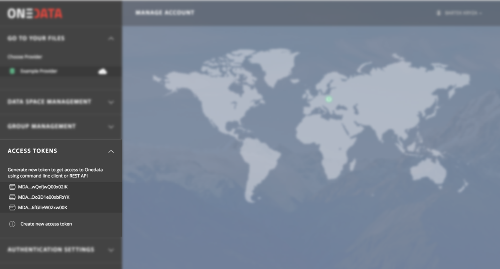

# Oneclient

<!-- toc -->

Onedata provides a command-line based client that is able to mount your spaces
in your local file system tree. Oneclient is based on
[Fuse](https://github.com/libfuse/libfuse) and can be downloaded from
[onedata.org](https://onedata.org/download). Please follow installation
instructions that can be found there for your particular platform.

## Installation

### Linux
Oneclient is supported on several major Linux platforms including Ubuntu and Fedora. To install oneclient using packages simply use the following command:

```bash
curl -sS  http://get.onedata.org/oneclient.sh | bash
```

>After installing ensure that you are able to access `fusermount` tool, by
>running `fusermount -h`. In case you are not allowed to execute `fusermount`,
>ask your administrator to make you a member of a `fuse` group. If you have
>administrator rights to your machine, use command `gpasswd -a <username> fuse`
>to add your account to `fuse` group.

### macOS
An experimental version of oneclient is available for macOS (Sierra or higher), and can be installed using Homebrew:

```bash
# OSXFuse must be installed separately, at least version 3.5.4
brew cask install osxfuse
brew tap onedata/onedata
brew install oneclient
```

In order to enable Desktop icon for the mounted Onedata volume, it is necessary to enable this feature in the system settings:

```bash
defaults write com.apple.finder ShowMountedServersOnDesktop 1
```

## Authentication

In order to be able to mount your spaces you need to authenticate with
a specific Onezone service and obtain an access token. Access token can be generated directly from the Web interface using *Access tokens* menu:

<p align="center">  </p>

> IMPORTANT: Please make sure not to share or publish access tokens with anyone, access tokens should be treated as private keys which should be only used by their owners for authentication with Onedata services. In particular they should NOT be used for sharing your data with others - for this purpose you can issue special purpose tokens such as [space invite tokens](space_collaboration.md) or [group invite tokens](group_management.md).

If you are connecting to a provider service which does not have a
globally trusted certificate, you will have to use `-i` or `--insecure` on every `oneclient` invocation or export `ONECLIENT_INSECURE=1` environment variable .


### Mounting spaces

The basic command line syntax to mount spaces using a specific Oneprovider is:
```bash
oneclient -H <PROVIDER_HOSTNAME> -t <ACCESS_TOKEN> <MOUNT_POINT>
```

or

```bash
export ONECLIENT_ACCESS_TOKEN=<CLIENT_TOKEN>

export ONECLIENT_PROVIDER_HOST=<DEFAULT_PROVIDER>

oneclient <MOUNT_POINT>
```

In order to unmount your spaces, type:

```bash
oneclient -u MOUNT_POINT
```

## Options

### Direct IO and Proxy IO modes
By default `oneclient` will automatically try to detect if it can access storage supporting
mounted spaces directly, which significantly improves IO performance as all read and write
operations go directly to the storage and not via the Oneprovider service.

This feature can be controlled using 2 command line options:

  * `--force-proxy-io` - disables Direct IO mode, all data transfers will go via Oneprovider service
  * `--force-direct-io` - forces Direct IO mode, if it is not available for any of mounted spaces, `oneclient` will fail to mount

### Buffering
`oneclient` employs an in-memory buffer for input and output data blocks, which can significantly
improve performance for various types of storages, in particular object based storages such as S3.

If for some reason this local cache is undesired, it can be disabled using `--no-buffer` option.

### Other options

To see full set of `oneclient` command line options checkout the man page
`man oneclient` or print help information using `oneclient -h`:

```bash
$ oneclient -h
Usage: oneclient [options] mountpoint

A Onedata command line client.

General options:
  -h [ --help ]                         Show this help and exit.
  -V [ --version ]                      Show current Oneclient version and
                                        exit.
  -u [ --unmount ]                      Unmount Oneclient and exit.
  -c [ --config ] <path> (=/etc/oneclient.conf)
                                        Specify path to config file.
  -H [ --host ] <host>                  Specify the hostname of the Oneprovider
                                        instance to which the Oneclient should
                                        connect.
  -P [ --port ] <port> (=443)           Specify the port to which the Oneclient
                                        should connect on the Oneprovider.
  -i [ --insecure ]                     Disable verification of server
                                        certificate, allows to connect to
                                        servers without valid certificate.
  -t [ --token ] <token>                Specify Onedata access token for
                                        authentication and authorization.
  -l [ --log-dir ] <path> (=/tmp/oneclient/0)
                                        Specify custom path for Oneclient logs.

Advanced options:
  --force-proxy-io                      Force proxied access to storage via
                                        Oneprovider for all spaces.
  --force-direct-io                     Force direct access to storage for all
                                        spaces.
  --buffer-scheduler-thread-count <threads> (=1)
                                        Specify number of parallel buffer
                                        scheduler threads.
  --communicator-pool-size <connections> (=10)
                                        Specify number of connections in
                                        communicator pool.
  --communicator-thread-count <threads> (=4)
                                        Specify number of parallel communicator
                                        threads.
  --scheduler-thread-count <threads> (=1)
                                        Specify number of parallel scheduler
                                        threads.
  --storage-helper-thread-count <threads> (=10)
                                        Specify number of parallel storage
                                        helper threads.
  --no-buffer                           Disable in-memory cache for
                                        input/output data blocks.
  --provider-timeout <duration> (=120)  Specify Oneprovider connection timeout
                                        in seconds.
  --disable-read-events                 Disable reporting of file read events.
  --force-fullblock-read                Force fullblock read mode. By
                                        default read can return less data than
                                        request in case it is immediately
                                        available and consecutive blocks need
                                        to be prefetched from remote storage.
  --read-buffer-min-size <size> (=5242880)
                                        Specify minimum size in bytes of
                                        in-memory cache for input data blocks.
  --read-buffer-max-size <size> (=104857600)
                                        Specify maximum size in bytes of
                                        in-memory cache for input data blocks.
  --read-buffer-prefetch-duration <duration> (=1)
                                        Specify read ahead period in seconds of
                                        in-memory cache for input data blocks.
  --write-buffer-min-size <size> (=20971520)
                                        Specify minimum size in bytes of
                                        in-memory cache for output data blocks.
  --write-buffer-max-size <size> (=52428800)
                                        Specify maximum size in bytes of
                                        in-memory cache for output data blocks.
  --write-buffer-flush-delay <delay> (=5)
                                        Specify idle period in seconds before
                                        flush of in-memory cache for output
                                        data blocks.
  --metadata-cache-size <size> (=100000)
                                        Specify maximum number of file metadata
                                        entries which can be stored in cache.
  --readdir-prefetch-size <size> (=2500)
                                        Specify the size of requests made
                                        during readdir prefetch (in number of
                                        dir entries).

FUSE options:
  -f [ --foreground ]         Foreground operation.
  -d [ --debug ]              Enable debug mode (implies -f).
  -s [ --single-thread ]      Single-threaded operation.
  -o [ --opt ] <mount_option> Pass mount arguments directly to FUSE.

Monitoring options:
  --monitoring-type <reporter>        Enables performance metrics monitoring -
                                      allowed values are: graphite.
  --monitoring-level-basic            Sets monitoring reporting level to basic
                                      - default.
  --monitoring-level-full             Sets monitoring reporting level to full.
  --monitoring-period <seconds> (=30) Performance metrics reporting period.
  --graphite-url <url>                Graphite url - required when
                                      monitoring-type is 'graphite', the scheme
                                      can be either tcp or udp and default port
                                      is 2003
  --graphite-namespace-prefix <name>  Graphite namespace prefix.
```

## Using Oneclient from Docker
Oneclient can also be started without installation using our official Docker images:

```bash
docker run --privileged -e ONECLIENT_ACCESS_TOKEN=<ACCESS_TOKEN> \
-e ONECLIENT_PROVIDER_HOST=<PROVIDER_HOSTNAME> \
-d --name oneclient-1 onedata/oneclient:18.02.1
```

This will start a Docker container with mounted spaces in `/mnt/oneclient`
folder (inside container). They can be accessed from another terminal,
for instance using:
```bash
docker exec -it oneclient-1 /bin/bash

ls /mnt/oneclient
```

## Running Oneclient as systemd service

In some scenarios it may be convenient to run Oneclient as a service which is mounted before certain other services (e.g. user jobs) are executed on the machine. For this purpose a simple systemd service script can be created, with accompanying environment file with proper definitions.

The environment file should be created at: `/etc/oneclient.env`

```ini
ONECLIENT_PROVIDER_HOST=<ONEPROVIDER_HOST>
ONECLIENT_ACCESS_TOKEN=<ACCESS_TOKEN>
ONECLIENT_MOUNT=/mnt/oneclient
```

After that the systemd service script `` can look like this:

```ini
[Unit]
Description = Oneclient service
After       = network.target

[Service]
EnvironmentFile=/etc/oneclient.env
# Create Oneclient mountpoint if necessary
ExecStartPre=/usr/bin/mkdir -p $ONECLIENT_MOUNT
# Start Oneclient
ExecStart=/opt/oneclient/bin/oneclient -i -o allow_other $ONECLIENT_MOUNT
# Unmount oneclient when stopping the service
ExecStop      = /bin/fusermount -uz $ONECLIENT_MOUNT
# Change to `always` to automatically restart Oneclient
Restart       = no
Type          = forking

[Install]
WantedBy    = multi-user.target
```

The oneclient service can then be used in the following way:

```bash
# Start oneclient
sudo systemctl start oneclient

# Start oneclient on machine startup
sudo systemctl enable oneclient

# Unmount oneclient
sudo systemctl stop oneclient

# Check oneclient status
sudo systemctl status oneclient
```

