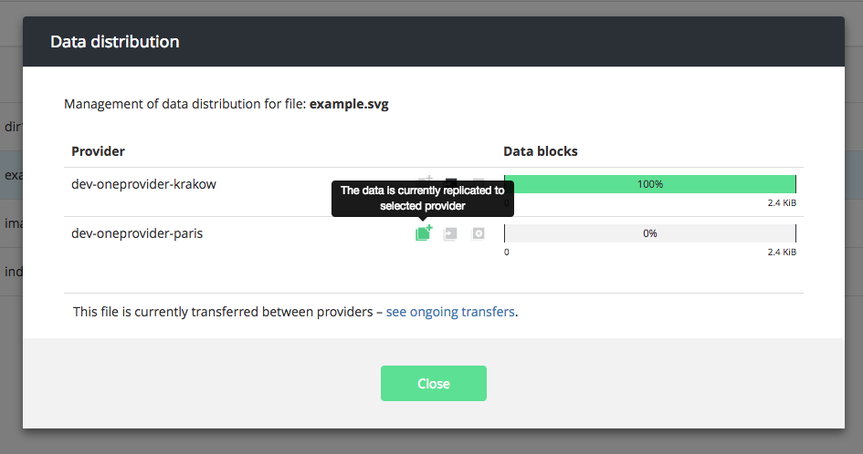
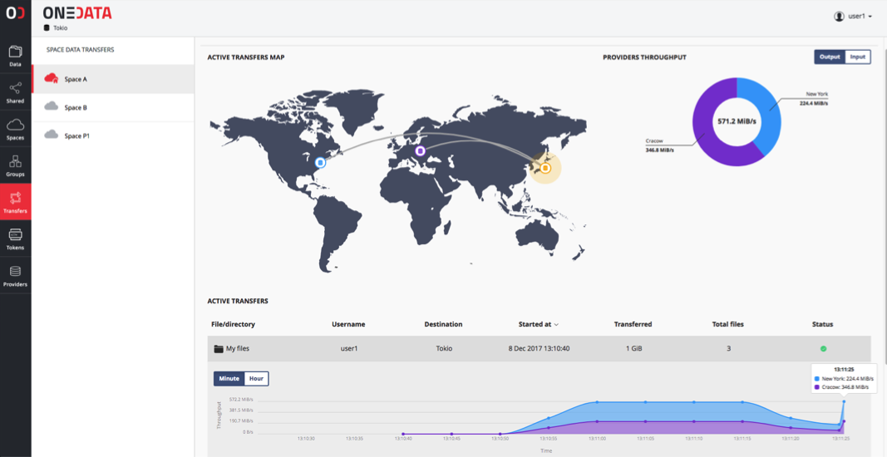

# Replicas and Transfer Management

<!-- toc -->

Onedata provides advanced functionality in terms of replica and transfer management in order to support most demanding use cases such as high performance scientific applications.

On the low level, all files are divided into blocks which can be independently replicated between storage resources. The API's for replication and transfer management give detailed information on which blocks are replicated at which sites, which allows for custom control and optimization at the application level.

## Operations
There are four possible operations that can be performed by users in terms of file replica management:
* getting file replicas distribution - finds out where blocks of a given file are stored
* replication - replicates file blocks to target provider
* replica eviction - removes file blocks from a given provider. 
The procedure checks whether file replica can be safely deleted which means that it is responsible for checking whether file blocks are not unique. 
* replica migration - combination of replication and replica eviction. Replicates file blocks to target provider and evicts file replica on the source provider. Migration is performed by the same request as eviction with additional parameter `migration_provider_id`

### Advanced operations using view indexes
As a prerequisite for understanding this section we advise to familiarize with [Onedata Indexes API](metadata.md#advanced-metadata-queries).

It is possible to schedule replication, replica eviction or replica migration of files that are included in the result of a query on a view index.
Currently, scheduling of such operations is possible only via [REST interface](#rest-interface).

In order to schedule replica operations by indexes, the user must ensure that the mapping (or reduce) function returns a list containing solely file IDs as a value. The list of IDs can be arbitrarily nested (it will be flattened).
Failure to comply with this format will result in errors.
Example of such mapping function is presented below. It returns the list of all files that have an extended attribute which name starts with "org.onedata.jobId.".
The latter part of the extended attribute is used as the key in the index view. 
```javascript
function (id, type, meta, ctx) {
    const JOB_PREFIX = "org.onedata.jobId.";
    var results = [];
    for (var key of Object.keys(meta))
        if (key.startsWith(JOB_PREFIX)){
            var jobId = key.slice(JOB_PREFIX.length);
            results.push([jobId, id]);
        }
    return {"list": results};
}
```
> **NOTE**
> Currently, scheduling operations on replicas works only for files. Directory Ids are ignored in the results.


## Web user interface

Web interface provides visual information on the current replication of each file among the storage providers supporting the user space in which this file is located.
The information is visible in the `Data distribution` window. It can be used to perform all of the operations mentioned in the previous [section](#operations).
Screenshot of the sample data distribution window is presented in the image below:



## REST interface

For full control over transfer and replication, users can directly invoke REST API of Oneprovider service.

### Replicas management

All operations presented in the [Operations section](#operations) can be performed via REST API.
Requests are listed in the table below, with attached links to their comprehensive documentation.

| Request                                     |                                             API                                             |
|:--------------------------------------------|:-------------------------------------------------------------------------------------------:|
| Get replicas by path                        | [API](https://onedata.org/#/home/api/latest/oneprovider?anchor=operation/get_file_replicas) |
| Get replicas by ID                          | [API](https://onedata.org/#/home/api/latest/oneprovider?anchor=operation/get_file_replicas_by_id)|
| Replicate file or folder by path            | [API](https://onedata.org/#/home/api/latest/oneprovider?anchor=operation/replicate_file)         |
| Replicate file or folder by ID              | [API](https://onedata.org/#/home/api/latest/oneprovider?anchor=operation/replicate_file_by_id)   |
| Replicate files by index                    | [API](https://onedata.org/#/home/api/latest/oneprovider?anchor=operation/replicate_file_by_id)|
| Evict/migrate existing replica by file path | [API](https://onedata.org/#/home/api/latest/oneprovider?anchor=operation/evict_replica)|
| Evict/migrate existing replica by file ID   | [API](https://onedata.org/#/home/api/latest/oneprovider?anchor=operation/evict_replica_by_id)|
| Evict/migrate existing replicas by index    | [API](https://onedata.org/#/home/api/latest/oneprovider?anchor=operation/evict_replica_by_id)|
 
### Transfer control and monitoring

#### Using GUI
In order to initiate a transfer (either replication or migration),
simply select the `Data distribution` icon in the top
menu of the file browser of Oneprovider and select the target provider, to which
replication or migration should take place:


Transfers can be conveniently managed and monitored using Oneprovider GUI. 
For each space, under tab `Transfers` on the left a dedicated transfer management
view is available:



For each transfer within the current data space an appropriate entry in the list below is
added, which provides information on current throughput of a specific transfer.

Overall throughput for the space can be observed on the world map.

#### Using REST API

The `/transfer/` operations provide basic transfer management functionality based on the ID of transfer returned by `/replicas/{path} [POST]` operation.

In order to get information about a specific transfer, simply query the following resource:

```bash
curl -X GET -H "X-Auth-Token: $ACCESS_TOKEN" \
https://$ONEPROVIDER_HOST/api/v3/oneprovider/transfers/<TRANSFER_ID>
```

or you can request all active transfers for given user:
```bash
curl -X GET -H "X-Auth-Token: $ACCESS_TOKEN" \
https://$ONEPROVIDER_HOST/api/v3/oneprovider/transfers
```

Each transfer can be cancelled using the HTTP `DELETE` method:
```bash
curl -X DELETE -H "X-Auth-Token: $ACCESS_TOKEN" \
https://$ONEPROVIDER_HOST/api/v3/oneprovider/transfers/<TRANSFER_ID>
```

