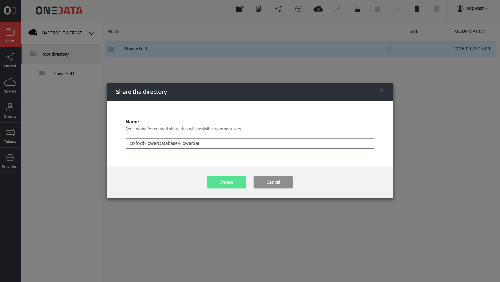
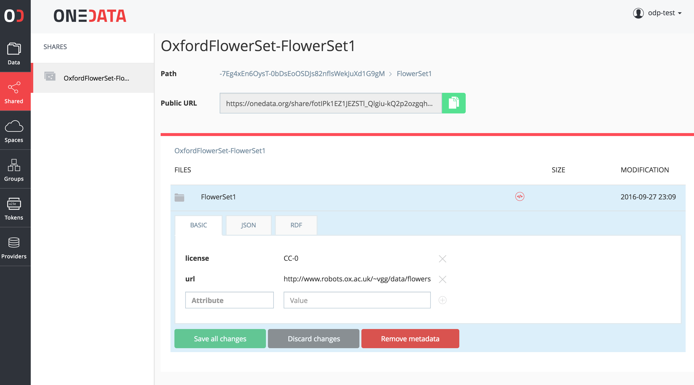
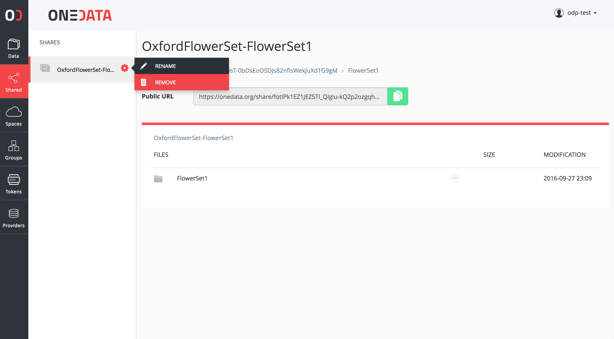

# Shares

<!-- toc -->

Onedata provides a feature which allows any folder to be seamlessly shared with other people, either already Onedata users or even users who do not yet have a Onedata account.

**Shares** functionality allows to generate a unique URL which can be easily shared with other users.

## Creating a share
In order to create shares, simply select the appropriate folder and press the **Share** icon in the top menu of Onedata data browser.



## Editing share metadata

In addition to metadata that is defined for each file in a shared dataset, entire data set's metadata can also be edited in the **Shares** view:




## Removing shares

In order to remove a share, simply select **Remove** option in the share menu:



## Open access shares
In order to support Open Data access community use cases, Onedata provides means for publishing shares as Open Data collections. Such collections can have assigned Open Access identifiers such as [DOI](http://www.doi.org/) or [PID](http://www.pidconsortium.eu/).

### Generating an open access identifier
Open access identifiers can be generated and assigned to shares by users who have access to a [Handle](http://handle.net) system based service within the current Onezone.

Handle service can be registered in Onezone by users who have access rights to specific Handle registras. Details on how to register and manage handle based services in Onedata are described [here](./handle_services.md).

Open access shares which have valid metadata will be exposed by the [OAI-PMH](https://www.openarchives.org/pmh/) Data Provider interface and can be used by content aggregators for indexing open access data sets.

<!-- #### Web user interface


 -->
#### REST API
Handles for shares can be also generated using the  REST API using the following command line:

```bash
curl -k -u username:password -X POST -H "Content-type: application/json" \
-d '{"handleServiceId": "AFSASDARAWD32aasfASSD", "resourceType": "Share", "resourceId": "LKJGLSAKDGASGD34234JKAHSD", "metadata": "..." }' \
https://$ONEZONE_HOST:8443/api/v3/handles
```

where metadata must be a Dublin Core compatible metadata in escaped XML.
