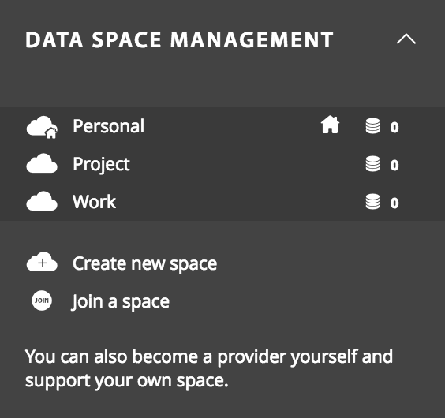
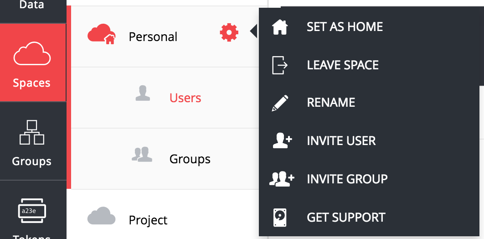

# Space Management

<!-- toc -->

This document discusses in more detail what the space is, and how it can be managed through the Onedata web interface.

## Space concept overview

You can think of a space as a virtual directory, which contents are stored in distributed storage resources provisioned by storage providers. Each space must have at least one provider supporting it with a non-zero storage space (quota). The effective quota available to a single space is the sum of storage quotas dedicated to this space by all storage providers supporting it.

*It is important to note that even if some file in the space is larger than any single provider's quota but smaller that total storage quota left in the space, Onedata can still store this file by splitting it in blocks and storing parts at different storage providers.*

You can create as many spaces as necessary, and each of them can have different providers supporting it.

### Home Space

You can select one of the spaces as you **Home** space. This will be the space
which is opened by default when logging into Oneprovider data management
interface.

## Manage your spaces
You can manage your spaces from the **Data space management** tab located in the web user interface.
To navigate to **Spaces** page, click on the **Spaces** in the left menubar, there you can see the list of all your spaces with one of them denoted as the home space.

### Create new space

The first space is created for you automatically during the first login. In order to create more spaces:

1. In the Onezone Web Interface unfold **Data space management** tab located on the left menubar.
2. Click **Create new space** button.
3. Provide new space name in the text edit field and confirm.

New space will appear in the list of spaces designated with a unique ID.

In order to be able to store data in the newly created space, it is necessary to [add storage support](#add-storage-support) from some provider.

### Join existing space
In addition to creating new spaces, it is also possible to join existing spaces created by other users.

In order to do that it is necessary to request a **Space join** token from the owner of such space or other user, who has privileges to share the space with others.

### Space Properties
On the **Spaces** page, you can see a detailed information about a space by clicking on it.

All information regarding your space is presented here, including:
- a list of users who can access your space and their permissions
- a list of groups who can access your space and their permissions

For more information about groups, see [Group Management](group_management.md).

For more information about permissions, see [Access Control](file_management.md#access-control-lists).

### Spaces management
On the **Spaces** page, each listed space has an **Settings** button, which allows you to manage the space.

| Action Name  | Description                                                             |
|:-------------|:------------------------------------------------------------------------|
| Set as home  | Set this space to be your home space                                    |
| Leave space  | Remove this space from the list of your spaces                          |
| Rename       | Rename this space                                                       |
| Invite user  | Add a user to this space                                                |
| Invite group | Add a group to this space                                               |
| Get support  | Generate a unique token for this space that can be sent to the provider |

### Get storage support
In order to increase your space quota:
1. Navigate to **Spaces** page.
2. On your space, click the **Settings** button.
3. Select **Get support** from the drop down menu.
4. Copy the token and send it to your provider asking for required amount of storage space.

The last step can be performed by email or by other means depending on the policies adopted by the provider. After the provider supports your space with more storage you will be able to see it in the detailed space view.

### Leaving space
Due to the collaborative nature of spaces in Onedata, there is no option to directly remove a space, as it may still be used by other users.

It is however possible to leave a space, which may be removed automatically when no users are part of it anymore:
1. Navigate to **Spaces** page.
2. On your space, click the **Settings** button.
3. Select **Leave space** from the drop down menu.
4. Click **Yes**, confirming that you want to remove this space.
