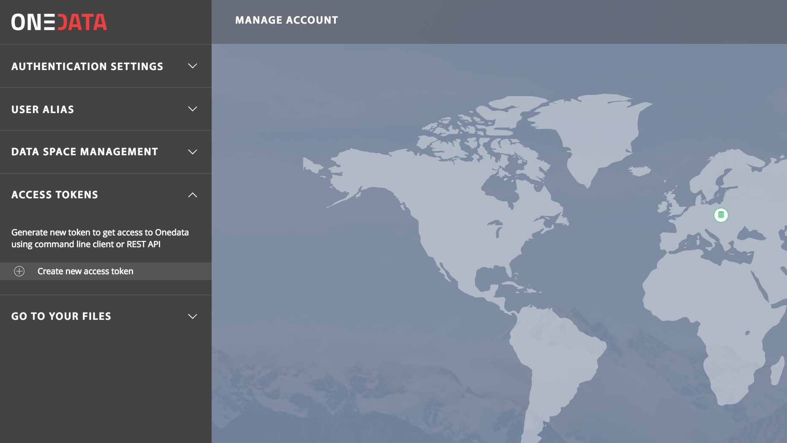

# Using Onedata REST API from command line

<!-- toc -->

## Overview
This tutorial section presents how to manage Onedata platform and access user
data solely from command line, using Onedata's REST API's as well as
*oneclient* command line tool for mounting virtual Onedata filesystem on the
local machine.

## Prerequisites
This tutorial is based on a Docker image with a preconfigured Zsh environment
for accessing Onedata services, including Onedata command line clients,
CDMI client and [jq](https://stedolan.github.io/jq/) tool for parsing and
formatting JSON. To start this environment simply execute:

```bash
docker run -it onedata/rest-cli
```

Before proceeding first set the following environment variables:
```bash
export ONEZONE_HOST=https://<ONEZONE IP ADDRESS>
export ONEZONE_API_KEY=Xdasd64asdASD54ASDAKk-ADSa6q
```

The Docker provides 3 command line utilities for each of the main Onedata
services:

* `onezone-rest-cli` - for accessing Onezone REST API
* `oneprovider-rest-cli` - for accessing Oneprovider REST API
* `onepanel-rest-cli` - for accessing Onepanel REST API

> If you're connecting to a Onedata service which does not have a trusted
> certificate remember to add `-k` option to each call before the operation name.

By default Docker is configured for the latest Onedata release, but it also
contains clients for all previous releases, to switch to a specific release
(for instance 18.02.0-rc11) use:

```bash
onedata-select-version 18.02.0-rc11
```

## Authentication

Onedata authentication is based on authentication tokens. In order to proceed
with the next steps it is necessary to generate an access token for an active
user account.

The access token can be generated either in the Web GUI, in the
**Access Tokens** menu:



or using Onedata REST API (if basic authentication is available for the user
account):

```bash
export ONEZONE_API_KEY=`onezone-rest-cli listClientTokens | jq -r '.tokens[0]'`
```

Check if the token has been generated successfully. From now on we can use it
for authenticating all requests to Onedata.
```bash
echo $ONEZONE_API_KEY

MDAxNWxvY2F00aW9uIG9uZXpvbmUKMDAzYmlkZW500aWZpZXIgd00tmNldJSWxHUVZ5X00hQQlh1S00800YjBnbkVZU3NFdERUc3dpXy1SLUkwWQowMDFhY2lkIHRpbWUgPCAxNTE4MTEzNjM2CjAwMmZzaWduYXR1cmUgOuuiePjiQEyoOgYFcr6tdVnjDeY187YsFD1A5Hdh6jIK
```


## Account management
First of all, we can retrieve basic user account information using REST API:
```bash
onezone-rest-cli getCurrentUser | jq '.'

{
   "name" : "admin",
   "alias" : "admin",
   "linkedAccounts" : [],
   "userId" : "njOzyvXybAYvki10HXRCeJd_IlLHS4XEklgghmJjDpo",
   "emails" : []
}
```

and modify some of the properties, for instance user alias to `administrator`:
```bash
onezone-rest-cli modifyCurrentUser alias==administrator
```

## Space management
All space related functionality can be accessed through the REST API.

To see the list of all user spaces call:
```bash
onezone-rest-cli listUserSpaces | jq '.'

{
   "default" : "Xnp1JVpWfL8_stHJgct76AFALjRsI0W3rNs1nfMwqnY",
   "spaces" : [
      "PZnzc7vlM8g62ERNdRgahBhKTqXJDXIaJVvHojmxo6w",
      "SwWBElahXbbwIxIoOmS8LGOcJa-ueqFTo5pee_6TmpI",
      "Xnp1JVpWfL8_stHJgct76AFALjRsI0W3rNs1nfMwqnY"
   ]
}
```
which returns the list of GUIDs of spaces to which the user belongs and the
ID of the default space.

In order to get more information about a specific space use:
```bash
onezone-rest-cli getUserSpace sid=Xnp1JVpWfL8_stHJgct76AFALjRsI0W3rNs1nfMwqnY | jq '.'

{
   "providersSupports" : {
      "hxfMCWmquqAIjG1GeG2eZY8qvs8iRIn09HzjCJilnSE" : 5368709120
   },
   "shares" : [],
   "spaceId" : "Xnp1JVpWfL8_stHJgct76AFALjRsI0W3rNs1nfMwqnY",
   "name" : "Test"
}
```
which returns basic space properties.

Now we can simply change these properties, for instance the space's name:

```bash
onezone-rest-cli modifySpace id=Xnp1JVpWfL8_stHJgct76AFALjRsI0W3rNs1nfMwqnY name==CLITest
```
> Please note that `name` attribute is provided using a double equal sign. This is
> because `name` is in fact provided as a JSON body parameter, and the onedata
> Bash clients allow to provide such attributes (first level JSON only) using
> `==` for string attributes and `:=` for numerical attributes. To see how it
> actually works, add `--dry-run` parameter at the end of the command.

Furthermore, we can also create a new space, called `Personal files`. The newly
create space GUID is returned in the `Location:` header (please note the `-vvv`
argument which prints out the headers):
```bash
onezone-rest-cli -vvv createSpace name=="Personal files"

...
location: /spaces/gTE6vt5h7bVSeXE1UDt9m6xAurkBwn58Od5YpaHbL_o
...
```

Now we can check the properties of the space, in particular see if there are any
providers supporting the space:

```bash
onezone-rest-cli getUserSpace sid=gTE6vt5h7bVSeXE1UDt9m6xAurkBwn58Od5YpaHbL_o | jq '.providers | length'

0
```

Since by default all newly created spaces in Onedata have no storage support, a
storage support must be requested from some provider. The request token can be
generated using this command:

```bash
onezone-rest-cli createSpaceSupportToken id=gTE6vt5h7bVSeXE1UDt9m6xAurkBwn58Od5YpaHbL_o | jq -r '.token'

MDAxNmxvY2F00aW9uIHJlZ2lzdHJ5CjAwM2JpZGVudGlmaWVyIDZhMnhxVEhxcHdEcXpMSWMzVk500TldLb3hGeWY4Rkw00dFd6TlJwTHZYbEUKMDAyOGNpZCB00b2tlblR5cGUgPSBzcGFjZV9zdXBwb3J00X3Rva2VuCjAwMmZzaWduYXR1cmUgdFo02YRFqN7Xr201P6h01rgIZsT2yO02qQTgZqs00itL9AFwK
```

This token has to be sent to the preferred storage provider who will grant the
storage support.

## Data management
Onedata provides several means for accessing the data including Web GUI
(not covered here), REST and CDMI API's as well as direct POSIX access via
*oneclient* tool.

First, let's select a space on which we'll be working on. For that we need to
extract the ID of the space "Personal files":
```bash
onezone-rest-cli listUserSpaces | jq -r '.spaces | join("\n")' \
| xargs -n1 -I{} sh -c 'onezone-rest-cli getUserSpace sid={} | jq -r "if .name == \"Personal files\" then .spaceId else empty end"'

gTE6vt5h7bVSeXE1UDt9m6xAurkBwn58Od5YpaHbL_o
```

now we can export it as ONEDATA_SPACE environment variable:
```bash
export ONEDATA_SPACE=gTE6vt5h7bVSeXE1UDt9m6xAurkBwn58Od5YpaHbL_o
```

Since this is a new space, it is empty. We can mount this space directly to the
local filesystem, but first we need to find the address of the provider that supports
our space:
```bash
onezone-rest-cli getUserSpace sid=$ONEDATA_SPACE | jq -r '.providers | keys[0]' \
| xargs -n1 -I{} sh -c 'onezone-rest-cli getProviderDetails pid={} | jq -r ".domain"'

example-provider.tk
```

Now we can setup environment variables for accessing the Oneprovider and actual
data using Oneclient. Oneclient can be also started in a separate session using
Docker in a separate terminal:

```bash
docker run -it --privileged --entrypoint=/bin/bash onedata/oneclient:18.02.1
```

```bash
export PROVIDER_HOSTNAME=192.168.1.4
export ONEPROVIDER_HOST=https://$PROVIDER_HOSTNAME
export ONEPROVIDER_API_KEY=$ONEZONE_API_KEY

mkdir -p ~/mnt/onedata
oneclient -H $PROVIDER_HOSTNAME -t $ONEPROVIDER_API_KEY ~/mnt/onedata
ls -la ~/mnt/onedata

total 0
drwxr-xr-x  1 root    wheel    0 Feb  2 10:07 .
drwxr-xr-x  4 bartek  staff  136 Jan 24 17:30 ..
drwxrwxr-x  1 root    wheel    0 Feb  5 16:24 CLITest
drwxrwxr-x  1 root    wheel    0 Feb  6 01:58 Personal files
drwxrwxr-x  1 root    wheel    0 Feb  2 16:26 Test1
drwxrwxr-x  1 root    wheel    0 Feb  2 16:26 Test2
```

Now we can create some test files in the `Personal files` space:
```bash
echo "FILE1" > ~/mnt/onedata/Personal\ files/file1.txt
echo "FILE2" > ~/mnt/onedata/Personal\ files/file2.txt
echo "FILE3" > ~/mnt/onedata/Personal\ files/file3.txt
```


## Metadata management

Onedata supports 3 levels of metadata (for more details see [here](../using_onedata/metadata.md)):
* Filesystem attributes
* Extended attributes
* User metadata

This section will present how to access and modify each of these metadata types:

### Filesystem attributes
Basic filesystem attributes are mostly read only properties defined dynamically
by the data management system.

For instance to get information about the file size, we can execute:
```bash
oneprovider-rest-cli getFileAttributes path="Personal files/file1.txt" attribute=size | jq '.'

{
   "size" : 6
}
```

### Extended attributes
Extended attributes provide means for adding simple key-value attributes to
objects in the filesystem.

Extended attributes can be set using the REST API, please note that we
have to specify the body format here explictly:

```bash
oneprovider-rest-cli -ct json setFileAttribute path="Personal files/file1.txt" license==CC-0 extended=true
```

and than we can check the extended attributes using:

```bash
oneprovider-rest-cli getFileAttributes path="Personal files/file1.txt" extended=true | jq '.'

{
   "license" : "CC-0"
}
```

### User metadata
The last type of metadata, allows users to store any JSON or RDF documents.
Currently, JSON metadata backend supports complete querying and indexes, while
RDF only allows storage of valie RDF documents attached to data objects.

#### JSON
In order to add custom JSON document to a file, simply provide on an input pipe
to the `oneprovider-rest-cli setFileMetadata` command (remember the `-` at the
end to indicate that the body should be read from a pipe):

```bash
echo '{"key1": "value1", "key2": 2, "key3": ["a1", "a2", "a3"]}' | \
oneprovider-rest-cli setFileMetadata -ct json path="Personal files/file1.txt" -
```

Now in order to get the second element of the `key3` array:
```bash
oneprovider-rest-cli -g -ac json getFileMetadata path="Personal files/file1.txt" filter_type=keypath filter="key3.[2]"

"a3"
```
> Please note that an additional option `-g` had to be passed to the command
> in order to disable cURL URL globbing and enable passing square brackets
> to specify array index in JSON metadata.

In a similar vein, we can modify only a selected key in the JSON metadata document:
```bash
echo 5 | oneprovider-rest-cli -ct json setFileMetadata path="Personal files/file1.txt" filter_type=keypath filter=key2 -
```

For larger data sets, it might be necessary to create an index, which enables
efficient data discovery based on JSON metadata.

An index can be created using REST API, but first we have to prepare an index
function in some text editor:

```bash
vi index1.js
```

and paste there the following code, which creates an index over the `key1`
attribute of the files' metadata:

```js
function(id, type, meta, ctx) {
    if (type === 'custom_metadata') {
        if(meta['onedata_json'] && meta['onedata_json']['key1']) {
	        return [meta['onedata_json']['key1'], id];
	}
    }
}
```

Now to add this index to the space, use the following command:

```bash
cat index1.js | oneprovider-rest-cli -ct js createSpaceIndex index_name=MyIndex1 sid=$ONEDATA_SPACE -
```

We can now list indexes using the following command:

```bash
oneprovider-rest-cli getSpaceIndexes space_id=$ONEDATA_SPACE | jq '.'

{
  "indexes": [
      "MyIndex1"
  ]
}
```

Now the files which match the specified index can be queried using the
following command:
```bash
oneprovider-rest-cli querySpaceIndex sid=$ONEDATA_SPACE index_name=MyIndex1| jq '.'

[
  {
      "value": "000000000046288867756964233964383034643730316136636530353837626433386336323062343039653533233733363938653539633432313466623662363066356330313635386232663362",
      "key": "value1",
      "id": "3d4a1da785bdda1fd205aae8fcc092ce"
  }
]
```

The returned JSON objects describe the files which match match the index. The
attribute "value" contains the given file identifier.

> The format and length of the file identifiers is compatible with CDMI standard.

Currently the path to the file can be resolved only using CDMI API:

```bash
curl -H "X-Auth-Token: $ONEPROVIDER_API_KEY" -H "X-CDMI-Specification-Version: 1.1.1" \
$ONEPROVIDER_HOST/cdmi/cdmi_objectid/000000000046288867756964233964383034643730316136636530353837626433386336323062343039653533233733363938653539633432313466623662363066356330313635386232663362 \
| jq '.parentURI+.objectName'

"/Personal files/file1.txt"
```

#### RDF
Custom RDF documents can also be attached to any data object:
```bash
curl -Ssk https://www.w3.org/2000/10/rdf-tests/Miscellaneous/animals.rdf \
| oneprovider-rest-cli -ct rdf setFileMetadata path="Personal files/file1.txt" -
```


and then retrieved:
```bash
oneprovider-rest-cli -ac rdf getFileMetadata path="Personal files/file1.txt" | xmllint --format -

<?xmls version="1.0"?>

<RDF:RDF xmlns:RDF="http://www.w3.org/1999/02/22-rdf-syntax-ns#"
   xmlns:ANIMALS="http://www.some-ficticious-zoo.com/rdf#">

<RDF:Seq about="urn:animals:data">
  <RDF:li>
    <RDF:Description about="urn:animals:lion">
      <ANIMALS:name>Lion</ANIMALS:name>
      <ANIMALS:species>Panthera leo</ANIMALS:species>
      <ANIMALS:class>Mammal</ANIMALS:class>
    </RDF:Description>
  </RDF:li>
  <RDF:li>
    <RDF:Description about="urn:animals:tarantula">
      <ANIMALS:name>Tarantula</ANIMALS:name>
      <ANIMALS:species>Avicularia avicularia</ANIMALS:species>
      <ANIMALS:class>Arachnid</ANIMALS:class>
    </RDF:Description>
  </RDF:li>
  <RDF:li>
    <RDF:Description about="urn:animals:hippopotamus">
      <ANIMALS:name>Hippopotamus</ANIMALS:name>
      <ANIMALS:species>Hippopotamus amphibius</ANIMALS:species>
      <ANIMALS:class>Mammal</ANIMALS:class>
    </RDF:Description>
  </RDF:li>
</RDF:Seq>
</RDF:RDF>
```
