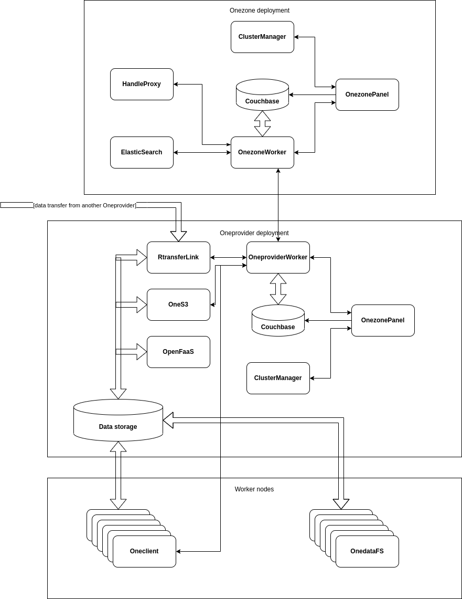

# Architecture

This section provides high-level view of Onedata platform from the administrators
perspective, including brief overview of each of the components.

## Overview

The following diagram shows an example Onedata deployment including all major
functional components.

## Service overview

### Onezone
Onezone is a main component of Onedata enabling federated authentication and
authorization.
Onezone acts as an intermediary in a network of cooperating Oneproviders. It
stores metadata of system entites, i.e. users, groups, spaces and providers,
manages relations between them and informs all oneproviders about any changes
that are in their region of interest.
As such, Onezone does not handle any actual data transfers, and
does not need high-performance connectivity to any storage resources.

#### OnezoneWorker

OnezoneWorker, serves as a worker process of Onezone service. The main
objective of OnezoneWorker is to provide logic for coordinating the Oneprovider
instances. Onezone service requires at least one OnezoneWorker instance. Adding
more nodes scales the cluster allowing for processing more requests in
parallel. OnezoneWorker instances are coordinated by **ClusterManager**
process, which should be deployed at least in one instance per entire cluster.
Adding cluster-manager nodes increases fault tolerance of the Onezone service.

It can be found in the process tree under the name `oz_worker`.

#### OnezonePanel

The main goal of Onepanel is to enable configuration of Onedata cluster
components in a distributed environment. It provides a web GUI, which allows
for configuration and management of ClusterManager, OnezoneWorker and Couchbase
database components.

It can be found in the process tree under the name `oz_panel`.

#### ClusterManager

ClusterManager is a background service, which is responsible for proper
operation of other Onezone processes on a given host, support load-balancing of
internal requests and coordination of communication between processes.

ClusterManager can be found in the process tree under the name `cluster_manager`.

#### Couchbase

[Couchbase](https://www.couchbase.com) is a highly scalable JSON database,
which can be scaled to several nodes. This component is nessary for running
Onezone service, and it is responsible for storing all information about user
spaces, registered providers, etc. When deploying Onedata using Docker
container or Kubernetes, Couchbase is started automatically.

#### Elasticsearch

Deployment of [Elasticsearch](https://www.elastic.co/elasticsearch/) along with
Onezone, enables a Onedata feature called `Harvesters`, which allows performing
data and metadata queries on user spaces.
Elasticsearch is used to transparently indexes all data and metadata in a
, which can then be queried using Onedata REST API.

#### Handle Proxy

Onedata supports Open Access identifier registration services based on Handle
system such as [DOI](https://www.doi.org/). Due to the fact that different identifier minting services
provider different API's, Onezone administrator has to deploy and register a
handle proxy service, which implements a bridge between Onezone handle API and
actual handle minting service, such as [DataCite](https://doi.datacite.org/).

An example implementation for B2HANDLE is available
[here](https://github.com/onedata/hps-b2handle).

### Oneprovider
The main objective of Oneprovider service as a whole, is to unify access to
files stored at heterogeneous data storage systems that belong to
geographically distributed organizations.

#### OneproviderWorker

OneproviderWorker provides a self-scalable cluster, which manages the Onedata
system in a single data centre, i.e. it stores meta-data about actual users'
data from the data centre, decides how to distribute users' files among
available storage systems, and executes data management rules, which can be
defined by administrators or users.

OneproviderWorker requires direct access to storage resources it manages, so
it has to be deployed accordingly.

It can be found in the process tree under the name `op_worker`.

#### OneproviderPanel

The main goal of Onepanel is to enable configuration of Onedata cluster
components in a distributed environment. It provides a web GUI, which allows
for configuration and management of ClusterManager, OneproviderWorker and Couchbase
database components as well as adding storage resources to the Oneprovider cluster
and supporting user spaces.

It can be found in the process tree under the name `op_panel`.

#### ClusterManager

ClusterManager is a background service, which is responsible for proper
operation of other Oneprovider processes on a given host, support load-balancing of
internal requests and coordination of communication between processes.

ClusterManager can be found in the process tree under the name `cluster_manager`.

#### RTransferLink

RTransferLink is a high-performance data transfer service, managed directly by
OneproviderWorker. It is responsible for handling all data transfers between
Oneprovider services, including scheduled transfers, QoS transfers as well as
on-the-fly transfers triggered by data access requests.

RTransferLink is deployed and managed automatically, it can be found in the
process tree under the name `link`.

#### Couchbase

[Couchbase](https://www.couchbase.com) is a highly scalable JSON database,
which can be scaled to several nodes. This component is nessary for running
Oneprovider service, and it is responsible for storing all filesystem related metadata.
It has to be ensured that sufficient disk space is available for this database,
especially in systems where large numbers of files and directories are added.
When deploying Onedata using Docker container or Kubernetes, Couchbase is
started automatically.

#### OpenFaaS

[OpenFaaS](https://www.openfaas.com/) is a serverless Docker-based function
management and execution service, which enables seamless integration of custom
data or metadata processing logic. In Onedata, OpenFaaS is used to execute user defined
workflows over their data spaces. Each function can run on top of a
mounted virtual POSIX filesystem provisioned by Oneclient, using nativ POSIX-base API
or use any of the other data access API's provided by Onedata including REST
API, CDMI or S3.

### Oneclient

Oneclient is a command line Onedata client. It provides a POSIX interface to
user's files in Onedata system base one
[FUSE](https://github.com/libfuse/libfuse).

Oneclient can be deployed by the users on their local resources, as well as
administrators for instance on HPC access or worker nodes.

For optimal performance, Oneclient should have direct access to storage
resources (for instance in case of Ceph network access to Ceph Monitor or in
case of POSIX-like storages they need to be mounted on the Oneclient nodes).
However if not possible, Oneclient can also work in proxy mode, in which case
all data transfers will go via Oneprovider.

### OnedataFS

OnedataFS is a Python library, which provides high-performance access to
Onedata virtual filesystem directly from Python. OnedataFS implements the
[PyFilesystem2](https://github.com/PyFilesystem/pyfilesystem2) API.

> OnedataFS can be preinstalled on user worker nodes using distribution packages,
> however it cannot be installed using `pip` due to native library dependencies.

### OneS3

OneS3 is a scalable S3 implementation based on Oneclient, which exposes storage
resources managed by Oneprovider via AWS S3 interface.

OneS3 requires direct access to the storage resources, thus it should be preferably
deployed in the same network as Oneprovider, however it can be scaled to any number
of nodes, in which case it will handle data transfers, while Oneprovider instances
will only handle metadata management.
