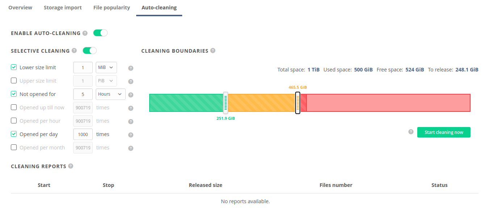

# Auto-cleaning
<!-- This file is referenced at least one time as "auto-cleaning.md" -->

As a prerequisite for understanding this chapter, we advise to familiarize with 
the mechanism of [*file popularity*](file-popularity.md).

The purpose of the *auto-cleaning* mechanism is to automatically maintain storage usage at a certain 
level and ensure that there is enough space for new replicas when performing continuous computations.
The mechanism uses the statistics collected by the 
[*file popularity*](file-popularity.md) to determine
the least popular file replicas and evict them.
The process is safe - only redundant replicas (duplicated on remote providers) are evicted.
Eviction of replicas is coordinated among providers using a custom algorithm.
It ensures that there is no risk of data loss, even in case of simultaneous requests for deletion of replicas of 
the same file.

Each auto-cleaning run produces a report, which shows the number of removed replicas and the amount of released 
storage space.

## Basic setup

The mechanism can be enabled in the space configuration tab in Oneprovider panel.

> *NOTE:* 
>The [*file popularity*](file-popularity.md) mechanism 
must be enabled to turn *auto-cleaning* on. 
> Disabling [*file popularity*](file-popularity.md) disables *auto-cleaning* as well.
 
The user interface allows specifying **low** and **high** thresholds,
corresponding to the amount of data stored on the local storage supporting given space:
* **high threshold** - when exceeded, an auto-cleaning run is triggered to evict redundant replicas. 
* **low threshold** - when reached, the current auto-cleaning run is stopped.  

The thresholds can be adjusted in the 
`Spaces -> "Space Name" -> Auto-cleaning` tab, in the Spaces menu of Oneprovider panel GUI (as shown below)
 or using [REST API](#rest-api).

## Selective rules

It is possible to filter the list of files obtained from the 
[*file popularity*](file-popularity.md) by enabling *selective rules*.

There are six rules for which ranges might be provided:
* `maxOpenCount` - Files that have been opened not more than `maxOpenCount` times may be cleaned.
  The default value is `9007199254740991 (2^53-1)`.
* `minHoursSinceLastOpen` - Files that have been closed at least this many hours ago may be cleaned.
  The default value is `0`.
* `minFileSize` - Only files which size (in bytes) is not less than given value may be cleaned.
  The default value is `1`.
* `maxFileSize` - Only files which size (in bytes) is not greater than given value may be cleaned.
  The default value is `1125899906842624 (1 PiB)`.
* `maxHourlyMovingAverage` - Files that have moving average of open operations
  count per hour not greater than given value may be cleaned. The average is calculated
  in 24 hours window. The default value is `9007199254740991 (2^53-1)`.
* `maxDailyMovingAverage` - Files that have moving average of open operations
  count per day not greater than given value may be cleaned. The average is calculated in 
  30 days window. The default value is `9007199254740991 (2^53-1)`.
* `maxMonthlyMovingAverage` - Files that have moving average of open operations
  count per month not greater than given value may be cleaned. The average is calculated
  in 12 months window. The default value is `9007199254740991 (2^53-1)`.

Disabled rules are ignored. A file replica must satisfy all enabled rules to be evicted. 

## Starting run on demand

It is possible to forcefully start an auto-cleaning run by pressing the green button
placed below space occupancy bar. The run can be forcefully triggered even
if the **high threshold** is not exceeded.

## Stopping run on demand

It is possible to forcefully stop an auto-cleaning run by pressing the red button
placed below space occupancy bar.

## REST API

All operations related to auto-cleaning can be performed using the REST API.
Please refer to the linked API documentation for detailed information and examples.

| Request                                 | Link to API |
|---------------------------------------- |-------------|
| Get auto-cleaning configuration         | [API](https://onedata.org/#/home/api/latest/onepanel?anchor=operation/get_space_auto_cleaning_configuration)|        
| Update auto-cleaning configuration      | [API](https://onedata.org/#/home/api/latest/onepanel?anchor=operation/configure_space_auto_cleaning)|
| Get list of auto-cleaning runs' reports | [API](https://onedata.org/#/home/api/latest/onepanel?anchor=operation/get_provider_space_auto_cleaning_reports)|
| Get the report of auto-cleaning run     | [API](https://onedata.org/#/home/api/latest/onepanel?anchor=operation/get_provider_space_auto_cleaning_report)|
| Trigger auto-cleaning run               | [API](https://onedata.org/#/home/api/latest/onepanel?anchor=operation/trigger_auto_cleaning)|
| Get current auto-cleaning status        | [API](https://onedata.org/#/home/api/latest/onepanel?anchor=operation/get_provider_space_auto_cleaning_status)|