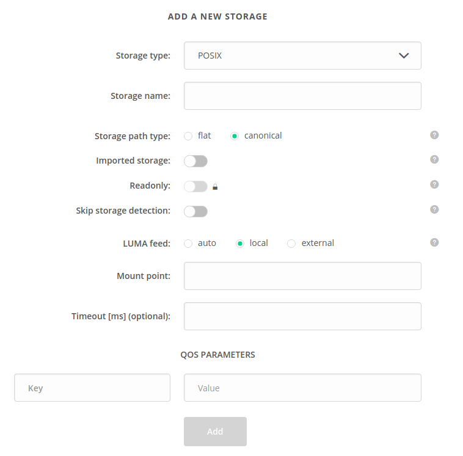

# Quality of Service

[toc]

Quality of Service (QoS) is used to manage file replica distribution and redundancy
between providers supporting a space.
FIXME - add links to data distribution, provider, space

This documentation concerns the proper configuration of the Oneprovider service
so that QoS rules can be effectively utilized by the users. For details on how 
QoS works and how to use it, consult the 
[counterpart documentation for end users](../../../user-guide/qos.md#Basics).

## QoS parameters
QoS management is based on QoS parameters that are assigned to storage backends 
by Oneprovider admins. All parameters are in the form of `key=value`.

Each storage has implicit parameters representing its ID and the ID of its Oneprovider:
`storageId=$STORAGE_ID` and `providerId=$PROVIDER_ID`.

You can modify the QoS parameters using the Web GUI (Administration Panel) or REST API.
FIXME - add links to Administration Panel and REST API


::: tip NOTE
The `storageId` and `providerId` parameters cannot be removed or modified.
:::

## Web GUI guide

QoS parameters can be set during storage creation:
  
FIXME create a full-screen shot to include more context ^
FIXME add 2-3 sensible parameters before creating the screenshot

To modify the parameters, use the **Modify** action for the desired row in the **Storage backends** view:

FIXME screenshot with modification ^


## Using REST API

FIXME adjust to guidelines

Below are some examples for Oneprovider administrators concerning the management of storage
QoS parameters with the use of [REST API](https://onedata.org/#/home/api/stable/onepanel?anchor=operation/get_storage_details).

Below examples assume that the following environment variables are exported:

```bash
PANEL_API="https://<oneprovider-domain>/api/v3/onepanel"
# or
PANEL_API="https://<oneprovider-domain>:9443/api/v3/onepanel"  # if you have access to the onepanel's emergency interface
AUTH_HEADER="x-auth-token: <your-access-token>"
CT="content-type: application/json"
```

#### Listing QoS parameters

In below example `$STORAGE_ID` is the ID of your storage.

```bash
curl -H "${AUTH_HEADER}" -X GET {$PANEL_API}/provider/storages/$STORAGE_ID
```

```bash
{
    ...
    "qosParameters": {
      "storageId": "b1b9174674b951305831d55b42c6ae22ch975f",
      "providerId": "7b052ee78cb4fa0263d3bebeab1da7f3ch255b",
      "geo": "PL",
      "type": "disk"
    }
    ...
}
```

#### Modifying QoS parameters

<!-- @TODO VFS-6429 Update example after storage modify endpoint is reworked -->

Adding new parameters, removing and modifying existing ones is done with the use of the
same REST endpoint. Submitted QoS parameters overwrite previous ones.
In below example (assuming that QoS parameters before modifications are as in previous
example) parameter `geo` is removed, value of parameter `type` is changed
and new parameter `new_key` is added.

```bash
curl -H "${AUTH_HEADER}" -H "${CT}" -X PATCH {$PANEL_API}/provider/storages/$STORAGE_ID -d '{
    "$STORAGE_NAME": {
        "type": "$STORAGE_TYPE",
        "qosParameters": {
            "type": "modified_type"
            "new_key": "new_value"
        }
    }
}'
```
