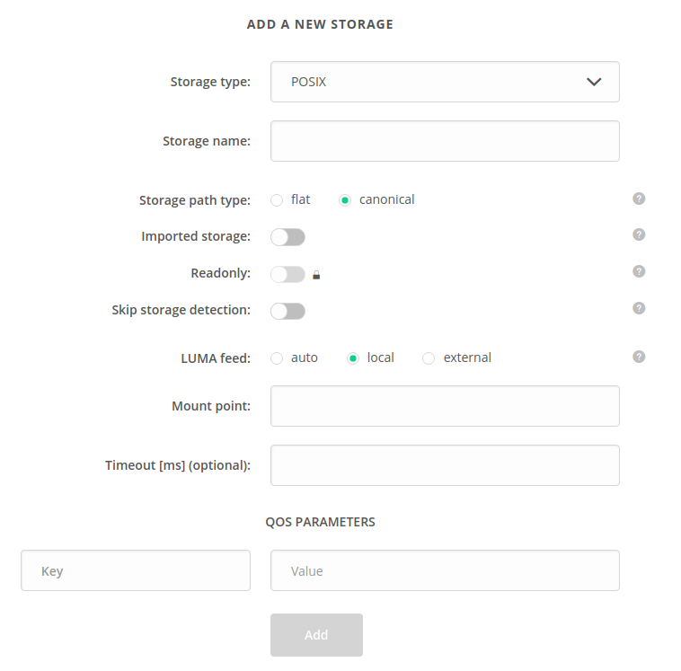

# Quality of Service
<!-- This file is referenced at least one time as "quality-of-service.md" -->

[[toc]]

Quality of Service functionality in Onedata is used to manage file replica distribution and redundancy
between supporting Oneproviders.

For explanation how this functionality works and how to use it please consult [paragraph in User Guide](../../../user-guide/quality-of-service.md#Basics).

## QoS parameters
QoS management is based on QoS parameters that are assigned to storages by Oneprovider admins.
All parameters are in form `key=value`.

Each storage has implicit parameters representing its id and id of its Oneprovider:
`storageId=$STORAGE_ID` and `providerId=$PROVIDER_ID`.

Adding new QoS parameters and removing existing ones can be done using the Modify Storage Details operation in Onepanel.

> **NOTE**: `storageId` and `providerId` parameters cannot be removed or modified.

## Using web GUI

QoS parameters for storage can be set in storage create/modify view in Onepanel:
  


## Using REST API

Below are some examples for Oneprovider administrators concerning management of storage
QoS parameters with the use of [REST API](https://onedata.org/#/home/api/stable/onepanel?anchor=operation/get_storage_details).

#### Listing QoS parameters

In below example `$STORAGE_ID` is the id of your storage.

```bash
curl -H "${AUTH_HEADER}" -X GET {$PANEL_API}/provider/storages/$STORAGE_ID
```

```bash
{
    ...
    "qosParameters": {
      "storageId": "b1b9174674b951305831d55b42c6ae22ch975f",
      "providerId": "7b052ee78cb4fa0263d3bebeab1da7f3ch255b",
      "geo": "PL",
      "type": "disk"
    }
    ...
}
```

#### Modifying QoS parameters

<!-- @TODO VFS-6429 Update example after storage modify endpoint is reworked -->

Adding new parameters, removing and modifying existing ones is done with the use of the
same REST endpoint. Submitted QoS parameters overwrite previous ones.
In below example (assuming that QoS parameters before modifications are as in previous
example) parameter `geo` is removed, value of parameter `type` is changed
and new parameter `new_key` is added.

```bash
curl -H "${AUTH_HEADER}" -H "${CT}" -X PATCH {$PANEL_API}/provider/storages/$STORAGE_ID -d '{
    "$STORAGE_NAME": {
        "type": "$STORAGE_TYPE",
        "qosParameters": {
            "type": "modified_type"
            "new_key": "new_value"
        }
    }
}'
```
