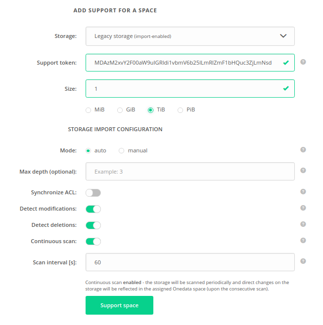
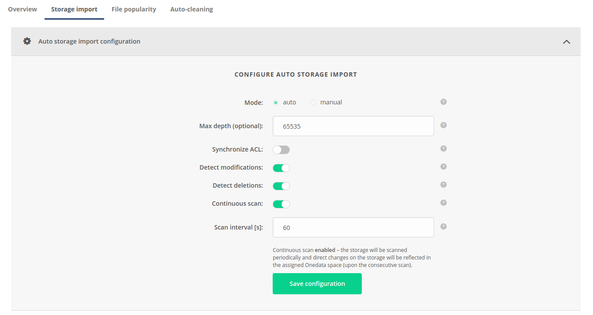
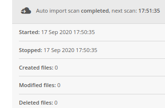
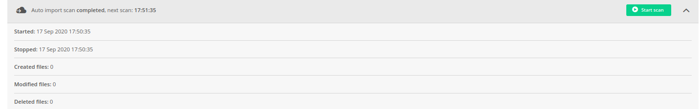
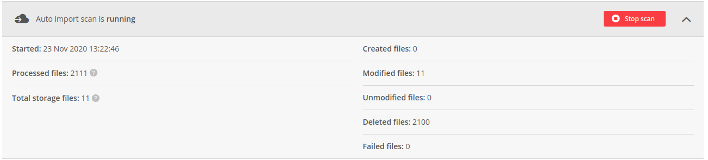
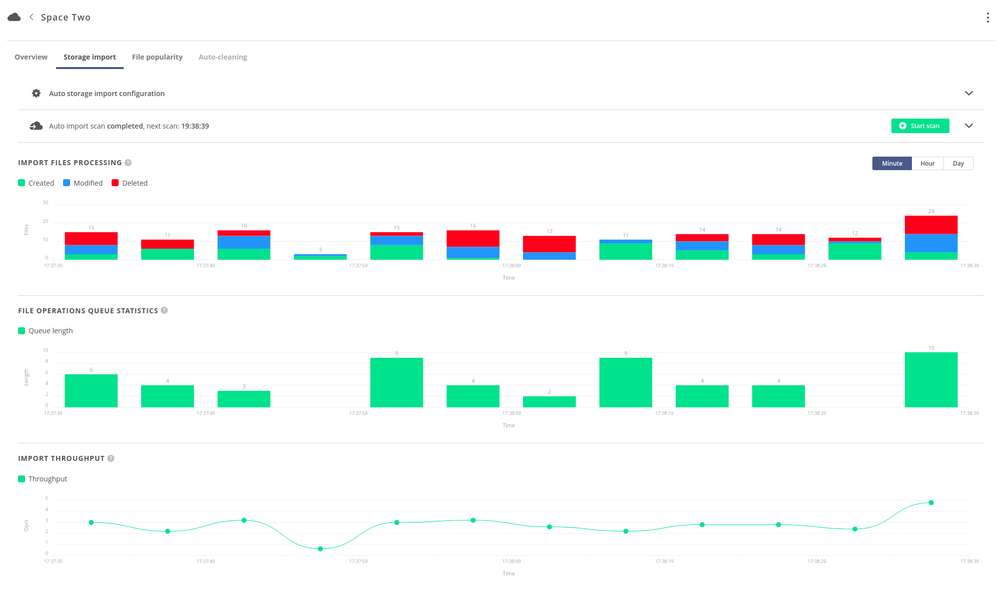

# Storage import
<!-- This header is referenced at least one time as "#storage-import" -->

`Storage import` is dedicated for importing files located on a storage by registering them in the space supported by
the storage. The file registration process **does not copy any data**, it simply creates the necessary metadata so that
the files pre-existing on the storage are reflected and accessible in the supported space. It is possible to configure
the storage to detect consecutive changes made directly on the storage after the initial import (during the space 
lifecycle) - using the continuous scan option, by manually triggering scans or by re-registering files. 

This functionality should be used in two setups:
* There is a legacy dataset located on the storage, which should be imported into a space.
* The data on storage is to be modified directly by third party applications, bypassing 
  the Oneprovider interfaces, and the changes should be reflected in the supported space.
  
> **NOTE**: In other setups, it is **not recommended** to enable `storage import`, as it will introduce unnecessary
overheads. Essentially, the regular storage setup in Onedata assumes that the supporting storage is initially empty and 
dedicated exclusively for being accessed by Oneprovider. This should be the preferred setup, except for the two 
above-mentioned cases.

`Storage import` can be enabled only if the space is supported with an [`Imported storage`](storages.md#imported-storage).

## Modes
There are 2 possible modes of `storage import`: [`manual`](#manual-storage-import) and [`auto`](#auto-storage-import).
The mode is chosen when the space is being supported with an [`Imported storage`](storages.md#imported-storage) 
as presented in the below picture.

> **NOTE**: `Storage import` mode cannot be changed during the space lifecycle.

### Manual storage import
<!-- This header is referenced at least one time as "#manual-storage-import" -->

In case of `manual` mode, the files must be [registered manually](../../../user-guide/file-registration.md) by the space users. 
Registration of directories is not supported.

This option is preferred when only a part of the dataset is to be imported, but required if the storage backend does 
not support [automatic import scans](#auto-storage-import).

#### Storage configuration for manual import:
<!-- This header is referenced at least one time as "#storage-configuration-for-manual-import" -->

Manual `storage import` is supported on the following storage backends:
 * `POSIX`
 * `GlusterFS`
 * `Null device`
 * `WebDAV`
 * `XRootD`
 * `HTTP`
 * `S3`
 * `Swift`
 * `Ceph RADOS`
 
> **NOTE**: The storage must have `canonical` [path type](storages.md#storage-path-type). 
Moreover, on object storages: S3, SWIFT and CEPHRADOS the `Block size` parameter **must be set to `0`!**

### Auto storage import
In case of `auto` mode, the storage will be automatically scanned and data will be imported from storage into the
assigned space.

#### Storage configuration for auto import:
<!-- This header is referenced at least one time as "#storage-configuration-for-auto-import" -->

Auto `storage import` is supported on the following storage backends:
 * `POSIX`
 * `GlusterFS`
 * `Null device`
 * `WebDAV`
 * `XRootD`
 * `S3`
 
> **NOTE**: The storage must have `canonical` [path type](storages.md#storage-path-type). 
Moreover, on S3 the `Block size` parameter **must be set to `0` !**

#### Configuration
The configuration of `auto storage import` can be set when supporting the space, as presented in the 
[previous picture](#modes). It can also be modified later in the
`Spaces -> "Space Name" -> Storage import > Auto storage import configuration` tab, as presented below:

The available configuration options are:
* `Max depth` - Maximum depth of filesystem tree that will be traversed during the scan. By default it is 65535.
* `Synchronize ACL` - Enables import of NFSv4 ACLs. Note that this option requires proper [mappings in LUMA DB](luma.md#imported-storages).
* `Detect modifications` - If disabled, the storage will be treated as immutable – changes of already imported files
  will not be detected. Relevant only if more than one scan is performed.
* `Detect deletions` - Flag determining that deletions of already imported files will be detected and reflected.
  Relevant only if more than one scan is performed.
* `Continuous scan` - Indicates if the data on the storage should be imported into the space periodically. Continuous
  import guarantees data integrity if direct modifications on the storage are to be made during the space lifecycle.
* `Scan interval` - Period between subsequent scans in seconds (counted from end of one scan till beginning of the following),
  relevant only if `Continuous scan` is enabled.

#### Last scan summary
Below the configuration tab, there is information about current or last finished scan: its status, start & stop times
and the number of created/modified/deleted files. If the `Continuous scan` is enabled, it also displays the estimated
time of the next scan:

#### Starting a scan on demand
It is possible to forcefully start a single scan of `auto storage import`, even if `Continuous scan` is disabled
(use the green button). The scan will be started with current configuration.

> **NOTE:** A new scan can be started only if there is no scan in progress for the space. 

#### Stopping a scan on demand
It is also possible to forcefully stop the current scan of `auto storage import` (use the red button). 

> **NOTE:** Stopping the scan is asynchronous - may take some time and does not guarantee instant effect.

#### Statistics
Progress of the `auto storage import` can be observed on three charts, as shown below. 
It is possible to change the time resolution of the charts in the upper right corner of the charts view.

