# Installation

<!-- @TODO VFS-7218 missing chapter -->

<!-- as needed: link to configuration, compatibility-reference [versions]) -->

This chapter describes the available **Oneprovider** installation methods. 
Note
that an existing **Onezone** instance should be available before deploying
**Oneprovider**. Oneprovider communicates with external services or clients
using ports 80, 443, 6665 and 9443. All of these ports need to be publicly
open except 9443 which is used for direct emergency access to the Oneprovider.


**Oneprovider** service can be deployed on multiple nodes for
high-availability purpose. If not mentioned otherwise it is assumed that 
**Oneprovider** will be installed on a single node.


## Docker-based
Docker-based instalation methods use our  [official Docker
images](https://hub.docker.com/r/onedata/oneprovider/)  to run **Oneprovider** on any [Linux OS
supporting
Docker](https://docs.docker.com/engine/installation/#supported-platforms).

The node on which **Oneprovider** will be deployed should fullfill the requirements  shown in the table below. 

| Requirement | Minimum | Optimal |
|----         |----     |----     |
| CPU | 4 vCPU | 16 vCPU |
| RAM | 16GB   | 64GB    |
| Local disk | SSD | SSD |
| Local storage space | 20GB + 8MB for each 1000 files | 40GB + 8MB for each 1000 files |
| OS | Any Docker compatible | Any Docker compatible |

### Manual installation using batch mode

#### Prerequisites
In order to ensure optimum performance of the **Oneprovider** service,
several low-level settings need to be tuned on the host machine. This applies
to both Docker based as well as package based installations, in particular to
nodes where Couchbase database instance are deployed.

After these settings are modified, the machine needs to be rebooted.

##### Increase maximum number of opened files
In order to install **Oneprovider** service on one of the supported operating systems, first make sure that the maximum limit of opened files is sufficient (preferably 63536, but below `/proc/sys/fs/file-max`). The limit can be checked using:

```sh
ulimit -n
1024
```

If necessary, increase the limit using:

```sh
$ sudo sh -c 'echo "* soft nofile 63536" >> /etc/security/limits.conf'
$ sudo sh -c 'echo "* hard nofile 63536" >> /etc/security/limits.conf'
```
>It might be also necessary to setup the limit in /etc/systemd/system.conf:
>```sh
>sudo sh -c 'echo DefaultLimitNOFILE=65536 >> /etc/systemd/system.conf'
>sudo systemctl daemon-reexec
>```

##### Swap preference settings
Make sure that the swap preference (i.e. *swappiness*) is set to `0` (or at most `1` - see [here](https://developer.couchbase.com/documentation/server/current/install/install-swap-space.html) for details):

```sh
$ cat /proc/sys/vm/swappiness
60
```
and if necessary decrease it using:
```sh
$ sudo sh -c 'echo "vm.swappiness=0" >> /etc/sysctl.d/50-swappiness.conf'
```

##### Disable Transparent Huge Pages feature
By default, many Linux machines have the Transparent Huge Pages feature enabled, which somehwat improves performance of machines running multiple application at once (e.g. desktop operation systems), however it deteriorates the performance of most database-heavy applications, such as **Oneprovider**.

These settings can be checked using the following commands (the output shown below presents the expected settings):

```
$ cat /sys/kernel/mm/transparent_hugepage/enabled
always madvise [never]

$ cat /sys/kernel/mm/transparent_hugepage/defrag
always madvise [never]
```

If any of the settings is different than the above, they should be changed permanently, which can be achieved for instance by creating a simple **systemd** unit file `/etc/systemd/system/disable-thp.service`:

```
[Unit]
Description=Disable Transparent Huge Pages

[Service]
Type=oneshot
ExecStart=/bin/sh -c "/bin/echo 'never' | /usr/bin/tee /sys/kernel/mm/transparent_hugepage/enabled"
ExecStart=/bin/sh -c "/bin/echo 'never' | /usr/bin/tee /sys/kernel/mm/transparent_hugepage/defrag"

[Install]
WantedBy=multi-user.target
```

and enabling it on system startup using:

```
$ sudo systemctl enable disable-thp.service
$ sudo systemctl start disable-thp.service
```

##### Node hostname
Make sure that the machine has a resolvable, domain-style hostname (it can be Fully Qualified Domain Name or just a proper entry in `/etc/hostname` and `/etc/hosts`) - for this tutorial it is set to `oneprovider-example.com`.

Following command examples assumes an environment variable `ONEPROVIDER_HOST` is available, for instance:

```sh
$ export ONEPROVIDER_HOST="oneprovider-example.com"
```

##### Python
Make sure that python 2.x is installed on the machine. For example:
```sh
$ python -V
Python 2.7.12
```

##### Docker and docker-compose
The Docker software need to be installed on the machine. It can be done by using the convenience script from get.docker.com:
```sh
$ curl -fsSL https://get.docker.com -o get-docker.sh
$ sudo sh get-docker.sh
$ sudo usermod -aG docker <your-user>
```
In order to install docker-compose run:
```sh
sudo curl -L "https://github.com/docker/compose/releases/download/1.27.4/docker-compose-$(uname -s)-$(uname -m)" -o /usr/local/bin/docker-compose
```


#### Customizing Oneprovider Docker Compose script

**Oneprovider** installation using Docker is very straightforward. This type of deployment uses docker-compose and requieres a docker-compose.yml file to be prepared.

In case of Docker based deployment all configuration information needed to install Oneprovider can be included directly in the Docker Compose script. This tutorial assumes that all **Oneprovider** configuration and log files will be stored in the folder `/opt/onedata/oneprovider` on the host machine, but you can use any directory to which Docker has access to. Make sure the partition where the `/opt` directory is mounted has at least 20GB of free space for logs and database files. For large systems with large numbers of files (>1M files) the space should be much bigger. Also consider setting up the `persistence` folder on a separate partition with backup.

Create the following directories:

```sh
$ sudo mkdir -p /opt/onedata/oneprovider/persistence
$ sudo mkdir -p /opt/onedata/oneprovider/certs
$ sudo mkdir -p /mnt/nfs
```
> /mnt/nfs should be exported via NFS to allow direct access from oneclient which increases performance.

Create the following Docker Compose file in `/opt/onedata/oneprovider/docker-compose.yml`:

```Yaml
version: '2.0'
services:
  node1.oneprovider.localhost:
    # Oneprovider Docker image version
    image: onedata/oneprovider:${RELEASE}
    # Hostname (in this case the hostname inside Docker network)
    hostname: node1.oneprovider.localhost
	# The IP of VM need to be placed below under extra_hosts, for example:
	# - "node1.oneprovider.localhost:10.20.30.5"
	extra_hosts:
	- "node1.oneprovider.localhost:place-the-VM-IP-here"
    # dns: 8.8.8.8 # Optional, in case Docker containers have no DNS access
    # Host network mode is preferred, but on some systems may not work (e.g. CentOS)
    network_mode: host
    # Friendly name of the Oneprovider Docker container
    container_name: oneprovider-1
    # Mapping of volumes to Oneprovider container
    volumes:
       - "/var/run/docker.sock:/var/run/docker.sock"
       # Oneprovider runtime files
       - "/opt/onedata/oneprovider/persistence:/volumes/persistence"
       # Data storage directories
       - "/mnt/nfs:/volumes/storage"
	   # Overlay configs
	   - "/opt/onedata/oneprovider/op-panel-overlay.config:/etc/op_panel/overlay.config"
       - "/opt/onedata/oneprovider/op-worker-overlay.config:/etc/op_worker/overlay.config"
       # Additional, trusted CA certificates (all files from this directory will be added)
       - "/opt/onedata/oneprovider/cacerts:/etc/op_worker/cacerts"
       # Uncoment lines below if you have disabled the built-in Let's Encrypt client
       ## SSL certificate
       #- "/opt/onedata/oneprovider/certs/cert.pem:/etc/op_panel/certs/web_cert.pem"
       ## SSL certificate key
       #- "/opt/onedata/oneprovider/certs/key.pem:/etc/op_panel/certs/web_key.pem"
       ## Certificate chain for the TLS certificate above
       #- "/opt/onedata/oneprovider/certs/cacert.pem:/etc/op_panel/certs/web_chain.pem"
	   # The whole host filesystem - for convenience
       - "/:/hostfs"

    # Expose the necessary ports from Oneprovider container to the host
    # This section can be commented when using host mode networking
    ports:
      - "80:80"
      - "443:443"
      - "6665:6665"
      - "9443:9443"
    environment:
      # Force Onepanel to read configuration from environment variable
      ONEPANEL_BATCH_MODE: "true"
      # Provide initial Oneprovider configuration for Onepanel in environment variable
	  # Emergency onepanel password
      ONEPANEL_EMERGENCY_PASSPHRASE: "Your_admin_password"
      ONEPROVIDER_CONFIG: |
        # Cluster configuration allows to specify distribution of Oneprovider
        # components over multiple nodes - here we deploy entire service on
        # a single node
        cluster:
          # Domain name of the provider within Docker network, will be appended
          # to all nodes specified below
          domainName: "oneprovider.localhost"
          autoDeploy: true
          nodes:
            n1:
              hostname: "node1"
          managers:
            mainNode: "n1"
            nodes:
              - "n1"
          workers:
            nodes:
              - "n1"
          databases:
            # Per node Couchbase cache size in MB for all buckets
            serverQuota: 4096
            # Per bucket Couchbase cache size in MB across the cluster
            bucketQuota: 1024
            nodes:
              - "n1"
          storages:
            # Add initial storage resource (optional - can be added later)
            # In this example NFS mounted at /mnt/nfs on the host, which is
            # mounted to /volumes/storage directory inside Docker container
            NFS:
              type: "posix"
              mountPoint: "/volumes/storage"
        oneprovider:
          geoLatitude: 50.0646501
          geoLongitude: 19.9449799
          register: true
          name: "ONEPROVIDER-DEMO"
          adminEmail: "admin@oneprovider-example.tk"
          # Use built-in Let's Encrypt client to obtain and renew certificates
          letsEncryptEnabled: true

	      # Automatically register this Oneprovider in Onezone with subdomain delegation
          subdomainDelegation: true
          subdomain: oneprovider-example # Domain will be "oneprovider-example.onezone-example.tk"
          # Alternatively:
          # Automatically register this Oneprovider in Onezone without subdomain delegation
          #subdomainDelegation: false
          #domain: "oneprovider-example.tk"

        onezone:
          # Address of the Onezone at which this Oneprovider will register
          domainName: "onezone-example.tk"
```
Modify it according to your needs. You should at least change onezone->domainName (not cluster->domainName), geo coordinates, emergency password, oneprovider->name, oneprovider->subdomain. It assumed in the above example that some posix type storage is available under the directory /mnt/nfs. 
To install the necessary Docker images on the machine run:

```sh
$ docker-compose -f /opt/onedata/oneprovider/docker-compose.yml pull
```

#### Setting up certificates
Since release 18.02.0-beta5, **Oneprovider** supports automatic certificate
management backed by Let's Encrypt. To use this option, it is only necessary
to enable this feature in **Oneprovider** Docker Compose configuration file
(see above) or via GUI.

If you prefer to obtain and install certificates for **Oneprovider** service
manually, modify the Docker Compose file to mount PEM files inside the
container using paths listed in [TLS certificate management](./configuration/web-certificate.html).

#### Security and recommended firewall settings
**Oneprovider** service requires several TCP ports (`80`,`443`,`6665`,`9443`) to be opened for proper operation. Some of these ports can be limited to internal network, in particular `9443` for **Onepanel** management interface.

Furthermore, on all nodes of **Oneprovider** deployment where Couchbase
instance is deployed, it exposes several additional ports. This means that
the Couchbase [security guidelines](https://developer.couchbase.com/documentation/server/4.6/security/security-intro.html)
should be also followed.

For more information about ports setup see [Firewal setup](./configuration/network-and-firewall.md)

#### Running Docker based installation using systemd
Docker based installation can be conveniently managed using a **systemd** service unit. Simply create a `/etc/systemd/system/oneprovider.service`:

```
[Unit]
Description=Oneprovider Service
After=docker.service
Requires=docker.service

[Service]
ExecStartPre=/usr/local/bin/docker-compose -f /opt/onedata/oneprovider/docker-compose.yml down
ExecStart=/usr/local/bin/docker-compose -f /opt/onedata/oneprovider/docker-compose.yml up --abort-on-container-exit --no-recreate
ExecStop=-/usr/local/bin/docker-compose -f /opt/onedata/oneprovider/docker-compose.yml down
Restart=always

[Install]
WantedBy=multi-user.target
```

Then the **Oneprovider** service can be managed using standard `systemctl` command:
```
# Enable Oneprovider service on machine startup
$ sudo systemctl enable oneprovider.service

# Start Oneprovider service
$ sudo systemctl start oneprovider.service
$ sudo systemctl status oneprovider.service
...
May 25 23:25:32 localhost docker-compose[13499]: oneprovider-1                  | Congratulations! oneprovider has been successfully started.

# Stopping Oneprovider service
$ sudo systemctl stop oneprovider.service

# Restarting Oneprovider service while keeping all persistent files
$ sudo systemctl restart oneprovider.service
```

If you need to start a fresh instance of Oneprovider use the following commands. Note that this will **remove all users data** managed by this Oneprovider instance:

```
$ sudo systemctl stop oneprovider.service
$ sudo rm -rf /opt/onedata/oneprovider/persistence/*
$ sudo systemctl start oneprovider.service
```
### Manual installation using Onepanel Web GUI

The prerequisites for this instalation method are the same as for the instalation using batch mode. With this method the onedata cluster is configured and deployed by using the Onepanel Web GUI.

#### Customizing Oneprovider Docker Compose script

Similarly to the prevous instalation method we need to create some directories and prepare a docker-compose.yml file.
Create the following directories:

```sh
$ sudo mkdir -p /opt/onedata/oneprovider/persistence
$ sudo mkdir -p /opt/onedata/oneprovider/certs
```

Create the following Docker Compose file in `/opt/onedata/oneprovider/docker-compose.yml`:

```Yaml
version: '2.0'
services:
  node1.oneprovider.localhost:
    # Oneprovider Docker image version
    image: onedata/oneprovider:${RELEASE}
    # Hostname (in this case the hostname inside Docker network)
    hostname: node1.oneprovider.localhost
	# The IP of VM need to be placed below under extra_hosts, for example:
	# - "node1.oneprovider.localhost:10.20.30.5"
	extra_hosts:
	- "node1.oneprovider.localhost:place-the-VM-IP-here"
    # dns: 8.8.8.8 # Optional, in case Docker containers have no DNS access
    # Host network mode is preferred, but on some systems may not work (e.g. CentOS)
    # To use bridge network
    network_mode: host
    privileged: true
    # Friendly name of the Oneprovider Docker container
    container_name: oneprovider-1
    # Mapping of volumes to Oneprovider container
    volumes:
       - "/var/run/docker.sock:/var/run/docker.sock"
       # Oneprovider runtime files
       - "/opt/onedata/oneprovider/dn-local-ceph-test/persistence:/volumes/persistence"
       # Additional, trusted CA certificates (all files from this directory will be added)
       #- "/opt/onedata/oneprovider/dn-local-ceph-test/cacerts:/etc/op_worker/cacerts"
	   # The whole host filesystem - for convenience
       - "/:/hostfs"
       # Uncoment lines below if you will not use the built-in Let's Encrypt client
       ## SSL certificate
       #- "/opt/onedata/oneprovider/certs/cert.pem:/etc/op_panel/certs/web_cert.pem"
       ## SSL certificate key
       #- "/opt/onedata/oneprovider/certs/key.pem:/etc/op_panel/certs/web_key.pem"
       ## Certificate chain for the TLS certificate above
       #- "/opt/onedata/oneprovider/certs/cacert.pem:/etc/op_panel/certs/web_chain.pem"
    # Expose the necessary ports from Oneprovider container to the host
    # This section can be commented when using host mode networking
    ports:
      - "80:80"
      - "443:443"
      - "6665:6665"
      - "9443:9443"
    environment:
      # Force Onepanel not to read configuration from environment variable
      ONEPANEL_BATCH_MODE: "false"
```
Prepare the systemd files for oneprovider service as shown in previos section and run oneprovider:

```
$ sudo systemctl enable oneprovider.service
$ sudo systemctl start oneprovider.service
```

#### Deploying the onedata cluster using the Web GUI

Start a web browser and open https://localhost:9443. If the browser is not started on the oneprovider VM replace localhost with the IP of the VM. You may need to accept the SSL security exception in your browser. The cluster deployment process is straighforward - just follow the instructions on the subsequent pages. You can hover the question marks for additional explanations. The following screenshots illustrate the process.

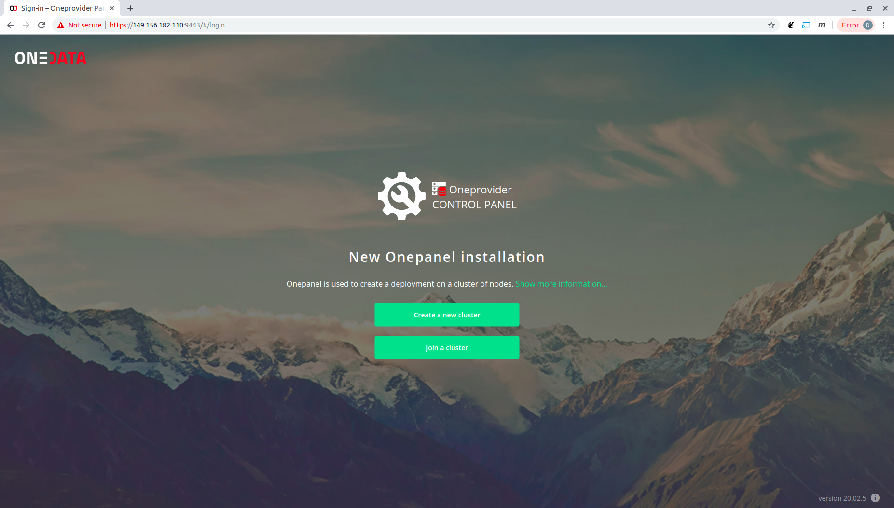

Click "Create a new cluster".

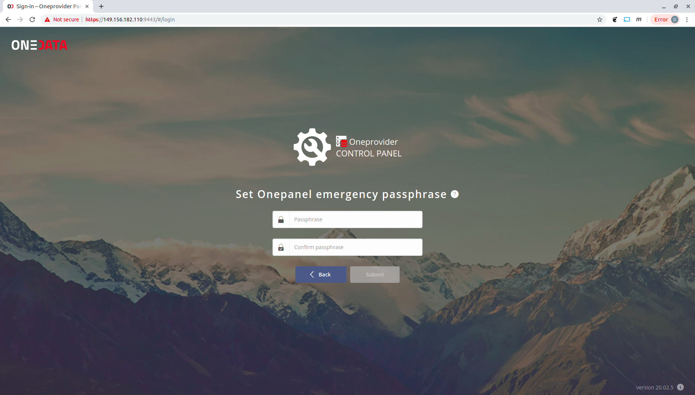

Enter the passphrase and click "Submit".

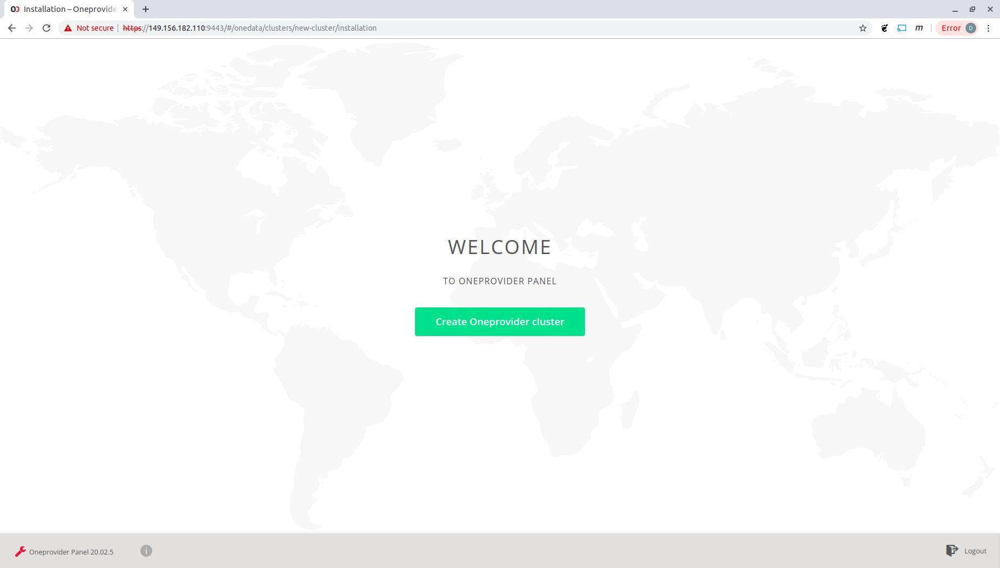

Click "Create Oneprovider cluster"

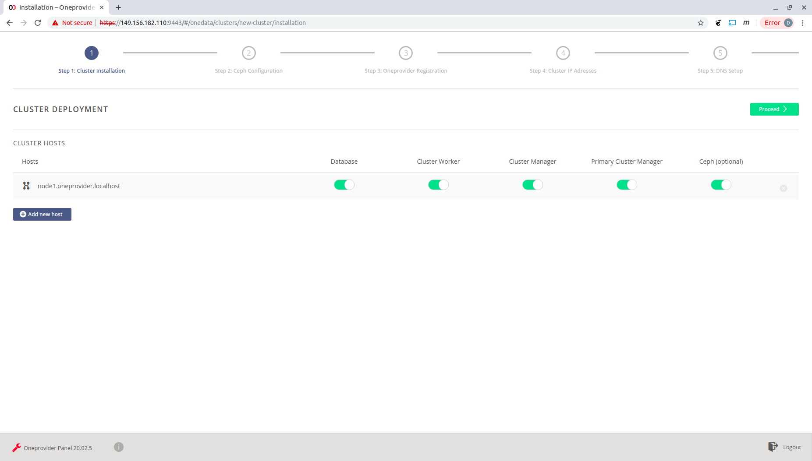

Choose the components to be installed on the given node. For a one-node deployment as in this example select all compoments. A local Ceph cluster will be also deployed. Click on the green "Proceed" button.

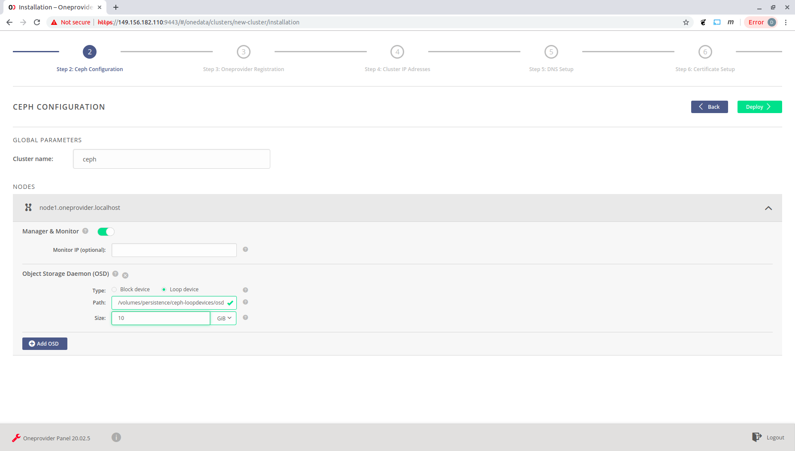

Configure the local Ceph components. At least one monitor, manager and OSD need to be configured. For the OSD you can choose between block device or loop device (in which case the data will go to a regular file). If choosing loopdevice make sure there is enough disk space otherwise the deployment will fail. For more information about local ceph configuation and further management go [here](configuration/ceph). For more details about the Ceph distributed storage system go to the [Ceph site](https://ceph.io). Click "Deploy" to continiue with the instalation.

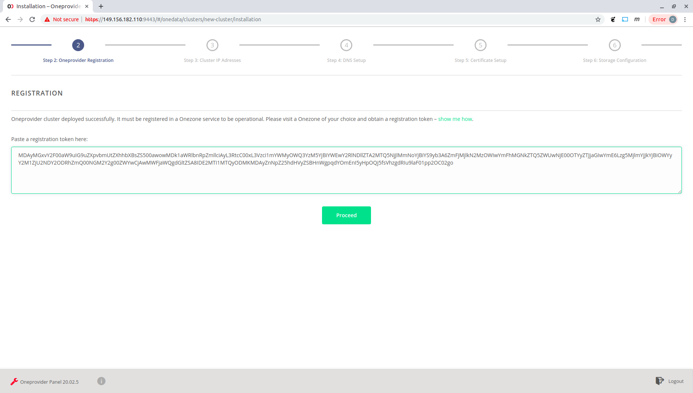

Register your oneprovider in a given onezone. Click "show me how" for instructions. Paste the obtained token and click "Proceed".

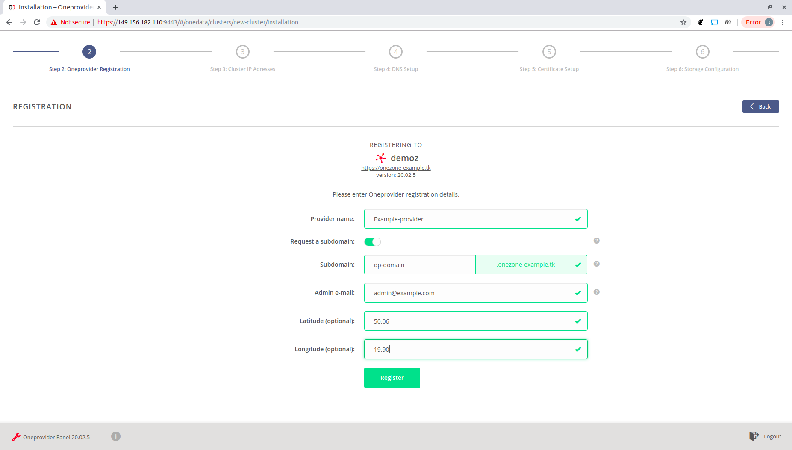

Fill the requiered form fields and click "Register".

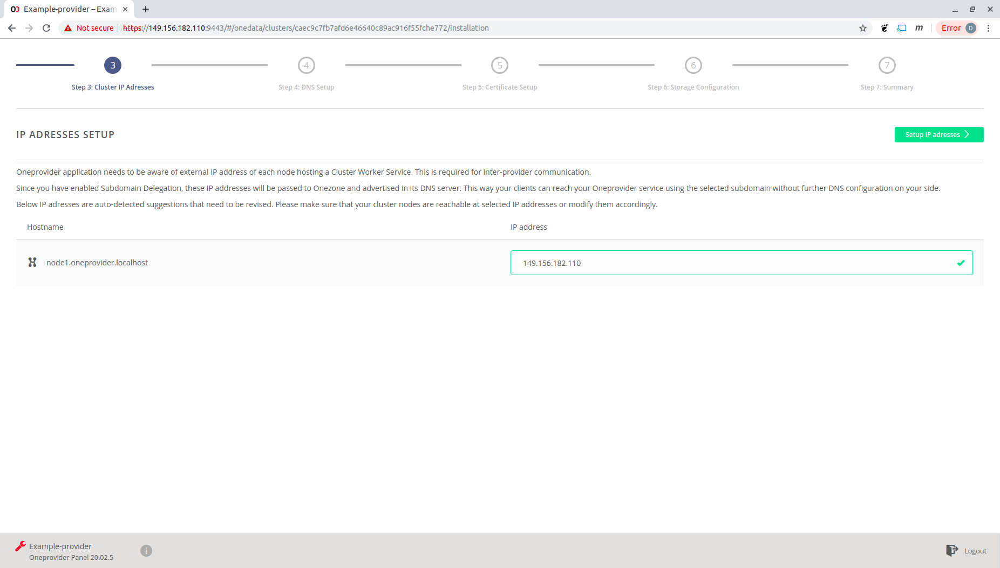

Check the correctness of IP address and click "Setup IP address".

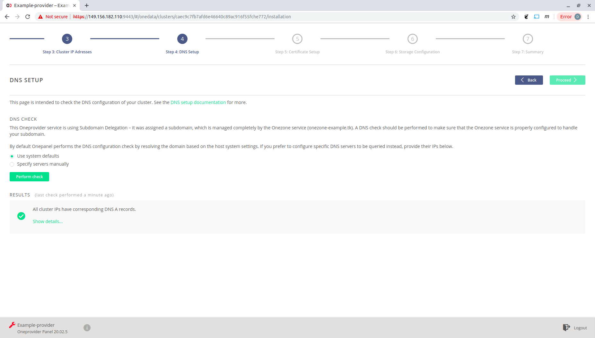

Check the DNS configuration and click "Proceed".

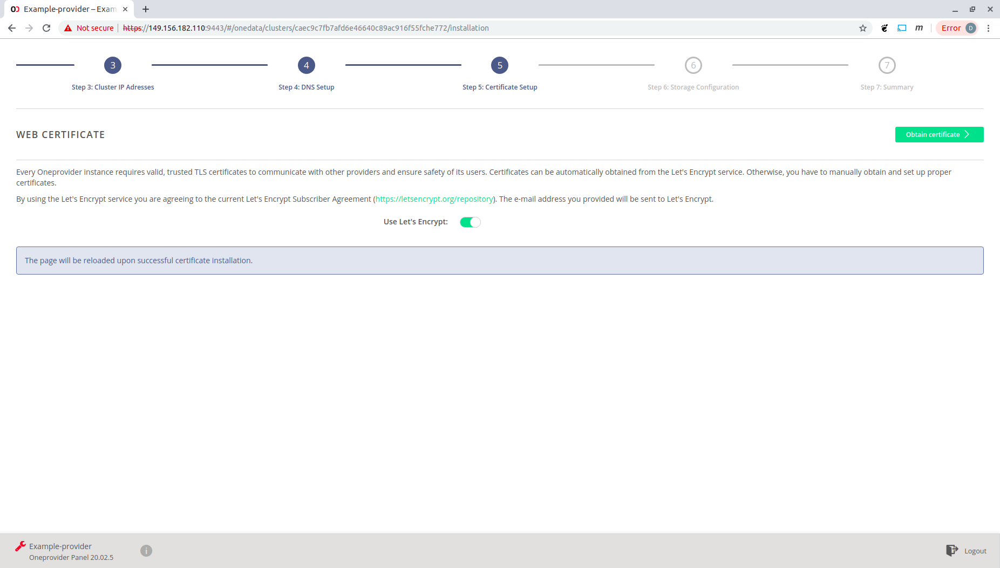

Click "Obtain certificate".

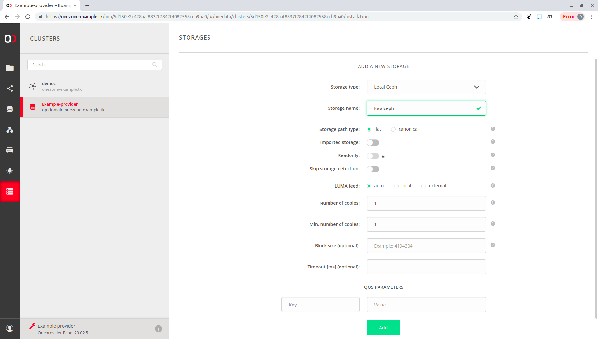

Choose Local Ceph type of storage and give it a name. Click "OK".

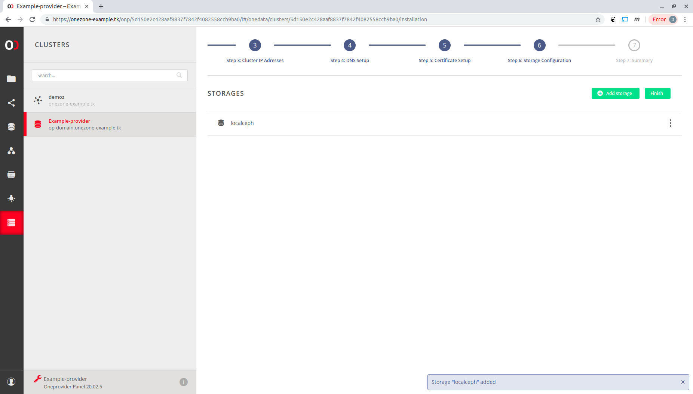

Click "Finish".

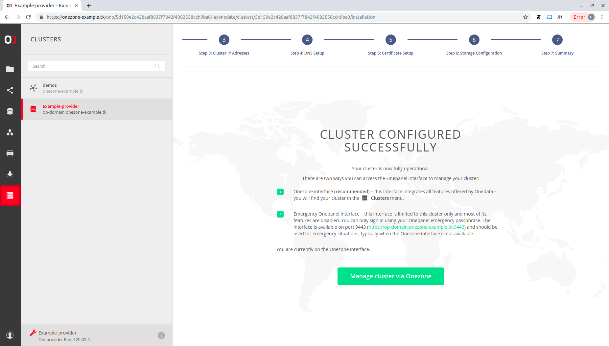

Now you can start managing your cluster, e.g., support a space as described in [Space supports](../../../images/admin-guide/oneprovider/installation/configuration/space-supports).


### Deploing Oneprovider with Onedatify convenience script

Onedatify is an easy to use script for automating the deployment of Docker based Oneprovider instance, automatically registered to a selected Onezone with selected storage resources and enabling import of legacy data sets.

#### Prerequisites

In addition to the general prerequisites this method requires also an access to existing user account in the Onezone instance, with which Oneprovider should register.

#### Deploing Oneprovider 

Follow carefully the following steps.

##### Creating a new space in Onezone

The first step to deploy Oneprovider using Onedatify script is to create a new space, which will be automatically supported by the new Oneprovider instance.

Go the main Onezone interface and select **DATA -> +** :

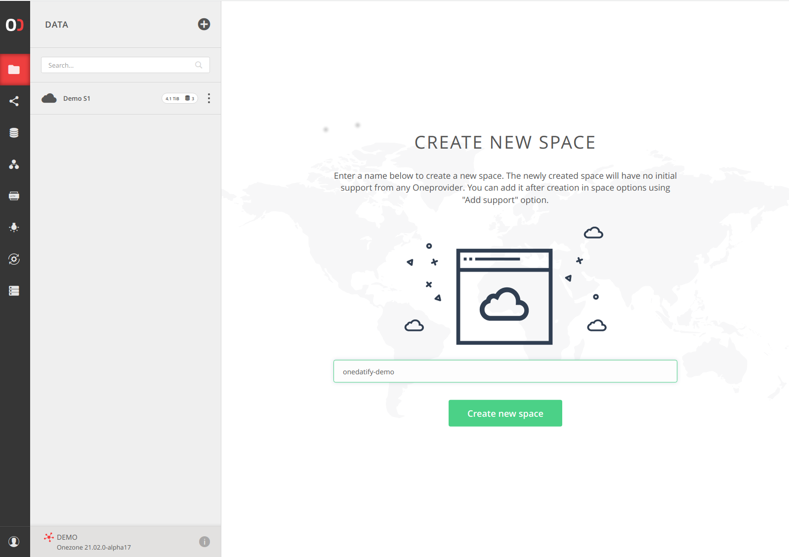

Note: Skip this step if existing space should be supported.

##### Generating oneline Onedatify command in Onezone

Go to Onezone interface and click on the space. Click **Add support** in the providers pane.

Select the tab *Deploy your own Oneprovider*:

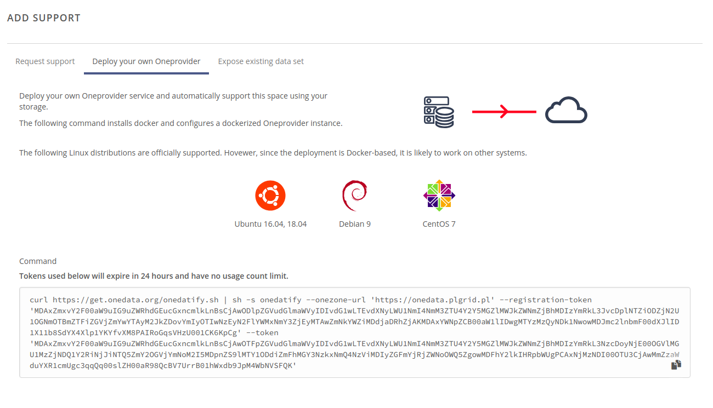

and copy the generated command.

Note: If you would like to expose a dircetory containing an existing data set then select the tab *Expose existing data set* and copy the generated command. 

##### Run the command on the target host

Paste the copied command in the terminal on the Oneprovider machine (as superuser or as a user with sudo privileges).

Check the prerequsite list and confirm to proceed to the next step:


If necessary, the Onedatify script will ask for permission to install all necessary dependencies including Docker and Docker Compose.

After the dependency installation is complete, the script will ask several questions and suggest default setting for each one:

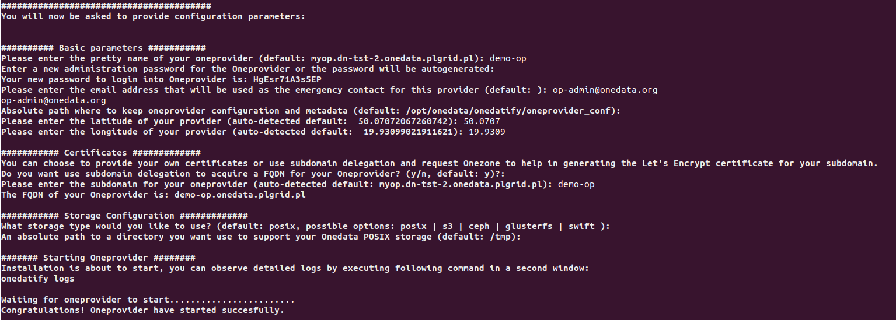

The progress can be monitored on a separate terminal using the following command:

```
journalctl -u onedatify.service -f
```

After the deployment is complete, the following message will be shown, with connection details for administration panel for the Oneprovider instance:

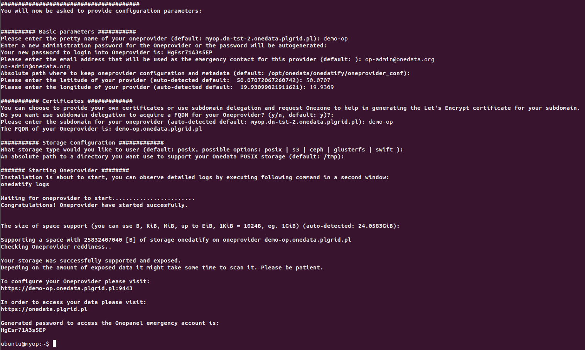


<!-- # Deploy Oneprovider and attach empty storage with Onedatify -->

<!-- toc -->


### Ansible/TF

### k8s/helm

## Native <!-- say that its not recommended, give a link to the dockerfile as reference, contact us if required -->
