# Data discovery

Data discovery services in Onedata are built around the concept of **harvesters**.
Harvesters have two main functions:

* automatic scanning of data spaces and collecting file metadata, which is fed
into a harvesting backend (e.g. Elasticsearch) for indexing,

* browsing the collected metadata and querying indices using a graphical
interface or REST API.

## Harvesting process overview

Metadata detection, processing and indexing - a harvesting process - is a multi-stage
algorithm which flow depends on the harvester configuration. The below glossary will help you
understand main keywords and to configure your harvester correctly.

### Detecting new metadata

A harvester can be connected to any number of spaces, each of which can be
supported by any number of Oneproviders. For every such pair (Oneprovider x space),
there is a continuous harvesting process that scans the space by iterating over
all changes that have been made to the files locally (a.k.a. changes stream). Types of changes
handled by the harvesting mechanism are:
  - creation and deletion of a file,
  - metadata change (xattrs, JSON or RDF),
  - file name change.

Each change triggers a metadata submission, which is posted in batches to the
Onezone service. The changes stream is robust and resistant to failures - in case of any problems,
harvesting is restarted at the point of last successful submission.

> NOTE: The changes to files are processed in the order of occurrence - if the space is
large and has not been fully harvested yet, it might take a long time for the newest
changes to be indexed.

### Putting data into indices

Metadata provided by a changes stream is then being processed by an external
*harvesting backend* (e.g. Elasticsearch). Harvesters are bound to the harvesting backends in many-to-one
relation - many harvesters can use the same backend simultaneously. Such a backend persists metadata in data structures called *indices*,
which allow to perform database-like queries in terms of fields defined by *index schema*
(either provided by a user or an automatically generated one). A harvester may contain
any number of indices, but all of them are handled only by the backend bounded to the harvester.
Onezone service sends the same metadata changes stream to each harvester index via harvesting backend API.
The result of that submission depends on the index schema - an incoming metadata entry might be
accepted (fully or partially) or rejected. For example you can use 2 different indices,
which will accept different types of JSON metadata depending on its content. In that case
you can use these indices like a tables in a database - each having records of different types.

> #### More about index schemas
> The index schema describes:
> - a format of the incoming metadata and how it should be saved,
> - conditions for data entries, which have to be met by a new data submission to be accepted,
> - searching parameters used during a query,
> - additional configuration, which will adjust the indexing process
> itself (like a number of used nodes in Elasticsearch).
>
> How the index schema should look like depends on the type of used harvesting backend.
> E.g. for Elasticsearch it can be found
> [here](https://www.elastic.co/guide/en/elasticsearch/reference/current/mapping.html).
> In the most of typical cases there is no need to define a custom index schema.

### Accessing indexed metadata

After data has been sent to the harvesting backend and accepted by the indexing mechanism,
it is accessible via:
- data discovery GUI,
- Onezone REST API,
- direct access to the harvesting backend using its specific API.

The data discovery GUI will be probably the most popular way as it provides simple tools for querying and filtering.
REST API is dedicated for more advanced users, that want to use harvested data in their own scripts
in an automated way. The last possibility - direct access to the harvesting backend - is available depending on
your access priviliges to that backend. It is the most powerful one. Allows to use
all proprietary API features with no additional translation layers from Onedata system.

> WARNING: Using direct access to the harvesting backend may corrupt your indexed data as
it allows not only to query, but also to modify and remove metadata entries and whole indices.
Use it with caution.

If the harvester is configured as *public*, then its query REST API is accessible for
anyone without no authentication. Also the data discovery GUI is accessible via a special
URL, which can be entered without a need to sign-in.

## Creating a new harvester
<!-- This header is referenced at least one time as "#creating-a-new-harvester" -->

The previous section has given us a short overview of the whole harvesting idea. Now we can try to create a harvester.

> NOTE: To create a harvester you need to be the Onezone administrator or a user
with `oz_harvesters_*` admin privileges.

1. Navigate to the Discovery tab and click "Get started"
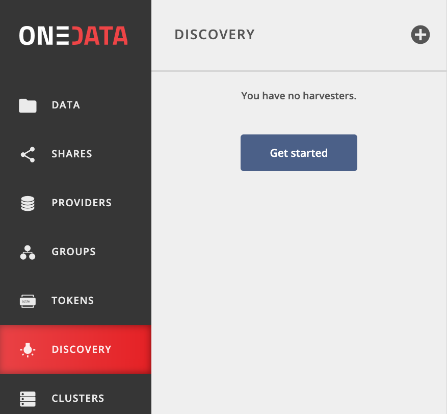

2. Choose the *Create a harvester* option or the `(+)` button at the top of the side menu.
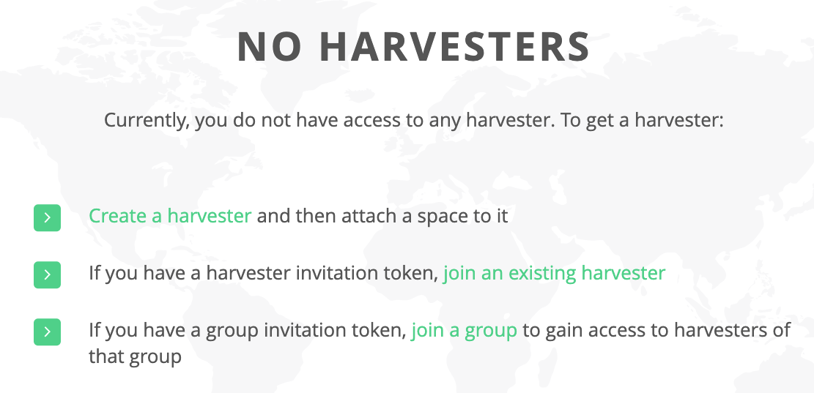
Other options visible on the screen allows to join to the existing harvester without creation.

3. Fill in the information - choose a meaningful *name*, the plugin that will
be used as harvesting backend (currently only Elasticsearch is available).
*Endpoint* is a location where the API of the harvesting backend is available. It is
optional - if not specified, default endpoint configured for the
environment will be used. *Auto setup* means, that a newly created harvester will have an
initial generic index and ready-to-use data discovery GUI. Auto setup is recommended,
unless you are an advanced user and you want to customize configuration on your own.
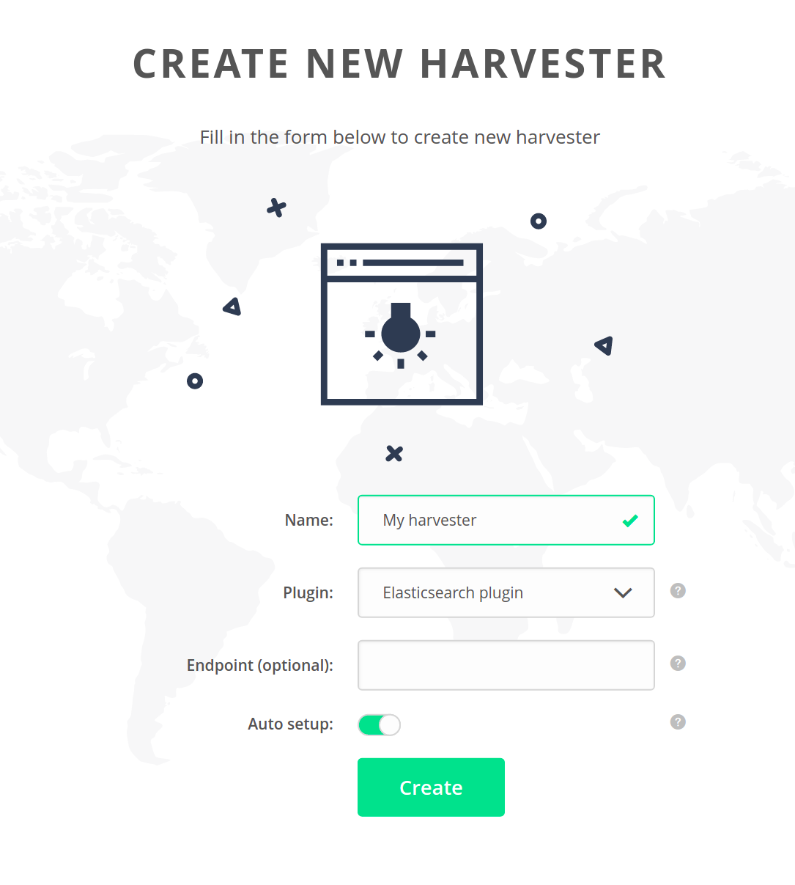

4. Navigate to the `Spaces` submenu to attach a space to the harvester.

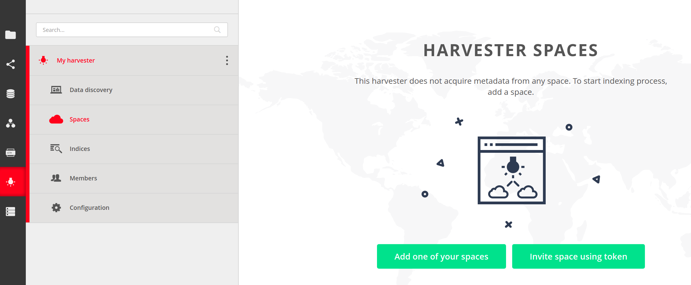

You can generate an invitation token and pass it to another user for them to add one of
their spaces. For this guide, choose the `Add one of your spaces`. If you don't have any,
learn about [spaces](../../../user-guide/spaces.html).

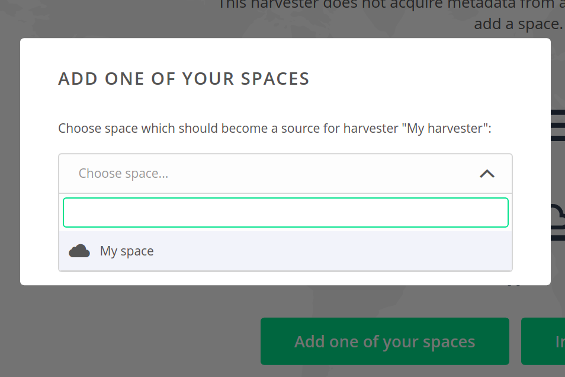

After that the space will be attached to the harvester - harvesting
processes will be started and indexing of file metadata will begin.

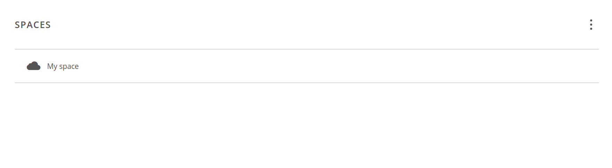

5. That's it! You have a fully configured harvester and it is ready to use for data discovery.
If files in the attached space does not have any metadata, then
add some (see [here](../../../user-guide/metadata.html)) to make it searchable.

The harvesting results are available through `Data discovery` submenu of your harvester.

## Harvester spaces

A harvester can have many spaces attached to it. A list of them is available through
`Spaces` submenu of your harvester.

### Adding new spaces

At any moment you have a possibility to extend the list of spaces with new ones - either one
of yours or a space of some another user. Both methods are available through *dots menu*
visible on the top right corner of the harvester spaces view.

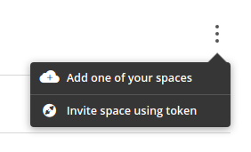

`Add one of your spaces` options has already been shown in
[creating a harvester](#creating-a-new-harvester) section. `Invite space using token`
opens a window with token, which should be passed to the owner of the space we would like
to join to our harvester.

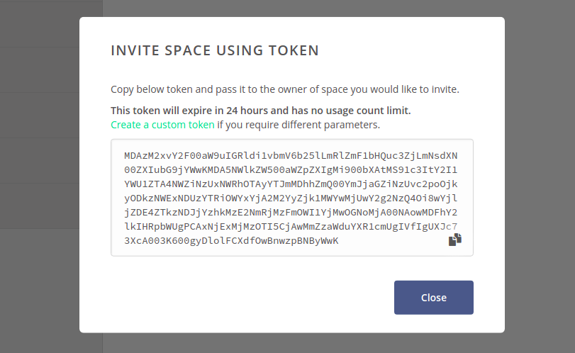

### Removing spaces

If you want to stop collecting metadata from one of the harvester spaces, click on the
*dots menu* on the right side of the spaces list entry and choose `Remove this space`.

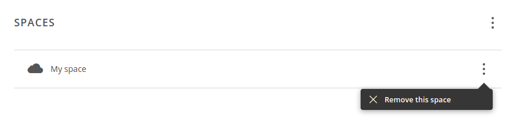

And then click on `Remove` button to acknowlegde your decision.

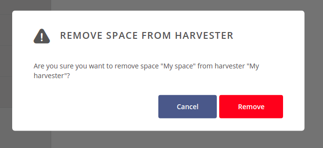

> NOTE: Removing space from the harvester will not remove previously indexed data from harvesting
backend. It will also not affect the space itself.

## Harvester indices

Like spaces, a harvester can have multiple indices. These can be found under *Indices*
submenu of your harvester.

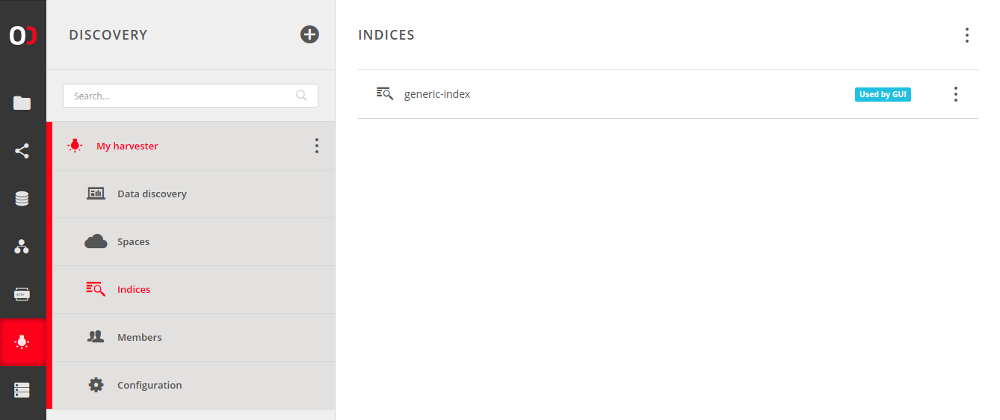

By default (if `Auto setup` was enabled during the harvester creation) there is one
`generic-index` entry. It is a very basic index, which is designed to accept incoming
metadata without any extra restrictions. It is also used by the data discovery GUI (which is
denoted by `Used by GUI` badge).

> NOTE: If there are many indices, only a subset of them might be used by GUI. Other ones
still work and collect metadata, but are not accessible via the data discovery GUI. To query them
you need to use [REST API](../../../user-guide/data-discovery.html#using-rest-api)
or change [indices configuration](#gui-plugin-indices) of the GUI plugin.

### Adding new index

To add a new index, click on the *dots menu* visible on the top right corner of the
harvester indices view. Then choose `Create new index`.

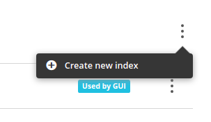

After that we can start to setup our new index in the visible form. It contains a few
options to customize:
- `Name` - a name for the new index,
- `Schema` - an index schema, which will be used by the harvesting backend during its creation.
Is optional, but if provided - must be in the format required by the harvesting
backend, e.g. for Elasticsearch it must be a correct index mapping.
- `Include metadata` - determines which type of metadata should be indexed. At least one
type must be selected,
- `Include file details` - specifies what file details should be harvested alongside the
metadata. Enabling `Metadata existence flags` will add boolean flags saying whether the
file has any metadata of certain type. The `File name` field may be utilized by the GUI
plugin to improve the browsing experience,
- `Include rejection reason` - if enabled, all payloads rejected by the harvesting backend
will be automatically analysed for offending data (e.g. fields that do not match the
schema), pruned and submitted again. This might slow down the harvesting process and cause
nonconformant metadata to be lost.

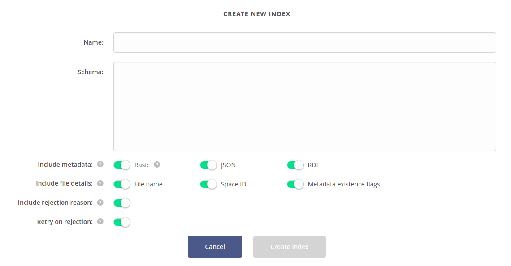

When a configuration for the new index is ready, click `Create index`. New entry will
be visible on the indices list and the harvesting process will start.

> NOTE: The order of attaching spaces and creating indices does not matter. Every index
(even those created after attaching spaces) will always process the whole metadata from
all attached spaces.

### Removing index

If you want to stop collecting metadata with a specific index, click on the
*dots menu* on the right side of that index and choose `Remove`.

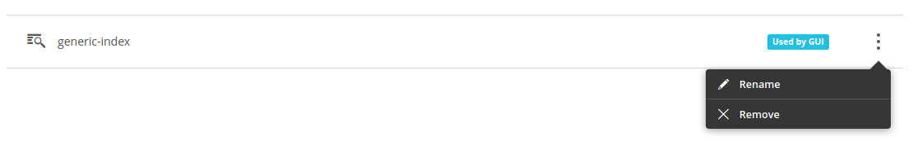

After that an acknowledge modal will show.

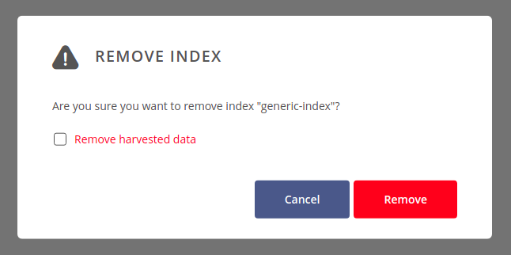

You can select `Remove harvested data`
checkbox if you want to remove the index structure from the harvesting backend. Otherwise,
only a binding between the harvester and the index will be destroyed, so harvested data
will still live in the harvesting backend internal memory (and be accessible via its
direct proprietary API).

At the end, click on `Remove` button to acknowlegde your decision.

### Index characteristics

Click on the index to see its details. `Harvesting progress` shows the space scanning
progress per each pair (Oneprovider x space). You can click on each chart to see more
information. If there were spaces, which were attached to the harvester and detached
later, then you can click on `Show archival spaces / providers` to see statistics for
them also.

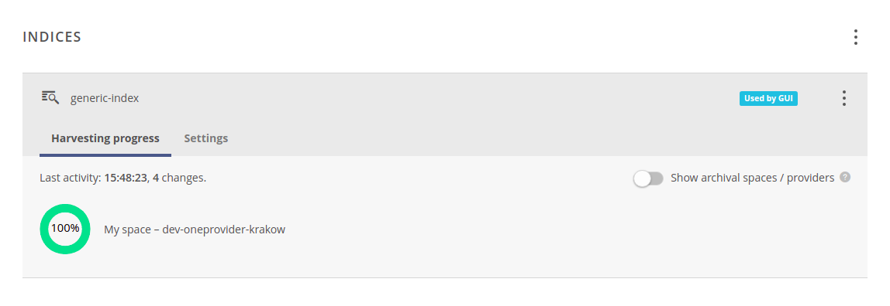

`Settings` tab contains the same (but now read-only) configuration as it was used during
the creation of that specific index.

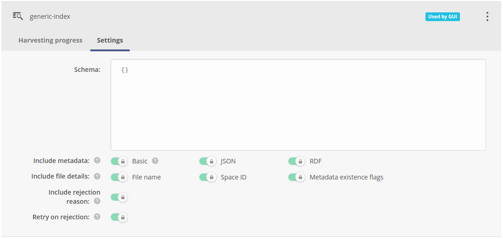

## Harvester members

The members view - available through `Members` submenu - allows you to add users or
groups to the harvester and manage their privileges. It is the same mechanism as used by
spaces and groups members concepts. For more information see
[group members management](../../../user-guide/groups.html#group-members).

> NOTE: When the harvester is public, then its indices can be accessed regardless the
members-related rules.

## Harvester settings

Each harvester has two categories of configuration, both can be found under the
`Configuration` submenu.

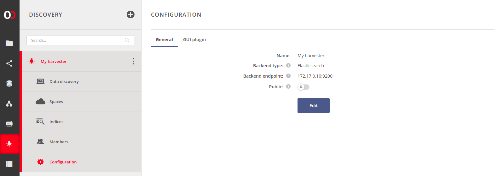

### General settings

The first category of settings - *general settings* - are very similar to the
form used for harvester creation. The only extra field is the `Public` setting.
If enabled, anyone with the public link can browse the harvested metadata or use the
REST API for queries.

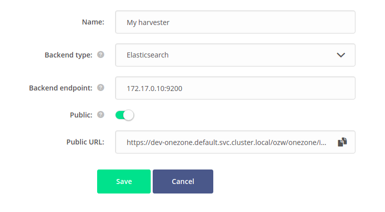

### GUI plugin settings

The second category is *GUI plugin* settings, which are responsible for adjusting data
discovery GUI, including usage of custom GUIs with non-standard configuration.

Each new harvester has a so-called *generic* GUI for data discovery to let the
harvester administrator start the harvesting process as soon as possible and let the users
interact with metadata. It provides simple mechanisms for querying indices and filtering
the results. But that generic GUI can be replaced by a more specific one,
which will  visualise indexed data in a customized way. Hence the term
*GUI plugin*.

GUI plugin is a self-contained web application. After uploading, it is embedded into the
Onezone interface. It communicates with the underlying harvesting service through Onezone.

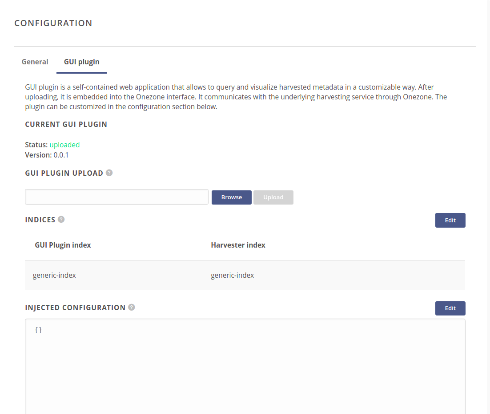

#### Uploading custom GUI plugin

The first section of GUI plugin configuration allows to upload your own GUI plugin.
It should be a standalone, static web application compressed in tar.gz format.

Only plugins that are whitelisted, are accepted (for safety purposes).
If your custom plugin was not provided directly by Onedata team, then you will
need to contact Onezone administrator and ask to add harvester GUI checksum (from
`shasum -a 256 your-plugin.tar.gz`) to `/etc/oz_worker/compatibility.json`
configuration file.

> WARNING: Use only GUI plugins, which are whitelisted by the Onezone and are taken from a
trusted source. Custom GUI plugins may contain malicious code and using them without
caution can cause critical security issues, including data leaks and unauthorized
operations.

#### GUI plugin indices
<!-- This header is referenced at least one time as "#gui-plugin-indices" -->

Each GUI plugin has a list of indices, which are needed for the plugin to work.
For the custom plugins we have to setup a mapping between these requirements and real
indices that are a part of the harvester. Onezone will proxy GUI plugin communication
to the harvesting service according to that settings.

For each index requirement we have three possible options to choose:
- `Create new index` - creates a clear, new index according to the index schema
provided by the GUI plugin itself,
- `Use existing index` - uses one of the existing indices. You have to be sure, that
its schema is compatible with the schema used by the GUI plugin.
- `Leave unassigned` - leaves it unsatisfied - use only if it is known,
that this requirement is optional and the GUI plugin can work without it.

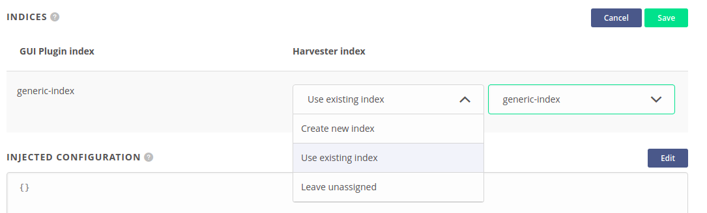

#### GUI plugin injected configuration

Some of the custom GUI plugins might have a possibility for a more complicated configuration.
In such a situation you should use `Injected configuration` section and fill it with
your own configuration in JSON format.

> NOTE: If you do not know what the possible options are, enter the edition mode and click
`Use defaults` button. It will prefill the textarea with the example configuration
provided by the GUI plugin.

## Data discovery FAQ

### Why only administrators are privileged to create a new harvester?

The harvesting process analyzes all changes performed on the files in spaces attached to
the harvester. When these spaces are large - e.g. with a few milions of files or more -
that analysis and metadata submission significantly impacts the overall system
performance - mostly Onezone service and external harvesting backend. Hence the ability to create and configure
harvesters is narrowed to a privileged group of users to let the system load be more under control.

### Why some of my metadata is not present in my index at all?

The decision, which metadata is (not) persisted in an index, depends on its index schema, where are rules
describing a format of incoming data. If your metadata does not fit to it, then it will be
rejected.

The other reason might be your index settings. If you configured index to accept e.g.
only JSON metadata, then all other types of metadata will be ignored and not submitted to the index.

> NOTE: If you did not provide a custom index schema, then Onedata uses a default one
> which - in most cases - generates acceptable data format just-in-time depending on
> incoming data. It means that if you had a file metadata where field `myFavField` was initially a
> number, then `myFavField` cannot be a string in another files metadata - data types must fit
> in all metadata entries in the index and incorrect submissions will be rejected.
