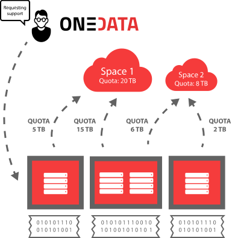
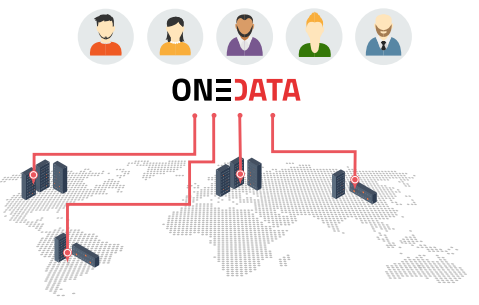

# 

Version: xRELEASExVERSIONx

<!-- TODO VFS-6805:
INTRODUCTION  (landing page)
    - a couple of words about Onedata
    - are you a user? — go here: [USER GUIDE]
    - are you an admin? — go here: [ADMIN GUIDE]
      <these three should fit onto one screen>
    - broader description of Onedata
        - architecture
     - rework user interfaces, move them somewhere else (data management interfaces are already on the data page, but
       what about general overview on the GUI, login methods, basic navigation, oneproviders and onepanels?)
    -->

Onedata is a data management platform that provides easy and unified access to globally
distributed storage resources, supporting a wide range of use cases from personal data
management to data-intensive scientific computations. It is an [open-source project][],
started in 2013, and implemented by the team from the Academic Computer Centre Cyfronet
AGH in Krakow, Poland.

In Onedata, users can store, access, process, and publish their data using a global
virtual file system spanning computing centers and storage providers worldwide.

Onedata focuses on performant, transparent access to distributed data sets, without
burdensome manual staging and migration, allowing access to the data directly from a
personal computer or a worker node within a data center.

## Quickstart

Read on to get familiar with the basic Onedata concepts, or take a look at the
[glossary][] for condensed information and cross-references.

To start with Onedata as **an end-user**, go to the [user quickstart][].

If you are familiar with `docker`, you may set up a [demo (sandbox) environment][] to see
Onedata in action, even with a multi-provider environment. It takes less than 5 minutes to
get it running!

If you are about to deploy Onedata services on your infrastructure, go the [admin guide][]
or the relevant chapter for [Onezone][] or [Oneprovider][] service.

## Basic concepts

The most important concepts in Onedata are:

<!-- TODO VFS-11766 links to different sections, consider being more concise or moving some information -->

* **Spaces** — distributed virtual volumes, where users can organize their data,
* **Providers** — entities who support user spaces with actual storage resources exposed via *Oneprovider* services,
* **Zones** — federations of providers that enable the creation of closed or
  interconnected communities, managed by *Onezone* services.

### Spaces

All data stored in Onedata is organized into [Spaces][]. Spaces can be seen as virtual
directories or volumes, which can contain an arbitrary directory and file hierarchy while
being distributed across multiple storage providers. Each space has to be supported by at
least one provider, which means that this provider reserved a certain storage quota for
this particular space. In case a space is supported by more providers, the total quota is
the sum of storage space provisioned by all providers supporting it.

Each user can have any number of spaces. Spaces can be easily shared with other users
and even exposed to the public. If you want to create a space for a community of users,
Onedata supports user *groups*, which enable multiple users to access a single space
sharing common authorization rules.

The data in spaces can be accessed using a wide-range of [user interfaces][], including a
Web UI and a command-line client based on [Fuse][]. It enables mounting your spaces to a
local filesystem and accessing the data directly from a laptop, a cluster node, or a
virtual machine deployed in the cloud.

For more information, see the dedicated chapters for [Spaces][] and [Groups][].

### Providers

Each zone is composed of a network of providers who provision their storage resources to
users. Anyone can become a Onedata provider by installing the *Oneprovider* service,
attaching storage resources, and registering it in a particular Onezone service.

A user can use several providers simultaneously to manage his/her data. Onedata exposes
the combined storage space of all providers to the user and ensures that access to the
user's data is performant and transparent.

Providers deploy *Oneprovider* services near physical storage resources, i.e. in computing
and data centers or even personal computers. Providers have full control over which users
can use their storage resources and in what amount.

Users use *Onezone* web interfaces (like the one at [demo.onedata.org][]) to authenticate
with Onedata and access the data located on the providers' storage resources.

### Zones

Onedata is a freely available software stack that can be used to build different
ecosystems, called *zones*. Each Onedata zone constitutes an independent data management
platform, bringing together multiple data centers (providers). At the heart of each
Onedata ecosystem lies a *Onezone* service that serves as a center of authority and an
entry point to the system, integrating with OIDC & SAML identity providers. While
typically it operates on the level of a federation (e.g. [EGI DataHub][]), in principle
the size of a zone and the administrative setup of the providers building up an
environment can be arbitrary.

![image-onezone][]

While currently each zone is an isolated, independent ecosystem, the future roadmap for
Onedata is to build a decentralized, peer-to-peer network of zones to allow (optional)
collaboration between different ecosystems.

## User interfaces

Onedata offers multiple interfaces to manage and access user data: Web GUI, REST API, CDMI
API, fuse-based POSIX mount, Python libraries, or S3. Regardless of the interface, the
user gets the same, unified view of all his data.

### Web GUI

This [rich graphical interface][] can be used for all data management tasks and is designed
to be intuitive for non-computer-savvy users with basic needs, while offering advanced
features for skilled personnel, such as data stewards, developers, or administrators.

![screen-web-gui-example][]

<!-- TODO VFS-6805: refresh this screenshot -->

### Oneclient — native POSIX mount

The [Oneclient][] application allows mounting your Onedata Spaces in a Linux filesystem,
so that the data can be accessed as if it resided in the local filesystem. Oneclient is
based on the [Fuse][] (Filesystem in Userspace) library and proves useful in many
scenarios:

* convenient access using a personal laptop from any place with Internet connection,
* high-performance access in computing environments — the filesystem can be mounted on
  a worker node and processed interactively or using jobs,
* accessing the data via the command-line interface (terminal),
* accessing and processing the data using specialized software.

![screen-oneclient-mount][]

<!-- TODO VFS-6805: refresh this screenshot, 
maybe show only the CLI with the same data as in Web GUI -->

### Administrator Web interface

Dedicated web interface for installation and management of [Oneprovider][op-panel-gui] and
[Onezone][oz-panel-gui] services.

### API

Onedata offers a [RESTful interface][REST interface], which can be used for integration
with other services, creating middleware, and automating repetitive processes.

### Other interfaces

All available interfaces, including Python libraries, S3 endpoint, and CDMI API, are
described in a [dedicated chapter][interfaces].

<!-- ## Architecture

<!-- TODO VFS-6805: description of architecture: Onezones, Oneproviders, Onepanels, glossary -->

<!-- TODO VFS-6805: describe the concept of Oneprovider being a service deployed in a data provider institution 
                    and offering storage space for users -->

<!-- references -->

[user interfaces]: #user-interfaces

[open-source project]: https://github.com/onedata

[glossary]: glossary.md

[user quickstart]: user-guide/quickstart.md

[demo (sandbox) environment]: admin-guide/demo-mode.md

<!-- TODO VFS-11766 link the proper landing page when it's there -->

[Onezone]: admin-guide/onezone/installation.md

<!-- TODO VFS-11766 link the proper landing page when it's there -->

[Oneprovider]: admin-guide/oneprovider/installation/overview.md

[admin guide]: admin-guide/overview.md

[Spaces]: user-guide/spaces.md

[Groups]: user-guide/groups.md

[demo.onedata.org]: https://demo.onedata.org

[EGI DataHub]: https://datahub.egi.eu

[Oneclient]: user-guide/interfaces/oneclient.md

[fuse]: https://github.com/libfuse/libfuse

[op-panel-gui]: admin-guide/oneprovider/administration-panel.md

[oz-panel-gui]: admin-guide/onezone/administration-panel.md

[REST interface]: https://onedata.org/#/home/api

[rich graphical interface]: user-guide/interfaces/web-file-browser.md

[interfaces]: user-guide/interfaces/overview.md

[image-onezone]: ../images/intro/onezone.png

[screen-web-gui-example]: ../images/intro/web-gui-example.png

[screen-oneclient-mount]: ../images/user-guide/interfaces/oneclient/oneclient-mount.png
