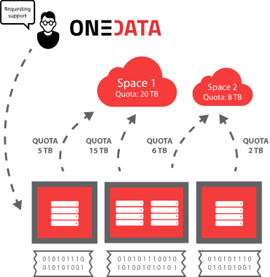

#  Documentation

Version: ${RELEASE}

Onedata is a global data management system, providing easy access to distributed 
storage resources, supporting wide range of use cases from personal data 
management to data-intensive scientific computations.

With Onedata, users can access, store, process and publish data using global data storage backed by computing centers and storage providers worldwide.

Onedata focuses on instant, transparent access to distributed data sets, without unnecessary staging and migration, allowing access to the data directly from your local computer or worker node.

## Quickstart

Before you start using Onedata, it's helpful to understand the basic concepts provided in the next section. There you will find out: what functionality it provides, how data is organized and what are the various components of the platform. 

If you would like to start using onedata as a user go to the [user quickstart](user-guide/quickstart.md).

If you would like to deploy the onedata services on your infrastructure then you should start with the relevent quickstart for [onezone](admin-guide/onezone) or [oneprovider](admin-guide/oneprovider) found in the [admin guide](admin-guide/).

## Basic concepts

The most important concepts of the platform to understand at the beginning include:
 - **Spaces** - distributed virtual volumes, where users can organize their data
 - **Providers** - entities who support user spaces with actual storage resources exposed via *Oneprovider* services
 - **Zones** - federations of providers, which enable creation of closed or interconnected communities, managed by *Onezone* services.

### Spaces
All data stored in Onedata is organized into *Spaces*. Spaces can be seen as virtual directories or volumes, which can contain an arbitrary directory and file hierarchy, while being distributed across multiple storage providers. Each space has to be supported by at least one provider, which means that this provider reserved certain storage quota for this particular space. In case a space is supported by more providers, the total quota is the sum of storage space provisioned by all providers supporting it.

After registering in a specific zone using Onezone web interface, a new space has to be created. Onedata is not a storage provider, and it does not provide any free or paid storage resources. That is why, the newly created *space* has a quota size set to 0. In order to be able to use this *space*, you have to request storage from some provider.

You can do that by sending to the provider a unique support request token, which can be generated using the Onezone interface. Provider uses this token to easily enable support for your *space* with a specified quota. The actual storage size and provisioning time depends on your agreement with the storage provider. You can request more storage for your *space* from multiple geographically distributed providers. Onedata will unify access to these storage resources automatically.

Each user can have any number of *spaces*. *Spaces* can be easily shared with other users and even exposed to the public. If you want to create a *space* for a community of users, Onedata supports user *groups*, which enable multiple users to access single *space* with respect to specified authorization rules.

Data in spaces can be managed through a web interface as well as from command-line. Each space can be easily mounted to a local filesystem and accessed directly from a laptop, a cluster node or virtual machine deployed in the cloud.

For more information about *Spaces* and *Groups* see [Space Management](../using_onedata/space_management.md) and [Group Management](../using_onedata/group_management.md).

### Providers
Each zone is composed of a network of providers who provision their storage resources to users. Anyone can become a Onedata provider by installing *Oneprovider* service, attaching storage resources and registering it in a particular Onezone service.

A user can use several providers simultaneously to manage his/her data. Onedata exposes combined storage space of all providers to the user and ensures that access to user's data is instant and transparent.

Providers deploy *Oneprovider* services near physical storage resources, i.e. in computing and data centers or even personal computers. Providers have full control over which users can use their storage resources and in what amount.

Users use *Onezone* web interfaces (like the one at [onedata.org](onedata.org)) in order to authenticate with Onedata and access the data located on the providers storage resources.

For more information about Onedata's provider service, check out [Oneprovider Overview](../administering_onedata/provider_overview.md) documentation.

### Zones
Onedata is a distributed system divided into zones that are created by deploying a dedicated service called *Onezone*. Any organization, community or user group can deploy their own *Onezone* service with customized login page and either connect it to the distributed network of *Onezone* services or run it as an isolated private deployment.

*Onezone* is responsible for authentication and authorization of users and makes it possible for users from different zones to communicate with each other and share data. It allows providers from different zones to interact with each other, i.e., allowing users from different zones to get support for their spaces regardless of the zone in which the particular provider is located.

As *onedata.org* is a main public zone, any provider registered there allows the users to access their data through *onedata.org* user interface.

For more information about Onedata's  *Onezone* service, check out [*Onezone* Overview](../administering_onedata/onezone_overview.md) documentation.

## User interfaces
Onedata provides 4 ways to manage and access your data:

### User web interface

The Onedata Web Interface provides a web-based, graphical user interface that you can use to manage your spaces, control access rights and manage your user account.

### User command-line interface

If you prefer to work from the terminal, Onedata provides the *oneclient* command-line tool, which allows you to mount your spaces in a Linux filesystem and access your data directly from console. See the [oneclient](../using_onedata/oneclient.md) reference for the complete list of available features.

### Administrator web interface

Dedicated web interface for installation and management of *Oneprovider* and *Onezone* services.

### API

Currently Onedata exposes a CDMI (Cloud Data Management Interface) [interface](user-guide/cdmi.md) and RESTful [interface](https://onedata.org/#/home/api) for integration with other services, which allows developers to directly access and manage spaces, groups, authorization rights and data.

<!-- TODO:
INTRODUCTION  (landing page)
    - a couple of words about Onedata
    - are you a user? - go here: [USER GUIDE]
    - are you an admin? - go here: [ADMIN GUIDE]
      <these three should fit onto one screen>
    - broader description of Onedata
    -->