# Data Discovery

Data discovery services in Onedata are built around the concept of **harvesters**.
Harvesters have two main functions:

* automatic scanning of data spaces and collecting file metadata, which is fed
into a harvesting backend (e.g. Elasticsearch) for indexing,

* browsing the collected metadata and querying indices using a graphical
interface or REST API.

## Indexing your metadata

> **Before you start, be sure, that the following requirements are met:**
>- by indexing metadata you implicitly give a consent for sharing them with all members
of the indexing harvester. Anyone with access to the harvester will be able to query
indices and see metadata. Hence you need to be sure, that your metadata does not contain
any information which is considered secret,
>- harvesting process is sensitive for metadata format inconsitencies, especially
data types. E.g. if some JSON metadata field was once a number, then it must be a number
(or empty) in all of your files. To prevent from such incompatibilities, check your
metadata format - it has to be consistent and unambiguous in the whole space.

If you want to index metadata, which is attached to the files in your space, you can
choose one of the two following approaches.

### 1. Joining your space to an existing harvester

If you are a member of a harvester, which might be suitable for your needs, then you can try
to join your space to it. It is the simpliest way of making your metadata searchable. To do
so, contact with the harvester owner and ask him for the
*"join space to harvester" invite token*. When you receive it, go to the
[tokens consumer](./tokens.html#consuming-invite-tokens)
page and use it to join your space. After a while your metadata should be accessible via
`Data discovery` submenu of the harvester.

> WARNING: In this scenario all members of the harvester will have access to your indexed
metadata without restrictions. It also includes any new member, that will join to the harvester
in the future.

### 2. Creating a new harvester with your space attached

This is a more advanced way, as it requires an action of the Onezone administrator
(only administrators can create a harvester for you). At first you need to contact the administrator
and ask for a new harvester. At some point of this operation he will
send you a *"join space to harvester" invite token* and a
*"join user to harvester" invite token*. You have to use both of them with the
[tokens consumer](./tokens.html#consuming-invite-tokens)
page. After these operations you will become a member of a brand new harvester with your
space attached to it.

In case of any problems with metadata indexing, contact the owner/creator of your harvester.

## Querying for harvested metadata

Indexed metadata can be queried using the GUI or Onezone's REST API. Then first method is the best
for a fast overview of the data collected by the harvester or to search for a one specific
entry. REST API, on the other hand, is the best solution for automated execution mechanisms
like scripts and applications.

> #### Public and private access
>If desired, it is possible to grant public access to the GUI and REST API
(ask for it your harvester owner) so that unauthenticated users can make API queries and
browse the harvester using a public link to its GUI. Otherwise, it is available
only to the harvester members (users and groups). In the public view, the
harvester GUI is displayed in full-screen mode.

### Using data discovery GUI

1. Open the *Data discovery* view, where the harvester can be browsed. To see
any results, you must make sure that there are some files in spaces attached to
the harvester
(preferably with some [custom metadata](./metadata.md) set).
You might open the [public](#public-and-private-access) view of the harvester
(if enabled) to enter the full-screen mode.
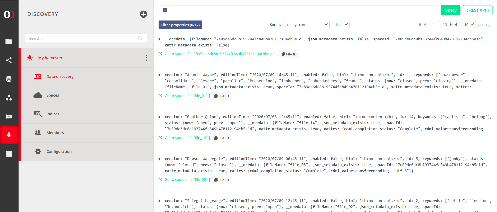

2. Click on an entry to expand it and view the metadata. This example shows
a file that has some custom JSON metadata set. Such
file can be found in the index by its filename or queries matching the JSON
metadata.
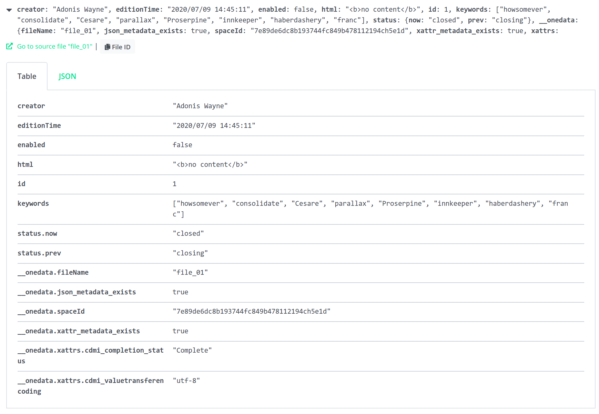

3. You can switch between table and JSON views.
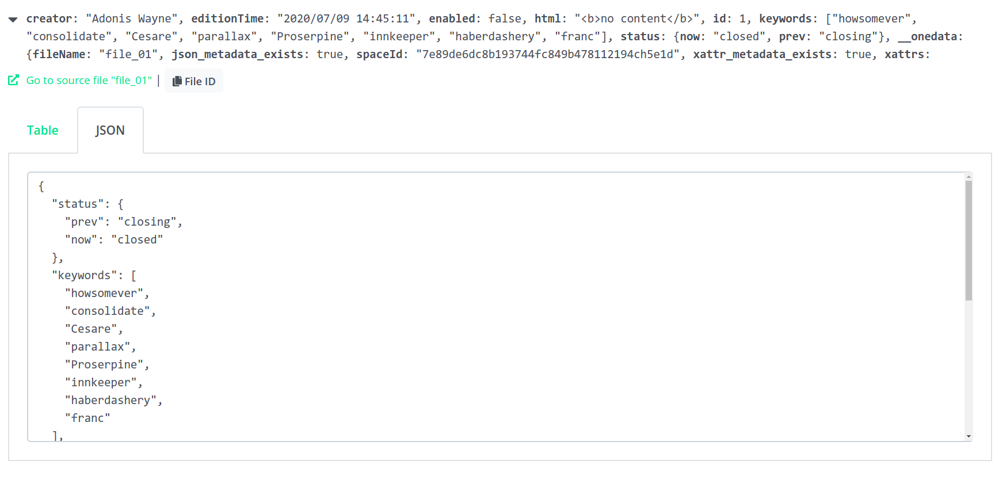

4. You can easily go to the source file using the green link (see above) -
you will be taken to the directory that contains the indexed file.
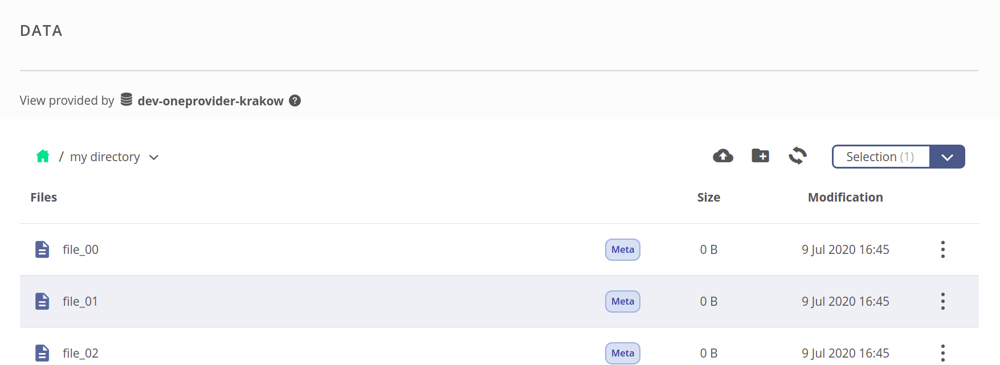

5. Back to the data discovery view - you can use the query builder to compose
custom queries which will narrow your search results. Building the query starts
with a single placeholder that can become a direct condition, or branch into
a more complex expression using chosen operator.
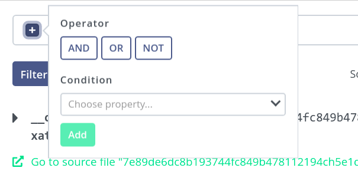

6. If an operator is chosen, new placeholders appear in that place, which
can be recursively filled with further conditions or operators. This example
shows the `OR` operator, which will match a file if the left-hand expression or
the right-hand expression matches it.


7. The condition expression is composed of a property name, comparator and
value to compare against. If the condition is true for a file, it will be
included in the results (subject to other expressions in case of a complex query).
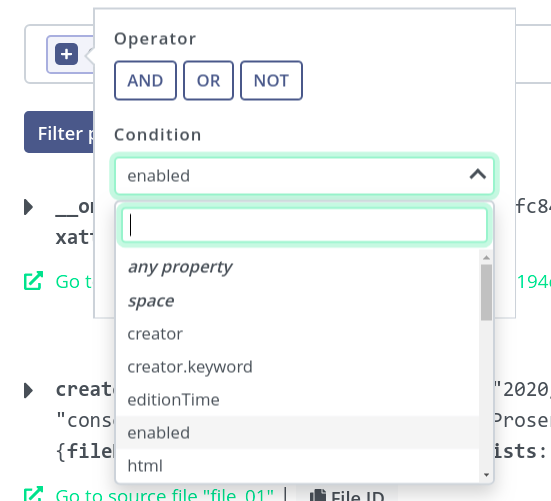

8. Complete condition - matches if the `enabled` property in file metadata
equals `true`.
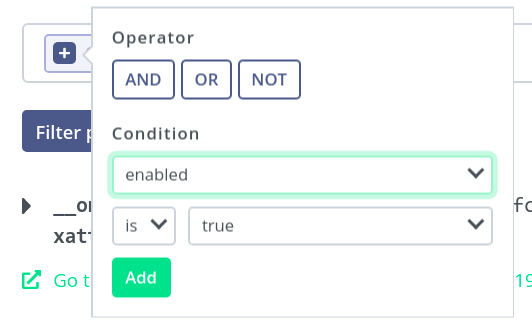

9. Now, for the right-hand expression - another condition that matches if `id`
is equal to `16`.
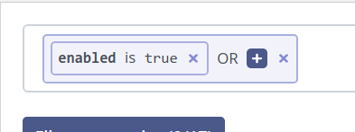

10. Complete query might look like the following - quick on the *Query* button
to perform the search.
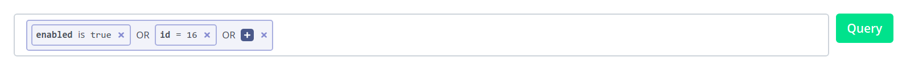

11. The results are presented on a paged view - you should see all the files
that match the specified query, split to pages. Use the paging menu at the
bottom for navigation.
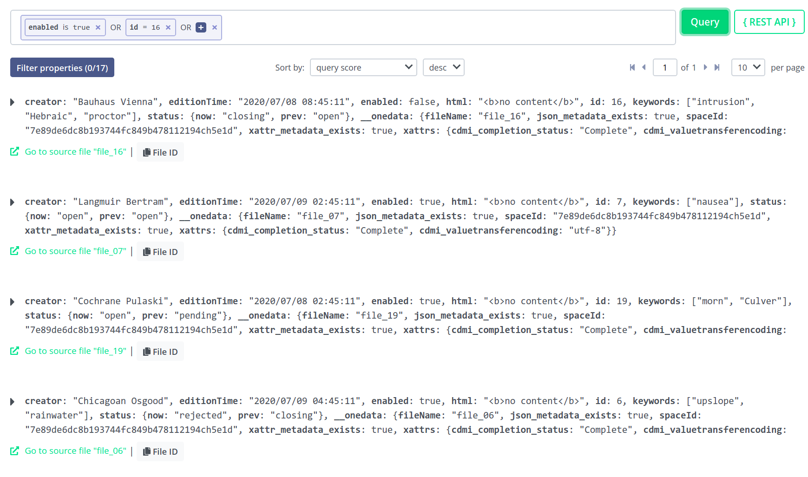

12. Results can be sorted by desired property and in ascending or descending order.
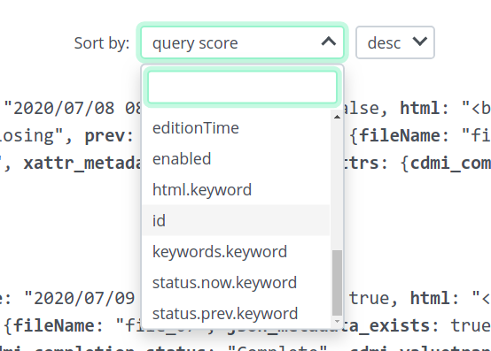

13. To refine the search, you may apply some filters based on properties. In our
example, the results constitute 17 accumulated unique properties to filter by.
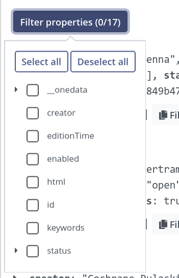

14. Filtering is applied live. Behind the scenes, the query is not repeated -
the unwanted properties are hidden from the view for convenient browsing through
the results, but the list of matching files does not change.
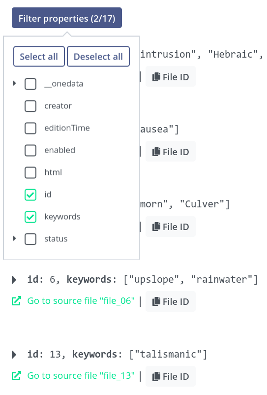

15. If you wish to use the [REST API](#rest-api) for queries, you may find the
`{REST API}` button useful.
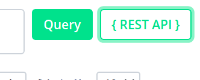

16. Click on the button to generate a `curl` command that will perform a query
equivalent to the one currently built in the editor, including the filters and
sorting parameters. See the [REST API](#rest-api) for more information.
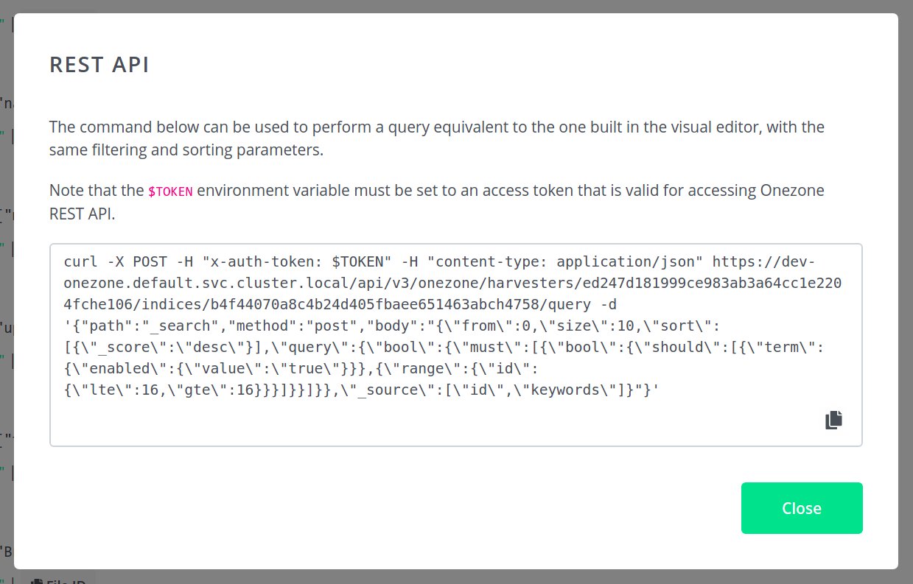


### Using REST API

Onezone's REST API allows performing queries in Elasticsearch, where Onezone
serves as a proxy - as the Elasticsearch server is usually deployed alongside
the Onezone's cluster in an isolated, internal network.

Example query to the harvester looks like the following. The request body is
essentially a specification of the request to be made by Onezone to the
Elasticsearch server, and the response is fed back to the client. The `body`
value is a string - encoded JSON expressing the Elasticsearch query.

```bash
curl -X POST -H "x-auth-token: ${TOKEN}" -H "content-type: application/json" \
    https://hub.archiver-otc.eu/api/v3/onezone/harvesters/ed247d181999ce983ab3a64cc1e2204fche106/indices/b4f44070a8c4b24d405fbaee651463abch4758/query \
    -d '{
        "path": "_search",
        "method": "post",
        "body": "{
            \"from\": 0,
            \"size\": 10,
            \"sort\": [
                {\"_score\": \"desc\"}
            ],
            \"query\": {
                \"bool\": {
                    \"must\": [
                        {
                            \"bool\": {
                                \"should\": [
                                    {
                                        \"term\": {
                                            \"enabled\": {
                                                \"value\": \"true\"
                                            }
                                        }
                                    },
                                    {
                                        \"range\": {
                                            \"id\": {
                                                \"lte\": 16,
                                                \"gte\": 16
                                            }
                                        }
                                    }
                                ]
                            }
                        }
                    ]
                }
            },
            \"_source\": [
                \"id\",
                \"keywords\"
            ]
        }"
    }'
```

Note that the `${TOKEN}` variable must be set to an access token of a user that
is a member of this harvester - unless the harvester is
[public](#public-and-private-access), then the `x-auth-token` header can be simply removed.

The response will contain the raw response from the Elasticsearch server. If
filters are enabled, only the specified properties will be included in the
results (for the bove example - `id` and `keywords`). Furthermore, by default
only the first 10 entries will be returned - override by changing the
`\"from\": 0, \"size\": 10` parameters of the query.


