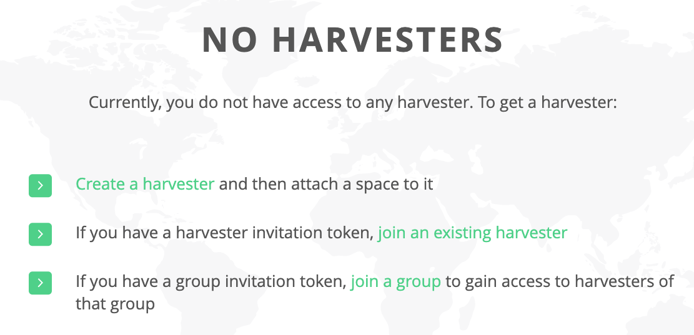
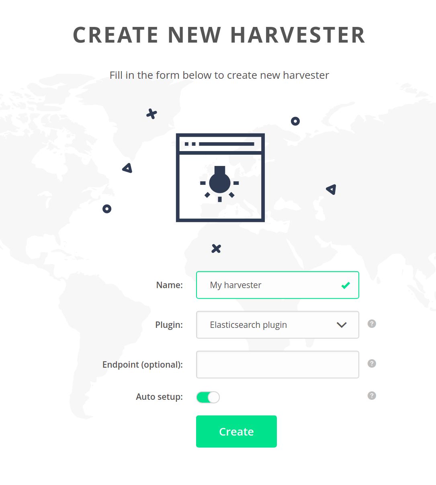
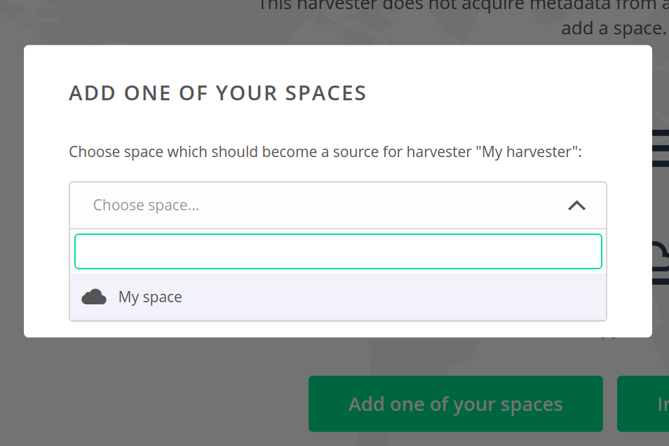
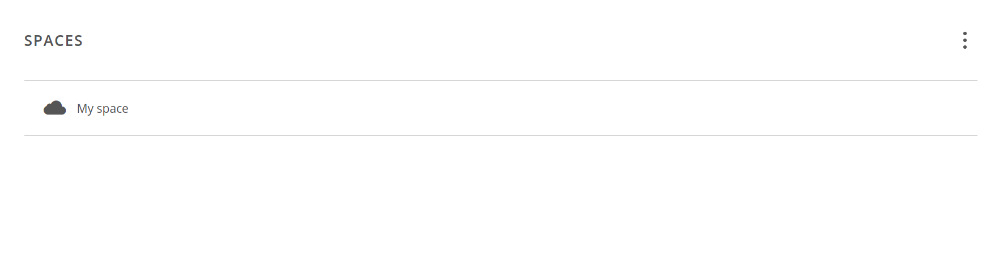
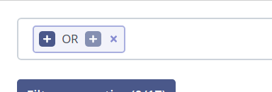

# Data Discovery

Data discovery services in Onedata are built around the concept of **harvesters**.
Harvesters have two main functions:

* automatic scanning of data spaces and collecting file metadata, which is fed
into a harvesting backend (e.g. Elasticsearch) for indexing,

* browsing the collected metadata and querying indices using a graphical
interface or REST API.


### Automatic metadata harvesting
A harvester can be connected to any number of spaces, each of which can be
supported by any number of Oneproviders. For every such pair (Oneprovider x space),
there is a continuous harvesting process that scans the space by iterating over
all changes that have been made to the files locally (a.k.a. changes stream).
Each change triggers a metadata submission, which is posted in batches to the
Onezone service. Onezone gathers all such metadata feeds and submits the metadata
to the harvesting backend (e.g. Elasticsearch). The changes stream is robust and
resistant to failures - in case of any problems, harvesting is restarted at the
point of last successful submission. The changes to files are processed in the
order of occurrence - if the space is large and has not been fully harvested yet,
it might take a long time for the newest changes to be indexed.


### Browsing the harvester
Each harvester has a corresponding GUI for browsing, which is pluginable. By
default, a [standard GUI](#gui-guide) with text-based search support is
preconfigured for each harvester. It is possible to create a custom GUI plugin
for specific use cases and assign it to a harvester.

Onezone offers a [REST API](#rest-api) that can be used to query the indices and
obtain results for custom processing.


### Public and private access
If desired, it is possible to grant public access to the GUI and REST API (in
Configuration submenu) so that unauthenticated users can make API queries and
browse the harvester using a public link to its GUI. Otherwise, it is available
only to the harvester members (users and groups). In the public view, the
harvester GUI is displayed in full-screen mode.


## GUI guide
1. Navigate to the Discovery tab and click "Get started"


2. If you have received an invitation token, you may choose to join an existing
harvester, or a group that has access to a harvester (see
[invite tokens](./tokens.md#gui-wizard) for more). This guide will show you how
to create and configure a new harvester - choose the *Create a harvester*
option or the `(+)` button at the top of the side menu.


3. Fill in the information - choose a meaningful name, the plugin that will
be used as harvesting backend (currently only Elasticsearch is available).
Endpoint is optional - if not specified, default Elasticsearch configured for the
environment will be used. Auto setup is recommended, unless you are an advanced
user and wish to change the default GUI or modify indices to be created.


> Note that only privileged users can create harvesters - regular users have to
ask the VO administrators for an invitation token.

4. After creating the harvester, navigate to the configuration tab. Here you can
find the basic config and toggle the [public setting](#public-and-private-access).
If enabled, a public link for unauthenticated access will be generated.
Visit the link to browse the harvester in a full-screen mode.


5. Switch to the *GUI plugin* tab within the configuration view to access
advanced settings. If you chose the *Auto setup* during creation, everything
will be set up on defaults. Advanced users might upload a different GUI plugin,
modify the indices (or add custom ones, unnecessarily attached to the
GUI browser) or feed different GUI configuration JSON.


6. Navigate to the *Spaces* submenu to attach a space to the harvester. You can
generate an invitation token and pass it to another user for them to add one
of their spaces. For this guide, choose the *add one of your spaces*. If you
don't have any, [learn about spaces](./space-and-user-management.md).


7. Choose one of your spaces and confirm.


8. The space will be attached to the harvester - which means that harvesting
processes will be started and indexing of file metadata will begin.


9. Navigate to the *Members* submenu - here you can add users or groups to the
harvester and manage their privileges. If the harvester is not
[public](#public-and-private-access), only the member users and groups are able
to perform queries.


10. Inspect the *Indices* tab, which shows all indices registered for this
harvester - on default settings there should be one index, used by the GUI for
queries.


11. Click on the index to see details. Harvesting progress shows the space
scanning progress per each pair (Oneprovider x space). Schema shows the
predefined data structure for the index - by default no schema is specified and
the Elasticsearch service builds it dynamically based on incoming content.


12. Open the *Data discovery* view, where the harvester can be browsed. To see
any results, you must make sure that there are some files in your space
(preferably with some [custom metadata](./metadata-management.md) set), and optionally a
[metadata extraction process](./metadata-extraction.md) is enabled for the space.
You might open the [public](#public-and-private-access) view of the harvester
(if enabled) to enter the full-screen mode.


13. Click on an entry to expand it and view the metadata. This example shows
a file that has some [custom JSON metadata](./metadata-management.md) set. Such
file can be found in the index by its filename or queries matching the JSON
metadata.


14. You can switch between table and JSON views.


15. You can easily go to the source file using the green link (see above) -
you will be taken to the directory that contains the indexed file.


16. Back to the data discovery view - you can use the query builder to compose
custom queries which will narrow your search results. Building the query starts
with a single placeholder that can become a direct condition, or branch into
a more complex expression using chosen operator.


17. If an operator is chosen, new placeholders appear in that place, which
can be recursively filled with further conditions or operators. This example
shows the `OR` operator, which will match a file if the left-hand expression or
the right-hand expression matches it.


18. The condition expression is composed of a property name, comparator and
value to compare against. If the condition is true for a file, it will be
included in the results (subject to other expressions in case of a complex query).


19. Complete condition - matches if the `enabled` property in file metadata
equals `true`.


20. Now, for the right-hand expression - another condition that matches if `id`
is equal to `16`.


21. Complete query might look like the following - quick on the *Query* button
to perform the search.


22. The results are presented on a paged view - you should see all the files
that match the specified query, split to pages. Use the paging menu at the
bottom for navigation.


23. Results can be sorted by desired property and in ascending or descending order.


24. To refine the search, you may apply some filters based on properties. In our
example, the results constitute 17 accumulated unique properties to filter by.


25. Filtering is applied live. Behind the scenes, the query is not repeated -
the unwanted properties are hidden from the view for convenient browsing through
the results, but the list of matching files does not change.


26. If you wish to use the [REST API](#rest-api) for queries, you may find the
`{REST API}` button useful.


27. Click on the button to generate a `curl` command that will perform a query
equivalent to the one currently built in the editor, including the filters and
sorting parameters. See the [REST API](#rest-api) for more information.


## REST API

Onezone's REST API allows performing queries in Elasticsearch, where Onezone
serves as a proxy - as the Elasticsearch server is usually deployed alongside
the Onezone's cluster in an isolated, internal network.

Example query to the harvester looks like the following. The request body is
essentially a specification of the request to be made by Onezone to the
Elasticsearch server, and the response is fed back to the client. The `body`
value is a string - encoded JSON expressing the Elasticsearch query.

```bash
curl -X POST -H "x-auth-token: ${TOKEN}" -H "content-type: application/json" \
    https://hub.archiver-otc.eu/api/v3/onezone/harvesters/ed247d181999ce983ab3a64cc1e2204fche106/indices/b4f44070a8c4b24d405fbaee651463abch4758/query \
    -d '{
        "path": "_search",
        "method": "post",
        "body": "{
            \"from\": 0,
            \"size\": 10,
            \"sort\": [
                {\"_score\": \"desc\"}
            ],
            \"query\": {
                \"bool\": {
                    \"must\": [
                        {
                            \"bool\": {
                                \"should\": [
                                    {
                                        \"term\": {
                                            \"enabled\": {
                                                \"value\": \"true\"
                                            }
                                        }
                                    },
                                    {
                                        \"range\": {
                                            \"id\": {
                                                \"lte\": 16,
                                                \"gte\": 16
                                            }
                                        }
                                    }
                                ]
                            }
                        }
                    ]
                }
            },
            \"_source\": [
                \"id\",
                \"keywords\"
            ]
        }"
    }'
```

Note that the `${TOKEN}` variable must be set to an access token of a user that
is a member of this harvester - unless the harvester is
[public](#public-and-private-access), then the `x-auth-token` header can be simply removed.

The response will contain the raw response from the Elasticsearch server. If
filters are enabled, only the specified properties will be included in the
results (for the bove example - `id` and `keywords`). Furthermore, by default
only the first 10 entries will be returned - override by changing the
`\"from\": 0, \"size\": 10` parameters of the query.


