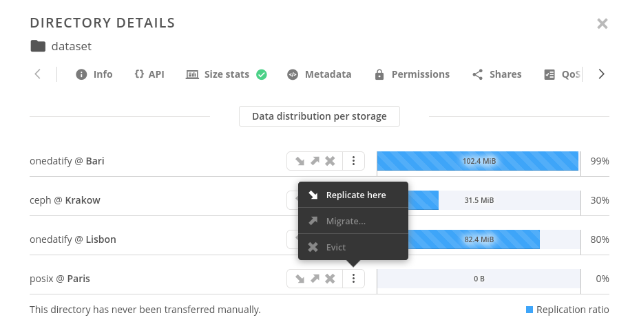
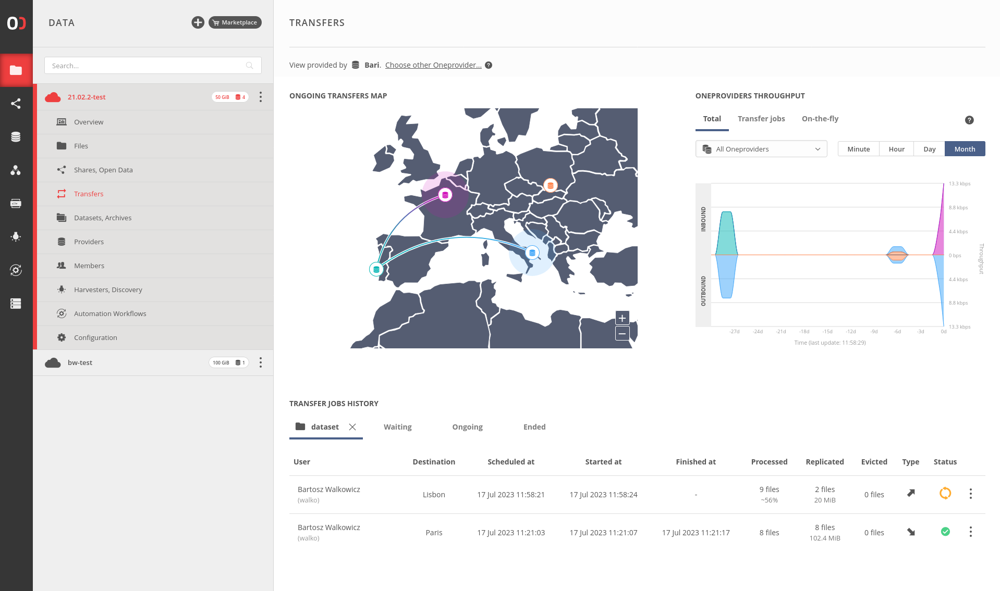
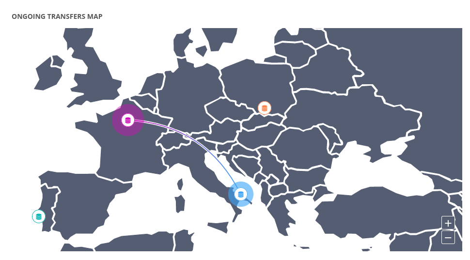
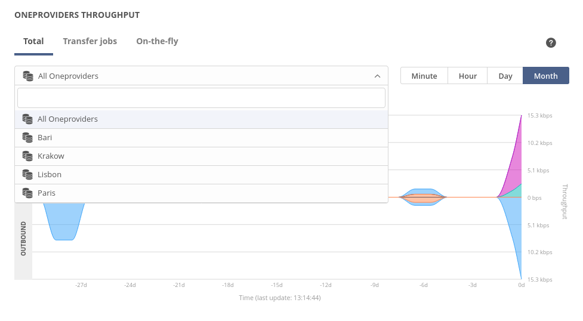
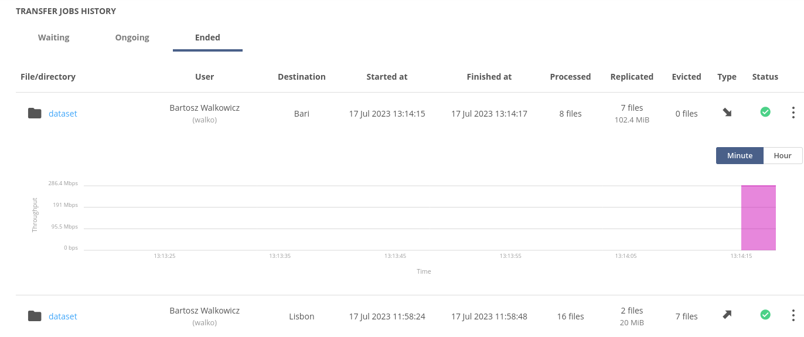

# Data Transfer

[toc][]


## Overview

Data transfer is a process of moving data between providers within the 
Onedata system. This operation is asynchronous and may take a considerable 
amount of time depending on the size of the data being transferred.

There are three types of data transfers supported:

1. **replication** - process of copying data to achieve a complete replica in 
    destination provider. The data is copied from one or more providers within 
    the space that already hold replicas or fragments.
    >**NOTE:** This operation requires `space_schedule_replication` privilege.

2. **eviction** - process of removing replica(s) from provider specified. This 
    operation is safe and will succeed only if there exist at least one file 
    replica on other providers suporting the space. 
    >**NOTE:** This operation requires `space_schedule_eviction privilege` privilege.

3. **migration** - replication followed by eviction. It first replicates the data 
    to the target provider and then evicts the replica from the source provider. 
    >**NOTE:** This operation requires both `space_schedule_replication` and 
    >`space_schedule_eviction` privileges.


## Web GUI

You can initiate data transfer using [Data distribution](data.md#file-distribution) 
modal:
 

For each space, under the `Transfers` tab on the left, a dedicated transfer 
management view is available:
 
>**NOTE:** The presented view is specific to the current provider, meaning it 
> provides information available to that particular provider. Due to possible 
> differences in metadata synchronization, the view might vary when switching 
> to another provider.

This view consists of three main elements:
1. `ONGOING TRANSFERS MAP` - an interactive map displaying active data transfers 
    with intuitive visual cues. Each line represents an ongoing transfer, with 
    the transferring provider indicated by an exploding circle (outgoing data) 
    and the receiving provider represented by an imploding circle (incoming data).
     

2. `ONEPROVIDERS THROUGHPUT` - this section presents inbound and outbound 
    throughput, providing a summary of data transfers incoming to and outgoing 
    from each provider. The measurements can be viewed either individually per 
    provider or combined on a single chart.
     

    Available time series:
    * `Total`: this represents the sum of both transfer jobs and 
    on-the-fly throughput.
    * `Transfer Jobs`: this category displays the throughput of all data 
    transfers manually triggered by users.
    * `On-the-fly`: `On-the-fly` throughput represents data transfers triggered 
    by remote data access. These transfers occur in the background automatically 
    when providers are requested to serve file not replicated ont them. 
    `On-the-fly` transfers do not appear in the transfer jobs list; only 
    summarized statistics are available.

3. `TRANSFER JOBS HISTORY` - this list presents comprehensive information about 
    each individual transfer within the space. It offers valuable insights into 
    the transfer's progress, status, and relevant details as well as allow you 
    to:
    * cancel transfer if it is still ongoing
    * rerun transfer if it has already ended (this initiates a new transfer with 
    the same parameters as the original one)
     


## REST API

All operations on transfers can be performed using the REST API.
Refer to the linked API documentation for detailed information and examples.

| Request                      | Link to API |
|------------------------------|-------------|
| List all space transfers     | [API](https://onedata.org/#/home/api/stable/oneprovider?anchor=operation/get_all_transfers)|
| Create transfer              | [API](https://onedata.org/#/home/api/stable/oneprovider?anchor=operation/create_transfer)|
| Get transfer status          | [API](https://onedata.org/#/home/api/stable/oneprovider?anchor=operation/get_transfer_status)|
| Cancel ongoing transfer      | [API](https://onedata.org/#/home/api/stable/oneprovider?anchor=operation/cancel_transfer)|
| Rerun ended  transfer        | [API](https://onedata.org/#/home/api/stable/oneprovider?anchor=operation/rerun_transfer)|


## Advanced operations using views

It is possible to schedule transfer of files that are included in the result 
of a query on a [view](views.md). 
>**NOTE:** Currently, scheduling of such operations is possible only via REST interface.

In order to schedule replica operations by view, you must ensure that the 
mapping (or reduce) function returns a list containing solely file IDs as 
a value. The list of IDs can be arbitrarily nested (it will be flattened). 
Any deviation from this format will result in errors.

Below is an example of a mapping function that retrieves the list of all files 
with an extended attribute whose name starts with `org.onedata.jobId.`. 
The latter part of the extended attribute serves as the key in the view.

```json
function (id, type, meta, ctx) {
    const JOB_PREFIX = "org.onedata.jobId.";
    var results = [];
    for (var key of Object.keys(meta))
        if (key.startsWith(JOB_PREFIX)){
            var jobId = key.slice(JOB_PREFIX.length);
            results.push([jobId, id]);
        }
    return {"list": results};
}
```
>**NOTE:** Currently, scheduling operations on replicas works only for files. 
> Directory Ids are ignored in the results.
