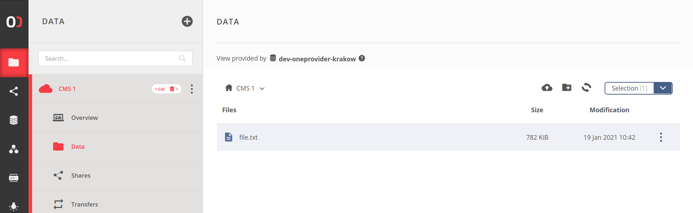
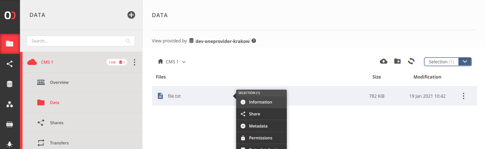
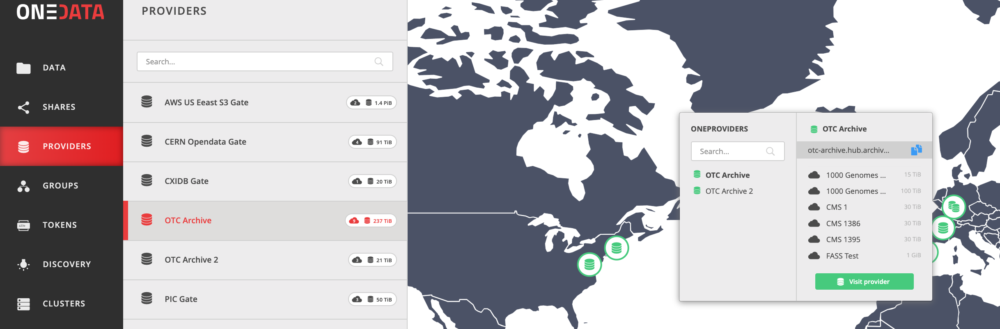

# Data
<!-- This file is referenced at least one time as "data.md" -->

[[toc]]

The Onedata system organizes all user data into logical containers called spaces. 
Please refer to [this](spaces.md) chapter for details about this concept and how 
the logical files are mapped to their physical content on storage backends.
 
 
## File path and ID
<!-- This header is referenced at least one time as "#file-path-and-id" -->

Files and directories in Onedata can be globally identified using unique file 
IDs or logical paths. Whenever possible, it is recommended to use File IDs, 
due to better performance and no need for escaping or encoding.

### File path
<!-- This header is referenced at least one time as "#file-paths" -->

All logical paths in Onedata use the slash `/` delimiter and must start with a
space name:
```
/CMS 1/file.txt
/MyExperiment/directory/subdirectory/image.jpg
```

The path-based navigation is used mainly in the Web GUI and Oneclient interfaces.

[Web GUI](#web-gui) - the path is represented in the file browser's breadcrumbs.  


[Oneclient](#oneclient) - please remember that some characters in paths should be properly escaped.
```
cat /CMS\ 1/file.txt
```        

[REST](#rest-api) or [CDMI](#cdmi) API - referencing by path should be avoided, 
otherwise make sure to urlencode the path if its the part of an URL:
```
{...}/CMS%201/file.txt
```        

>**NOTE:** Duplicate space names are generally allowed. For that reason, 
referencing files by path may be ambiguous. During file path resolution, the 
first space whose name matches the first segment of the path is always taken, 
but the order in which spaces are checked cannot be guaranteed.


### File ID
<!-- This header is referenced at least one time as "#file-id" -->

File ID is a unique, global identifier associated with a file or directory and
can be used universally in the [REST](#rest-api) and [CDMI](#cdmi) APIs.
There are several ways to find out the File ID of given file or directory:

Web GUI - click on **Information** in the file/directory context menu and look 
for `File ID`


REST API - use the File ID 
[resolution endpoint](https://onedata.org/#/home/api/stable/oneprovider?anchor=operation/lookup_file_id). 
Below example returns the File ID of <br />`/CMS 1/file.txt`, where `CMS 1` is the space name 
(consult [file path](#file-path)):
```bash
curl -H "X-Auth-Token: ${ACCESS_TOKEN}" \
-X POST "https://${ONEPROVIDER_DOMAIN}/api/v3/oneprovider/lookup-file-id/CMS%201/file.txt"
```
```json 
{
    "fileId": "094576776E667431723230677767776C6B497031394E445F6E3868677873..."
}
```
>**NOTE:** Make sure to urlencode the path if used in URL, as in above example.

>**NOTE:** See [below](#oneprovider-domain) to learn how to obtain the Oneprovider domain.


## Interfaces
Onedata offers several ways of accessing and managing user data. Regardless of 
the interface, the user is presented with a coherent view on all his files. All
data management interfaces are available in the [Oneprovider service](../intro.md#architecture).
Please note that depending on the environment, there might be several 
Oneprovider services [supporting user spaces](spaces.md#space-support) that can
be used to access the data. While the [Web GUI](#web-gui) offers natural navigation
between services, the other interfaces require that the user must choose one of 
his Oneproviders and be aware of its domain (see below).

### Oneprovider domain
<!-- This header is referenced at least one time as "#oneprovider-domain" -->
<!-- TODO VFS-7218 this should be moved somewhere else - maybe a new chapter with providers GUI
     from the user's point of view? -->

Oneprovider's domain is required to mount a [Oneclient](#oneclient) instance or
utilize the [REST](#rest-api) and [CDMI](#cdmi) APIs. It can be easily found in the Web GUI. 
Use the blue button to copy to clipboard:


### Oneclient
Oneclient is a command-line based application used for mounting Onedata spaces
in the local file system tree. To that end, Oneclient requires a network 
connection to chosen Oneprovider instance. Please refer to [this](oneclient.md) 
chapter for information on its setup and usage.

### REST API
Oneprovider service offers a comprehensive REST API for data management. All
endpoints use [File IDs](#file-id) to identify files and directories. The documentation
based on OpenAPI (a.k.a. Swagger) can be found [here](https://onedata.org/#/home/api/stable/oneprovider).
For general information on using the REST APIs in Onedata, see [this](rest-api.md) chapter.

### CDMI
Oneprovider implements a subset of **Cloud Data Management Interface**
specification - please refer to [this](cdmi.md) chapter for more information.

### Web GUI
The most end-user friendly method of data management. Please refer to the
[Web file browser](web-file-browser.md) chapter for a visual guide.


## File System Security

Onedata provides several file system security models that limit access to 
files and directories. Those are: 
[access token caveats](tokens.md#token-caveats),
[space ownership](spaces.md#space-owner), 
[space privileges](spaces.md#space-privileges), 
[POSIX permissions](#posix-permissions) and 
[CDMI access control lists (ACLs)](#access-control-lists).

These models fit together as follows:
1. If user [access token caveats](tokens.md#token-caveats) 
forbids the requested access, the request is denied.
2. If user is [space owner](spaces.md#space-owner), the request is granted.
3. If user lacks `space_write_data` [space privilege](spaces.md#space-privileges) 
in case of operation that modifies file or directory (content, attributes, 
metadata, etc.) or `space_read_data` [space privilege](spaces.md#space-privileges) 
in case of operation that reads file or directory (content, attributes, 
metadata, etc.), the request is denied.
4. If an [ACL](#access-control-lists) exists on the file, it is evaluated 
and used to determine whether access should be granted.
5. Otherwise, [POSIX permissions](#posix-permissions) are checked. 

---
> **NOTE:** when accessing files or directories in [share mode](shares.md) 
the access is additionally limited to read-only operations even if ACLs or 
POSIX permissions allow write access.
---

### Access Control Lists
<!-- This header is referenced at least one time as "#access-control-lists" -->

**Access control lists (ACL)** provide mechanism for granting and denying access 
to files and directories. Onedata supports subset of CDMI ACL which are based 
on NFSv4 standard [RFC 3530](https://tools.ietf.org/html/rfc3530).

#### Introduction

An ACL is an ordered list of **ACEs (access control entries)**. Oneprovider 
evaluates ACEs in order defined by the client. If any of the ACEs denies access, 
evaluation is stopped.

The ACEs consist of four fields: 
- type - `ALLOW` or `DENY` access of some kind to principal. 
- who - principal (user or group) represented by the identifier. Additionally, 
Onedata provides support for following special principals:
    - `OWNER@` - the owner of the file,
    - `GROUP@` - members of space containing file,
    - `EVERYONE@` - literally everyone.
- flags - currently only flag telling whether principal identifier points 
to user or group is supported. More flags can be set or 
[imported](../admin-guide/oneprovider/configuration/storage-import.md)
but they will be ignored during ACE evaluation.
- access_mask - permissions.

Permissions can be changed using the [Web file browser](web-file-browser.md) in
the **ACL** context menu, or using the [CDMI API](cdmi.md).

#### Permissions
ACL provides more fine-grained control of access to resources than 
POSIX permissions. 

All available permissions and their meaning for files or directories 
are presented below.

|   Permissions      |          File             |          Directory            |
|--------------------|---------------------------|-------------------------------|
| Read/List          | open file for read        | list directory content        |
| Write/Add file     | open file for write       | add file to directory         |
| Add subdirectory   | --                        | add subdirectory to directory |
| Traverse directory | --                        | traverse directory            |
| Delete             | delete file               | delete directory              |
| Delete child       | --                        | delete file or subdirectory from directory |
| Read attributes    | read file attributes      | read attributes metadata      |
| Write attributes   | write file attributes     | write attributes metadata     |
| Read metadata      | read file metadata        | read directory metadata       |
| Write metadata     | write file metadata       | write directory metadata      |
| Read ACL           | read file acl             | read directory acl            |
| Write ACL          | write file acl            | write directory acl           |

#### Evaluation

Each ACE in an ACL either allows or denies some set of permissions. 
Oneprovider will evaluate the resource (file or directory) ACEs until
all requested permissions are granted or any of them is denied using 
the following algorithm:
1. The ACE is checked for applicability. ACEs that do not refer to 
the principal requesting the operation or any requested permission 
are ignored.
2. If the ACE denies any of the requested permissions, 
then the request is denied.
3. If the ACE allows any of the requested permissions, then they are added 
to the list of granted permissions. If the list include all the requested 
permissions, the request is allowed and the process stops.
4. If the end of the ACL list is reached and permission has neither been 
fully granted nor explicitly denied, access is denied and the algorithm 
terminates.

### POSIX permissions
<!-- This header is referenced at least one time as "#posix-permissions" -->

Onedata implements traditional POSIX permissions typical for Unix or Linux
systems for specifying access rights to files or directories. However, there
is one important nuance - all space members are treated as a virtual group which
is the **group** owner of all files in the space. This means that whenever a 
file is accessed by a space member who is not the owner of the file, the 
**group** permissions are taken into consideration. Permissions for **others** 
are considered when a public [share](shares.md) is accessed (as an anonymous 
guest). These differences stem from the fact that unlike on POSIX systems, there
is an additional layer of access control imposed by membership in 
[spaces](spaces.md) (which are completely separated logical data containers), 
and the concepts of POSIX **group** and Onedata [group](groups.md) are different. 

Examine the following example of file POSIX permissions:

    rwx r-- ---
     |   |   |
     |   |   guests
     |   |
     |   space members
     |
     owner user
     
In the above case, the creator of the file (its **owner** user) has full access 
to the file. All space members have read access to the file. Users (guests) who 
try to access the file through a public share will fail to do so as all 
permissions are declined for **others**.

Default permissions (for newly created files/directories) are as follows:
* files: `r-x r-x r--` (octal: `664`)
* directories: `rwx rwx r-x` (octal: `775`)

Permissions can be changed using the [Web file browser](web-file-browser.md) in
the **Permissions** context menu, or using the 
[REST API](https://onedata.org/#/home/api/stable/oneprovider?anchor=operation/set_attr).

Oneprovider admins should keep in mind that the 
[Local User Mapping Database](../admin-guide/oneprovider/configuration/luma.md)
must be properly set up for each storage supporting a space. This is required so 
that file permissions are accurately enforced in the space and the permissions in 
Onedata are correctly mapped onto and from actual permissions on the storage,
especially concerning the above-mentioned **group** and **others** semantics.


## File distribution 
<!-- link to replication & migration -->
