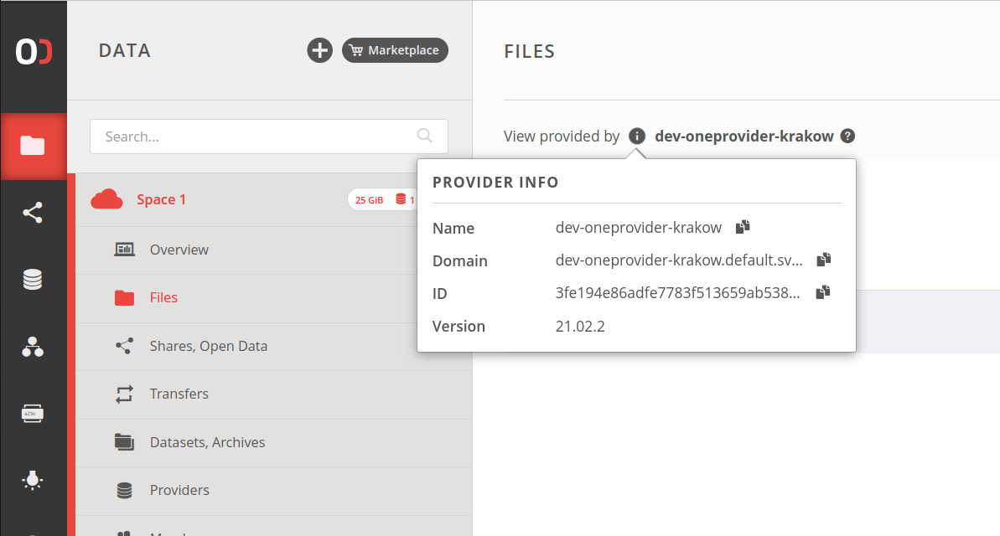

# Data
<!-- This file is referenced at least one time as "data.md" -->

[toc][]

The Onedata system organizes all user data into logical containers called spaces. 
Please refer to [this](spaces.md) chapter for details about this concept and how 
the logical files are mapped to their physical content on storage backends.
 
 
## File path and ID


Files and directories in Onedata can be globally identified using unique file 
IDs or logical paths. Whenever possible, it is recommended to use File IDs, 
due to better performance and no need for escaping or encoding.

### File path


All logical paths in Onedata use the slash `/` delimiter and must start with a
space name:
```
/CMS 1/file.txt
/MyExperiment/directory/subdirectory/image.jpg
```

The path-based navigation is used mainly in the Web GUI and Oneclient interfaces.

[Web GUI](#web-gui) - the path is represented in the file browser's breadcrumbs.  


[Oneclient](#oneclient) - please remember that some characters in paths should be properly escaped.
```
cat /CMS\ 1/file.txt
```        

[REST](#rest-api) or [CDMI](#cdmi) API - referencing by path should be avoided, 
otherwise make sure to urlencode the path if its the part of an URL:
```
{...}/CMS%201/file.txt
```        

>**NOTE:** Duplicate space names are generally allowed. For that reason, 
referencing files by path may be ambiguous. During file path resolution, the 
first space whose name matches the first segment of the path is always taken, 
but the order in which spaces are checked cannot be guaranteed.


### File ID


File ID is a unique, global identifier associated with a file or directory and
can be used universally in the [REST](#rest-api) and [CDMI](#cdmi) APIs.
There are several ways to find out the File ID of given file or directory:

Web GUI - click on **Information** in the file/directory context menu and look 
for `File ID`


REST API - use the File ID 
[resolution endpoint](https://onedata.org/#/home/api/stable/oneprovider?anchor=operation/lookup_file_id). 
Below example returns the File ID of <br />`/CMS 1/file.txt`, where `CMS 1` is the space name 
(consult [file path](#file-path)):
```bash
curl -H "X-Auth-Token: ${ACCESS_TOKEN}" \
-X POST "https://${ONEPROVIDER_DOMAIN}/api/v3/oneprovider/lookup-file-id/CMS%201/file.txt"
```
```json 
{
    "fileId": "094576776E667431723230677767776C6B497031394E445F6E3868677873..."
}
```
>**NOTE:** Make sure to urlencode the path if used in URL, as in above example.

>**NOTE:** See [below](#oneprovider-domain) to learn how to obtain the Oneprovider domain.


## Interfaces
Onedata offers several ways of accessing and managing user data. Regardless of 
the interface, the user is presented with a coherent view on all his files. All
data management interfaces are available in the [Oneprovider service](../intro.md#architecture).
Please note that depending on the environment, there might be several 
Oneprovider services [supporting user spaces](spaces.md#space-support) that can
be used to access the data. While the [Web GUI](#web-gui) offers natural navigation
between services, the other interfaces require that the user must choose one of 
his Oneproviders and be aware of its domain (see below).

### Oneprovider domain

<!-- TODO VFS-7218 this should be moved somewhere else - maybe a new chapter with providers GUI
     from the user's point of view? -->

Oneprovider's domain is required to mount a [Oneclient](#oneclient) instance or
utilize the [REST](#rest-api) and [CDMI](#cdmi) APIs. It can be easily found in the Web GUI. 
Use the blue button to copy to clipboard:


### Oneclient
Oneclient is a command-line based application used for mounting Onedata spaces
in the local file system tree. To that end, Oneclient requires a network 
connection to chosen Oneprovider instance. Please refer to [this](oneclient.md) 
chapter for information on its setup and usage.

### REST API
Oneprovider service offers a comprehensive REST API for data management. All
endpoints use [File IDs](#file-id) to identify files and directories. The documentation
based on OpenAPI (a.k.a. Swagger) can be found [here](https://onedata.org/#/home/api/stable/oneprovider).
For general information on using the REST APIs in Onedata, see [this](rest-api.md) chapter.

### CDMI
Oneprovider implements a subset of **Cloud Data Management Interface**
specification - please refer to [this](cdmi.md) chapter for more information.

### Web GUI
The most end-user friendly method of data management. Please refer to the
[Web file browser](web-file-browser.md) chapter for a visual guide.


## File permissions
Access to each file or directory can be controlled using traditional (POSIX) 
file permissions and Access Control Lists.

>**NOTE:** Each space can have one or more [space owners](spaces.md#space-owner),
who have full administrative power in the space and unrestricted access to data,
overriding the permissions and ACLs.


### POSIX permissions


Onedata implements traditional POSIX permissions typical for Unix or Linux
systems for specifying access rights to files or directories. However, there
is one important nuance - all space members are treated as a virtual group which
is the **group** owner of all files in the space. This means that whenever a 
file is accessed by a space member who is not the owner of the file, the 
**group** permissions are taken into consideration. Permissions for **others** 
are considered when a public [share](shares.md) is accessed (as an anonymous 
guest). These differences stem from the fact that unlike on POSIX systems, there
is an additional layer of access control imposed by membership in 
[spaces](spaces.md) (which are completely separated logical data containers), 
and the concepts of POSIX **group** and Onedata [group](groups.md) are different. 

Examine the following example of file POSIX permissions:

    rwx r-- ---
     |   |   |
     |   |   guests
     |   |
     |   space members
     |
     owner user
     
In the above case, the creator of the file (its **owner** user) has full access 
to the file. All space members have read access to the file. Users (guests) who 
try to access the file through a public share will fail to do so as all 
permissions are declined for **others**.

>**NOTE:** regardless of the granted write permissions, all write operations are 
disallowed for guests that access the data through the public share. 

Default permissions (for newly created files/directories) are as follows:
* files: `r-x r-x r--` (octal: `664`)
* directories: `rwx rwx r-x` (octal: `775`)

Permissions can be changed using the [Web file browser](web-file-browser.md) in
the **Permissions** context menu, or using the 
[REST API](https://onedata.org/#/home/api/stable/oneprovider?anchor=operation/set_attr).

Oneprovider admins should keep in mind that the 
[Local User Mapping Database](../admin-guide/oneprovider/configuration/luma.md)
must be properly set up for each storage supporting a space. This is required so 
that file permissions are accurately enforced in the space and the permissions in 
Onedata are correctly mapped onto and from actual permissions on the storage,
especially concerning the above-mentioned **group** and **others** semantics.


### Access Control Lists
<!-- TODO VFS-7218 write me -->


## File distribution 
<!-- link to replication & migration -->
