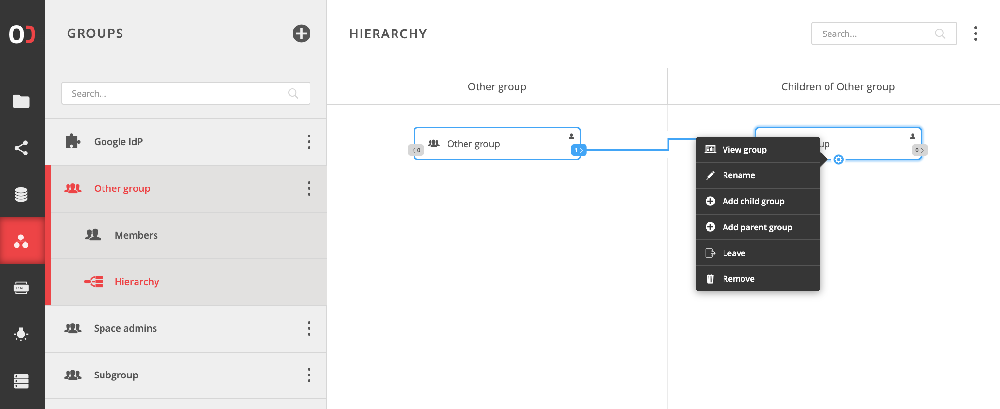

# Groups
<!-- TODO VFS-7218 management, members and privileges -->

## Group members
<!-- This header is referenced at least one time as "#group-members" -->

<!-- TODO VFS-7218 basically we need a similar tutorial as in spaces, but with users and groups only -->

<!-- TODO VFS-7218 emove redundancy between spaces and groups doc 
           (e.g. in spaces, it is shown how a group can be created) -->

<!-- TODO VFS-7218 this is some leftovers from the archiver docs, maybe can be reused -->
Go to the **Other group** in **GROUP** tab. You are encouraged to add some 
more relations in the **Members** submenu – create more groups and organize
them into complex structures. Onedata supports arbitrary group nesting levels,
and even allows cycles. Play around to see how a group can become its own
effective parent and child at the same time. Visit the **Hierarchy** tab to
browse the groups hierarchy. Use the context menu that shows up on hover to
test the available actions.
